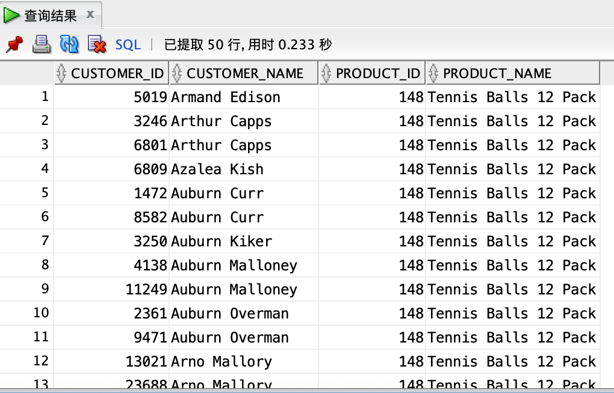
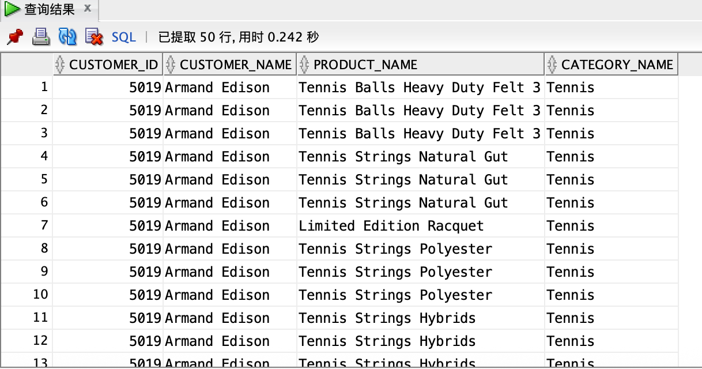

# Create Property Graph Using MV

## 前提条件

1.   安装Oracle数据库DB23ai

2.   安装SH sample schema，[参考文档和下载脚本](https://github.com/oracle-samples/db-sample-schemas)。注意用`sql`命令安装

3.   授予其它用户访问权限

     ```
     grant select any table on schema sh to vector;
     ```

     

## Task 1: 创建MV log

1.   连接到SH用户

     ```
     sqlplus sh/sh@bj_sales
     ```

     

2.   创建MV log(复杂sql的mv用不到这个mv log)

     ```
     CREATE MATERIALIZED VIEW LOG ON sales 
        WITH ROWID, SEQUENCE(prod_id, cust_id, quantity_sold, amount_sold)
        INCLUDING NEW VALUES;
     ```

     

3.   sadf

## Task 2: 创建MATERIALIZED VIEW

1.   连接到SH用户

     ```
     sqlplus sh/sh@bj_sales;
     ```

     

2.   创建MV

     ```
     drop MATERIALIZED VIEW products_mv;
     CREATE MATERIALIZED VIEW products_mv 
        REFRESH complete start with sysdate NEXT sysdate + 1/1440 AS
        select prod_id as id, prod_name as name, 'product' as proddesc, prod_list_price as list_price from products
     union all
     select distinct prod_subcategory_id as id, prod_subcategory as name, 'subcategory' as proddesc, null as list_price from products
     union all
     select distinct prod_category_id as id, prod_category as name, 'category' as proddesc, null as list_price from products;
     
     drop MATERIALIZED VIEW prod_belong_to_mv;
     CREATE MATERIALIZED VIEW prod_belong_to_mv 
        REFRESH complete start with sysdate NEXT sysdate + 1/1440 AS
     select prod_id as id_a, prod_subcategory_id as id_b from sh.products
     union all
     select distinct prod_subcategory_id as id_a, prod_category_id as id_b from sh.products;
     
     drop MATERIALIZED VIEW customers_mv;
     CREATE MATERIALIZED VIEW customers_mv 
        REFRESH complete start with sysdate NEXT sysdate + 1/24 AS
        select cust_id as id, cust_first_name||' '||cust_last_name as name, 'customer' as custdesc, cust_year_of_birth as year_of_birth from customers
     union all
     select distinct cust_city_id as id, cust_city as name, 'city' as custdesc, NULL as year_of_birth from customers
     union all
     select distinct cust_state_province_id as id, cust_state_province as name, 'province' as custdesc, NULL as year_of_birth from customers
     union all
     select distinct country_id as id, to_char(country_id) as name, 'country' as custdesc, NULL as year_of_birth from customers;
     
     drop MATERIALIZED VIEW cust_live_in_mv;
     CREATE MATERIALIZED VIEW cust_live_in_mv 
        REFRESH complete start with sysdate NEXT sysdate + 1/24 AS
        select cust_id as id_a, cust_city_id as id_b from customers
     union all
     select distinct cust_city_id as id_a, cust_state_province_id as id_b from customers
     union all
     select distinct cust_state_province_id as id_a, country_id as id_b from customers;
     
     drop MATERIALIZED VIEW sales_mv;
     CREATE MATERIALIZED VIEW sales_mv
       REFRESH FAST start with sysdate NEXT sysdate + 1/24 AS
       select prod_id, cust_id, sum(quantity_sold) as quantity_sold, sum(amount_sold) as amount_sold from sales group by prod_id, cust_id;
     ```

     

3.   sdf

## Task 3: 创建Property Graph

1.   连接到vector用户

     ```
     sqlplus vector/vector@bj_sales
     ```

     

2.   创建product graph

     ```
     CREATE or REPLACE PROPERTY GRAPH products_graph
       VERTEX TABLES (
         sh.products_mv as prod KEY (id)
           LABEL prod
             PROPERTIES (id, name, proddesc, list_price)
       )
       EDGE TABLES (
         sh.prod_belong_to_mv as prodbt
           KEY (id_a,id_b)
           SOURCE KEY (id_a) REFERENCES prod(id)
           DESTINATION KEY (id_b) REFERENCES prod(id)
           LABEL belong_to
       );
     ```

     

3.   创建customer graph

     ```
     CREATE or REPLACE PROPERTY GRAPH customers_graph
       VERTEX TABLES (
         sh.customers_mv as cust KEY (id)
           LABEL cust
             PROPERTIES (id, name, custdesc, year_of_birth)
       )
       EDGE TABLES (
         sh.cust_live_in_mv as custln
           KEY (id_a,id_b)
           SOURCE KEY (id_a) REFERENCES cust(id)
           DESTINATION KEY (id_b) REFERENCES cust(id)
           LABEL live_in
       );
     ```

     

4.   整体创建一个GRAPH

     ```
     CREATE or REPLACE PROPERTY GRAPH total_graph
       VERTEX TABLES (
         sh.products_mv as prod KEY (id)
           LABEL prod
             PROPERTIES (id, name, proddesc, list_price),
         sh.customers_mv as cust KEY (id)
           LABEL cust
             PROPERTIES (id, name, custdesc, year_of_birth)
       )
       EDGE TABLES (
         sh.prod_belong_to_mv as prodbt
           KEY (id_a,id_b)
           SOURCE KEY (id_a) REFERENCES prod(id)
           DESTINATION KEY (id_b) REFERENCES prod(id)
           LABEL belong_to,
         sh.cust_live_in_mv as custln
           KEY (id_a,id_b)
           SOURCE KEY (id_a) REFERENCES cust(id)
           DESTINATION KEY (id_b) REFERENCES cust(id)
           LABEL live_in,
         sh.sales_mv as sales
           KEY (prod_id,cust_id)
           SOURCE KEY (cust_id) REFERENCES cust(id)
           DESTINATION KEY (prod_id) REFERENCES prod(id)
           LABEL buy
             PROPERTIES (cust_id,prod_id,quantity_sold, amount_sold)
       ); 
     ```

     

5.   sdf


## Task 5: 查询Graph

1.   查询products graph

     ```
     SELECT id_a, id_e, id_b FROM GRAPH_TABLE (products_graph
       MATCH (src) -[e]-> (dst)
         COLUMNS (vertex_id(src) AS id_a, edge_id(e) AS id_e, vertex_id(dst) AS id_b)
       );
     ```

     

2.   查询所有"belong_to"关系

     ```
     SELECT *
     FROM GRAPH_TABLE(products_graph
         MATCH (src) -[e IS belong_to]-> (dst)
         COLUMNS (e.id_a as source_id, e.id_b as target_id, 
                  src.name as source_name, dst.name as target_name)
     );
     ```

     

2.   查询单价大于1000的产品

     ```
     SELECT * FROM GRAPH_TABLE (products_graph
       MATCH (p IS prod )
       WHERE p.list_price > 1000
       COLUMNS(p.id, p.name as name, p.list_price as list_price)
       );
     ```

     

4.   查询所有购买关系

     ```
     SELECT *
     FROM GRAPH_TABLE(total_graph
         MATCH () -[e IS buy]-> ()
         COLUMNS (e.cust_id, e.prod_id, e.quantity_sold, e.amount_sold)
     )
     fetch first 100 rows only;
     ```

     

5.   查找购买了特定产品的客户

     ```
     SELECT *
     FROM GRAPH_TABLE(total_graph
         MATCH (cust IS cust) -[e IS buy]-> (prod IS prod)
         WHERE prod.id = 148  
         COLUMNS (cust.id as customer_id, cust.name as customer_name, prod.id AS product_id, prod.name AS product_name)
     );
     ```

     

6.   查找购买了属于某子类别产品的客户

     ```
     SELECT *
     FROM GRAPH_TABLE(total_graph
         MATCH (c IS cust) -[b IS buy]-> (p1 IS prod) -[bt IS belong_to]-> {1}(p2 IS prod)
         WHERE p2.id = 2013  
         COLUMNS (c.id AS customer_id, c.name AS customer_name, p1.name AS product_name, p2.name AS subcategory_name)
     );
     ```

     

7.   查找购买了属于某类别产品的客户

     ```
     SELECT *
     FROM GRAPH_TABLE(total_graph
         MATCH (c IS cust) -[b IS buy]-> (p1 IS prod) -[bt IS belong_to]->{2} (p2 IS prod)
         WHERE p2.id = 201  
         COLUMNS (c.id AS customer_id, c.name AS customer_name, p1.name AS product_name, p2.name AS category_name)
     );
     ```

     

8.   计算每个客户的购买总金额

     ```
     SELECT customer_id, customer_name, SUM(amount_sold) AS total_spent
     FROM GRAPH_TABLE(total_graph
         MATCH (c IS cust) -[b IS buy]-> (p IS prod)
         COLUMNS (c.id as customer_id, c.name as customer_name, b.amount_sold as amount_sold)
     )
     GROUP BY customer_id, customer_name
     ORDER BY total_spent DESC;
     ```

     

9.   查找住在同一地区且购买过相同产品的客户对

     ```
     SELECT *
     FROM GRAPH_TABLE(total_graph
         MATCH (c1 IS cust) -[b1 IS buy]-> (p IS prod) <-[b2 IS buy]- (c2 IS cust),
                      (c1) -[l1 IS live_in]-> (l) <-[l2 IS live_in]- (c2)
         WHERE c1.id < c2.id  -- 避免重复对
         COLUMNS (c1.name AS customer1, c2.name AS customer2, p.name AS product_name, l.id AS location_id)
     );
     ```

     

10.   查找购买金额超过1000的高价值客户及其购买的产品

      ```
      SELECT *
      FROM GRAPH_TABLE(total_graph
          MATCH (c IS cust) -[b IS buy]-> (p IS prod)
          WHERE b.amount_sold > 1000
          COLUMNS (c.id AS customer_id, c.name AS customer_name, p.id AS product_id, p.name AS product_name, b.amount_sold AS amount_sold)
      )
      ORDER BY amount_sold DESC;
      ```

      

11.   sdf

4.   