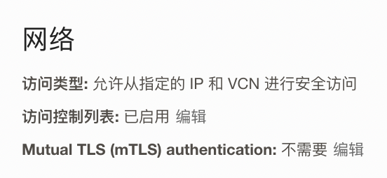

# DataX连接ADW测试

## 先决条件

1. 创建ADW实例

2. 配置ACL和支持TLS连接

   

3. 创建test表

   ```
   create table test (a varchar2(20));
   ```

   

## 测试步骤

1. 下载datax

   ```
   wget http://datax-opensource.oss-cn-hangzhou.aliyuncs.com/datax.tar.gz
   ```

   

2. 解压

   ```
   tar -xvzf datax.tar.gz
   ```

   

3. 修改oracle driver, 在下面两个目录下，先删除ojdbc6-11.2.0.3.jar，再拷贝ojdbc8.jar到这个目录下。

   ```
   ./datax/plugin/reader/oraclereader/libs
   ./datax/plugin/writer/oraclewriter/libs
   ```

   如果是datax web，还需要覆盖以下目录的oracle driver

   ```
   ./datax-web-2.1.2/modules/datax-admin/lib
   ```

   

4. 生成配置模版

   ```
   cd datax/bin
   python datax.py -r oraclereader -w oraclewriter
   ```

   

5. 将模版拷贝生成配置文件test.json，修改配置如下：

   ```
   {
       "job": {
           "content": [
               {
                   "reader": {
                       "name": "oraclereader", 
                       "parameter": {
                           "column": ["a"], 
                           "connection": [
                               {
                                   "jdbcUrl": ["jdbc:oracle:thin:@(description= (retry_count=20)(retry_delay=3)(address=(protocol=tcps)(port=1521)(host=adb.ap-seoul-1.oraclecloud.com))(connect_data=(service_name=x3f1wiw0zp5wynv_ajdtest_high.adb.oraclecloud.com))(security=(ssl_server_dn_match=yes)))"], 
                                   "table": ["test"]
                               }
                           ], 
                           "password": "WelcomePTS_2022#", 
                           "username": "admin"
                       }
                   }, 
                   "writer": {
                       "name": "oraclewriter", 
                       "parameter": {
                           "column": ["a"], 
                           "connection": [
                               {
                                   "jdbcUrl": "jdbc:oracle:thin:@(description= (retry_count=20)(retry_delay=3)(address=(protocol=tcps)(port=1521)(host=adb.ap-seoul-1.oraclecloud.com))(connect_data=(service_name=x3f1wiw0zp5wynv_ajdtest_high.adb.oraclecloud.com))(security=(ssl_server_dn_match=yes)))", 
                                   "table": ["test"]
                               }
                           ], 
                           "password": "WelcomePTS_2022#", 
                           "preSql": [], 
                           "username": "admin"
                       }
                   }
               }
           ], 
           "setting": {
               "speed": {
                   "channel": "5"
               }
           }
       }
   }
   ```

   

6. 启动datax

   ```
   $ python datax.py ./test.json
   
   DataX (DATAX-OPENSOURCE-3.0), From Alibaba !
   Copyright (C) 2010-2017, Alibaba Group. All Rights Reserved.
   
   
   2022-08-20 08:25:41.816 [main] INFO  MessageSource - JVM TimeZone: GMT+08:00, Locale: zh_CN
   2022-08-20 08:25:41.819 [main] INFO  MessageSource - use Locale: zh_CN timeZone: sun.util.calendar.ZoneInfo[id="GMT+08:00",offset=28800000,dstSavings=0,useDaylight=false,transitions=0,lastRule=null]
   2022-08-20 08:25:41.877 [main] INFO  VMInfo - VMInfo# operatingSystem class => com.sun.management.internal.OperatingSystemImpl
   2022-08-20 08:25:41.888 [main] INFO  Engine - the machine info  => 
   
   	osInfo:	Oracle Corporation 17 17.0.4.1+1-LTS-2
   	jvmInfo:	Linux amd64 5.4.17-2136.309.5.el7uek.x86_64
   	cpu num:	2
   
   	totalPhysicalMemory:	-0.00G
   	freePhysicalMemory:	-0.00G
   	maxFileDescriptorCount:	-1
   	currentOpenFileDescriptorCount:	-1
   
   	GC Names	[G1 Young Generation, G1 Old Generation]
   
   	MEMORY_NAME                    | allocation_size                | init_size                      
   	CodeHeap 'profiled nmethods'   | 117.22MB                       | 2.44MB                         
   	G1 Old Gen                     | 1,024.00MB                     | 970.00MB                       
   	G1 Survivor Space              | -0.00MB                        | 0.00MB                         
   	CodeHeap 'non-profiled nmethods' | 117.22MB                       | 2.44MB                         
   	Compressed Class Space         | 1,024.00MB                     | 0.00MB                         
   	Metaspace                      | -0.00MB                        | 0.00MB                         
   	G1 Eden Space                  | -0.00MB                        | 54.00MB                        
   	CodeHeap 'non-nmethods'        | 5.56MB                         | 2.44MB                         
   
   
   2022-08-20 08:25:41.908 [main] INFO  Engine - 
   {
   	"content":[
   		{
   			"reader":{
   				"parameter":{
   					"password":"****************",
   					"column":[
   						"a"
   					],
   					"connection":[
   						{
   							"jdbcUrl":[
   								"jdbc:oracle:thin:@(description= (retry_count=20)(retry_delay=3)(address=(protocol=tcps)(port=1521)(host=adb.ap-seoul-1.oraclecloud.com))(connect_data=(service_name=x3f1wiw0zp5wynv_ajdtest_high.adb.oraclecloud.com))(security=(ssl_server_dn_match=yes)))"
   							],
   							"table":[
   								"test"
   							]
   						}
   					],
   					"username":"admin"
   				},
   				"name":"oraclereader"
   			},
   			"writer":{
   				"parameter":{
   					"password":"****************",
   					"column":[
   						"a"
   					],
   					"connection":[
   						{
   							"jdbcUrl":"jdbc:oracle:thin:@(description= (retry_count=20)(retry_delay=3)(address=(protocol=tcps)(port=1521)(host=adb.ap-seoul-1.oraclecloud.com))(connect_data=(service_name=x3f1wiw0zp5wynv_ajdtest_high.adb.oraclecloud.com))(security=(ssl_server_dn_match=yes)))",
   							"table":[
   								"test"
   							]
   						}
   					],
   					"preSql":[],
   					"username":"admin"
   				},
   				"name":"oraclewriter"
   			}
   		}
   	],
   	"setting":{
   		"speed":{
   			"channel":"5"
   		}
   	}
   }
   
   2022-08-20 08:25:41.924 [main] WARN  Engine - prioriy set to 0, because NumberFormatException, the value is: null
   2022-08-20 08:25:41.925 [main] INFO  PerfTrace - PerfTrace traceId=job_-1, isEnable=false, priority=0
   2022-08-20 08:25:41.926 [main] INFO  JobContainer - DataX jobContainer starts job.
   2022-08-20 08:25:41.927 [main] INFO  JobContainer - Set jobId = 0
   2022-08-20 08:25:43.029 [job-0] INFO  OriginalConfPretreatmentUtil - Available jdbcUrl:jdbc:oracle:thin:@(description= (retry_count=20)(retry_delay=3)(address=(protocol=tcps)(port=1521)(host=adb.ap-seoul-1.oraclecloud.com))(connect_data=(service_name=x3f1wiw0zp5wynv_ajdtest_high.adb.oraclecloud.com))(security=(ssl_server_dn_match=yes))).
   2022-08-20 08:25:43.490 [job-0] INFO  OriginalConfPretreatmentUtil - table:[test] has columns:[A].
   2022-08-20 08:25:44.011 [job-0] INFO  OriginalConfPretreatmentUtil - table:[test] all columns:[
   A
   ].
   2022-08-20 08:25:44.209 [job-0] INFO  OriginalConfPretreatmentUtil - Write data [
   INSERT INTO %s (a) VALUES(?)
   ], which jdbcUrl like:[jdbc:oracle:thin:@(description= (retry_count=20)(retry_delay=3)(address=(protocol=tcps)(port=1521)(host=adb.ap-seoul-1.oraclecloud.com))(connect_data=(service_name=x3f1wiw0zp5wynv_ajdtest_high.adb.oraclecloud.com))(security=(ssl_server_dn_match=yes)))]
   2022-08-20 08:25:44.209 [job-0] INFO  JobContainer - jobContainer starts to do prepare ...
   2022-08-20 08:25:44.209 [job-0] INFO  JobContainer - DataX Reader.Job [oraclereader] do prepare work .
   2022-08-20 08:25:44.210 [job-0] INFO  JobContainer - DataX Writer.Job [oraclewriter] do prepare work .
   2022-08-20 08:25:44.210 [job-0] INFO  JobContainer - jobContainer starts to do split ...
   2022-08-20 08:25:44.211 [job-0] INFO  JobContainer - Job set Channel-Number to 5 channels.
   2022-08-20 08:25:44.214 [job-0] INFO  JobContainer - DataX Reader.Job [oraclereader] splits to [1] tasks.
   2022-08-20 08:25:44.215 [job-0] INFO  JobContainer - DataX Writer.Job [oraclewriter] splits to [1] tasks.
   2022-08-20 08:25:44.239 [job-0] INFO  JobContainer - jobContainer starts to do schedule ...
   2022-08-20 08:25:44.243 [job-0] INFO  JobContainer - Scheduler starts [1] taskGroups.
   2022-08-20 08:25:44.244 [job-0] INFO  JobContainer - Running by standalone Mode.
   2022-08-20 08:25:44.255 [taskGroup-0] INFO  TaskGroupContainer - taskGroupId=[0] start [1] channels for [1] tasks.
   2022-08-20 08:25:44.259 [taskGroup-0] INFO  Channel - Channel set byte_speed_limit to 1048576.
   2022-08-20 08:25:44.259 [taskGroup-0] INFO  Channel - Channel set record_speed_limit to -1, No tps activated.
   2022-08-20 08:25:44.274 [taskGroup-0] INFO  TaskGroupContainer - taskGroup[0] taskId[0] attemptCount[1] is started
   2022-08-20 08:25:44.280 [0-0-0-reader] INFO  CommonRdbmsReader$Task - Begin to read record by Sql: [select a from test 
   ] jdbcUrl:[jdbc:oracle:thin:@(description= (retry_count=20)(retry_delay=3)(address=(protocol=tcps)(port=1521)(host=adb.ap-seoul-1.oraclecloud.com))(connect_data=(service_name=x3f1wiw0zp5wynv_ajdtest_high.adb.oraclecloud.com))(security=(ssl_server_dn_match=yes)))].
   2022-08-20 08:25:44.465 [0-0-0-reader] INFO  CommonRdbmsReader$Task - Finished read record by Sql: [select a from test 
   ] jdbcUrl:[jdbc:oracle:thin:@(description= (retry_count=20)(retry_delay=3)(address=(protocol=tcps)(port=1521)(host=adb.ap-seoul-1.oraclecloud.com))(connect_data=(service_name=x3f1wiw0zp5wynv_ajdtest_high.adb.oraclecloud.com))(security=(ssl_server_dn_match=yes)))].
   2022-08-20 08:25:44.775 [taskGroup-0] INFO  TaskGroupContainer - taskGroup[0] taskId[0] is successed, used[511]ms
   2022-08-20 08:25:44.775 [taskGroup-0] INFO  TaskGroupContainer - taskGroup[0] completed it's tasks.
   2022-08-20 08:25:54.263 [job-0] INFO  StandAloneJobContainerCommunicator - Total 0 records, 0 bytes | Speed 0B/s, 0 records/s | Error 0 records, 0 bytes |  All Task WaitWriterTime 0.000s |  All Task WaitReaderTime 0.000s | Percentage 100.00%
   2022-08-20 08:25:54.263 [job-0] INFO  AbstractScheduler - Scheduler accomplished all tasks.
   2022-08-20 08:25:54.264 [job-0] INFO  JobContainer - DataX Writer.Job [oraclewriter] do post work.
   2022-08-20 08:25:54.264 [job-0] INFO  JobContainer - DataX Reader.Job [oraclereader] do post work.
   2022-08-20 08:25:54.264 [job-0] INFO  JobContainer - DataX jobId [0] completed successfully.
   2022-08-20 08:25:54.265 [job-0] INFO  HookInvoker - No hook invoked, because base dir not exists or is a file: /home/opc/datax/hook
   2022-08-20 08:25:54.268 [job-0] INFO  JobContainer - 
   	 [total cpu info] => 
   		averageCpu                     | maxDeltaCpu                    | minDeltaCpu                    
   		-1.00%                         | -1.00%                         | -1.00%
                           
   
   	 [total gc info] => 
   		 NAME                 | totalGCCount       | maxDeltaGCCount    | minDeltaGCCount    | totalGCTime        | maxDeltaGCTime     | minDeltaGCTime     
   		 G1 Young Generation  | 1                  | 1                  | 1                  | 0.010s             | 0.010s             | 0.010s             
   		 G1 Old Generation    | 0                  | 0                  | 0                  | 0.000s             | 0.000s             | 0.000s             
   
   2022-08-20 08:25:54.268 [job-0] INFO  JobContainer - PerfTrace not enable!
   2022-08-20 08:25:54.269 [job-0] INFO  StandAloneJobContainerCommunicator - Total 0 records, 0 bytes | Speed 0B/s, 0 records/s | Error 0 records, 0 bytes |  All Task WaitWriterTime 0.000s |  All Task WaitReaderTime 0.000s | Percentage 100.00%
   2022-08-20 08:25:54.271 [job-0] INFO  JobContainer - 
   任务启动时刻                    : 2022-08-20 16:25:41
   任务结束时刻                    : 2022-08-20 16:25:54
   任务总计耗时                    :                 12s
   任务平均流量                    :                0B/s
   记录写入速度                    :              0rec/s
   读出记录总数                    :                   0
   读写失败总数                    :                   0
   ```

   

7. asdf