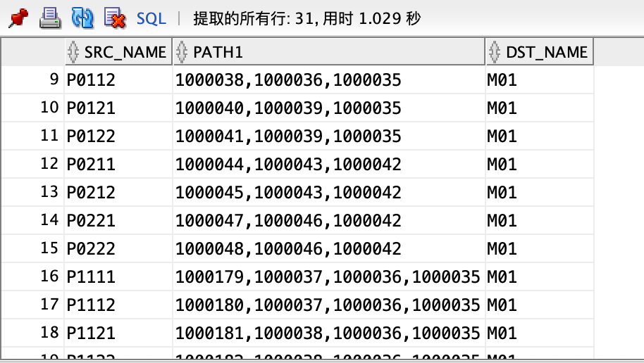
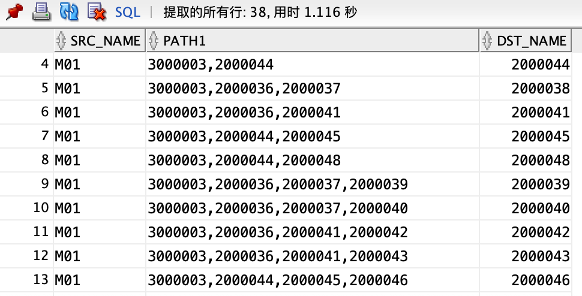
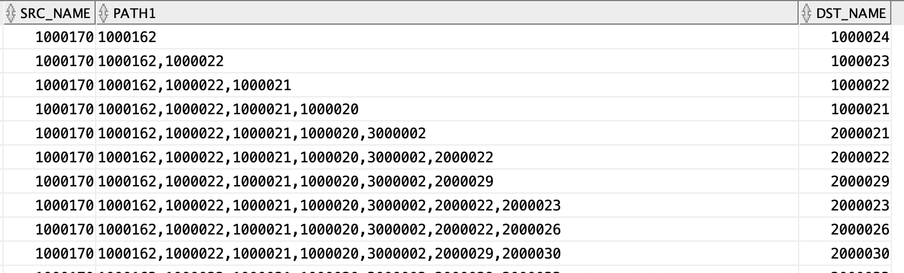
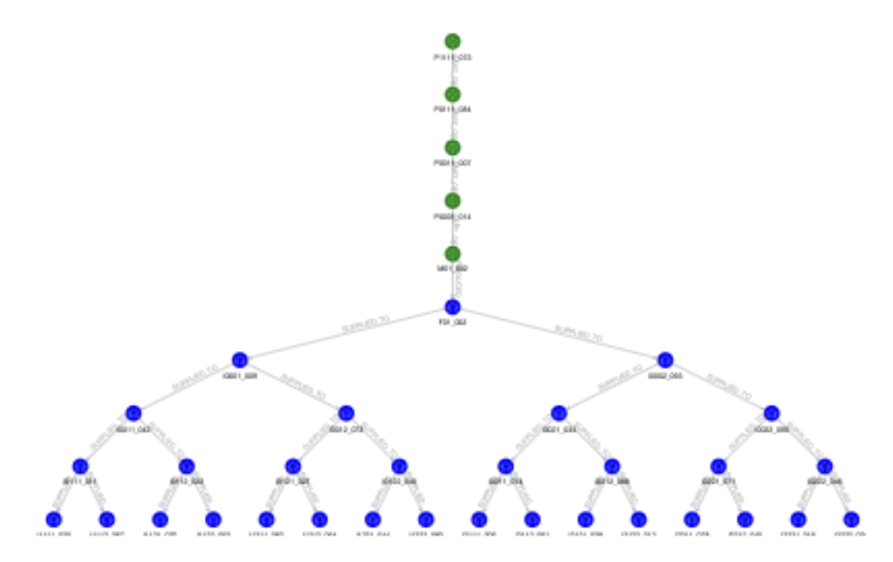
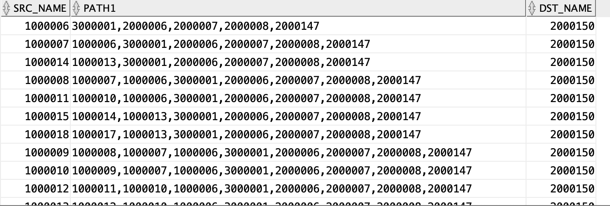
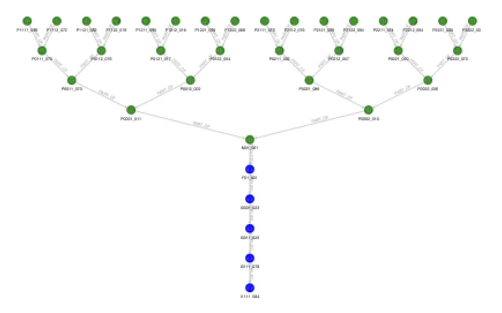
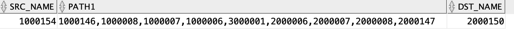
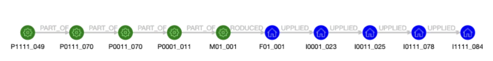

## Trace BOM and Supply Chain

## 前提条件

-   [参考文档](https://medium.com/oracledevs/d65521510975)

-   下载[zip文件](https://objectstorage.ap-tokyo-1.oraclecloud.com/n/nr92jg8wdcil/b/public/o/traceability.zip)

-   加载三张demo表

    ```
    trace_bom_small
    trace_scn_small
    trace_b2s_small
    ```

    

-   dsf


## Task 1: 创建顶点表

1.   创建BOM顶点表

     ```
     drop table trace_bom_node;
     create table trace_bom_node as
     select rownum+1000000 as id, part_id, LOT from (
     select distinct parent_id as PART_ID, Parent_lot as LOT from trace_bom_small
     union
     select distinct child_id as PART_ID, child_lot as LOT from trace_bom_small
     );
     ```

     

2.   创建BOM边表

     ```
     drop table trace_bom_edge;
     CREATE TABLE trace_bom_edge AS
     SELECT 
       rownum+1000000 as ID,
       parent_node.id AS parent_id, 
       child_node.id AS child_id
     FROM 
       trace_bom_small s
     JOIN 
       trace_bom_node parent_node 
       ON s.parent_id = parent_node.part_id 
       AND s.parent_lot = parent_node.lot
     JOIN 
       trace_bom_node child_node 
       ON s.child_id = child_node.part_id 
       AND s.child_lot = child_node.lot;
     ```

     

3.   创建Supply Chain顶点表

     ```
     drop table trace_scn_node;
     create table trace_scn_node as
     select rownum+2000000 as id, place_id, lot from(
     select distinct src_id as PLACE_ID, src_lot as LOT from trace_scn_small
     union
     select distinct dst_id as PLACE_ID, dst_lot as LOT from trace_scn_small
     );
     ```

     

4.   创建Supply Chain边表

     ```
     drop table trace_scn_edge;
     CREATE TABLE trace_scn_edge AS
     SELECT 
       rownum+2000000 as ID,
       parent_node.id AS src_id, 
       child_node.id AS dst_id
     FROM 
       trace_scn_small s
     JOIN 
       trace_scn_node parent_node 
       ON s.src_id = parent_node.place_id 
       AND s.src_lot = parent_node.lot
     JOIN 
       trace_scn_node child_node 
       ON s.dst_id = child_node.place_id 
       AND s.dst_lot = child_node.lot;
     ```

5.   创建B2S边表

     ```
     drop table trace_b2s_edge;
     CREATE TABLE trace_b2s_edge AS
     SELECT 
       rownum+3000000 as ID,
       bom_node.id AS part_id, 
       scn_node.id AS place_id
     FROM 
       trace_b2s_small s
     JOIN 
       trace_bom_node bom_node 
       ON s.part_id = bom_node.part_id 
       AND s.prod_lot = bom_node.lot
     JOIN 
       trace_scn_node scn_node 
       ON s.place_id = scn_node.place_id 
       AND s.ship_lot = scn_node.lot;
     ```

     


## Task 2: 创建Property Graph

1.   创建BOM图

     ```
     drop PROPERTY GRAPH trace_bom;
     CREATE PROPERTY GRAPH trace_bom
       VERTEX TABLES (
         trace_bom_node
           KEY (id)
           LABEL part
           PROPERTIES (id, part_id, lot)
       )
       EDGE TABLES (
         trace_bom_edge
           KEY (id)
           SOURCE KEY(child_id) REFERENCES trace_bom_node (id)
           DESTINATION KEY(parent_id) REFERENCES trace_bom_node (id)
           LABEL part_of
           PROPERTIES(id)
       );
     ```

     

2.   创建SCN图

     ```
     drop PROPERTY GRAPH trace_scn;
     CREATE PROPERTY GRAPH trace_scn
       VERTEX TABLES (
         trace_scn_node
           KEY (id)
           LABEL place
           PROPERTIES (id, place_id, lot)
       )
       EDGE TABLES (
         trace_scn_edge
           KEY (id)
           SOURCE KEY(src_id) REFERENCES trace_scn_node (id)
           DESTINATION KEY(dst_id) REFERENCES trace_scn_node (id)
           LABEL supplied_to
           PROPERTIES(id)
       );
     ```

     

3.   创建整体图

     ```
     drop PROPERTY GRAPH trace_all;
     CREATE PROPERTY GRAPH trace_all
       VERTEX TABLES (
         trace_bom_node
           KEY (id)
           LABEL part
           PROPERTIES (id, part_id, lot)
       , trace_scn_node
           KEY (id)
           LABEL place
           PROPERTIES (id, place_id, lot)
       )
       EDGE TABLES (
         trace_bom_edge
           KEY (id)
           SOURCE KEY(child_id) REFERENCES trace_bom_node (id)
           DESTINATION KEY(parent_id) REFERENCES trace_bom_node (id)
           LABEL part_of
           PROPERTIES(id)
       , trace_scn_edge
           KEY (id)
           SOURCE KEY(src_id) REFERENCES trace_scn_node (id)
           DESTINATION KEY(dst_id) REFERENCES trace_scn_node (id)
           LABEL supplied_to
           PROPERTIES(id)
       , trace_b2s_edge
           KEY (id)
           SOURCE KEY(part_id) REFERENCES trace_bom_node (id)
           DESTINATION KEY(place_id) REFERENCES trace_scn_node (id)
           LABEL produced_at
           PROPERTIES(id)
       );
     ```

     

4.   sdf


## Task 3: 可追溯查询

1.   查询M01批号为003的产品的所有部件：

     ```
     SELECT src_name, path1,dst_name FROM GRAPH_TABLE ( trace_all
     MATCH (src ) -[e1 ]->{0,9} (dst)
     WHERE dst.PART_ID = 'M01' 
     and dst.LOT='003'
     COLUMNS (LISTAGG(e1.ID, ',') AS path1,
              src.PART_ID AS src_name,
              dst.PART_ID AS dst_name)
     );
     ```

     

2.   查询M01批号为003产品的生产地点和存放地点。

     ```
     SELECT src_name, path1,dst_name FROM GRAPH_TABLE ( trace_all
     MATCH (src ) -[e1 ]->{0,9} (dst)
     WHERE src.PART_ID = 'M01' 
     and src.LOT='003'
     COLUMNS (LISTAGG(e1.ID, ',') AS path1,
              src.PART_ID AS src_name,
              dst.ID AS dst_name)
     );
     ```

     

3.   前向追溯。查询零件号'P1111',  批号为'070'的零件，1到9跳后的所有节点和边

     ```
     SELECT src_name, path1,dst_name FROM GRAPH_TABLE ( trace_all
     MATCH (src ) -[e1 ]->{0,9} (dst)
     WHERE src.PART_ID = 'P1111' 
     and src.LOT='073'
     COLUMNS (LISTAGG(e1.ID, ',') AS path1,
              src.ID AS src_name,
              dst.ID AS dst_name)
     );
     ```

     

     

     图示为：

     

4.   反向追溯。查询存放地点为'I1111'，批号为'084'的分销商存放的产品部件都有哪些？

     ```
     SELECT src_name, path1,dst_name FROM GRAPH_TABLE ( trace_all
     MATCH (src ) -[e1 ]->{0,9} (dst)
     WHERE dst.Place_ID = 'I1111' 
     and dst.LOT='084'
     COLUMNS (LISTAGG(e1.ID, ',') AS path1,
              src.ID AS src_name,
              dst.ID AS dst_name)
     );
     ```

     

     图示为：

     

5.   指定起点和终点的路径搜索。这种查询可以确定零件P1111的批次049是否包含在经销商I1111的批次084的产品中，以及它们之间的路径。

     ```
     SELECT src_name, path1,dst_name FROM GRAPH_TABLE ( trace_all
     MATCH (src ) -[e1 ]->{0,9} (dst)
     WHERE src.PART_ID = 'P1111' and src.LOT='049' and dst.Place_ID = 'I1111' and dst.LOT='084'
     COLUMNS (LISTAGG(e1.ID, ',') AS path1,
              src.ID AS src_name,
              dst.ID AS dst_name)
     );
     ```

     

     图示为：

     

6.   sdaf