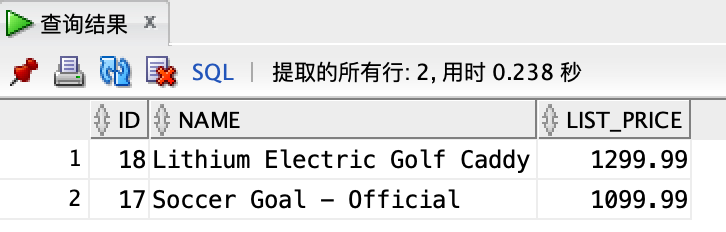
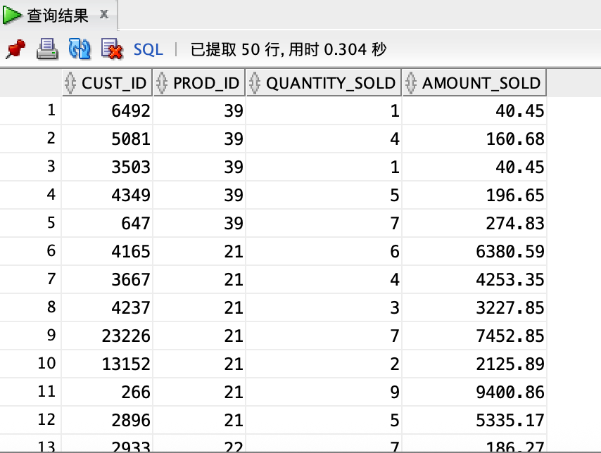
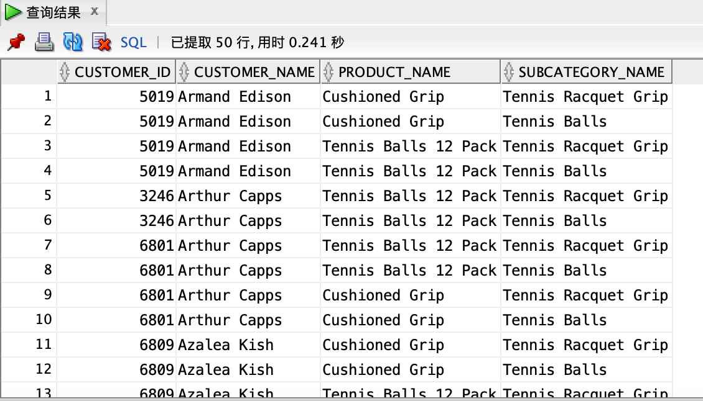
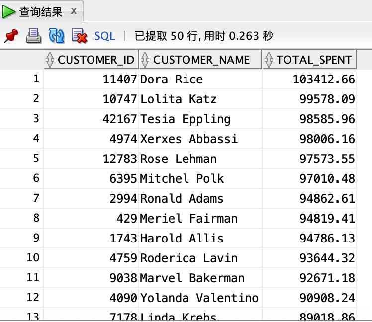
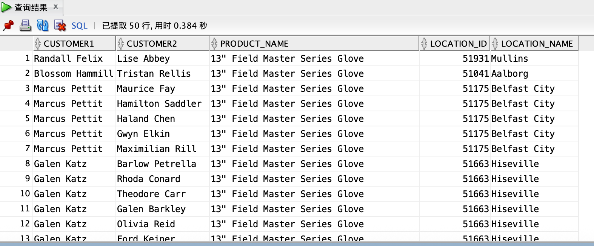
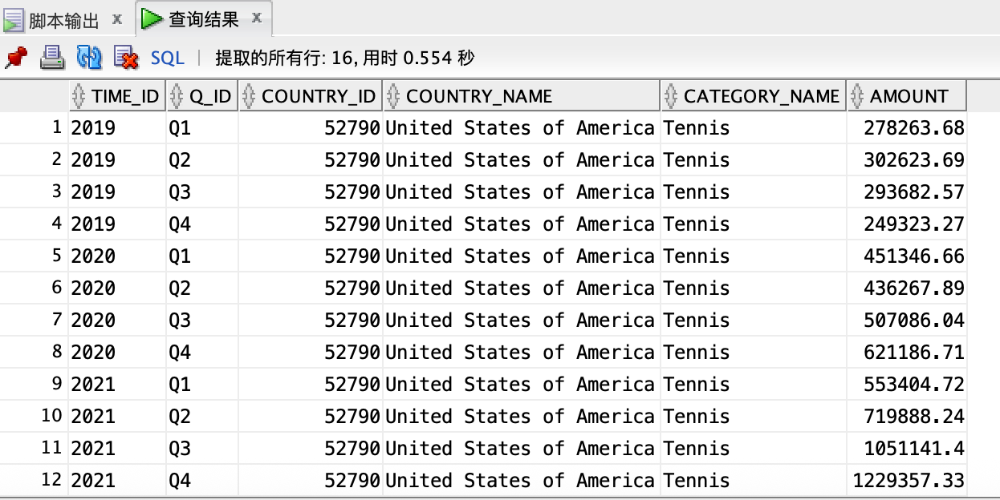
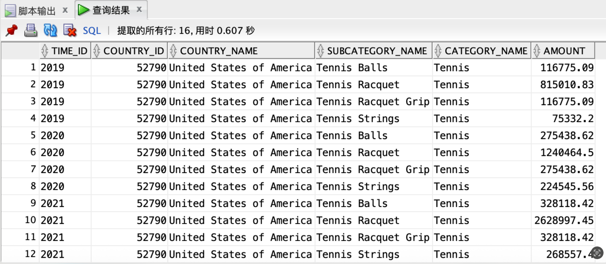

# Create Property Graph Using MV

## 前提条件

1.   安装Oracle数据库DB23ai

2.   安装SH sample schema，[参考文档和下载脚本](https://github.com/oracle-samples/db-sample-schemas)。注意用`sql`命令安装

3.   授予其它用户访问权限

     ```
     grant select any table on schema sh to vector;
     ```

     

## Task 1: 创建MV log

1.   连接到SH用户

     ```
     sqlplus sh/sh@bj_sales
     ```

     

2.   创建MV log(复杂sql的mv用不到这个mv log)

     ```
     drop MATERIALIZED VIEW LOG ON sales;
     CREATE MATERIALIZED VIEW LOG ON sales 
        WITH ROWID, SEQUENCE(prod_id, cust_id, time_id, quantity_sold, amount_sold)
        INCLUDING NEW VALUES;
     ```

     

3.   sadf

## Task 2: 创建MATERIALIZED VIEW

1.   连接到SH用户

     ```
     sqlplus sh/sh@bj_sales;
     ```

     

2.   因为有重复的id值，所以做些修改。

     ```
     update sh.customers set cust_state_province_id=cust_state_province_id+400000;
     update sh.customers set cust_city_id=cust_city_id+200000;
     commit;
     ```
     
     
     
2.   创建MV

     ```
     drop MATERIALIZED VIEW products_mv;
     CREATE MATERIALIZED VIEW products_mv 
        REFRESH complete start with sysdate NEXT sysdate + 1/1440 AS
        select prod_id as id, prod_name as name, '1' as prodlevel, 'product' as proddesc, prod_list_price as list_price from products
     union all
     select distinct prod_subcategory_id as id, prod_subcategory as name, '2' as prodlevel, 'subcategory' as proddesc, null as list_price from products
     union all
     select distinct prod_category_id as id, prod_category as name, '3' as prodlevel, 'category' as proddesc, null as list_price from products;
     
     drop MATERIALIZED VIEW prod_belong_to_mv;
     CREATE MATERIALIZED VIEW prod_belong_to_mv 
        REFRESH complete start with sysdate NEXT sysdate + 1/1440 AS
     select prod_id as id_a, prod_subcategory_id as id_b from sh.products
     union all
     select distinct prod_subcategory_id as id_a, prod_category_id as id_b from sh.products;
     
     drop MATERIALIZED VIEW customers_mv;
     CREATE MATERIALIZED VIEW customers_mv 
        REFRESH complete start with sysdate NEXT sysdate + 1/24 AS
        select cust_id as id, cust_first_name||' '||cust_last_name as name, '1' as custlevel, 'customer' as custdesc, cust_year_of_birth as year_of_birth from customers
     union all
     select distinct cust_city_id as id, cust_city as name, '2' as custlevel, 'city' as custdesc, NULL as year_of_birth from customers
     union all
     select distinct cust_state_province_id as id, cust_state_province as name, '3' as custlevel, 'province' as custdesc, NULL as year_of_birth from customers
     union all
     select country_id as id, country_name as name, '4' as custlevel, 'country' as custdesc, NULL as year_of_birth from countries;
     
     drop MATERIALIZED VIEW cust_live_in_mv;
     CREATE MATERIALIZED VIEW cust_live_in_mv 
        REFRESH complete start with sysdate NEXT sysdate + 1/24 AS
        select cust_id as id_a, cust_city_id as id_b from customers
     union all
     select distinct cust_city_id as id_a, cust_state_province_id as id_b from customers
     union all
     select distinct cust_state_province_id as id_a, country_id as id_b from customers;
     
     drop MATERIALIZED VIEW sales_mv;
     CREATE MATERIALIZED VIEW sales_mv
       REFRESH FAST start with sysdate NEXT sysdate + 1/24 AS
       select prod_id, cust_id, time_id, sum(quantity_sold) as quantity_sold, sum(amount_sold) as amount_sold from sales group by prod_id, cust_id, time_id;
     ```

     

3.   sdf

## Task 3: 创建Property Graph

1.   连接到vector用户

     ```
     sqlplus vector/vector@bj_sales
     ```

     

2.   创建product graph

     ```
     CREATE or REPLACE PROPERTY GRAPH products_graph
       VERTEX TABLES (
         sh.products_mv as prod KEY (id)
           LABEL prod
             PROPERTIES (id, name, prodlevel, proddesc, list_price)
       )
       EDGE TABLES (
         sh.prod_belong_to_mv as prodbt
           KEY (id_a,id_b)
           SOURCE KEY (id_a) REFERENCES prod(id)
           DESTINATION KEY (id_b) REFERENCES prod(id)
           LABEL belong_to
       );
     ```

     

3.   创建customer graph

     ```
     CREATE or REPLACE PROPERTY GRAPH customers_graph
       VERTEX TABLES (
         sh.customers_mv as cust KEY (id)
           LABEL cust
             PROPERTIES (id, name, custlevel, custdesc, year_of_birth)
       )
       EDGE TABLES (
         sh.cust_live_in_mv as custln
           KEY (id_a,id_b)
           SOURCE KEY (id_a) REFERENCES cust(id)
           DESTINATION KEY (id_b) REFERENCES cust(id)
           LABEL live_in
       );
     ```

     

4.   整体创建一个GRAPH

     ```
     CREATE or REPLACE PROPERTY GRAPH total_graph
       VERTEX TABLES (
         sh.products_mv as prod KEY (id)
           LABEL prod
             PROPERTIES (id, name, prodlevel, proddesc, list_price),
         sh.customers_mv as cust KEY (id)
           LABEL cust
             PROPERTIES (id, name, custlevel, custdesc, year_of_birth)
       )
       EDGE TABLES (
         sh.prod_belong_to_mv as prodbt
           KEY (id_a,id_b)
           SOURCE KEY (id_a) REFERENCES prod(id)
           DESTINATION KEY (id_b) REFERENCES prod(id)
           LABEL belong_to,
         sh.cust_live_in_mv as custln
           KEY (id_a,id_b)
           SOURCE KEY (id_a) REFERENCES cust(id)
           DESTINATION KEY (id_b) REFERENCES cust(id)
           LABEL live_in,
         sh.sales_mv as sales
           KEY (prod_id,cust_id,time_id)
           SOURCE KEY (cust_id) REFERENCES cust(id)
           DESTINATION KEY (prod_id) REFERENCES prod(id)
           LABEL buy
             PROPERTIES (cust_id,prod_id,time_id,quantity_sold, amount_sold)
       ); 
     ```

     

5.   sdf


## Task 4: 查询Graph

1.   查询products graph

     ```
     SELECT id_a, id_e, id_b FROM GRAPH_TABLE (products_graph
       MATCH (src) -[e]-> (dst)
         COLUMNS (vertex_id(src) AS id_a, edge_id(e) AS id_e, vertex_id(dst) AS id_b)
       );
     ```

     

2.   查询所有"belong_to"关系

     ```
     SELECT *
     FROM GRAPH_TABLE(products_graph
         MATCH (src) -[e IS belong_to]-> (dst)
         COLUMNS (e.id_a as source_id, e.id_b as target_id, 
                  src.name as source_name, dst.name as target_name)
     );
     ```

     

2.   查询单价大于1000的产品

     ```
     SELECT * FROM GRAPH_TABLE (products_graph
       MATCH (p IS prod )
       WHERE p.list_price > 1000
       COLUMNS(p.id, p.name as name, p.list_price as list_price)
       );
     ```

     

4.   查询所有购买关系

     ```
     SELECT *
     FROM GRAPH_TABLE(total_graph
         MATCH () -[e IS buy]-> ()
         COLUMNS (e.cust_id, e.prod_id, e.quantity_sold, e.amount_sold)
     )
     fetch first 100 rows only;
     ```

     

5.   查找购买了特定产品的客户

     ```
     SELECT *
     FROM GRAPH_TABLE(total_graph
         MATCH (cust IS cust) -[e IS buy]-> (prod IS prod)
         WHERE prod.id = 148  
         COLUMNS (cust.id as customer_id, cust.name as customer_name, prod.id AS product_id, prod.name AS product_name)
     );
     ```

     

6.   查找购买了属于某子类别产品的客户

     ```
     SELECT *
     FROM GRAPH_TABLE(total_graph
         MATCH (c IS cust) -[b IS buy]-> (p1 IS prod) -[bt IS belong_to]-> {1}(p2 IS prod)
         WHERE p2.id = 2013  
         COLUMNS (c.id AS customer_id, c.name AS customer_name, p1.name AS product_name, p2.name AS subcategory_name)
     );
     ```

     

7.   查找购买了属于某类别产品的客户

     ```
     SELECT *
     FROM GRAPH_TABLE(total_graph
         MATCH (c IS cust) -[b IS buy]-> (p1 IS prod) -[bt IS belong_to]->{2} (p2 IS prod)
         WHERE p2.id = 201  
         COLUMNS (c.id AS customer_id, c.name AS customer_name, p1.name AS product_name, p2.name AS category_name)
     );
     ```

     

8.   计算每个客户的购买总金额

     ```
     SELECT customer_id, customer_name, SUM(amount_sold) AS total_spent
     FROM GRAPH_TABLE(total_graph
         MATCH (c IS cust) -[b IS buy]-> (p IS prod)
         COLUMNS (c.id as customer_id, c.name as customer_name, b.amount_sold as amount_sold)
     )
     GROUP BY customer_id, customer_name
     ORDER BY total_spent DESC;
     ```

     

9.   查找住在同一地区且购买过相同产品的客户对

     ```
     -- 查找住在同一地区且购买过相同产品的客户对
     SELECT *
     FROM GRAPH_TABLE(total_graph
         MATCH (c1 IS cust) -[b1 IS buy]-> (p IS prod) <-[b2 IS buy]- (c2 IS cust),
                      (c1) -[l1 IS live_in]-> (l) <-[l2 IS live_in]- (c2)
         WHERE c1.id < c2.id  -- 避免重复对
         COLUMNS (c1.name AS customer1, c2.name AS customer2, p.name AS product_name, l.id AS location_id, l.name AS location_name)
     );
     ```

     

10.   查找购买金额超过1000的高价值客户及其购买的产品

      ```
      SELECT *
      FROM GRAPH_TABLE(total_graph
          MATCH (c IS cust) -[b IS buy]-> (p IS prod)
          WHERE b.amount_sold > 1000
          COLUMNS (c.id AS customer_id, c.name AS customer_name, p.id AS product_id, p.name AS product_name, b.amount_sold AS amount_sold)
      )
      ORDER BY amount_sold DESC;
      ```

      

11.   查询类别`Tennis`在各个国家总的销售额。

      ```
      SELECT country_id, country_name,category_name,sum(amount_sold) as amount
      FROM GRAPH_TABLE(total_graph
          MATCH (c IS cust) -[b IS buy]-> (p1 IS prod) -[bt IS belong_to]-> {2}(p2 IS prod),
          (c is cust)-[l is live_in]->{3}(c2 IS cust)
          WHERE p2.name = 'Tennis'  
          COLUMNS (c2.id as country_id, c2.name as country_name,c.id AS customer_id, c.name AS customer_name, b.amount_sold AS amount_sold, p1.name AS product_name, p2.name AS category_name)
      ) group by country_id, country_name,category_name
      order by amount desc;
      ```

      

12.   sdf

4.   sdf


## Task 5: 增加时间维度

1.   计算每个季度，Tennis类别的商品在美国的销售额。

     ```
     SELECT time_id, q_id, country_id, country_name,category_name,sum(amount_sold) as amount
     FROM GRAPH_TABLE(total_graph
         MATCH (c IS cust) -[b IS buy]-> (p1 IS prod) -[bt IS belong_to]-> {2}(p2 IS prod),
         (c is cust)-[l is live_in]->{3}(c2 IS cust)
         WHERE p2.name = 'Tennis' and c2.name='United States of America' 
         COLUMNS (c2.id as country_id, c2.name as country_name,c.id AS customer_id, c.name AS customer_name, to_char(b.time_id,'YYYY') AS time_id, 'Q'||to_char(b.time_id,'Q') AS q_id, b.amount_sold AS amount_sold, p1.name AS product_name, p2.name AS category_name)
     ) group by time_id,q_id,country_id, country_name,category_name
     order by time_id,q_id;
     ```

     

2.   计算Tennis子类在美国每年的销售金额。

     ```
     SELECT time_id, country_id, country_name,subcategory_name,category_name,sum(amount_sold) as amount
     FROM GRAPH_TABLE(total_graph
         MATCH (c IS cust) -[b IS buy]-> (p1 IS prod) -[bt IS belong_to]-> (p2 IS prod)-[bt2 IS belong_to]-> (p3 IS prod),
         (c is cust)-[l is live_in]->{3}(c2 IS cust)
         WHERE p3.name = 'Tennis' and c2.name='United States of America'
         COLUMNS (c2.id as country_id, c2.name as country_name,c.id AS customer_id, c.name AS customer_name, to_char(b.time_id,'YYYY') AS time_id, b.amount_sold AS amount_sold, p1.name AS product_name, p2.name AS subcategory_name,p3.name AS category_name)
     ) group by time_id,country_id, country_name,subcategory_name,category_name
     order by time_id;
     ```

     

3.   sadf

4.   sdf


## Task 6: 用函数来拼接SQL

1.   创建函数：

     ```
     CREATE OR REPLACE FUNCTION generate_sql (
         c_level IN NUMBER,       -- 客户维level
         c_value IN VARCHAR2,  -- 客户维值
         p_level IN NUMBER,        -- 产品维level
         p_value IN VARCHAR2,   -- 产品维值
         d_year  IN number :=0,
         d_quarter IN number :=0,
         d_month  IN number :=0
     ) RETURN VARCHAR2             -- 返回值类型
     IS
         v_result_list VARCHAR2(2000);
         v_sql varchar2(4000);
         v_custdesc varchar2(40);
         v_proddesc varchar2(100);
         v_column varchar2(1000);
         vc_level number;
         vp_level number;
         vc_where number;
         vp_where number;
         v_where_list varchar2(2000);
        -- v_groupby_list varchar2(2000);
     BEGIN
         -- 找到customer level对应的名称
         
         vc_where:=c_level;
         vp_where:=p_level;
             
         if d_month <>0 then
           v_result_list:=',MONTH ';
           v_column:=q'[ ,to_char(b.time_id,'MM') as MONTH]';
           v_where_list:=q'[ to_char(b.time_id,'MM')=]'||d_month||' AND ';
         end if;
         
         if d_quarter <>0 then
           v_result_list:=',QUARTER '||v_result_list;
           v_column:=q'[ ,to_char(b.time_id,'Q') as QUARTER]'||v_column;
           v_where_list:=q'[ to_char(b.time_id,'Q')=]'||d_quarter||' AND'||v_where_list;
         end if;
         
         if d_year <>0 then
           v_result_list:='YEAR '||v_result_list;
           v_column:=q'[ COLUMNS ( to_char(b.time_id,'YYYY') as YEAR]'||v_column;
           v_where_list:=q'[ to_char(b.time_id,'YYYY')=]'||d_year||' AND '||v_where_list;
         else
           v_result_list:='YEAR '||v_result_list;
           v_column:=q'[ COLUMNS ( to_char(b.time_id,'YYYY') as YEAR]'||v_column;    
         end if;
         
         
         dbms_output.put_line(v_column);
         vc_level:=c_level-1;
         for i in (c_level-1)..4 loop
           select custdesc into v_custdesc from sh.customers_mv where custlevel=vc_level fetch first rows only;
           if v_custdesc is not null then
             v_result_list:=v_result_list||','||v_custdesc;
             v_column:=v_column||', c'||vc_level||'.name'||' AS '||v_custdesc;
           end if;
           vc_level:=vc_level+1;
         end loop;
         dbms_output.put_line(v_column);
         
         vp_level:=p_level-1;
         for i in (p_level-1)..3 loop
           select proddesc into v_proddesc from sh.products_mv where prodlevel=vp_level fetch first rows only;
           if v_proddesc is not null then
             v_result_list:=v_result_list||','||v_proddesc;
             v_column:=v_column||', p'||vp_level||'.name'||' AS '||v_proddesc;
           end if;
           vp_level:=vp_level+1;
         end loop; 
         
         v_sql:='select '||v_result_list||', sum(amount_sold)'||' FROM GRAPH_TABLE(total_graph '||' MATCH (c1 IS cust) -[b IS buy]-> (p1 IS prod) -[]-> (p2 IS prod)-[]-> (p3 IS prod),';
         v_sql:=v_sql||' (c1 is cust)-[]-> (c2 IS cust)-[]-> (c3 IS cust)-[]-> (c4 IS cust) ';
         v_sql:=v_sql||' Where '||v_where_list||' c'||vc_where||q'[.name=']'||c_value||q'[']';
         v_sql:=v_sql||' AND p'||vp_where||q'[.name=']'||p_value||q'[']';
         v_sql:=v_sql||v_column||',b.amount_sold AS amount_sold)) group by '||v_result_list;
         
         -- 返回结果
         RETURN v_sql;
         
     EXCEPTION
         WHEN OTHERS THEN
             -- 异常处理
             DBMS_OUTPUT.PUT_LINE('Error occurred: ' || SQLERRM);
             RETURN NULL;
     END generate_sql;
     ```

     

2.   生成SQL

     ```
     set serveroutput on;
     select generate_sql(4,'United States of America',3,'Tennis') from dual;
     ```

     生成的结果：

     ```
     select time_id ,province,country,subcategory,category, sum(amount_sold) FROM GRAPH_TABLE(total_graph  MATCH (c1 IS cust) -[b IS buy]-> (p1 IS prod) -[]-> (p2 IS prod)-[]-> (p3 IS prod), (c1 is cust)-[]-> (c2 IS cust)-[]-> (c3 IS cust)-[]-> (c4 IS cust)  Where c4.name='United States of America' AND p3.name='Tennis' COLUMNS (to_char(b.time_id,'YYYY') AS time_id , c3.name AS province, c4.name AS country, p2.name AS subcategory, p3.name AS category,b.amount_sold AS amount_sold)) group by time_id ,province,country,subcategory,category
     ```

     

3.   或者：

     ```
     set serveroutput on;
     select generate_sql(4,'United States of America',3,'Tennis',2022,1,2) from dual;
     ```

     生成的SQL

     ```
     select YEAR ,QUARTER ,MONTH ,province,country,subcategory,category, sum(amount_sold) FROM GRAPH_TABLE(total_graph  MATCH (c1 IS cust) -[b IS buy]-> (p1 IS prod) -[]-> (p2 IS prod)-[]-> (p3 IS prod), (c1 is cust)-[]-> (c2 IS cust)-[]-> (c3 IS cust)-[]-> (c4 IS cust)  Where  to_char(b.time_id,'YYYY')=2022 AND  to_char(b.time_id,'Q')=1 AND to_char(b.time_id,'MM')=2 AND  c4.name='United States of America' AND p3.name='Tennis' COLUMNS ( to_char(b.time_id,'YYYY') as YEAR ,to_char(b.time_id,'Q') as QUARTER ,to_char(b.time_id,'MM') as MONTH, c3.name AS province, c4.name AS country, p2.name AS subcategory, p3.name AS category,b.amount_sold AS amount_sold)) group by YEAR ,QUARTER ,MONTH ,province,country,subcategory,category
     ```


## Task 7: 大模型生成SQL语句

1.   提示词

     ```
     ## 现有Oracle中定义的property graph 如下：
     CREATE or REPLACE PROPERTY GRAPH total_graph
       VERTEX TABLES (
         sh.products_mv as prod KEY (id)
           LABEL prod
             PROPERTIES (id, name, prodlevel, proddesc, list_price),
         sh.customers_mv as cust KEY (id)
           LABEL cust
             PROPERTIES (id, name, custlevel, custdesc, year_of_birth)
       )
       EDGE TABLES (
         sh.prod_belong_to_mv as prodbt
           KEY (id_a,id_b)
           SOURCE KEY (id_a) REFERENCES prod(id)
           DESTINATION KEY (id_b) REFERENCES prod(id)
           LABEL belong_to,
         sh.cust_live_in_mv as custln
           KEY (id_a,id_b)
           SOURCE KEY (id_a) REFERENCES cust(id)
           DESTINATION KEY (id_b) REFERENCES cust(id)
           LABEL live_in,
         sh.sales_mv as sales
           KEY (prod_id,cust_id,time_id)
           SOURCE KEY (cust_id) REFERENCES cust(id)
           DESTINATION KEY (prod_id) REFERENCES prod(id)
           LABEL buy
             PROPERTIES (cust_id,prod_id,time_id,quantity_sold, amount_sold)
       ); 
     ## 其中两个维度：
     a. cust维度有4层：1:customer, 2:city, 3:province, 4:country
     b. prod维度有3层： 1:product, 2:subcategory, 3:category
     ## country的值有：'United States of America', 'Germany', 'United Kingdom', 'France'等等。
      其中'United States of America'下的province的值有: 'CA', 'CO', 'KY', 'FL'等等。
      category的值有: 'Tennis', 'Baseball', 'Cricket', 'Golf'等等
      其中'Tennis'下的subcategory的值有: 'Tennis Racquet', 'Tennis Balls', 'Tennis Strings', 'Tennis Racquet Grip'等。
     
     ##这是几个使用SQL graph的语法的例子：
     #例子1: 查询2022年1季度2月份，'United States of America'的各个province中'Tennis'的subcategory销售总额是多少？
     答案：select YEAR ,QUARTER ,MONTH ,province,country,subcategory,category, sum(amount_sold) as total_amount
     FROM GRAPH_TABLE(total_graph  
     MATCH (c1 IS cust) -[b IS buy]-> (p1 IS prod) -[]-> (p2 IS prod)-[]-> (p3 IS prod), 
     (c1 is cust)-[]-> (c2 IS cust)-[]-> (c3 IS cust)-[]-> (c4 IS cust)  
     Where  to_char(b.time_id,'YYYY')=2022 AND  to_char(b.time_id,'Q')=1 AND to_char(b.time_id,'MM')=2 AND  c4.name='United States of America' AND p3.name='Tennis' 
     COLUMNS ( to_char(b.time_id,'YYYY') as YEAR ,to_char(b.time_id,'Q') as QUARTER ,to_char(b.time_id,'MM') as MONTH, c3.name AS province, c4.name AS country, p2.name AS subcategory, p3.name AS category,b.amount_sold AS amount_sold)) 
     group by YEAR ,QUARTER ,MONTH ,province,country,subcategory,category;
     
     #例子2: 查询2022年1季度，'United States of America'的各个province中'Tennis'的subcategory销售总额是多少？
     答案：select YEAR ,QUARTER ,province,country,subcategory,category, sum(amount_sold) as total_amount
     FROM GRAPH_TABLE(total_graph  
     MATCH (c1 IS cust) -[b IS buy]-> (p1 IS prod) -[]-> (p2 IS prod)-[]-> (p3 IS prod), 
     (c1 is cust)-[]-> (c2 IS cust)-[]-> (c3 IS cust)-[]-> (c4 IS cust)  
     Where  to_char(b.time_id,'YYYY')=2022 AND  to_char(b.time_id,'Q')=1 AND to_char(b.time_id,'MM')=2 AND  c4.name='United States of America' AND p3.name='Tennis' 
     COLUMNS ( to_char(b.time_id,'YYYY') as YEAR ,to_char(b.time_id,'Q') as QUARTER , c3.name AS province, c4.name AS country, p2.name AS subcategory, p3.name AS category,b.amount_sold AS amount_sold)) 
     group by YEAR ,QUARTER ,province,country,subcategory,category
     order by total_amount desc;
     
     #例子3: 查询2022年，'United States of America'的各个province销售总额是多少？
     答案：select YEAR ,province,country, sum(amount_sold) as total_amount
     FROM GRAPH_TABLE(total_graph  
     MATCH (c1 IS cust) -[b IS buy]-> (p1 IS prod) -[]-> (p2 IS prod)-[]-> (p3 IS prod), 
     (c1 is cust)-[]-> (c2 IS cust)-[]-> (c3 IS cust)-[]-> (c4 IS cust)  
     Where  to_char(b.time_id,'YYYY')=2022 AND  c4.name='United States of America'  
     COLUMNS ( to_char(b.time_id,'YYYY') as YEAR , c3.name AS province, c4.name AS country,b.amount_sold AS amount_sold)) 
     group by YEAR  ,province,country;
     
     #例子4: 查询'United States of America'的各个province销售总额是多少？
     答案：select province,country, sum(amount_sold) as total_amount
     FROM GRAPH_TABLE(total_graph  
     MATCH (c1 IS cust) -[b IS buy]-> (p1 IS prod) -[]-> (p2 IS prod)-[]-> (p3 IS prod), 
     (c1 is cust)-[]-> (c2 IS cust)-[]-> (c3 IS cust)-[]-> (c4 IS cust)  
     Where  c4.name='United States of America'  
     COLUMNS (  c3.name AS province, c4.name AS country,b.amount_sold AS amount_sold)) 
     group by province,country;
     
     #例子5: 2022年2月，'United States of America'的各个province中'Baseball'的销售总额跟上个月比的变化是多少？
     答案：SELECT
     curr.YEAR,
     curr.MONTH,
     curr.province,
     curr.country,
     curr.category,
     curr.total_amount AS current_month_amount,
     prev.total_amount AS previous_month_amount,
     (curr.total_amount - prev.total_amount) AS amount_change
     FROM (
     SELECT
      YEAR,
       MONTH,
      province,
     country,
     category,
     sum(amount_sold) AS total_amount
     FROM GRAPH_TABLE(total_graph
     MATCH (c1 IS cust) -[b IS buy]-> (p1 IS prod) -[]-> (p2 IS prod)-[]-> (p3 IS prod),
     (c1 is cust)-[]-> (c2 IS cust)-[]-> (c3 IS cust)-[]-> (c4 IS cust)
     WHERE to_char(b.time_id,'YYYY') = '2022'
     AND to_char(b.time_id,'MM') = '02'
     AND c4.name = 'United States of America'
     AND p3.name = 'Baseball'
     COLUMNS (
     to_char(b.time_id,'YYYY') as YEAR,
     to_char(b.time_id,'MM') as MONTH,
     c3.name AS province,
     c4.name AS country,
     p3.name AS category,
     b.amount_sold AS amount_sold
     )
     )
     GROUP BY YEAR, MONTH, province, country, category
     ) curr
     LEFT JOIN (
     SELECT
     YEAR,
      MONTH,
     province,
     country,
     category,
     sum(amount_sold) AS total_amount
     FROM GRAPH_TABLE(total_graph
     MATCH (c1 IS cust) -[b IS buy]-> (p1 IS prod) -[]-> (p2 IS prod)-[]-> (p3 IS prod),
     (c1 is cust)-[]-> (c2 IS cust)-[]-> (c3 IS cust)-[]-> (c4 IS cust)
     WHERE to_char(b.time_id,'YYYY') = '2022'
     AND to_char(b.time_id,'MM') = '01'
     AND c4.name = 'United States of America'
     AND p3.name = 'Baseball'
     COLUMNS (
     to_char(b.time_id,'YYYY') as YEAR,
     to_char(b.time_id,'MM') as MONTH,
     c3.name AS province,
     c4.name AS country,
     p3.name AS category,
     b.amount_sold AS amount_sold
     )
     )
     GROUP BY YEAR, MONTH, province, country, category
     ) prev ON curr.province = prev.province AND curr.country = prev.country AND curr.category = prev.category;
     
     ## 注意：检查生成的SQL语句中'Select 字段1, 字段2, 字段3... from graph_table' 中select后面的字段列表只能用COLUMNS( )子句中包含的别名
     ## 注意：检查'('和')'的匹配情况
     ## 根据以上的示例，回答下列问题，生成相应的SQL语句，仅返回SQL语句，不需要其它解释：
     问题：列出2020年到2022年每个国家，baseball大类的销售总额与去年同期的比较
     
     列出每年每个国家，每个category的销售总额
     发现'United States of America'的'Baseball'在2022年的销售总额比去年减少，需要按产品维度向下钻取一层查询销售总额，请生成相应的SQL graph语句。
     按customer维度向下钻取一层查询销售总额，请生成相应的SQL graph语句
     
     
     问题：2022年一季度，'United States of America'的各个province中'Baseball'的销售总额跟上个季度比的变化是多少？
     
     
     问题：2022年2月份，'United States of America'的'CA'的各个city中'Baseball'的销售总额是多少？
     问题：2022年2月份，'France'的各个province中'Baseball'的销售总额是多少？
     问题：2022年2月份，'United States of America'的各个province中'Baseball'的subcategory销售总额是多少？
     ```

     

2.   例如：2022年一季度，'United States of America'的各个province中'Baseball'的销售总额跟上个季度比的变化是多少？生成的SQL语句：

     ```
     SELECT
     curr.YEAR,
     curr.QUARTER,
     curr.province,
     curr.country,
     curr.category,
     curr.total_amount AS current_quarter_amount,
     prev.total_amount AS previous_quarter_amount,
     (curr.total_amount - prev.total_amount) AS amount_change
     FROM (
     SELECT
      YEAR,
       QUARTER,
      province,
     country,
     category,
     sum(amount_sold) AS total_amount
     FROM GRAPH_TABLE(total_graph
     MATCH (c1 IS cust) -[b IS buy]-> (p1 IS prod) -[]-> (p2 IS prod)-[]-> (p3 IS prod),
     (c1 is cust)-[]-> (c2 IS cust)-[]-> (c3 IS cust)-[]-> (c4 IS cust)
     WHERE to_char(b.time_id,'YYYY') = '2022'
     AND to_char(b.time_id,'Q') = '1'
     AND c4.name = 'United States of America'
     AND p3.name = 'Baseball'
     COLUMNS (
     to_char(b.time_id,'YYYY') as YEAR,
     to_char(b.time_id,'Q') as QUARTER,
     c3.name AS province,
     c4.name AS country,
     p3.name AS category,
     b.amount_sold AS amount_sold
     )
     )
     GROUP BY YEAR, QUARTER, province, country, category
     ) curr
     LEFT JOIN (
     SELECT
     YEAR,
      QUARTER,
     province,
     country,
     category,
     sum(amount_sold) AS total_amount
     FROM GRAPH_TABLE(total_graph
     MATCH (c1 IS cust) -[b IS buy]-> (p1 IS prod) -[]-> (p2 IS prod)-[]-> (p3 IS prod),
     (c1 is cust)-[]-> (c2 IS cust)-[]-> (c3 IS cust)-[]-> (c4 IS cust)
     WHERE to_char(b.time_id,'YYYY') = '2021'
     AND to_char(b.time_id,'Q') = '4'
     AND c4.name = 'United States of America'
     AND p3.name = 'Baseball'
     COLUMNS (
     to_char(b.time_id,'YYYY') as YEAR,
     to_char(b.time_id,'Q') as QUARTER,
     c3.name AS province,
     c4.name AS country,
     p3.name AS category,
     b.amount_sold AS amount_sold
     )
     )
     GROUP BY YEAR, QUARTER, province, country, category
     ) prev ON curr.province = prev.province AND curr.country = prev.country AND curr.category = prev.category;
     ```

     

3.   另一种提示：

     ```
     ## 现有Oracle中定义的property graph 如下：
     CREATE or REPLACE PROPERTY GRAPH total_graph
       VERTEX TABLES (
         sh.products_mv as prod KEY (id)
           LABEL prod
             PROPERTIES (id, name, prodlevel, proddesc, list_price),
         sh.customers_mv as cust KEY (id)
           LABEL cust
             PROPERTIES (id, name, custlevel, custdesc, year_of_birth)
       )
       EDGE TABLES (
         sh.prod_belong_to_mv as prodbt
           KEY (id_a,id_b)
           SOURCE KEY (id_a) REFERENCES prod(id)
           DESTINATION KEY (id_b) REFERENCES prod(id)
           LABEL belong_to,
         sh.cust_live_in_mv as custln
           KEY (id_a,id_b)
           SOURCE KEY (id_a) REFERENCES cust(id)
           DESTINATION KEY (id_b) REFERENCES cust(id)
           LABEL live_in,
         sh.sales_mv as sales
           KEY (prod_id,cust_id,time_id)
           SOURCE KEY (cust_id) REFERENCES cust(id)
           DESTINATION KEY (prod_id) REFERENCES prod(id)
           LABEL buy
             PROPERTIES (cust_id,prod_id,time_id,quantity_sold, amount_sold)
       ); 
     ## 其中两个维度：
     a. cust维度有4层：1:customer, 2:city, 3:province, 4:country
     b. prod维度有3层： 1:product, 2:subcategory, 3:category
     ## country的值有：'United States of America', 'Germany', 'United Kingdom', 'France'等等。
      其中'United States of America'下的province的值有: 'CA', 'CO', 'KY', 'FL'等等。
      category的值有: 'Tennis', 'Baseball', 'Cricket', 'Golf'等等
      其中'Tennis'下的subcategory的值有: 'Tennis Racquet', 'Tennis Balls', 'Tennis Strings', 'Tennis Racquet Grip'等。
     
     ##这是几个使用SQL graph的语法的例子：
     #例子1: 查询2022年1季度2月份，'United States of America'的各个province中'Tennis'的subcategory销售总额是多少？
     答案：select YEAR ,QUARTER ,MONTH ,province,country,subcategory,category, sum(amount_sold) as total_amount
     FROM GRAPH_TABLE(total_graph  
     MATCH (c1 IS cust) -[b IS buy]-> (p1 IS prod) -[]-> (p2 IS prod)-[]-> (p3 IS prod), 
     (c1 is cust)-[]-> (c2 IS cust)-[]-> (c3 IS cust)-[]-> (c4 IS cust)  
     Where  to_char(b.time_id,'YYYY')=2022 AND  to_char(b.time_id,'Q')=1 AND to_char(b.time_id,'MM')=2 AND  c4.name='United States of America' AND p3.name='Tennis' 
     COLUMNS ( to_char(b.time_id,'YYYY') as YEAR ,to_char(b.time_id,'Q') as QUARTER ,to_char(b.time_id,'MM') as MONTH, c3.name AS province, c4.name AS country, p2.name AS subcategory, p3.name AS category,b.amount_sold AS amount_sold)) 
     group by YEAR ,QUARTER ,MONTH ,province,country,subcategory,category;
     
     #例子2: 查询2022年1季度，'United States of America'的各个province中'Tennis'的subcategory销售总额是多少？
     答案：select YEAR ,QUARTER ,province,country,subcategory,category, sum(amount_sold) as total_amount
     FROM GRAPH_TABLE(total_graph  
     MATCH (c1 IS cust) -[b IS buy]-> (p1 IS prod) -[]-> (p2 IS prod)-[]-> (p3 IS prod), 
     (c1 is cust)-[]-> (c2 IS cust)-[]-> (c3 IS cust)-[]-> (c4 IS cust)  
     Where  to_char(b.time_id,'YYYY')=2022 AND  to_char(b.time_id,'Q')=1 AND to_char(b.time_id,'MM')=2 AND  c4.name='United States of America' AND p3.name='Tennis' 
     COLUMNS ( to_char(b.time_id,'YYYY') as YEAR ,to_char(b.time_id,'Q') as QUARTER , c3.name AS province, c4.name AS country, p2.name AS subcategory, p3.name AS category,b.amount_sold AS amount_sold)) 
     group by YEAR ,QUARTER ,province,country,subcategory,category
     order by total_amount desc;
     
     #例子3: 查询2022年，'United States of America'的各个province销售总额是多少？
     答案：select YEAR ,province,country, sum(amount_sold) as total_amount
     FROM GRAPH_TABLE(total_graph  
     MATCH (c1 IS cust) -[b IS buy]-> (p1 IS prod) -[]-> (p2 IS prod)-[]-> (p3 IS prod), 
     (c1 is cust)-[]-> (c2 IS cust)-[]-> (c3 IS cust)-[]-> (c4 IS cust)  
     Where  to_char(b.time_id,'YYYY')=2022 AND  c4.name='United States of America'  
     COLUMNS ( to_char(b.time_id,'YYYY') as YEAR , c3.name AS province, c4.name AS country,b.amount_sold AS amount_sold)) 
     group by YEAR  ,province,country;
     
     
     #例子4: 查询'France'的Baseball大类在2022年各个季度的销售总额与去年的同期比较？
     答案：SELECT
     YEAR,
     QUARTER,
     category,
     sum(amount_sold) AS total_amount,
     sum(amount_sold) - LAG(sum(amount_sold)) OVER (PARTITION BY QUARTER ORDER BY YEAR) AS amount_change
     FROM GRAPH_TABLE(total_graph
     MATCH (c1 IS cust) -[b IS buy]-> (p1 IS prod) -[]-> (p2 IS prod)-[]-> (p3 IS prod),
     (c1 is cust)-[]-> (c2 IS cust)-[]-> (c3 IS cust)-[]-> (c4 IS cust)
     WHERE to_char(b.time_id,'YYYY') IN ('2021','2022')
     AND c4.name = 'France'
     AND p3.name = 'Baseball'
     COLUMNS (
     to_char(b.time_id,'YYYY') as YEAR,
     to_char(b.time_id,'Q') as QUARTER,
     p3.name AS category,
     b.amount_sold AS amount_sold
     )
     )
     GROUP BY YEAR, QUARTER, category
     ORDER BY amount_change ASC;
     
     
     ##下面是2022年每个国家，baseball大类的销售总额与去年同期的比较：
     生成的SQL语句：
     SELECT
     YEAR,
     country,
     category,
     sum(amount_sold) AS total_amount,
     sum(amount_sold) - LAG(sum(amount_sold)) OVER (PARTITION BY country ORDER BY YEAR) AS amount_change
     FROM GRAPH_TABLE(total_graph
     MATCH (c1 IS cust) -[b IS buy]-> (p1 IS prod) -[]-> (p2 IS prod)-[]-> (p3 IS prod),
     (c1 is cust)-[]-> (c2 IS cust)-[]-> (c3 IS cust)-[]-> (c4 IS cust)
     WHERE to_char(b.time_id,'YYYY') IN ('2021','2022')
     AND p3.name = 'Baseball'
     COLUMNS (
     to_char(b.time_id,'YYYY') as YEAR,
     c4.name AS country,
     p3.name AS category,
     b.amount_sold AS amount_sold
     )
     )
     GROUP BY YEAR, country, category
     ORDER BY country, YEAR;
     
     运行的结果如下：
     YEAR COUNTRY                 CATEGORY               TOTAL_AMOUNT AMOUNT_CHANGE
     ---- ------------------------------------------------------------- -------------------------------------------------- ------------ -------------
     2021 Argentina                 Baseball              2925.01
     2022 Argentina                 Baseball               546.17  -2378.84
     2021 Australia                 Baseball             230347.9
     2022 Australia                 Baseball             293083.5   62735.6
     2021 Brazil                Baseball              2833.01
     2022 Brazil                Baseball              2961.28    128.27
     2021 Canada                Baseball            179022.41
     2022 Canada                Baseball            254375.02  75352.61
     2021 China                 Baseball                22.99
     2021 Denmark                 Baseball            107550.68
     2022 Denmark                 Baseball            156103.18   48552.5
     
     YEAR COUNTRY                 CATEGORY               TOTAL_AMOUNT AMOUNT_CHANGE
     ---- ------------------------------------------------------------- -------------------------------------------------- ------------ -------------
     2021 France                Baseball            262391.74
     2022 France                Baseball            232410.82     -29980.92
     2021 Germany                 Baseball            607463.95
     2022 Germany                 Baseball            756627.86     149163.91
     2021 Italy                 Baseball            259195.28
     2022 Italy                 Baseball            347188.01  87992.73
     2021 Japan                 Baseball            462764.65
     2022 Japan                 Baseball            630767.43     168002.78
     2021 Poland                Baseball               172.98
     2021 Saudi Arabia              Baseball               250.96
     2021 Singapore                 Baseball            219087.67
     
     YEAR COUNTRY                 CATEGORY               TOTAL_AMOUNT AMOUNT_CHANGE
     ---- ------------------------------------------------------------- -------------------------------------------------- ------------ -------------
     2022 Singapore                 Baseball            241203.28  22115.61
     2021 Spain                 Baseball            115434.89
     2022 Spain                 Baseball            204156.52  88721.63
     2021 Turkey                Baseball                22.99
     2021 United Kingdom              Baseball            424389.23
     2022 United Kingdom              Baseball            485284.72  60895.49
     2021 United States of America            Baseball           3590909.88
     2022 United States of America            Baseball           4254999.92     664090.04
     
     你是一个数据分析专家，找到上面数据里负向变化最大的国家，应该如何继续提问下一个问题，才能找到数据下降的根因，只保留前三个问题
     请列出问题，并根据这个生成新的SQL Graph语句
     注意：检查生成的SQL语句中'Select 字段1, 字段2, 字段3... from graph_table' 中select后面的字段列表只能用COLUMNS( )子句中包含的别名
     注意：检查'('和')'的匹配情况
     ```

     

4.   sdaf

3.   