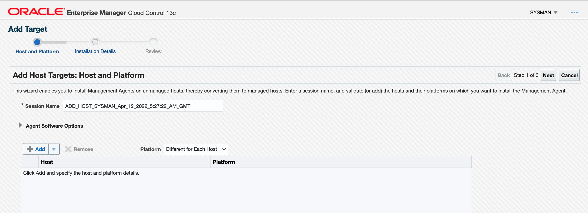

# Oracle Enterprise Manager 13.5 安装步骤

## 简介


## 准备工作

1. 部署虚机Oracle Linux7.9，4ocpu, 64G, 200G存储。启动后扩展存储。

    ```
    sudo /usr/libexec/oci-growfs -y
    ```

    

2. 配置VNC，参见文档

3. 下载[OEM安装包13.5](https://www.oracle.com/enterprise-manager/downloads/cloud-control-downloads.html)

4. 下载Oracle DB19.3.0.0

5. 下载Oracle DB Patch RUR 19.11.2.0，[安装文档要求19.5 + one-off patch](https://docs.oracle.com/en/enterprise-manager/cloud-control/enterprise-manager-cloud-control/13.5/embsc/creating-database-instance-preconfigured-repository-using-database-templates1.html#GUID-1E073672-7A0E-47EE-A3E8-72EC60A28712)

6. 下载[OEM资料库数据库PDB模版](https://www.oracle.com/enterprise-manager/downloads/db-templates-13c-release5-downloads.html)

7. 下载最新版opatch


## 安装数据库软件

1. 确定在opc用户下已经安装了数据库预安装包

    ```
    sudo yum -y install oracle-database-preinstall-19c
    ```

    

2. 在opc用户下创建目录

    ```
    sudo mkdir /u01
    sudo chown oracle:oinstall /u01
    ```

    

3. 在oracle用户下创建数据安装目录

    ```
    mkdir -p /u01/app/oracle/product/19c/dbhome
    ```

    

4. 解压Oracle DB安装软件到Oracle Home下

    ```
    unzip -d /u01/app/oracle/product/19c/dbhome LINUX.X64_193000_db_home.zip
    ```

    

5. 解压最新版opatch到Oracle Home下，覆盖旧版本文件。

    ```
    unzip -d /u01/app/oracle/product/19c/dbhome p6880880_190000_Linux-x86-64.zip 
    ```

    

6. 在Downloads目录下解压DB RUR

    ```
    unzip p33153989_190000_Linux-x86-64.zip
    ```

    

7. 在VNC Viewer中安装数据库软件并同时打上补丁

    ```
    /u01/app/oracle/product/19c/dbhome/runInstaller -applyRU /home/oracle/Downloads/33153989
    ```

    

8. 选择仅安装软件

    

9. 选择单实例安装

    

10. 选择安装企业版

    

11. 缺省的ORACLE BASE

    

12. 缺省的Inventory目录和组

    

13. 缺省的管理组

    

14. 因为当前root用户没有设置密码，oracle用户也没有sudo权限，采用手动执行root脚本。

    

15. 内存足够，可以暂时忽略swap大小的警告

    

16. 总结

    

17. 开始安装

    

18. 在root用户下执行下面的命令

    

19. 安装完成

    

    


## 创建数据库用于存放OEM资料库

1. 在oracle用户下将数据库模版展开到template目录下

    ```
    unzip -d /u01/app/oracle/product/19c/dbhome/assistants/dbca/templates 19_11_0_0_0_Database_Template_with_cdbpdb_for_EM13_5_0_0_0_Linux_x64.zip
    ```

    

2. 运行dbca创建数据库

    ```
    /u01/app/oracle/product/19c/dbhome/bin/dbca
    ```

    

3. 选择创建数据库

    

4. 选择高级配置

    

5. 选择针对EM13.5的Small数据库模版

    

    

6. 输入数据库名，如：orcl，该模版缺省的pdb名为:  `empdbrepos`

    

    

7. 使用模版的存储属性

    

8. 缺省选项

    

9. 创建新的listener

    

10. 缺省选项

    

11. 缺省选项

    

12. 不要配置EM Express

    

13. 输入password: `WelcomePTS_2021#`

    

14. 选择创建数据库

    

15. 点击完成。

    

16. 开始安装

    

17. 忽略错误`ORA-01537: cannot add file '/u01/app/oracle/oradata/ORCL/EMPDBREPOS/temp01.dbf' - file already part of database`

    

18. 点击关闭窗口。

    

19. 连接到数据库

    ```
    $ . oraenv
    ORACLE_SID = [oracle] ? orcl
    The Oracle base has been set to /u01/app/oracle
    $ sqlplus / as sysdba
    
    SQL*Plus: Release 19.0.0.0.0 - Production on Sat Apr 9 08:12:10 2022
    Version 19.11.2.0.0
    
    Copyright (c) 1982, 2020, Oracle.  All rights reserved.
    
    
    Connected to:
    Oracle Database 19c Enterprise Edition Release 19.0.0.0.0 - Production
    Version 19.11.2.0.0
    
    SQL> 
    
    ```

    

20. 修复前面的错误，为pdb添加tempfile

    ```
    SQL> alter session set container=empdbrepos;
    
    SQL> alter tablespace temp add tempfile '/u01/app/oracle/oradata/ORCL/EMPDBREPOS/temp02.dbf' size 80M autoextend on;
    
    Tablespace altered.
    ```

    

    

## 安装OEM

1. 运行安装命令

    ```
    chmod +x em13500_linux64.bin
    ./em13500_linux64.bin
    ```

    

2. 选择高级安装

    

3. 忽略更新检查。

    

4. 预检查发现警告信息，经检查实际版本比需要的版本高，所以忽略

    

5. 输入中间件和Agent的安装目录

    

6. 缺省选择安装的插件，其它的可以在后面再安装

    

7. 输入密码:`WelcomePTS_2021`，注意Weblogic用户密码不能带`#`号。

    

    

8. 输入前面准备好的数据库相关信息，密码为：`WelcomePTS_2021#`

    

    

9. 预检查全部通过。

    

10. 设置sysman用户和Agent的注册的密码：`WelcomePTS_2021#`

    

11. 缺省Oracle软件库的地址。

    

12. 缺省的端口。

    

13. 回顾一下刚才的设置，点击安装。

    

14. 开始安装。

    

15. 在root用户下运行脚本。

    

16. 安装完成，关闭窗口。

    

17. 在虚机里要打开相应的端口，虚机所在的子网的安全列表也要相应打开端口

    ```
    sudo firewall-cmd --zone=public --add-port=7803/tcp --permanent
    sudo firewall-cmd --zone=public --add-port=4889/tcp --permanent
    sudo firewall-cmd --zone=public --add-port=4903/tcp --permanent
    sudo firewall-cmd --reload
    ```

    

18. 浏览器里输入URL：`https://<public-ip>:7803/em`

    

    

19. 登录进入欢迎页面，可以选择一个自己的主页面模版，如：Summary。

    

20. 进入Summary主页面.

    

    

## 后续的工作

1. 设置售后服务账号，OEM会定期自动下载更新文件。

    

2. 解锁目标数据库用户

    ```
    alter user dbsnmp identified by WelcomePTS_2021# account unlock
    ```

    

3. sadf

## 增加host目标

1. 创建一个VM，包含database 18.13

2. 打开端口3872

    ```
    sudo firewall-cmd --zone=public --add-port=3872/tcp --permanent
    sudo firewall-cmd --reload
    ```

    

3. 选择**Setup**->**Extensibility**->**Self Upate**

4. 选择**Agent Software**

    

5. 选择**Install Agent on Host**

    

6. 点击**Add**

    

7. 输入目标主机的ip地址和操作系统平台

    

8. 提醒最好输入主机域名，可以忽略该信息，或者在hosts文件中增加主机域名

    

9. 输入安装Agent软件的目录和Agent实例目录

    

10. 在**Named Credential**中选择**Ssh Key Credential**，输入用户名opc，上传SSH Private Key和Public Key。

    

11. 其它信息可忽略，点击Next。

    

12. 点击**Deploy Agent**

    

13. 等待安装完成

    

    

## 添加数据库目标。

1. 选择**Targets**->**Database**

    

2. 点击**Add**->**Oracle Database**

    

3. 选中目标主机，点击**Select**

4. 点击**Next**

    

5. 数据库中的dbsnmp用户事先需要解锁，输入该用户密码

    

6. 目标数据库解锁dbsnmp用户

    ```
    alter user dbsnmp identified by WelcomePTS_2021# account unlock;
    ```

    

7. 打开端口1521

    ```
    sudo firewall-cmd --zone=public --add-port=1521/tcp --permanent
    sudo firewall-cmd --reload
    ```

    

8. **Test Connection**通过，点击**Next**

    

9. 点击**Save**

    

10. 点击**Close**

    

11. 可以看到目标数据库已成功添加

    

12. 

## Error and Workaround

1. Middleware error: BEA-310003 [LowMemory] 	

    ```
    [oracle@oemtest bin]$ ./emctl set property -name OMS_HEAP_MAX -value 12288M
    Oracle Enterprise Manager Cloud Control 13c Release 5  
    Copyright (c) 1996, 2021 Oracle Corporation.  All rights reserved.
    SYSMAN password: 
    Property OMS_HEAP_MAX for oms oemtest.sub10310211320.vcnseoul.oraclevcn.com:4889_Management_Service has been set to value 10240M
    OMS restart is required to reflect the new property value
    
    [oracle@oemtest bin]$ ./emctl stop oms -all
    Oracle Enterprise Manager Cloud Control 13c Release 5  
    Copyright (c) 1996, 2021 Oracle Corporation.  All rights reserved.
    Stopping Oracle Management Server...
    WebTier Successfully Stopped
    Oracle Management Server Successfully Stopped
    AdminServer Successfully Stopped
    Oracle Management Server is Down
    JVMD Engine is Down
    
    [oracle@oemtest bin]$ ./emctl start oms
    Oracle Enterprise Manager Cloud Control 13c Release 5  
    Copyright (c) 1996, 2021 Oracle Corporation.  All rights reserved.
    Starting Oracle Management Server...
    WebTier Successfully Started
    Oracle Management Server Successfully Started
    Oracle Management Server is Up
    JVMD Engine is Up
    ```

    

2. dsfa

3. sdaf

4. dsaf