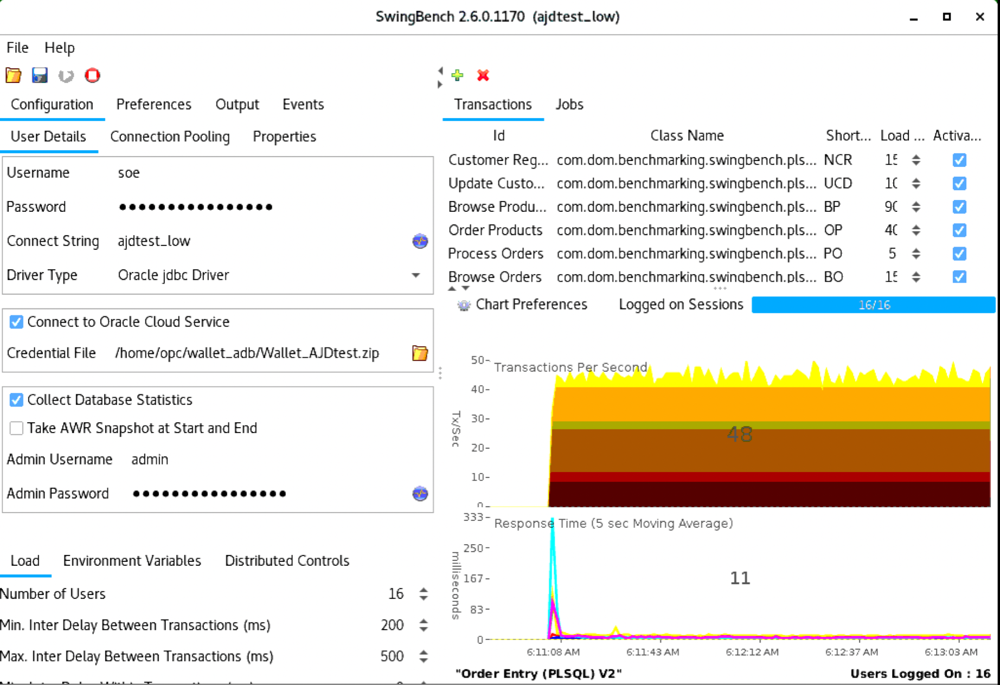

# Setup Swingbench for ADB

## Introduction

Swingbench is a load generator and associated set of utilities. The software enables a load to be generated and the transactions/response times to be charted. The tool has both graphical and command line functionality.

Swingbench can be used to demonstrate and test technologies such as Real Application Clusters, Online table rebuilds, Standby databases, Online backup and recovery etc.

[Reference](https://www.dominicgiles.com/)

### 先决条件

- ADB
- 虚机 Oracle Linux 7.9


## Task 1: 安装swingbench

1. 连接到虚机，先更新yum版本

    ```
    $ sudo yum makecache fast
    ```

    

2. 安装jdk17

    ```
    $ wget https://download.oracle.com/java/17/latest/jdk-17_linux-x64_bin.rpm
    $ sudo yum -y install jdk-17_linux-x64_bin.rpm
    ```

    

3. 查看java版本

    ```
    $ java -version
    java version "17.0.3.1" 2022-04-22 LTS
    Java(TM) SE Runtime Environment (build 17.0.3.1+2-LTS-6)
    Java HotSpot(TM) 64-Bit Server VM (build 17.0.3.1+2-LTS-6, mixed mode, sharing)
    ```

    

4. 下载swingbench最新版。可以从[官网下载](https://www.dominicgiles.com/site_downloads/swingbenchlatest.zip)。要连接ADB，必须采用合适的版本，如：本文使用的版本[build27052022](https://github.com/minqiaowang/my-documents/raw/main/setup-swingbench-for-adb/swingbench27052022.zip)。

    ```
    $ wget https://github.com/minqiaowang/my-documents/raw/main/setup-swingbench-for-adb/swingbench27052022.zip
    ```

    

5. 解压

    ```
    $ unzip swingbench27052022.zip
    ```

    

6. asdf


## Task 2: 安装Oracle Instant Client

1. 运行下列命令获取不同oracle区域的yum资料库配置

    ```
    $ cd /etc/yum.repos.d
    $ export REGION=`curl http://169.254.169.254/opc/v1/instance/ -s | jq -r '.region'| cut -d '-' -f 2`
    $ echo $REGION
    $ sudo -E wget http://yum-$REGION.oracle.com/yum-$REGION-ol7.repo
    ```

    

2. 激活Instant Client资料库

    ```
    $ sudo yum-config-manager --enable ol7_oracle_instantclient
    ```

    

3. 列出可用的Instant Client包

    ```
    $ sudo yum list oracle-instantclient*
    ```

    

4. 安装Instant Client不同的模块，包括basic，sqlplus，和tools。目前最新版本是19.15

    ```
    $ sudo yum install -y oracle-instantclient19.15-basic oracle-instantclient19.15-sqlplus oracle-instantclient19.15-tools
    ```

    

5. asdf


## 配置Instant Client连接ADB

1. 将ADB的wallet包拷贝到虚机中

2. 连接到虚机，创建wallet目录

    ```
      $ cd /home/opc
      $ mkdir wallet_adb
    ```

    

3. 解压wallet到创建的目录中，请使用自己的wallet包名

    ```
    $ mv Wallet_AJDtest.zip wallet_adb
    $ cd wallet_adb
    $ unzip Wallet_AJDtest.zip
    $ ls
    ```

    

4. 将sqlnet.ora, tnsnames.ora, cwallet.sso拷贝到相应的Instant Client目录下

    ```
    $ sudo cp sqlnet.ora /usr/lib/oracle/19.15/client64/lib/network/admin/sqlnet.ora
    $ sudo cp tnsnames.ora /usr/lib/oracle/19.15/client64/lib/network/admin/tnsnames.ora
    $ sudo cp cwallet.sso /usr/lib/oracle/19.15/client64/lib/network/admin/cwallet.sso
    ```

    

5. 连接到ADB，使用自己的admin密码和tns alias

    ```
    $ sqlplus admin/WelcomePTS_2022#@ajdtest_high
    
    SQL*Plus: Release 19.0.0.0.0 - Production on Thu Jul 14 05:47:38 2022
    Version 19.15.0.0.0
    
    Copyright (c) 1982, 2022, Oracle.  All rights reserved.
    
    Last Successful login time: Thu Jul 14 2022 05:45:46 +00:00
    
    Connected to:
    Oracle Database 19c Enterprise Edition Release 19.0.0.0.0 - Production
    Version 19.16.0.1.0
    
    SQL> exit
    Disconnected from Oracle Database 19c Enterprise Edition Release 19.0.0.0.0 - Production
    Version 19.16.0.1.0
    ```

    

6. sadf


## Task 4: 创建swingbench测试数据

1. 连接到虚机，转到swingbench目录下

    ```
    $ cd /home/opc/swingbench/bin
    ```

    

2. 生成测试数据，`-h`列出所有参数, 其中`-scale 5` 代表生成5GB的数据，`-cf`为ADB的wallet文件存放的目录。请使用自己的admin的password和要创建的用户soe的password。该过程时间较长，请不要关闭窗口。

    ```
    $ ./oewizard -cl -create -cs ajdtest_medium -cf ~/wallet_adb/Wallet_AJDtest.zip -u soe -p WelcomePTS_2022# -scale 5 -hashpart -dba admin -dbap WelcomePTS_2022# -v
    ```

    

3. 检查数据库对象创建情况

    ```
    $ ./sbutil -soe -cs ajdtest_low -cf ~/wallet_adb/Wallet_AJDtest.zip -u soe -p WelcomePTS_2022# -val
    Operation is successfully completed.
    Operation is successfully completed.
    The Order Entry Schema appears to be valid.
    --------------------------------------------------
    |Object Type    |     Valid|   Invalid|   Missing|
    --------------------------------------------------
    |Table          |        10|         0|         0|
    |Index          |        26|         0|         0|
    |Sequence       |         5|         0|         0|
    |View           |         2|         0|         0|
    |Code           |         1|         0|         0|
    --------------------------------------------------
    ```

    

4. 查看创建的表

    ```
    $ ./sbutil -soe -cs ajdtest_low -cf ~/wallet_adb/Wallet_AJDtest.zip -u soe -p WelcomePTS_2022# -tables
    Operation is successfully completed.
    Operation is successfully completed.
    Order Entry Schemas Tables
    +----------------------+------------+---------+----------+-------------+--------------+
    | Table Name           | Rows       | Blocks  | Size     | Compressed? | Partitioned? |
    +----------------------+------------+---------+----------+-------------+--------------+
    | ORDER_ITEMS          | 35,528,333 | 335,060 | 2.6GB    | Disabled    | No           |
    | ORDERS               | 7,148,950  | 127,397 | 1000.0MB | Disabled    | No           |
    | CUSTOMERS            | 5,000,112  | 96,797  | 760.0MB  | Disabled    | No           |
    | ADDRESSES            | 7,500,000  | 84,557  | 672.0MB  | Disabled    | No           |
    | CARD_DETAILS         | 7,500,000  | 60,077  | 472.0MB  | Disabled    | No           |
    | LOGON                | 11,914,920 | 41,717  | 336.0MB  | Disabled    | No           |
    | INVENTORIES          | 901,103    | 2,512   | 20.0MB   | Disabled    | No           |
    | PRODUCT_DESCRIPTIONS | 1,000      | 35      | 320KB    | Disabled    | No           |
    | PRODUCT_INFORMATION  | 1,000      | 28      | 256KB    | Disabled    | No           |
    | WAREHOUSES           | 1,000      | 5       | 64KB     | Disabled    | No           |
    | ORDERENTRY_METADATA  | 4          | 5       | 64KB     | Disabled    | No           |
    +----------------------+------------+---------+----------+-------------+--------------+
                                    Total Space     5.7GB
    ```

    

5. 运行工作负载，其中`-rt 0:30.00`为运行30分钟

    ```
    $ ./charbench -c ../configs/SOE_Server_Side_V2.xml -cs ajdtest_low -cf ~/wallet_adb/Wallet_AJDtest.zip -u soe -p WelcomePTS_2022# -v users,tpm,tps -intermin 0 -intermax 0 -min 0 -max 0 -uc 128 -di SQ,WQ,WA -rt 0:30.00
    Swingbench 
    Author  :  	 Dominic Giles 
    Version :  	 2.6.0.1170  
    
    Results will be written to results.xml 
    Hit Return to Terminate Run... 
    
    Time     Users       TPM      TPS     
    06:08:06 [0/128]     0        0       
    06:08:08 [0/128]     0        0       
    06:08:09 [0/128]     0        0       
    06:08:10 [0/128]     0        0       
    06:08:11 [0/128]     0        0       
    06:08:12 [0/128]     0        0       
    06:08:13 [0/128]     0        0       
    06:08:14 [0/128]     0        0       
    06:08:15 [11/128]    0        0       
    06:08:16 [29/128]    0        0       
    06:08:17 [33/128]    0        0       
    06:08:18 [46/128]    0        0       
    06:08:19 [104/128]   0        0       
    06:08:20 [128/128]   14       14      
    06:08:21 [128/128]   27       13      
    06:08:22 [128/128]   44       17      
    06:08:23 [128/128]   124      80      
    06:08:24 [128/128]   540      416     
    06:08:25 [128/128]   1304     764     
    06:08:26 [128/128]   1848     544     
    06:08:27 [128/128]   2385     537     
    06:08:28 [128/128]   3057     672     
    06:08:29 [128/128]   3999     942     
    06:08:30 [128/128]   4883     884     
    06:08:31 [128/128]   5504     621     
    06:08:32 [128/128]   6154     650     
    06:08:33 [128/128]   7055     901     
    06:08:34 [128/128]   8056     1001    
    06:08:35 [128/128]   8801     745     
    06:08:36 [128/128]   9657     856     
    06:08:37 [128/128]   10383    726     
    06:08:38 [128/128]   11388    1005  
    ```

    

6. 按Control+C退出charbench。

7. 图形界面运行swingbench

    ```
    $ ./swingbench -c ../configs/SOE_Server_Side_V2.xml -u soe -p WelcomePTS_2022# -cs ajdtest_low -cf ~/wallet_adb/Wallet_AJDtest.zip -min 0 -max 10 -intermin 200 -intermax 500 -dim 1024,768 -pos 100,100
    
    ```

    

8. 可以在图形界面修改相应的参数，然后点击运行按钮。

    

9. 点击停止按钮，然后退出swingbench界面

10. 