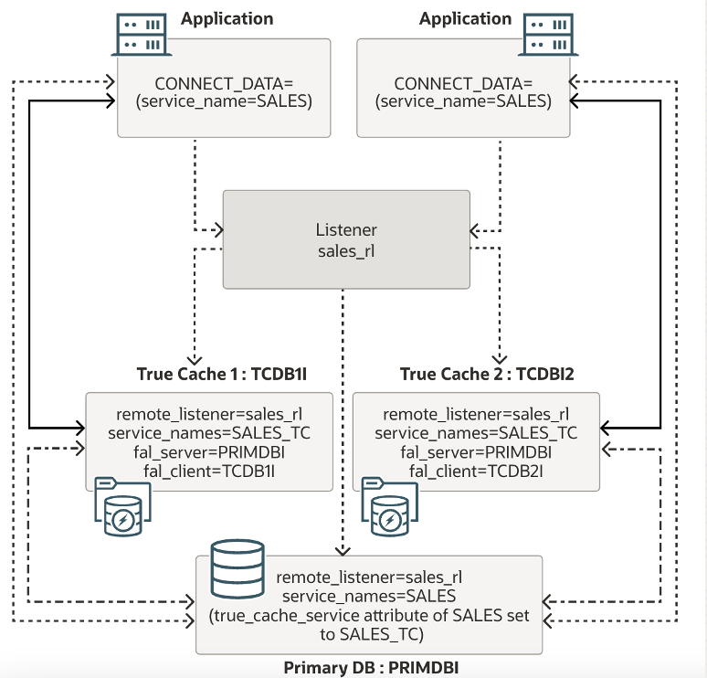
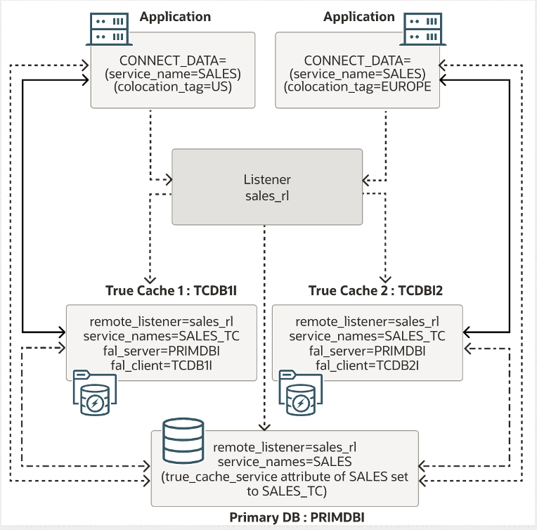
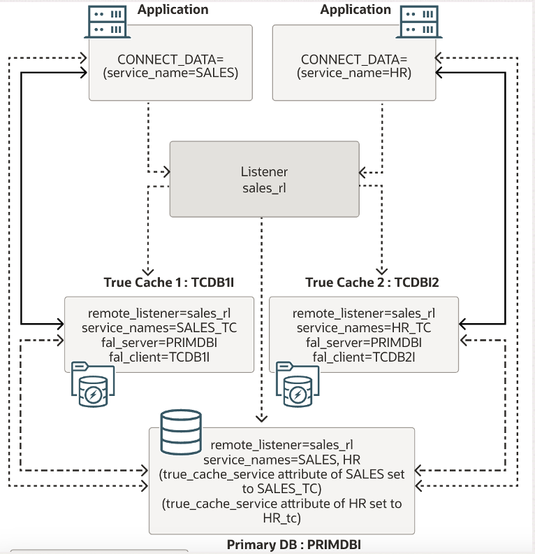

# True Cache 配置

db23ai EE 23.5.0.24.05

129.154.195.182 db23ai-ee.sub10310211320.vcnseoul.oraclevcn.com db23ai-ee

132.226.224.120 tc1.sub10310211320.vcnseoul.oraclevcn.com tc1

132.226.171.167 tc2.sub10310211320.vcnseoul.oraclevcn.com tc2

分别安装oracle数据库及仅软件，其中response文件请参考[db_ee.rsp](./db_ee.rsp)和[db_softonly.rsp](db_softonly.rsp)。如果是要安装数据库，最后还需要做数据库配置步骤，参见runInstaller安装后的提示```/u01/app/oracle/product/23.0.0/dbhome_1/runInstaller -executeConfigTools -responseFile /home/oracle/db_ee.rsp -silent```。

```
opc: sudo dnf -y install oracle-database-preinstall-23ai
sudo mkdir /u01
sudo chmod 777 /u01
oracle: mkdir -p /u01/app/oracle/product/23.0.0/dbhome_1
wget --no-proxy https://objectstorage.us-phoenix-1.oraclecloud.com/p/_hT8jShYHcYXJXgyjliRe5XmdTKYsQxfWQkoWhYKn4xS3mbu6kC4r1s7grror_CN/n/oracassandra/b/minqiao.wang/o/20377/db23502405.zip
unzip db23502405.zip -d /u01/app/oracle/product/23.0.0/dbhome_1
-- 编辑rsp文件
cd /u01/app/oracle/product/23.0.0/dbhome_1
./runInstaller -silent -ignorePrereqFailure -responseFile /home/oracle/db_ee.rsp
./runInstaller -silent -ignorePrereqFailure -responseFile /home/oracle/db_softonly.rsp

root: /u01/app/oraInventory/orainstRoot.sh
	/u01/app/oracle/product/23.0.0/dbhome_1/root.sh
	
sudo firewall-cmd --zone=public --add-port=1521/tcp --permanent
sudo firewall-cmd --reload
sudo firewall-cmd --list-all
```

 

## 配置主数据库

1.   开启归档

     ```
     shutdown immediate;
     startup mount;
     ALTER DATABASE ARCHIVELOG;
     ALTER DATABASE FORCE LOGGING;
     alter database open;
     alter pluggable database all open;
     ```

     

2.   在PDB中创建测试用户

     ```
     alter session set container=ORCLPDB;
     create user salesuser identified by oracle;
     grant dba to salesuser;
     ```

     

3.   修改listener.ora，添加以下内容：

     ```
     REGISTRATION_INVITED_NODES_LISTENER = (db23ai-ee.sub10310211320.vcnseoul.oraclevcn.com, tc1.sub10310211320.vcnseoul.oraclevcn.com, tc2.sub10310211320.vcnseoul.oraclevcn.com)
     
     SID_LIST_LISTENER =
       (SID_LIST=
         (SID_DESC=
           (GLOBAL_DBNAME=orcl)
           (SID_NAME=orcl)
           (ORACLE_HOME=/u01/app/oracle/product/23.0.0/dbhome_1)
         )
       )
     ```

     

4.   重启listener

     ```
     lsnrctl stop
     lsnrctl start
     ```

     

5.   过一段时间，监听工作正常

     ```
     lsnrctl status
     ```

     

## 配置True Cache instance

1.   用如下命令备份主库的密码的文件(blob格式)到/tmp/blob_loc2位置

     ```
     dbca -configureDatabase -prepareTrueCacheInstanceBlob -sourceDB orcl -trueCacheBlobLocation /tmp/blob_loc2 -silent
     ```

     

2.   将/tmp/blob_loc2下的密码文件拷贝到tc1和tc2的/home/oracle下，并修改所有权，注意修改blob文件名。

     ```
     chown oracle:oinstall blob_2024-05-22_03-07-26AM.tar.gz
     
     $ ls -l blob_2024-05-22_03-07-26AM.tar.gz 
     -rw-r-----. 1 oracle oinstall 340 May 22 03:12 blob_2024-05-22_03-07-26AM.tar.gz
     ```

     

3.   tc1的profile文件

     ```
     export ORACLE_BASE=/u01/app/oracle
     export ORACLE_HOME=/u01/app/oracle/product/23.0.0/dbhome_1
     export LD_LIBRARY_PATH=$ORACLE_HOME/lib
     export PATH=$ORACLE_HOME/bin:$PATH
     export ORACLE_SID=orcltc1
     ```

     

4.   tc2的profile文件

     ```
     export ORACLE_BASE=/u01/app/oracle
     export ORACLE_HOME=/u01/app/oracle/product/23.0.0/dbhome_1
     export LD_LIBRARY_PATH=$ORACLE_HOME/lib
     export PATH=$ORACLE_HOME/bin:$PATH
     export ORACLE_SID=orcltc2
     ```

     

5.   在tc1上创建True Cache instance1，要输入主数据库dba的密码，注意修改blob文件名。

     ```
     dbca -createTrueCache -gdbName orcltc1 -sid orcltc1 -sourceDBConnectionString db23ai-ee.sub10310211320.vcnseoul.oraclevcn.com:1521/orcl -trueCacheBlobFromSourceDB /home/oracle/blob_2024-05-21_05-52-33AM.tar.gz -sgaTargetInMB 8329 -pgaAggregateTargetInMB 2000 -silent
     ```

     

6.   在tc2上创建True Cache instance2，要输入主数据库dba的密码，注意修改blob文件名

     ```
     dbca -createTrueCache -gdbName orcltc2 -sid orcltc2 -sourceDBConnectionString db23ai-ee.sub10310211320.vcnseoul.oraclevcn.com:1521/orcl -trueCacheBlobFromSourceDB /home/oracle/blob_2024-05-22_03-07-26AM.tar.gz -sgaTargetInMB 8329 -pgaAggregateTargetInMB 2000 -silent
     ```

     

7.   在tc1和tc2上查看监听状态

     ```
     lsnrctl status
     ```

     

## True Cache一致性配置

1.   一致性配置如下

     
     
     
     
1.   在主服务器上创建一个SALES服务

     ```
     sqlplus / as sysdba
     alter session set container=orclpdb;
     BEGIN
        DBMS_SERVICE.CREATE_SERVICE('SALES', 'SALES');
        DBMS_SERVICE.START_SERVICE('SALES');
     END;
     /
     ```

     

2.   查看当前服务，可以看到当前```true_cache_service```是空的。

     ```
     set linesize 1000;
     COLUMN service_id FORMAT 999;
     COLUMN name FORMAT a20;
     COLUMN true_cache_service FORMAT a40;
     SELECT service_id, name, true_cache_service FROM V$ACTIVE_SERVICES WHERE name='SALES';
     ```

     

3.   在主服务器上配置tc1上的true cache服务，需输入sys密码

     ```
     dbca -configureDatabase -configureTrueCacheInstanceService -sourceDB orcl -trueCacheConnectString tc1.sub10310211320.vcnseoul.oraclevcn.com:1521/orcltc1 -trueCacheServiceName sales_tc -serviceName sales -pdbName orclpdb -silent
     ```

     

4.   添加节点tc2。因为上一步已经创建了```sales_tc```，我们只需要将tc2上的remote listener关联并手工启动即可

     ```
     sqlplus / as sysdba
     
     alter system set remote_listener='db23ai-ee.sub10310211320.vcnseoul.oraclevcn.com:1521' scope=both;
     ```

     

5.   切换到pdb

     ```
     alter session set container=orclpdb;
     ```

     

6.   启动```sales_tc```服务

     ```
     EXEC DBMS_SERVICE.START_SERVICE('SALES_TC');
     ```

     

7.   主服务器上查看监听状态：

     ```
     $ lsnrctl status
     
     LSNRCTL for Linux: Version 23.0.0.0.0 - Production on 22-MAY-2024 05:20:02
     
     Copyright (c) 1991, 2024, Oracle.  All rights reserved.
     
     Connecting to (DESCRIPTION=(ADDRESS=(PROTOCOL=TCP)(HOST=db23ai-ee.sub10310211320.vcnseoul.oraclevcn.com)(PORT=1521)))
     STATUS of the LISTENER
     ------------------------
     Alias                     LISTENER
     Version                   TNSLSNR for Linux: Version 23.0.0.0.0 - Production
     Start Date                22-MAY-2024 05:18:17
     Uptime                    0 days 0 hr. 1 min. 45 sec
     Trace Level               off
     Security                  ON: Local OS Authentication
     SNMP                      OFF
     Listener Parameter File   /u01/app/oracle/product/23.0.0/dbhome_1/network/admin/listener.ora
     Listener Log File         /u01/app/oracle/diag/tnslsnr/db23ai-ee/listener/alert/log.xml
     Listening Endpoints Summary...
       (DESCRIPTION=(ADDRESS=(PROTOCOL=tcp)(HOST=db23ai-ee.sub10310211320.vcnseoul.oraclevcn.com)(PORT=1521)))
       (DESCRIPTION=(ADDRESS=(PROTOCOL=ipc)(KEY=EXTPROC1521)))
     Services Summary...
     Service "18ad2f0fabf87ecbe063d3df5e64d669" has 1 instance(s).
       Instance "orcl", status READY, has 1 handler(s) for this service...
     Service "190315bb1e73fa87e063c600000a4ddb" has 1 instance(s).
       Instance "orcl", status READY, has 1 handler(s) for this service...
     Service "SALES" has 1 instance(s).
       Instance "orcl", status READY, has 1 handler(s) for this service...
     Service "orcl" has 2 instance(s).
       Instance "orcl", status UNKNOWN, has 1 handler(s) for this service...
       Instance "orcl", status READY, has 1 handler(s) for this service...
     Service "orclXDB" has 1 instance(s).
       Instance "orcl", status READY, has 1 handler(s) for this service...
     Service "orclpdb" has 3 instance(s).
       Instance "orcl", status READY, has 1 handler(s) for this service...
       Instance "orcltc1", status READY, has 1 handler(s) for this service...
       Instance "orcltc2", status READY, has 1 handler(s) for this service...
     Service "orcltc1" has 1 instance(s).
       Instance "orcltc1", status READY, has 1 handler(s) for this service...
     Service "orcltc2" has 1 instance(s).
       Instance "orcltc2", status READY, has 1 handler(s) for this service...
     Service "sales_tc" has 2 instance(s).
       Instance "orcltc1", status READY, has 1 handler(s) for this service...
       Instance "orcltc2", status READY, has 1 handler(s) for this service...
     The command completed successfully
     ```

     

8.   asdf

     

## 安装测试环境

1.   在另一台虚机上安装应用测试机。下载并安装jdk17，缺省JAVA_HOME为：```/usr/lib/jvm/jdk-17-oracle-x64```

     ```
     wget https://download.oracle.com/java/17/archive/jdk-17.0.10_linux-x64_bin.rpm
     sudo rpm -ivh jdk-17.0.10_linux-x64_bin.rpm
     ```

     

2.   下载Maven

     ```
     wget https://dlcdn.apache.org/maven/maven-3/3.9.5/binaries/apache-maven-3.9.5-bin.tar.gz
     ```

     

3.   解压

     ```
     tar -zxvf apache-maven-3.9.5-bin.tar.gz
     ```

     

4.   上传[java_demo.zip](./java_demo.zip)和[YCSB.zip](./YCSB.zip)

     ```
     unzip java_demo.zip
     unzip YCSB.zip
     ```

     

5.   添加opc用户的环境变量（alias可以不用配置，但后面命令要写全）。

     ```
     export JAVA_HOME=/usr/lib/jvm/jdk-17-oracle-x64
     
     export M2_HOME=/home/opc/apache-maven-3.9.5
     export M2=$M2_HOME/bin
     #export MAVEN_OPTS=-Xms256m -Xmx512m
     export ORACLE_HOME=/home/opc/instantclient_23_4
     
     
     export SQLCL_HOME=/home/opc/Downloads/sqlcl
     export PATH=$SQLCL_HOME/bin:$JAVA_HOME/bin:$M2:$PATH:$ORACLE_HOME
     
     alias rundemo='cd ~/java_demo/true-cache;mvn exec:java -Dexec.mainClass=com.example.App -Dexec.cleanupDaemonThreads=false'
     alias compile='cd ~/java_demo/true-cache;mvn clean compile'
     alias mvnpkg='cd ~/java_demo/true-cache;mvn clean package'
     alias edits='vi ~/java_demo/true-cache/src/main/java/com/example/App.java'
     alias assys='sql sys/WelcomePTS_2023#@db23ai-ee.sub10310211320.vcnseoul.oraclevcn.com:1521/orclpdb as sysdba'
     alias conmaincdb='sql sys/WelcomePTS_2023#@db23ai-ee.sub10310211320.vcnseoul.oraclevcn.com:1521/orcl as sysdba'
     alias conmainpdb='sql sys/WelcomePTS_2023#@db23ai-ee.sub10310211320.vcnseoul.oraclevcn.com:1521/orclpdb as sysdba'
     alias conslavepdb='sql sys/WelcomePTS_2023#@db23ai-ee.sub10310211320.vcnseoul.oraclevcn.com:1521/orclpdb as sysdba'
     alias conslavecdb='sql sys/WelcomePTS_2023#@db23ai-ee.sub10310211320.vcnseoul.oraclevcn.com:1521/orcl_tc as sysdba'
     alias runswing='/home/opc/swingbench27/swingbench/bin/swingbench'
     
     alias runcbenchntc='/home/opc/swingbench27/swingbench/bin/charbench -c /home/opc/swingbench27/swingbench/bin/no_true_cache_30_conn_pool.xml -v users,errs,trem,tps,vresp'
     alias runcbenchtc='/home/opc/swingbench27/swingbench/bin/charbench -c /home/opc/swingbench27/swingbench/bin/true_cache_30_conn_pool.xml -v users,errs,trem,tps,vresp'
     alias runcbenchtnp='/home/opc/swingbench27/swingbench/bin/charbench -c /home/opc/swingbench27/swingbench/bin/true_cache_colocation_no_pool.xml -debugf -v users,errs,trem,tps,vresp '
     alias runcbenchntnp='/home/opc/swingbench27/swingbench/bin/charbench -c /home/opc/swingbench27/swingbench/bin/guangxu_no_true_cache_no_conn_pool.xml -v users,errs,trem,tps,vresp'
     ```

     

6.   修改```java_demo```连接串

     ```
     edits
     ```

     

7.   编译

     ```
     compile
     ```

     

8.   运行

     ```
     rundemo
     ```

     

9.   结果，多运行几次，可以观察到使用不同的true cache instance。

     ```
     [INFO] --- exec:3.3.0:java (default-cli) @ true-cache ---
     Basic test to connect to primary and True Cache
     Get Connection from True Cache instance using primary db and properties
     URL = jdbc:oracle:thin:@db23ai-ee.sub10310211320.vcnseoul.oraclevcn.com:1521/sales
     isReadonly false
     Database role : PRIMARY
     instance_name : orcl
     server_host : db23ai-ee
     service_name : SALES
     db_unique_name : orcl
     =================================================
     isReadonly true
     Database role : TRUE CACHE
     instance_name : orcltc2
     server_host : tc2
     service_name : sales_tc
     db_unique_name : orcltc2
     The end
     [INFO] ------------------------------------------------------------------------
     [INFO] BUILD SUCCESS
     [INFO] ------------------------------------------------------------------------
     [INFO] Total time:  1.390 s
     [INFO] Finished at: 2024-05-22T05:23:14Z
     [INFO] ------------------------------------------------------------------------
     ```

     

10.   配置YCSB测试，修改数据库连接信息

      ```
      vi /home/opc/YCSB/ycsb-ora/truecache/db.properties
      ```

      

11.   在这里配置了TrueCache的属性和 readOnly 值（第232，355行）

      ```
      vi /home/opc/YCSB/ycsb-ora/truecache/src/main/java/com/yahoo/ycsb/db/JdbcDBClient.java
      ```

      

12.   修改后需要重新编译

      ```
      cd /home/opc/YCSB/ycsb-ora
      mvn clean package
      mvn install dependency:copy-dependencies
      ```

      

13.   在主服务器上创建测试表

      ```
      sqlplus salesuser/oracle@localhost:1521/sales
      -- 或者指定连接的instance：sqlplus salesuser/oracle@localhost:1521/orclpdb/orcl
      
      CREATE TABLE USERTABLE (  
        YCSB_KEY VARCHAR2(255) PRIMARY KEY, 
        FIELD0 VARCHAR2(4000 ), 
        FIELD1 VARCHAR2(4000 ), 
        FIELD2 VARCHAR2(4000 ), 
        FIELD3 VARCHAR2(4000 ), 
        FIELD4 VARCHAR2(4000 ), 
        FIELD5 VARCHAR2(4000 ), 
        FIELD6 VARCHAR2(4000 ), 
        FIELD7 VARCHAR2(4000 ), 
        FIELD8 VARCHAR2(4000 ), 
        FIELD9 VARCHAR2(4000 )
      ) ;
      ```

      

14.   回到appserver转到目录

      ```
      cd /home/opc/YCSB/ycsb-ora
      ```

      

15.   加载数据，缺省1,000,000条数据

      ```
      ./bin/load_truecache.sh
      ```

      

14.   运行

      ```
      ./bin/run_trucache.sh
      ```

      
      
14.   运行日志放在这个目录下

      ```
      /home/opc/YCSB/ycsb-ora/logs/main/result_lookup_${i}.log
      ```

      
      
14.   测试结果，QPS比较。可以看出在并发数加大时，True Cahe可以有效减少app的延迟，提高QPS。

      | 并发数 | 无True Cache | 有True Cache |
      | ------ | ------------ | ------------ |
      | 1      | 4576         | 4269         |
      | 2      | 7859         | 6627         |
      | 4      | 12195        | 11886        |
      | 8      | 14717        | 20057        |
      | 16     | 14655        | 27699        |
      | 32     | 13805        | 28634        |
      | 64     | 12672        | 26819        |
      
      
      
14.   平均延迟(ms)比较

      | 并发数 | 无True Cache | 有True Cache |
      | ------ | ------------ | ------------ |
      | 1      | 216          | 232          |
      | 2      | 252          | 299          |
      | 4      | 325          | 334          |
      | 8      | 540          | 396          |
      | 16     | 1087         | 574          |
      | 32     | 2308         | 1110         |
      | 64     | 5023         | 2369         |
      
      
      
20.   asdf


## 检查True Cahe状态

1.   分别连接到主服务和true cache实例：

     ```
     sqlplus / as sysdba
     SQL> SELECT * FROM v$true_cache;
     
     MY_DG_ID REMOTE_DG_ID    DEST_ID TRUE_CACHE_NAME		  PRIMARY_NAME
     ---------- ------------ ---------- ------------------------------ ------------------------------
     STATUS
     --------------------------------------------------------------------------------------------------------------------------------------------------------------------------------------------------------
     REMOTE_VERSION	       CON_ID
     ------------------ ----------
      846467676    237082307 	 0 orcltc1			  orcl
     HEALTHY
     23.0.0.0.0
     ```

     

2.   在true cache端查看状态

     ```
     SELECT database_role, open_mode FROM v$database;
     ```

     output：

     ```
     DATABASE_ROLE	 OPEN_MODE
     ---------------- --------------------
     TRUE CACHE	 READ ONLY WITH APPLY
     ```

     

3.   查看当前数据库SCN

     ```
     SELECT current_scn FROM v$database;
     ```

     输出如下：

     ```
     CURRENT_SCN
     -----------
         5092543
     ```

     

4.   查看每个日志文件的大小

     ```
     SELECT THREAD#, SEQUENCE#, BYTES FROM v$standby_log;
     ```

     输出如下：

     ```
        THREAD#  SEQUENCE#	   BYTES
     ---------- ---------- ----------
     	 1	   23  209715200
     	 1	    4  209715200
     	 1	    0  209715200
     	 1	    0  209715200
     ```

     

5.   sdaf


## 配置colocation tag方式

1.   Colocation Tag方式架构如下：

     

     

2.   服务端不用做任何改动，只需修改客户端的连接，比如修改如下文件的连接

     ```
     vi /home/opc/YCSB/ycsb-ora/truecache/db.properties
     ```

     

3.   数据库连接修改为（例如：创建两个应用，一个的TAG为TCA，另一个的TAG为TCB）

     ```
     db.url=jdbc:oracle:thin:@(DESCRIPTION=(ADDRESS=(PROTOCOL=TCP)(HOST=db23ai-ee.sub10310211320.vcnseoul.oraclevcn.com)(PORT=1521))(CONNECT_DATA=(SERVICE_NAME=sales)(COLOCATION_TAG=TCA)))
     ```

     

4.   sadf


## 多服务方式配置

1.   多服务的配置架构如下：

     

     

2.   现在服务器上创建一个新的服务HR

     ```
     sqlplus / as sysdba
     alter session set container=orclpdb;
     BEGIN
        DBMS_SERVICE.CREATE_SERVICE('HR', 'HR');
        DBMS_SERVICE.START_SERVICE('HR');
     END;
     /
     ```

     

3.   在tc2上停止之前配置的SALES_TC服务

     ```
     sqlplus / as sysdba
     alter session set container=orclpdb;
     exec DBMS_SERVICE.STOP_SERVICE('SALES_TC');
     ```

     

4.   在主服务器上配置HR的true cache服务到tc2

     ```
     dbca -configureDatabase -configureTrueCacheInstanceService -sourceDB orcl -trueCacheConnectString tc2.sub10310211320.vcnseoul.oraclevcn.com:1521/orcltc2 -trueCacheServiceName hr_tc -serviceName hr -pdbName orclpdb -silent
     ```

     

5.   查看当前服务，可以在主服务器端和tc2端分别查看

     ```
     $ lsnrctl status
     
     LSNRCTL for Linux: Version 23.0.0.0.0 - Production on 23-MAY-2024 07:32:55
     
     Copyright (c) 1991, 2024, Oracle.  All rights reserved.
     
     Connecting to (DESCRIPTION=(ADDRESS=(PROTOCOL=TCP)(HOST=db23ai-ee.sub10310211320.vcnseoul.oraclevcn.com)(PORT=1521)))
     STATUS of the LISTENER
     ------------------------
     Alias                     LISTENER
     Version                   TNSLSNR for Linux: Version 23.0.0.0.0 - Production
     Start Date                22-MAY-2024 05:18:17
     Uptime                    1 days 2 hr. 14 min. 38 sec
     Trace Level               off
     Security                  ON: Local OS Authentication
     SNMP                      OFF
     Listener Parameter File   /u01/app/oracle/product/23.0.0/dbhome_1/network/admin/listener.ora
     Listener Log File         /u01/app/oracle/diag/tnslsnr/db23ai-ee/listener/alert/log.xml
     Listening Endpoints Summary...
       (DESCRIPTION=(ADDRESS=(PROTOCOL=tcp)(HOST=db23ai-ee.sub10310211320.vcnseoul.oraclevcn.com)(PORT=1521)))
       (DESCRIPTION=(ADDRESS=(PROTOCOL=ipc)(KEY=EXTPROC1521)))
     Services Summary...
     Service "18ad2f0fabf87ecbe063d3df5e64d669" has 1 instance(s).
       Instance "orcl", status READY, has 1 handler(s) for this service...
     Service "190315bb1e73fa87e063c600000a4ddb" has 1 instance(s).
       Instance "orcl", status READY, has 1 handler(s) for this service...
     Service "HR" has 1 instance(s).
       Instance "orcl", status READY, has 1 handler(s) for this service...
     Service "SALES" has 1 instance(s).
       Instance "orcl", status READY, has 1 handler(s) for this service...
     Service "hr_tc" has 1 instance(s).
       Instance "orcltc2", status READY, has 1 handler(s) for this service...
     Service "orcl" has 2 instance(s).
       Instance "orcl", status UNKNOWN, has 1 handler(s) for this service...
       Instance "orcl", status READY, has 1 handler(s) for this service...
     Service "orclXDB" has 1 instance(s).
       Instance "orcl", status READY, has 1 handler(s) for this service...
     Service "orclpdb" has 3 instance(s).
       Instance "orcl", status READY, has 1 handler(s) for this service...
       Instance "orcltc1", status READY, has 1 handler(s) for this service...
       Instance "orcltc2", status READY, has 1 handler(s) for this service...
     Service "orcltc1" has 1 instance(s).
       Instance "orcltc1", status READY, has 1 handler(s) for this service...
     Service "orcltc2" has 1 instance(s).
       Instance "orcltc2", status READY, has 1 handler(s) for this service...
     Service "sales_tc" has 1 instance(s).
       Instance "orcltc1", status READY, has 1 handler(s) for this service...
     The command completed successfully
     ```

     

6.   Pdf