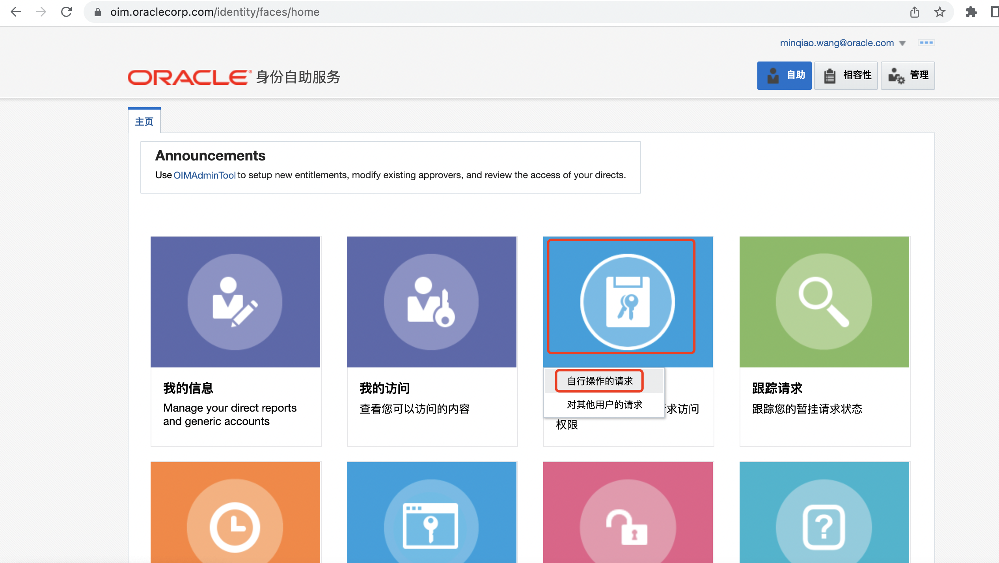
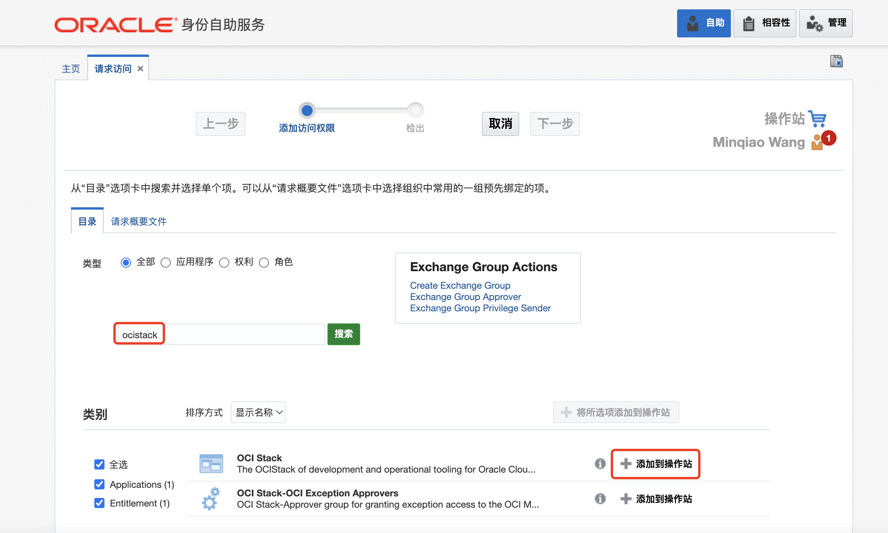
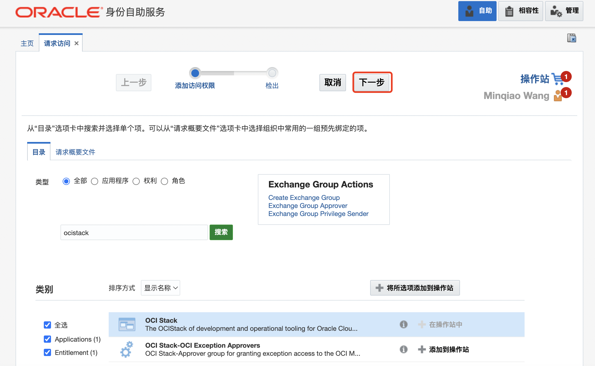
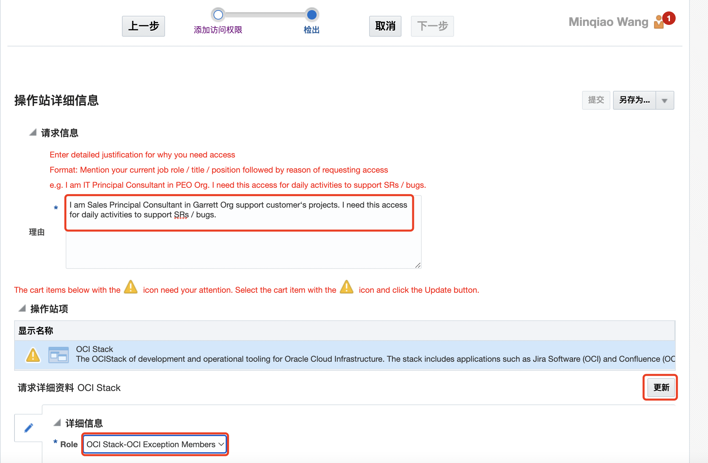
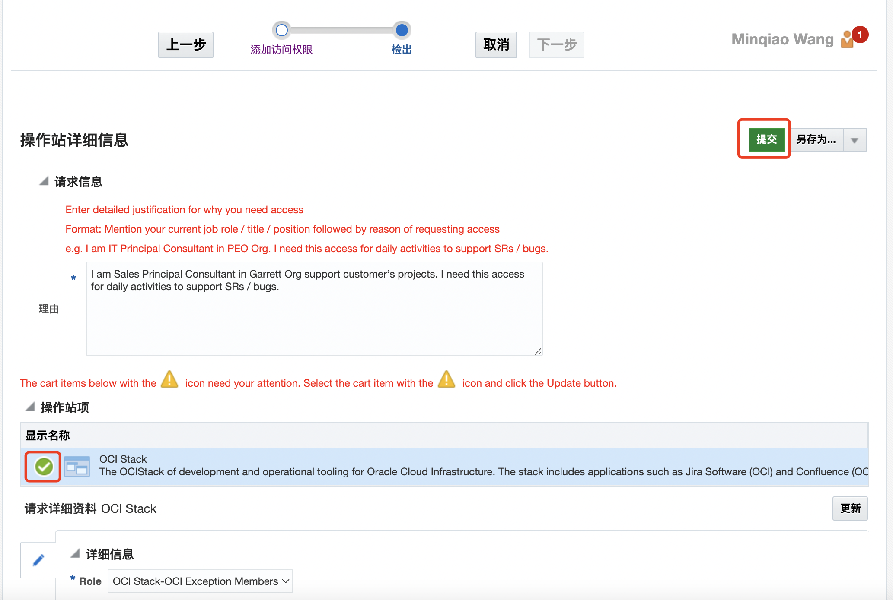

# 如何申请OCI Confluence访问权限

1. 登录[https://oim.oraclecorp.com/](https://oim.oraclecorp.com/)，点击**请求访问**，再选择**自行操作的请求**。

    

    

2. 选择**OCI Stack**对应的**添加到操作站**。**注意**：不要选择**OCI Stack-OCI Exception Approvers**

    

    

3. 点击**下一步**

    

    

4. 在**理由**项目里输入申请理由，如：

    ```
    I am Sales Principal Consultant in Garrett Org support customer‘s projects. I need this access for daily activities to support SRs / bugs.
    ```

    申请的**Role**选择；**OCI Stack-OCI Exeption Members**，这时**操作站项**的有黄色警告信息，点击**更新**。

    

    

    

5. 更新后显示状态为绿色。这时就可以点击**提交**。

    

    

6. 提交后等待你的上级老板批准就可以了。