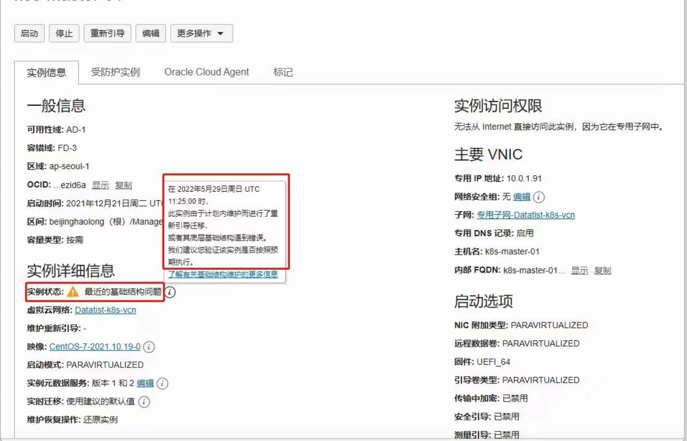

# 附加块存储错误配置导致重启后虚机不能SSH连接

最近遇到多起客户的虚机在自行重启或者后台维护重启后，不能ssh连通的现象，需要引起大家的注意。

## 现象

1. VM重启后，从OCI Console查看是正常启动状态，但有报警信息。客户端不能通过ssh连接。

    

2. 造成的原因是由于该虚机有附加块存储，客户为了让块存储在虚机每次重启时自动装载，在/etc/fstab里进行的错误设置。错误的设置如下：

    ```
    UUID=0d235dab-7c5f-4b03-ae94-35fa672b23d7 /data ext4 defaults, 1 1
    ```

    

3. 错误的设置导致VM重启失败，应该修改为如下正确的设置。可以[参考联机文档](https://docs.oracle.com/en-us/iaas/Content/Block/References/fstaboptionsconsistentdevicepaths.htm)。请尽快按照正确的格式进行修改。

    ```
    UUID=0d235dab-7c5f-4b03-ae94-35fa672b23d7 /data ext4 defaults,_netdev,nofail 0 2
    ```

## 如果已经发生虚机重启，不能SSH连接，如何修复

1. 创建serial console 连接：可以参考[官方文档](https://docs.oracle.com/en-us/iaas/Content/Compute/References/serialconsole.htm#Instance_Console_Connections)，或者http://www.happymillfam.com/login-to-new-oci-linux-instance-via-console/，修改opc密码并用opc密码登录。 运行下列命令
    - ***/usr/sbin/load_policy -i***
    - ***/bin/mount -o remount, rw /***
    - ***sudo passwd opc***
    - ***sudo reboot -f***
    - 添加pub key后就可以重启了。
2. 或者（optional）修改root密码并用root登录：[Reset-password-by-serial-console.pdf](https://github.com/minqiaowang/my-documents/blob/main/how-to-fix-blockstorage-wrong-config/Reset-password-by-serial-console.pdf)
3. 修改/etc/fstab文件：

  ```
  UUID=0d235dab-7c5f-4b03-ae94-35fa672b23d7 /data ext4 defaults,_netdev,nofail 0 2
  ```

4. 在Console重启VM