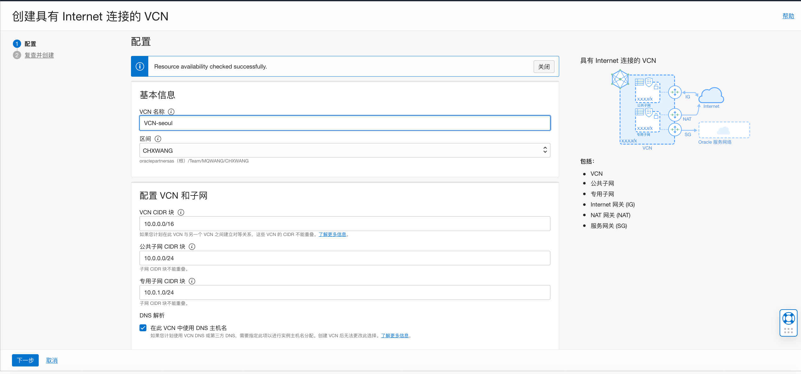
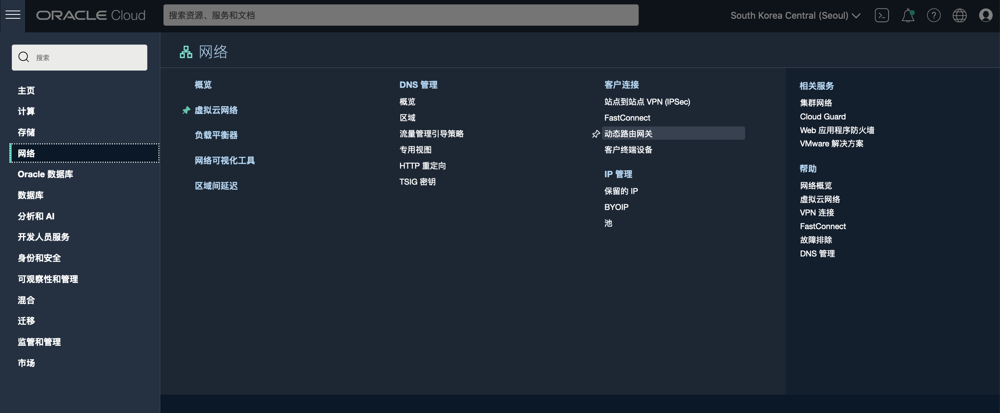
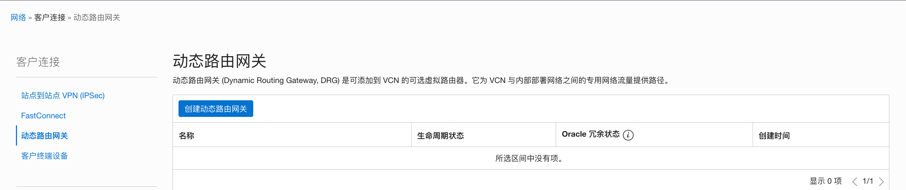
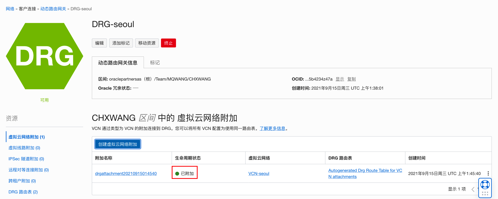
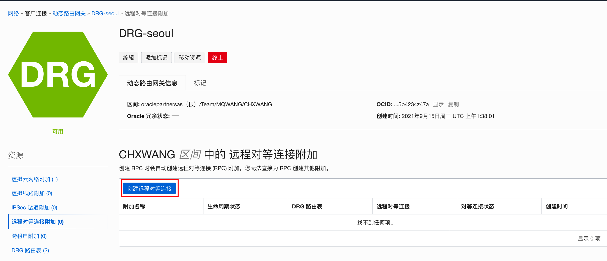
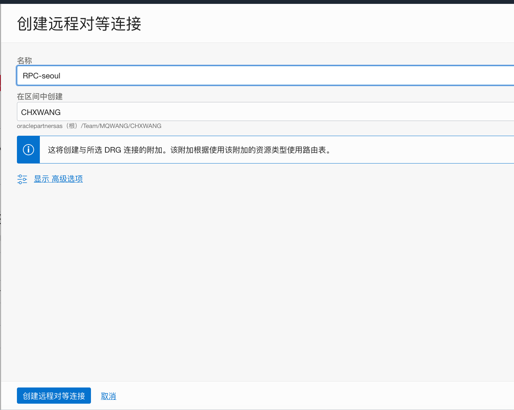
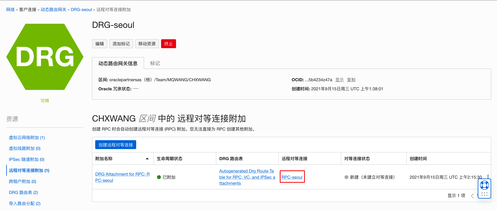
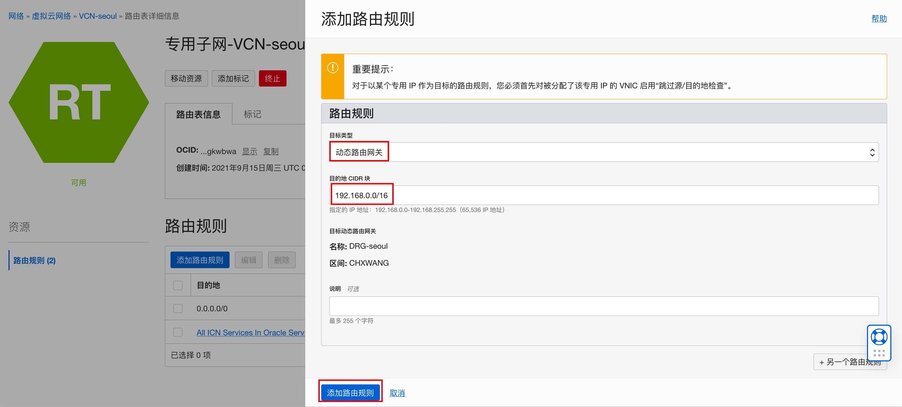
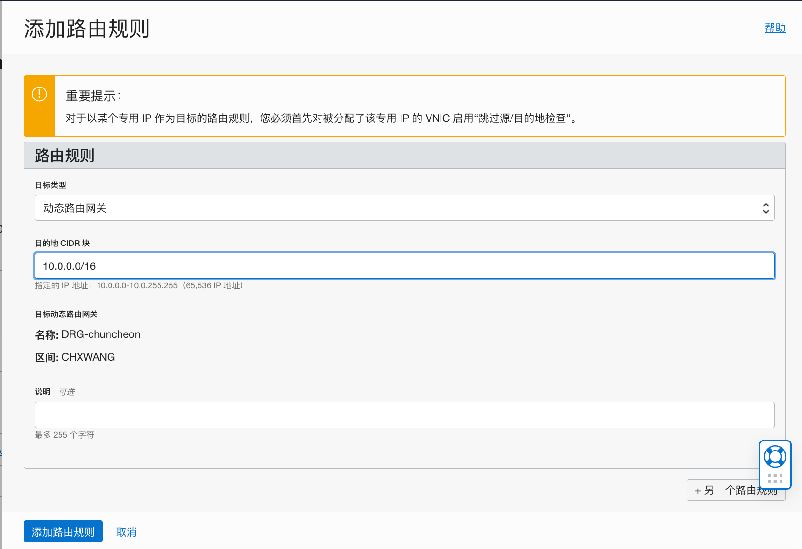

# 如何建立远程VCN对等连接

本文是关于如何在OCI上建立远程 VCN 对等连接的。远程 VCN 对等连接是连接不同区域的两个 VCN 的过程。 

如果没有对等互连，给定的 VCN 将需要 Internet 网关和公共 IP 地址与不同区域中的另一个 VCN 实例通信。对等互连允许 VCN 的资源使用私有 IP 地址进行通信，而无需通过 Internet 或本地网络路由流量。这样可以提高安全性和通信效率。 VCN 可以位于同一个 Oracle Cloud Infrastructure 租户中，也可以位于不同的租户中。 

假设这样一个场景：

- VCN-seoul在首尔，网段为：10.0.0.0/16，公共子网：10.0.0.0/24，专有子网：10.0.1.0/24
- VCN-chuncheon在春川，网段为：192.168.0.0/16，公共子网：192.168.0.0/24，专有子网：192.168.1.0/24
- 两个VCN均用网络向导创建，网段不重叠

要建立远程VCN对等连接，需要做如下的配置工作：

- 设置相应的策略
- 在两个区域创建动态路由网关 (DRG)，分别连接到 各自的VCN。
- 在对等关系中每个 DRG 上的创建远程对等连接 (RPC)。
- 创建这两个 RPC 之间的连接
- 创建路由规则，使网络流量能够通过连接进出各自指定的VCN。
- 修改安全规则来控制允许进出子网中需要与其他 VCN 通信的实例的流量类型。


以下是配置的详细步骤：

1.  在根区间为用户所在组设置策略。

    ```
    Allow group testgroup to manage remote-peering-connections in tenancy
    Allow group testgroup to manage drgs in tenancy
    ```

    

2. 使用VCN向导分别在seoul和chuncheon区域创建VCN：VCN-seoul和VCN-chuncheon。**注意：**两个VCN的网段不能重叠。

    

    

3. 在两个区域分别创建动态路由网关（DRG）并附加到相应的VCN。选择seoul区域，在OCI控制面板主菜单中选择**网络**，在**客户连接**下点击**动态路由网关**。

    

4. 点击**创建路由网关**。

    

5. 命名为DRG-seoul，然后点击**创建动态路由网关**。

    

6. 在动态网关详细信息页面，点击**创建虚拟云网络附加**。

    

7. 选择相应的VCN，然后点击**创建虚拟云网络附加**。

    

8. 附加成功。

    

9. 在**资源**下，选择**远程对等连接附加**，点击**创建远程对等附加连接**。

    

10. 命名后点击**创建远程对等连接**。

    

11. 创建成功后，点击新附加的RPC。

    

12. 在RPC详细信息页面，复制该RPC的OCID。在chuncheon区域重复以上步骤3 - 11.

    

13. 在chuncheon区域的RPC详细信息页面，点击**建立连接**。

    

14. 选择要连接的区域（seoul），拷贝seoul区域的RPC OCID，点击**建立连接**。

    

15. 远程对等连接创建成功。

    

16. 要使两个不同区域的VCN中的实例通信成功，还需要创建相应的路由规则。例如在seoul区域，我们希望在公共子网和专有子网的实例都能通过对等连接访问在chuncheon区域VCN里的实例，则需要分别配置相应的两个路由规则。在VCN-seoul的详细信息页面，选择**路由表**。

    

17. 点击专用子网的路由表，创建一个路由规则。选择目标类型为动态路由网关，目的地CIDR块：192.168.0.0/16。点击创建。

    

18. 同样为缺省路由表创建一个路由规则。

19. 在chuncheon区域，也要分别给VCN的公共子网和专有子网添加路由规则。如：

    

20. 要访问不同VCN部署的应用实例，还需要设置相应的网络入栈出栈规则。例如，在专用子网中部署MDS实例后，需要增加安全规则才能支持外部的访问。我们可以在专用子网的安全列表里增加入站规则。

    

21. 远程VCN对等连接配置完成