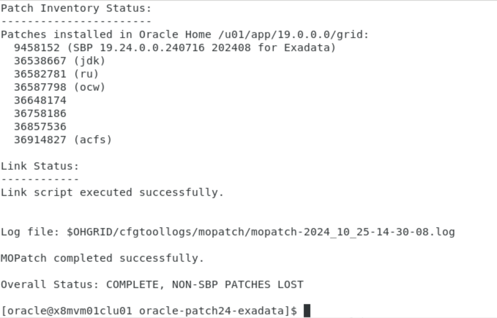
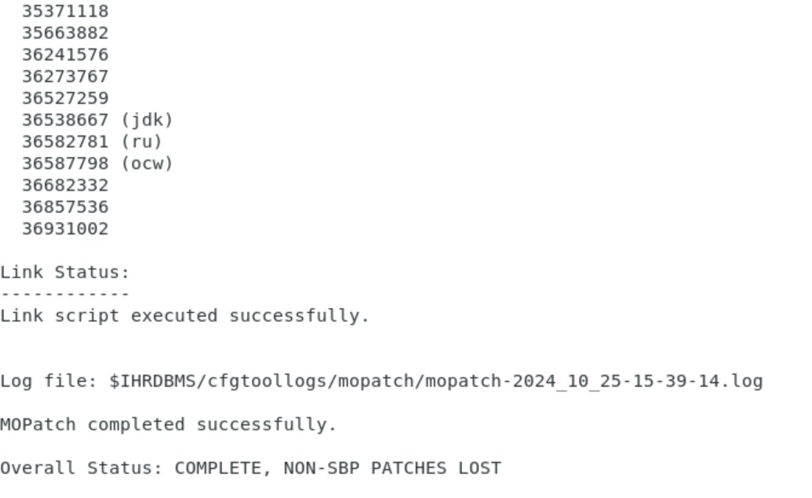
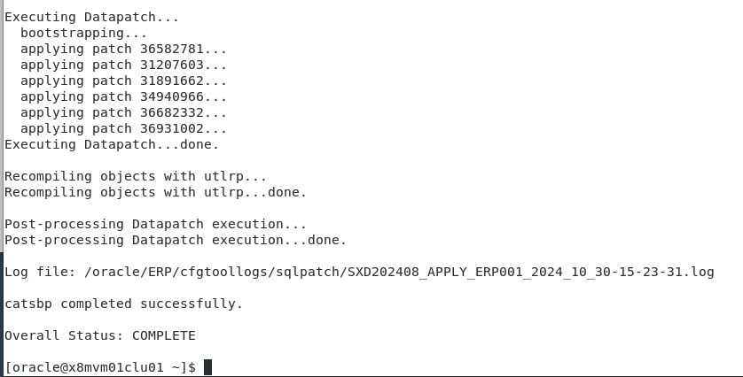

# 安装SAP Bundle Patch for Exadata

参见文档：```README19P_2408-70004543.HTM```

**Oracle® Database SAP® Bundle Patch 19.24.0.0.240716 - 202408 for Oracle Exadata®**


## 前期准备

1.   参照文档安装部署Exadata软件和数据库

2.   针对SAP软件的配置（swap区、hugepage等）

3.   本次安装包含Exadata上两台数据库服务器虚拟机，通过SGD桌面工具分别连接到两个节点（101，102），如：

     ```
     [mwang@sgd-arr05 ~]$ ssh root@10.113.121.101
     root@10.113.121.101's password: 
     Last login: Thu Oct 24 16:26:20 2024 from 10.136.44.201
     [root@x8mvm01clu01 ~]# 
     ```


## Task 1: 配置目录软链接

本次安装中，我们设置SAP的DBSID为**ERP**。分别在两个节点上都做以下步骤：

1.   修改oracle用户su权限（此步可以不做，在命令需要临时**root**权限时，可以另外开个窗口用**root**用户执行命令）。

     ```
     [root@x8mvm01clu01 ~]# usermod -aG wheel oracle
     ```

     

2.   创建ERP目录，修改owner，并检查

     ```
     [root@x8mvm01clu01 ~]# mkdir –p /oracle/ERP
     [root@x8mvm01clu01 ~]# chown -R oracle:oinstall /oracle
     [root@x8mvm01clu01 ~]# ls -l / | grep oracle
     drwxr-xr-x     3 oracle oinstall    17 Oct 25 10:03 oracle
     [root@x8mvm01clu01 ~]# ls -l /oracle
     total 0
     drwxr-xr-x 2 oracle oinstall 6 Oct 25 10:03 ERP
     ```

     

3.   转到**oracle**用户

     ```
     [root@x8mvm01clu01 ~]# su - oracle
     [oracle@x8mvm01clu01 ~]$ 
     ```

     

4.   建立目录软连接并检查

     ```
     [oracle@x8mvm01clu01 ~]$ ln -s /u01/app/oracle/product/19.0.0.0/dbhome_1 /oracle/ERP/19
     [oracle@x8mvm01clu01 ~]$ ls -l /oracle/ERP/
     total 0
     lrwxrwxrwx 1 oracle oinstall 41 Oct 25 10:10 19 -> /u01/app/oracle/product/19.0.0.0/dbhome_1
     ```

     

5.   在节点2上重复以上步骤

     

## Task 2: 准备patch文件

在两个节点上都要执行以下命令

1.   在节点1上，**root**用户下，将包含补丁的共享文件夹mount到本地

     ```
     # mount -t nfs 10.113.100.135:export/osc/images/23.1.17.0.0/tmp /mnt
     ```

     

2.   新建目录，修改目录权限

     ```
     # mkdir /source
     # chmod 777 /source
     ```

     

3.   拷贝patch文件到source目录下

     ```
     # cp -r /mnt/oracle-patch24-exadata /source
     ```

     

4.   转到补丁目录下

     ```
     # cd /source/oracle-patch24-exadata
     ```

     

5.   确认目录下包含下面的文件

     ```
     SXD19P_2408-70004543.ZIP (this SBP)
     GIRU19P_2408-70004543.ZIP (GIRU 19.24.0.0.240716)
     SBPJDK19P_2408-70004543.ZIP (JDKBP 19.0.0.0.240716)
     GIMERGEACFS19P_2408-70004543.ZIP (GI ACFS Merge 19.24.0.0.240716)
     OPATCH19P_2408-70004543.ZIP (OPatch 12.2.0.1.42)
     ```

     

6.   asdf

## Task 3: 环境变量设置

在两个节点上都要做以下配置：

1.   在**oracle**用户下设置环境变量，编辑```.bash_profile```文件，设置以下变量，注意不同节点```ORACLE_SID```不同。

     ```
     export ORACLE_SID=eccprd1
     export ORACLE_HOME=/u01/app/oracle/product/19.0.0.0/dbhome_1
     export LD_LIBRARY_PATH=$ORALE_HOME/lib
     export SBPFUSER=/usr/sbin/fuser
     
     export IHRDBMS=/u01/app/oracle/product/19.0.0.0/dbhome_1
     export OHRDBMS=/oracle/ERP/19
     export OHGRID=/u01/app/19.0.0.0/grid
     
     export PATH=$ORACLE_HOME/bin:$PATH
     ```

     

2.   激活变量

     ```
     [oracle@x8mvm01clu01 ~]$ source .bash_profile
     ```

     

3.   检查bash执行环境

     ```
     [oracle@x8mvm02clu01 ~]$ bind -v|grep bracketed
     set enable-bracketed-paste off
     ```

     

4.   编辑```.bashrc```文件，增加下面的内容

     ```
     bind 'set enable-bracketed-paste on'
     ```

     

5.   激活设置

     ```
     [oracle@x8mvm02clu01 ~]$ . .bashrc
     ```

     

6.   sdf

## Task 4: 打补丁前准备

在每个节点都要做以下步骤：

1.   **oracle**用户，转到补丁文件所在目录

     ```
     [oracle@x8mvm01clu01 ~]$ cd /source/oracle-patch24-exadata/
     ```

     

2.   使用临时**root**权限修改目录属性

     ```
     [oracle@x8mvm01clu01 oracle-patch24-exadata]$ su root -c "chown oracle:oinstall $OHGRID"
     Password: 
     [oracle@x8mvm01clu01 oracle-patch24-exadata]$ 
     ```

     

3.   备份Opatch，解压补丁文件，拷贝MOpatch到**grid home**。

     ```
     mv $OHGRID/OPatch $OHGRID/OPatch-pre-SBP_192400240716_202408
     unzip -qd $OHGRID OPATCH19P_2408-70004543.ZIP -x SIGNATURE.SMF
     unzip -qd $OHGRID/sapbundle SXD19P_2408-70004543.ZIP 'SBP_192400240716_202408/MOPatch/*'
     test -d $OHGRID/MOPatch && mv $OHGRID/MOPatch $OHGRID/MOPatch-pre-SBP_192400240716_202408
     mv $OHGRID/sapbundle/SBP_192400240716_202408/MOPatch $OHGRID/MOPatch
     ```

     

4.   备份、解压补丁文件，拷贝到**SAP home**。

     ```
     mv $IHRDBMS/OPatch $IHRDBMS/OPatch-pre-SBP_192400240716_202408
     unzip -qd $IHRDBMS OPATCH19P_2408-70004543.ZIP -x SIGNATURE.SMF
     unzip -qd $IHRDBMS/sapbundle SXD19P_2408-70004543.ZIP 'SBP_192400240716_202408/MOPatch/*'
     test -d $IHRDBMS/MOPatch && mv $IHRDBMS/MOPatch $IHRDBMS/MOPatch-pre-SBP_192400240716_202408
     mv $IHRDBMS/sapbundle/SBP_192400240716_202408/MOPatch $IHRDBMS/MOPatch
     ```

     

5.   消除跟ORAchk有关的错误。（su命令需要root密码），该环境没有orachk，命令忽略。

     ```
     su root -c "chown -R oracle:oinstall $OHGRID/suptools/orachk"
     chmod -R u+w $OHGRID/suptools/orachk
     rm -f $OHGRID/suptools/orachk/orachk
     su root -c "rm -f $IHRDBMS/suptools/orachk/orachk"
     ```

     

6.   asdf

## Task 5: 开始打补丁

没有特别说明，每个节点都要做。

1.   使用**oracle**用户，在home目录。停止XD缺省创建的数据库（只在节点1做），改数据库没有用，后续SAP安装会自动创建新的数据库。

     ```
     srvctl stop database -d eccprd
     ```

     

2.   停止CRS管理的相关资源

     ```
     rm -f $OHRDBMS.`hostname`.srvctlstatus
     
     
     env ORACLE_HOME=$OHRDBMS ORACLE_BASE=$OHRDBMS.dummybase $OHRDBMS/bin/srvctl stop home -o $OHRDBMS -s $OHRDBMS.`hostname`.srvctlstatus -n `hostname`
     ```

     

3.   检查是否有残留的SQL会话（需要root密码），如果有则可以kill掉

     ```
     su root -c "$SBPFUSER $IHRDBMS/bin/oracle"
     ```

     

4.   检查是否有ACFS进程

     ```
     $ su root -c "/sbin/acfsutil info fs -o mountpoints | xargs $SBPFUSER -mu"
     Password: 
     /acfsfs01:           41707c(oracle) 103310c(oracle) 194423c(root) 194425c(root) 
     ```

     

     如果有，停止ACFS服务。（此步可忽略，下一步会强制关闭ACFS）

     ```
     srvctl stop filesystem -device /dev/asm/acfsvol01-327 -force 
     ```

     

5.   停止GRID服务，解锁grid home到准备打补丁状态

     ```
     $ su root -c "$OHGRID/crs/install/rootcrs.sh -prepatch -nonrolling"
     Password: 
     Using configuration parameter file: /u01/app/19.0.0.0/grid/crs/install/crsconfig_params
     The log of current session can be found at:
     /u01/app/oracle/crsdata/x8mvm01clu01/crsconfig/crs_prepatch_apply_inplace_x8mvm01clu01_2024-10-25_02-19-50PM.log
     2024/10/25 14:20:37 CLSRSC-4012: Shutting down Oracle Trace File Analyzer (TFA) Collector.
     2024/10/25 14:20:57 CLSRSC-4013: Successfully shut down Oracle Trace File Analyzer (TFA) Collector.
     2024/10/25 14:20:58 CLSRSC-347: Successfully unlock /u01/app/19.0.0.0/grid
     2024/10/25 14:21:00 CLSRSC-671: Pre-patch steps for patching GI home successfully completed.
     ```

     

6.   记录`oradism`的所有者、组和权限，然后确保MOPatch能够覆盖该可执行文件。

     ```
     $ ls -al $OHGRID/bin/oradism
     -rwsr-x--- 1 root oinstall 147848 Apr 17  2019 /u01/app/19.0.0.0/grid/bin/oradism
     
     $ su root -c "chown `id -u` $OHGRID/bin/oradism && chmod u+rw $OHGRID/bin/oradism"
     Password: 
     ```

     

7.   在补丁所在目录下（```/mnt/oracle-patch24-exadata```) 安装SAP Bundle Patch到grid home

     ```
     env ORACLE_HOME=$OHGRID $OHGRID/MOPatch/mopatch.sh -v -s SXD19P_2408-70004543.ZIP
     ```

     在第一个节点开始打补丁时，可以同时做第二个节点

     

     

8.   打完补丁后，恢复`oradism`文件的所有者、组和权限，并验证它们是否与最初时相同。

     ```
     $ su root -c "chown root $OHGRID/bin/oradism && chmod 4750 $OHGRID/bin/oradism"
     Password: 
     
     $ ls -al $OHGRID/bin/oradism
     -rwsr-x--- 1 root oinstall 145888 Jul 18 12:40 /u01/app/19.0.0.0/grid/bin/oradism
     ```

     

9.   完成grid home的安装并启动grid。（注意：该步骤不能并行，需在节点1执行完成后，再在其它节点上运行）

     ```
     $ su root -c "$OHGRID/rdbms/install/rootadd_rdbms.sh"
     Password: 
     
     
     $ su root -c "$OHGRID/crs/install/rootcrs.sh -postpatch -nonrolling"
     Password: 
     Using configuration parameter file: /u01/app/19.0.0.0/grid/crs/install/crsconfig_params
     The log of current session can be found at:
       /u01/app/oracle/crsdata/x8mvm01clu01/crsconfig/crs_postpatch_apply_inplace_x8mvm01clu01_2024-10-25_03-12-02PM.log
     2024/10/25 15:12:11 CLSRSC-329: Replacing Clusterware entries in file 'oracle-ohasd.service'
     Oracle Clusterware active version on the cluster is [19.0.0.0.0]. The cluster upgrade state is [NORMAL]. The cluster active patch level is [431575059].
     2024/10/25 15:13:58 CLSRSC-4015: Performing install or upgrade action for Oracle Trace File Analyzer (TFA) Collector.
     2024/10/25 15:14:00 CLSRSC-672: Post-patch steps for patching GI home successfully completed.
     2024/10/25 15:14:16 CLSRSC-4003: Successfully patched Oracle Trace File Analyzer (TFA) Collector.
     
     
     $ $OHGRID/bin/cluutil -ckpt -oraclebase `env ORACLE_HOME=$OHGRID $OHGRID/bin/orabase` -writeckpt -name ROOTCRS_PREPATCH -state START
     ```

     

10.   准备打SAP home补丁，先运行预安装脚本

      ```
      $ test -d GIRU19P_2408-70004543 || unzip -qd GIRU19P_2408-70004543 GIRU19P_2408-70004543.ZIP -x SIGNATURE.SMF
      
      
      $ ./GIRU19P_2408-70004543/36582629/36587798/custom/scripts/prepatch.sh -dbhome $IHRDBMS
      ./GIRU19P_2408-70004543/36582629/36587798/custom/scripts/prepatch.sh completed successfully.
      
      ```

      

11.   记录`oradism`的所有者、组和权限，然后确保MOPatch能够覆盖该可执行文件。

      ```
      $ ls -al $IHRDBMS/bin/oradism
      -rwsr-x--- 1 root oinstall 147848 Apr 17  2019 /u01/app/oracle/product/19.0.0.0/dbhome_1/bin/oradism
      
      
      $ su root -c "chown `id -u` $IHRDBMS/bin/oradism && chmod u+rw $IHRDBMS/bin/oradism"
      Password: 
      ```

      

12.   在补丁文件目录下，开始安装补丁，在安装第一个节点的同时，可以开始安装第二个节点。

      ```
      env ORACLE_HOME=$IHRDBMS $IHRDBMS/MOPatch/mopatch.sh -v -s SXD19P_2408-70004543.ZIP
      ```

      

13.   打完补丁后，恢复oradism文件的权限

      ```
      $ su root -c "chown root $IHRDBMS/bin/oradism && chmod 4750 $IHRDBMS/bin/oradism"
      Password: 
      
      
      $ ls -al $IHRDBMS/bin/oradism
      -rwsr-x--- 1 root oinstall 145888 Jul 18 12:40 /u01/app/oracle/product/19.0.0.0/dbhome_1/bin/oradism
      ```

      

14.   运行数据库组件安装后脚本

      ```
      test -d GIRU19P_2408-70004543 || unzip -qd GIRU19P_2408-70004543 GIRU19P_2408-70004543.ZIP -x SIGNATURE.SMF
      
      cp -p GIRU19P_2408-70004543/36582629/36587798/custom/scripts/prepatch.sh  $IHRDBMS/sapbundle/SBP_192400240716_202408/
      
      cp -p GIRU19P_2408-70004543/36582629/36587798/custom/scripts/postpatch.sh $IHRDBMS/sapbundle/SBP_192400240716_202408/
      
      ./GIRU19P_2408-70004543/36582629/36587798/custom/scripts/postpatch.sh -dbhome $IHRDBMS
      ```

      

15.   空

16.   启动CRS相关资源

      ```
      env ORACLE_HOME=$OHRDBMS ORACLE_BASE=$OHRDBMS.dummybase $OHRDBMS/bin/srvctl start home -o $OHRDBMS -s $OHRDBMS.`hostname`.srvctlstatus -n `hostname`
      ```

      

17.   更新SAP home，运行安装后脚本（只在节点1上做）(错误，不能连接数据库，因为此时SAP的数据库还没有创建，后续步骤在创建后再做)

      ```
      export ORACLE_SID=ERP001
      env ORACLE_HOME=$OHRDBMS ORACLE_SID=$ORACLE_SID $OHRDBMS/sapbundle/catsbp
      ```

      

      

18.   在其它节点上运行：

      ```
      env ORACLE_HOME=$OHRDBMS ORACLE_BASE=$OHRDBMS.dummybase $OHRDBMS/bin/srvctl start home -o $OHRDBMS -s $OHRDBMS.`hostname`.srvctlstatus -n `hostname`
      ```

      

19.   sadf

20.   sdf