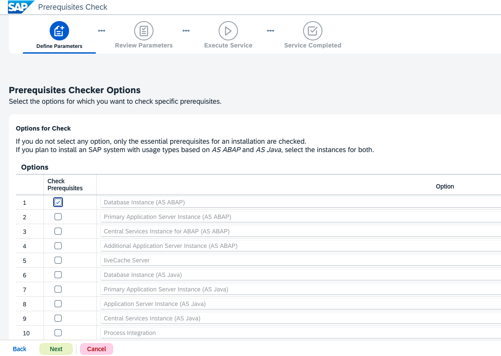
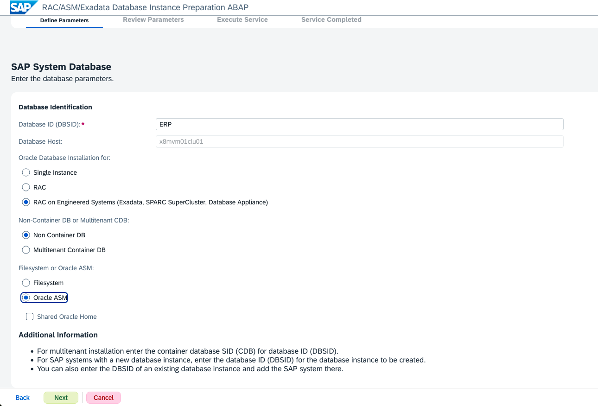

# 安装SWPM/ASCS/Database Instance

注意事项和基本步骤：

-   本次安装只做到了安装SAP应用业务模块前的数据库准备
-   要在哪个节点安装SAP软件，SWPM就运行在相应的节点上
-   SAP安装包最好放在共享文件夹中，如果没有，也可以拷贝到相应的节点目录下
-   安装前可以在每个相应的节点做预检查（参见Task 2，本次只做了x86节点的预检查）
-   安装ASCS在一台单独的X86服务器上。
-   安装SAP数据库前需要在每个数据库节点上做安装前准备（参见Task 4）
-   SAP数据库部署在Exadata上两台虚机节点上，只需要在节点1上执行安装。

## Task 1: 准备环境

1.   连接到**root**用户，mount共享文件夹到X86服务器上

     ```
     mount -t nfs 10.113.100.135:export/osc/images/23.1.17.0.0/tmp /mnt
     ```

     

2.   创建source目录，修改权限

     ```
     mkdir /source
     chmod 777 /source
     ```

     

3.   将SAPCAR和SWPM安装软件拷贝到source

     ```
     cp /mnt/SWPM/* /source
     cp /mnt/SAPCAR/* /source
     ```

     

4.   转到source目录，将```SAPCAR.exe```文件拷贝为`sapcar`文件

     ```
     cd /source
     cp SAPCAR_1300-70007716.EXE.sav sapcar
     ```

     

5.   运行sapcar，展开swpm文件

     ```
     ./sapcar -xvf SWPM10SP42_0-20009701.SAR 
     ```

     

     

6.   检查本机的hostname，确保使用短名

     ```
     # hostname
     srv03r03.cn.osc.oracle.com
     
     
     # hostnamectl --static set-hostname srv03r03
     
     
     # hostname
     srv03r03
     ```

     

7.   设置SWPM临时文件目录

     ```
     mkdir -p /usr/sap/tmp
     export TMP=/usr/sap/tmp
     ```

     

8.   安装csh

     ```
     dnf -y install csh
     ```

     

9.   创建sapmnt目录，拷贝共享盘Kernel目录下的所有文件

     ```
     mkdir /sapmnt
     chmod 777 /sapmnt
     cp /mnt/Kernel/* /sapmnt
     ```

     

10.   启动SWPM，拷贝相应的URL地址

      ```
      ./sapinst
      ```

      

      

10.   在浏览器里打开这个地址，输入root用户名和密码，进入SWPM主页面

      

12.   sadf


## Task 2: 安装前预检查

1.   在SWPM主页面，选择```SAP NetWeaver AS for ABAP 7.52``` -> `Oracle` -> `Preparations` -> `Prerequistites Check`，点击**Next**。

     

     

2.   选择Database Instance（AS ABAP），点击**Next**。

     

     

3.   输入数据库版本：19，点击**Next**。

     

     

4.   缺省Unicode，点击**Next**。

     

     

5.   指定package目录```/sapmnt```。点击**Next**, 当可以看到package的状态是Available时，Package Path可以为空，可以直接点击**Next**。

     

     

     

6.   在Review Parameters界面，向下滚屏，可以看到检测到的Package。点击**Next**

     

     

     

7.   检查的结果，发现swap size设置不对，需要修改。本次安装忽略这个错误。

     

     

8.   点击**Next**，直到退出

9.   sadf

     

## Task 3: 安装ASCS

1.   重新节点启动SWPM

1.   在SWPM主页面，在SWPM主页面，选择```SAP NetWeaver 7.4 Support Release 2``` -> `Oracle` -> `Installation` -> `Application Server ABAP` -> `Distributed System` -> `ASCS Instance`。点击**Next**

     

     

2.   选择缺省Typical模式，点击**Next**

     

     

3.   SAPSID设置为ERP，点击**Next**

     

     

4.   设置password，如：welcome1

     

     

5.   设置Package Path，点击**Next**

     

     

6.   当Package Status为Available后，直接点击**Next**

     

     

7.   SAPHOSTAGENT这个包也在同一个目录下，Available状态，直接点击**Next**

     

     

8.   接受缺省设置，点击**Next**

     

     

9.   Review设置，点击**Next**

     

     

     

10.   安装完成，点击**OK**

      

12.   sdaf

      

## Task 4: 安装Database前准备

1.   下面的步骤，除了前几步共享目录的准备，其它在两个节点都要做

2.   连接到Exadata数据库服务器节点1

     ```
     $ ssh root@10.113.121.101
     root@10.113.121.101's password: 
     Last login: Mon Oct 28 09:22:12 2024 from 10.136.44.201
     [root@x8mvm01clu01 ~]# 
     ```

     

3.   在ACFS下创建sapmnt目录，并修改权限

     ```
     mkdir /acfsfs01/sapmnt
     chmod 777 /acfsfs01/sapmnt
     ```

     

4.   将```mnt```目录下的路径和文件，拷贝到```/sapmnt```中

     ```
     cp -r /mnt/* /acfsfs01/sapmnt
     ```

     

5.   解压ABAP Export文件

     ```
     cd /acfsfs01/sapmnt/740SR2_ABAP_Export
     unzip 51050819_1.ZIP
     ```

     

6.   解压Oracle19c Client

     ```
     cd /acfsfs01/sapmnt/Oracle19c_client
     unzip 51057419.ZIP
     ```

     

7.   转到SWPM目录，使用sapcar解压

     ```
     cd /acfsfs01/sapmnt/SWPM
     cp ../SAPCAR/SAPCAR_1300-70007716.EXE.sav sapcar
     ./sapcar -xvf SWPM10SP42_0-20009701.SAR 
     ```

     

8.   检查hostname，确保使用短名

     ```
     # hostname
     x8mvm01clu01
     ```

     

9.   设置SWPM临时文件目录（后面部份两个节点都要做）

     ```
     mkdir -p /usr/sap/tmp
     export TMP=/usr/sap/tmp
     ```

     

10.   启动SWPM，记录下对应的URL地址。

      ```
      ./sapinst
      ```

      

      

11.   在SGD的桌面上启动浏览器，输入上一步的URL，机器名改为IP地址，输入用户名/密码（root/welcome1），进入SWPM页面。

      

      

12.   在SPWM页面，选择```Generic Option``` -> ```Oracle``` -> ```Database Tools``` -> ```RAC/ASM/Exadata Database Instance Preparation ABAP```，点击**Next**

      

      

13.   选择Custom

      

      

14.   节点1配置时没有profile，节点2配置时输入```/acfsfs01/sapmnt/ERP/profile```

      

      

      

15.   输入SAPID和SAP mount目录

      

      

16.   节点1配置时

      

      节点2配置时，接受缺省值

      

      

17.   输入DBSID，选择RAC on Exadata，ASM

      

      

18.   选择安装包路径

      

      

19.   找到安装包后直接点击**Next**

      

      

20.   检查发现Swap Size警告，忽略该信息，点击**Next**

      

      

21.   选择**No**，跳过检查

      

      节点2时，

      

      

22.   如果已经安装SAP Host Agent，这步可以不选。

      

      

23.   该包已经存在，直接点击**Next**

      

      

24.   接受缺省值

      

      

25.   接受缺省值

      

      

      

26.   输入Oracle Client 19安装包地址

      

      

27.   节点1为ASM1，节点2为ASM2

      

      

28.   节点1和节点2一样

      

      

29.   修改Host Name

      

      

30.   接受缺省值

      

      

31.   Review参数

      

      

32.   执行过程

      

33.   节点1成功后，继续在节点2上重复以上操作

34.   为了防止后面的Task遇到的问题，需要做以下设置

35.   在两个节点上，修改```/etc/security/limits.conf```，增加下面几行，重进root用户，检查limit是否已经修改。SAP安装时会自动创建两个用户：```<sapid>adm```和```ora<sapid>```。(暂不确定是否在这一步之前这两个用户已经创建了。同时需要检查这两个用户的ORACLE环境变量是否设置正确)。

      ```
      root soft memlock unlimited
      root hard memlock unlimited
      oraerp soft memlock unlimited
      oraerp hard memlock unlimited
      erpadm soft memlock unlimited
      erpadm hard memlock unlimited
      ```

      

36.   在两个节点上，修改```/oracle/ERP/19/install/orabasetab```文件，增加一条：```<Soft Link Location>:<ORACLE_BASE>:<New Home Name>:N:```。（暂不确定是否在这一步之前这个文件已经创建，如果没有，在后面出错时再修改）

      ```
      /oracle/ERP/19:/oracle/ERP:DbHome_1:N:
      ```

      

37.   sdaf


## Task 5: 安装Database Instance

1.   只在节点1上做，启动节点1上的SPWM。

2.   （后来选择的是High Avaliability System下的数据库安装）在SWPM主页面，在SWPM主页面，选择```SAP NetWeaver 7.4 Support Release 2``` -> `Oracle` -> `Installation` -> `Application Server ABAP` -> `Distributed System？？？` -> `Database Instance`。点击**Next**

     

     

3.   按缺省选择典型安装。

     

     

4.   指定profile文件

     

     

5.   设置密码，如：welcome1

     

     

6.   设置DBSID，RAC on Exadata，ASM等

     

     

7.   设置Package Path（```/acfsfs01/sapmnt/Kernel```）。初始需要的Package状态是missing。点击**Next**

     

     

8.   当所需Package状态是Available后，直接点击**Next**

     

     

9.   检查发现swap size不够，先忽略。点击**Next**

     

     

10.   点击**No**，跳过检查

      

      

      

11.   SAPHOST包是Available状态，直接点击**Next**

      

      

12.   需要Export NW740 SR2包路径(```/acfsfs01/sapmnt/740SR2_ABAP_Export```)。

      

      

13.   数据库版本选择19，其它接受缺省配置

      

      

14.   选择安装一个新的database，修改缺省密码（如：welcome1）

      

      

15.   接受缺省配置

      

      

16.   设置密码，如：welcome1

      

      

17.   修改grid home为实际的路径（```/u01/app/19.0.0.0/grid```)

      

      

18.   选择ASM磁盘组

      

      

      

19.   配置Scan Listener（查看Exadata配置时的设置）

      

      

20.   RAC参数配置，切记```cluster_database```的值不要修改

      

      

21.   按图示选择选项，压缩选项可以三选一

      

      

22.   接受缺省配置

      

      

23.   接受缺省配置

      

      

24.   接受缺省配置，可以不选Mirror Redo Log Files

      

      

25.   接受缺省配置

      

      

26.   接受缺省配置，可适当增加某些表空间的大小

      

      

27.   接受缺省配置

      

      

28.   接受缺省配置

      

      

29.   接受缺省配置

      

      

30.   接受缺省配置

      

      

31.   接受缺省配置，可修改某些参数，如processes，sessions等

      

      

32.   接受缺省配置

      

      

33.   并行度根据CPU的多少来修改

      

      

34.   选择收集统计信息

35.   输入Oracle 19c Client安装包路径

      

      

36.   接受缺省配置

      

      

37.   Review参数设置

      

      

38.   安装过程

      

      

39.   在```43%```创建数据库时出现错误，查看日志，发现是执行下面的命令

      ```
      /oracle/ERP/19/bin/srvctl add database -db ERP -oraclehome /oracle/ERP/19 -spfile +DATAC1/ERP/spfileERP.ora -role PRIMARY -policy AUTOMATIC -startoption OPEN -stopoption NORMAL
      
      错误信息：
      PRCD-1025 : Failed to create database ERP
      PRCT-1402 : Attempt to retrieve version of SRVCTL from Oracle Home /oracle/ERP/19/bin failed.
      PRCT-1011 : Failed to run "srvctl". Detailed error: PRCZ-3002 : failed to locate Oracle base
      ```

      参考**Doc ID 2573835.1**。进入**erpadm**用户，```$ORACLE_HOME/install/orabasetab```文件，增加一条:```<Soft Link Location>:<ORACLE_BASE>:<New Home Name>:N:```。两个节点都要改。

      ```
      /oracle/ERP/19:/oracle/ERP:DbHome_1:N:
      ```

      保存后，在SWPM页面点击**Retry**

      

40.   在```92%```遇到下列错误

      ```
      Total System Global Area 7.5000E+10 bytes
      Fixed Size                 37346992 bytes
      Variable Size            3.8386E+10 bytes
      Database Buffers         3.6507E+10 bytes
      Redo Buffers               69308416 bytes
      Database mounted.
      ORA-00603: ORACLE server session terminated by fatal error
      ORA-01092: ORACLE instance terminated. Disconnection forced
      ORA-00704: bootstrap process failure
      ORA-00600: internal error code, arguments: [ipc_recreate_que_2], [2], [8], [],
      [], [], [], [], [], [], [], []
      Process ID: 185049
      Session ID: 245 Serial number: 18997
      ```

      

41.   检查发现root用户max lock memory不对

      ```
      ulimit -a
      ```

      

42.   修改/etc/security/limits.conf文件，在oracle用户的设置下面增加几项。退出SWPM，重新进入root用户，检查ulimit为unlimited后，重启SWPM，进入安装页面后，选择继续断点安装。

      ```
      root soft memlock unlimited
      root hard memlock unlimited
      oraerp soft memlock unlimited
      oraerp hard memlock unlimited
      erpadm soft memlock unlimited
      erpadm hard memlock unlimited
      ```

      

43.   安装成功

      

      

44.   安装完成后，发现节点2上的实例没有启动。手工启动出错。

      ```
      ORA-12777: A non-continuable error encountered.  Check the error stack for additional information [ksm_check_ob_paths:1], [ORACLE_BASE], [], [].
      ORA-08275: Environment variable unset
      ```

      结果是发现节点2的orabasetab没有修改（参见第39步），修改后，用erpadm用户手工启动就行了

      ```
      x8mvm02clu01:erpadm 13> sqlplus / as sysdba
      
      SQL*Plus: Release 19.0.0.0.0 - Production on Wed Oct 30 14:27:13 2024
      Version 19.24.0.0.0
      
      Copyright (c) 1982, 2024, Oracle.  All rights reserved.
      
      Connected to an idle instance.
      
      SQL> startup
      ORACLE instance started.
      
      Total System Global Area 7.5000E+10 bytes
      Fixed Size		   37346992 bytes
      Variable Size		 3.8386E+10 bytes
      Database Buffers	 3.6507E+10 bytes
      Redo Buffers		   69308416 bytes
      Database mounted.
      Database opened.
      ```

      

45.   数据库正常启动后，接着去做SAP bundle Patch的第17步后续步骤。

46.   sdaf

47.   sdaffd