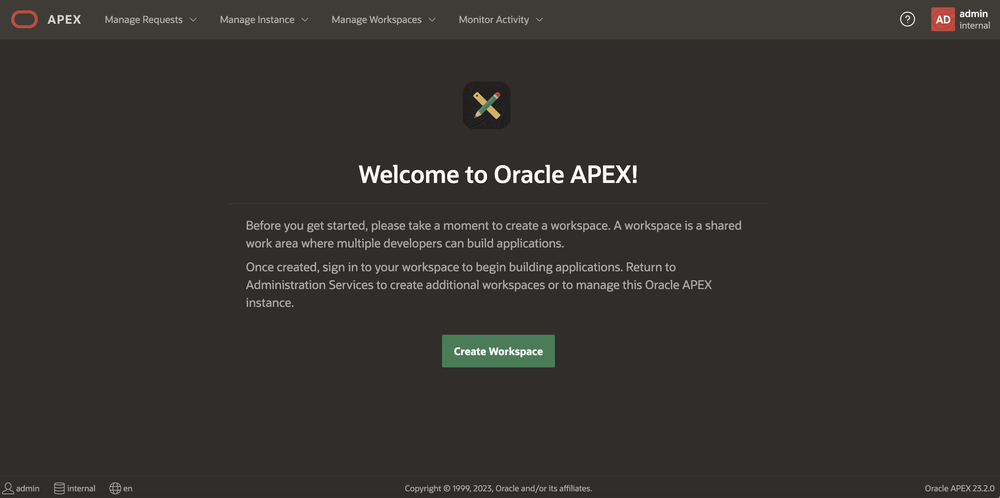
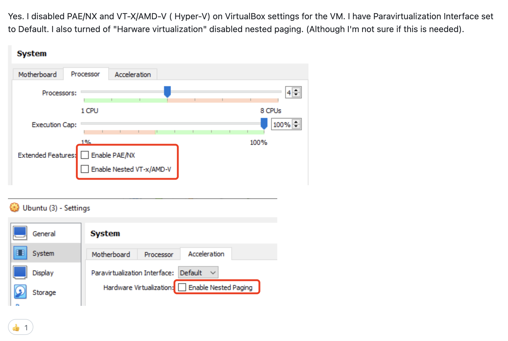
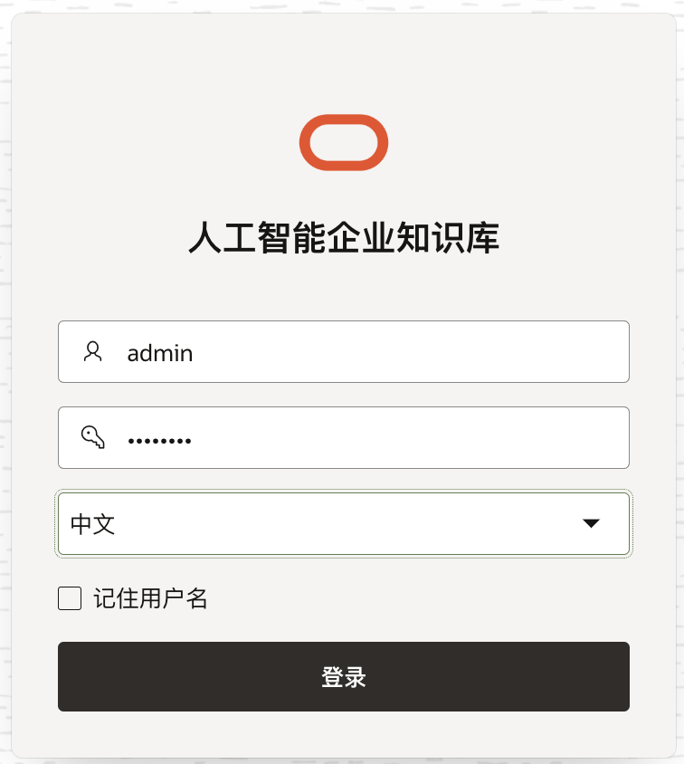
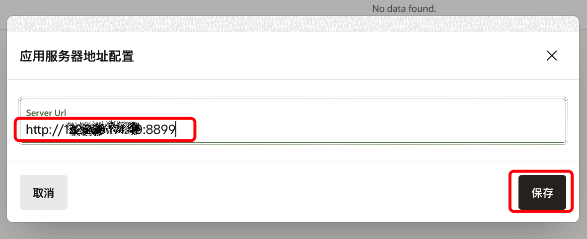

# Kbot2.0安装配置步骤


## 先决条件

获取最新版本的kbot安装程序和APEX应用安装程序。

## Task 1: 安装Oracle DB23ai数据库

1.   创建数据库环境：oracle linux8.10
2.   数据库名为beijing，包含1个PDB：bj_sales
3.   参见[db_bj.rsp](./db_bj.rsp)

```
-- opc: 
sudo dnf -y install oracle-database-preinstall-23ai
sudo mkdir /u01
sudo chmod 777 /u01

-- oracle: 
mkdir -p /u01/app/oracle/product/23.0.0/dbhome_1
wget --no-proxy https://objectstorage.us-phoenix-1.oraclecloud.com/p/_hT8jShYHcYXJXgyjliRe5XmdTKYsQxfWQkoWhYKn4xS3mbu6kC4r1s7grror_CN/n/oracassandra/b/minqiao.wang/o/20377/db23502405.zip
unzip db23502405.zip -d /u01/app/oracle/product/23.0.0/dbhome_1
-- 编辑rsp文件
cd /u01/app/oracle/product/23.0.0/dbhome_1
./runInstaller -silent -ignorePrereqFailure -responseFile /home/oracle/db_bj.rsp

-- root: 
/u01/app/oraInventory/orainstRoot.sh
/u01/app/oracle/product/23.0.0/dbhome_1/root.sh

-- oracle:
/u01/app/oracle/product/23.0.0/dbhome_1/runInstaller -executeConfigTools -responseFile /home/oracle/db_bj.rsp -silent

-- opc:
sudo firewall-cmd --zone=public --add-port=1521/tcp --permanent
sudo firewall-cmd --reload
sudo firewall-cmd --list-all

-- oracle: 编辑.bash_profile
export ORACLE_HOME=/u01/app/oracle/product/23.0.0/dbhome_1
export LD_LIBRARY_PATH=$ORACLE_HOME/lib
export ORACLE_SID=beijing
export PATH=$ORACLE_HOME/bin:$PATH
```

4.   创建数据库用户

     ```
     sqlplus / as sysdba
     alter session set container=bj_sales;
     create user vector identified by vector;
     grant db_developer_role to vector;
     alter user vector quota unlimited on users;
     ```

     

5.   sdf

## Task2:  安装APEX和ORDS

1.   opc用户安装jdk17

     ```
     sudo dnf install java-17-openjdk java-17-openjdk-devel
     ```

     

2.   验证安装成功

     ```
     $ java -version
     openjdk version "17.0.11" 2024-04-16 LTS
     OpenJDK Runtime Environment (Red_Hat-17.0.11.0.9-3.0.1) (build 17.0.11+9-LTS)
     OpenJDK 64-Bit Server VM (Red_Hat-17.0.11.0.9-3.0.1) (build 17.0.11+9-LTS, mixed mode, sharing)
     ```

     

3.   oracle用户，下载apex和ords安装文件，下载地址分别为[APEX](https://www.oracle.com/tools/downloads/apex-downloads/)和[ORDS](https://www.oracle.com/database/sqldeveloper/technologies/db-actions/download/)

     ```
     wget https://download.oracle.com/otn_software/apex/apex_23.2.zip
     wget https://download.oracle.com/otn_software/java/ords/ords-latest.zip
     ```

     

4.   解压APEX，进入apex目录

     ```
     $ unzip apex_23.2.zip
     $ cd apex
     ```

     

5.   创建静态目录，ords中需配置该静态资源目录

     ```
     $ mkdir apex_images
     $ cp -r /home/oracle/apex/images/* /home/oracle/apex_images
     ```

     

6.   连接到oracle数据库，进入相应的pdb

     ```
     $ sqlplus / as sysdba
     
     SQL*Plus: Release 23.0.0.0.0 - Production on Wed Jun 5 03:00:07 2024
     Version 23.5.0.24.05
     
     Copyright (c) 1982, 2024, Oracle.  All rights reserved.
     
     
     Connected to:
     Oracle Database 23ai Enterprise Edition Release 23.0.0.0.0 - Production
     Version 23.5.0.24.05
     
     SQL> alter session set container=bj_sales;
     
     Session altered.
     ```

     

7.   开始安装

     ```
     SQL> @apexins.sql SYSAUX SYSAUX TEMP /i/
     ......
     ......
     ......
     
     Thank you for installing Oracle APEX 23.2.0
     
     Oracle APEX is installed in the APEX_230200 schema.
     
     The structure of the link to the Oracle APEX administration services is as follows:
     http://host:port/ords/apex_admin
     
     The structure of the link to the Oracle APEX development interface is as follows:
     http://host:port/ords
     
     
     timing for: Phase 3 (Switch)
     Elapsed:    0.13
     
     
     timing for: Complete Installation
     Elapsed:    3.83
     
     SYS> exit
     Disconnected from Oracle Database 23ai Enterprise Edition Release 23.0.0.0.0 - Production
     Version 23.5.0.24.05
     ```

     

8.   修改APEX相关客户的密码(如：WelcomePTS_2023#)

     ```
     $ sqlplus / as sysdba
     SQL> alter session set container=bj_sales;
     SQL> @apxchpwd.sql
     ...set_appun.sql
     ================================================================================
     This script can be used to change the password of an Oracle APEX
     instance administrator. If the user does not yet exist, a user record will be
     created.
     ================================================================================
     Enter the administrator's username [ADMIN] 
     User "ADMIN" does not yet exist and will be created.
     Enter ADMIN's email [ADMIN] admin@null.com
     Enter ADMIN's password [] 
     Created instance administrator ADMIN.
     ```

     

9.   修改其它用户的密码(如：WelcomePTS_2023#)

     ```
     SQL> @apex_rest_config.sql
     
     Enter a password for the APEX_LISTENER user              [] 
     Enter a password for the APEX_REST_PUBLIC_USER user              [] 
     ...set_appun.sql
     ...setting session environment
     ...create APEX_LISTENER and APEX_REST_PUBLIC_USER users
     ...grants for APEX_LISTENER and ORDS_METADATA user
     ```

     

10.   禁用数据库内置的PL/SQL网关

      ```
      SQL> exec dbms_xdb.sethttpport(0);
      SQL> exec dbms_xdb.setftpport(0);
      ```

      

11.   解锁用户

      ```
      ALTER USER APEX_LISTENER  ACCOUNT UNLOCK identified by WelcomePTS_2023#;
      ALTER USER APEX_PUBLIC_USER ACCOUNT UNLOCK identified by WelcomePTS_2023#;
      ALTER USER APEX_REST_PUBLIC_USER ACCOUNT UNLOCK identified by WelcomePTS_2023#;
      ALTER USER APEX_230200 ACCOUNT UNLOCK identified by WelcomePTS_2023#;
      CREATE PROFILE password_unlimited LIMIT PASSWORD_LIFE_TIME UNLIMITED;
      ALTER USER apex_public_user PROFILE password_unlimited;
      ```

      

12.   安装中文包。

      ```
      @builder/zh-cn/load_zh-cn.sql
      ```

      

13.   开放用户外网访问权限

      ```
      SQL> BEGIN
        DBMS_NETWORK_ACL_ADMIN.APPEND_HOST_ACE(
        host => '*',
        ace => xs$ace_type(privilege_list => xs$name_list('connect'),
        principal_name => 'APEX_230200',
        principal_type => xs_acl.ptype_db));
      END;
      /
      
      SQL> exit
      ```

      

14.   解压ords

      ```
      $ cd /home/oracle
      $ mkdir ords
      $ unzip ords-latest.zip -d /home/oracle/ords
      ```

      

15.   创建ords config目录

      ```
      mkdir ords_config
      ```

      

16.   配置环境变量

      ```
      $ vi .bash_profile
      
      -- 增加下面两个环境变量
      export PATH=$PATH:/home/oracle/ords/bin
      export ORDS_CONFIG=/home/oracle/ords_config
      
      $ source .bash_profile
      ```

      

17.   安装ords，选择S，自定义数据库连接到PDB(输入主机名、端口、服务名），安装完成后，ords缺省就是启动的，可以按```ctrl+c```退出

      ```
      $ ords install
      Warning: Support for executing: java -jar ords.war has been deprecated.
      Please add ords to your PATH and use the ords command instead.
      Run the following command to add ords to your PATH:
      
      echo -e 'export PATH="$PATH:/home/oracle/bin"' >> ~/.bash_profile
      
      Start a new shell to pick up this change.
      2024-06-05T03:25:15.297Z INFO        Your configuration folder /home/oracle is located in ORDS product folder.  Oracle recommends to use a different configuration folder.
      
      ORDS: Release 24.1 Production on Wed Jun 05 03:25:15 2024
      
      Copyright (c) 2010, 2024, Oracle.
      
      Configuration:
        /home/oracle
      
      The configuration folder /home/oracle does not contain any configuration files.
      
      Oracle REST Data Services - Interactive Install
      
        Enter a number to select the TNS net service name to use from /u01/app/oracle/product/23.0.0/dbhome_1/network/admin/tnsnames.ora or specify the database connection
          [1] BEIJING      SERVICE_NAME=beijing                                        
          [2] BJ_ACCT      SERVICE_NAME=bj_acct                                        
          [3] BJ_SALES     SERVICE_NAME=bj_sales                                       
          [4] SHANGHAI     SERVICE_NAME=shanghai                                       
          [5] SH_FIN       SERVICE_NAME=sh_fin                                         
          [S] Specify the database connection
        Choose [1]: S
        Provide database user name with administrator privileges.
          Enter the administrator username: sys
        Enter the database password for SYS AS SYSDBA: 
      
      ......
      ......
      
        Install ORDS in the database
          [1] Yes
          [2] No
        Choose [1]: 
      ORDS is not installed in the database. ORDS installation is required.
      
        Enter a number to update the value or select option A to Accept and Continue
          [1] Connection Type: TNS
          [2] TNS Connection: TNS_NAME=BEIJING TNS_FOLDER=/u01/app/oracle/product/23.0.0/dbhome_1/network/admin
                 Administrator User: SYS AS SYSDBA
          [3] Database password for ORDS runtime user (ORDS_PUBLIC_USER): <generate>
          [4] ORDS runtime user and schema tablespaces:  Default: SYSAUX Temporary TEMP
          [5] Additional Feature: Database Actions
          [6] Configure and start ORDS in Standalone Mode: Yes
          [7]    Protocol: HTTP
          [8]       HTTP Port: 8080
          [9]   APEX static resources location: 
          [A] Accept and Continue - Create configuration and Install ORDS in the database
          [Q] Quit - Do not proceed. No changes
        Choose [A]: 9
        Enter the APEX static resources location: /home/oracle/apex/images
        Enter a number to update the value or select option A to Accept and Continue
          [1] Connection Type: TNS
          [2] TNS Connection: TNS_NAME=BEIJING TNS_FOLDER=/u01/app/oracle/product/23.0.0/dbhome_1/network/admin
                 Administrator User: SYS AS SYSDBA
          [3] Database password for ORDS runtime user (ORDS_PUBLIC_USER): <generate>
          [4] ORDS runtime user and schema tablespaces:  Default: SYSAUX Temporary TEMP
          [5] Additional Feature: Database Actions
          [6] Configure and start ORDS in Standalone Mode: Yes
          [7]    Protocol: HTTP
          [8]       HTTP Port: 8080
          [9]   APEX static resources location: /home/oracle/apex/images
          [A] Accept and Continue - Create configuration and Install ORDS in the database
          [Q] Quit - Do not proceed. No changes
        Choose [A]: 
        ......
        ......
        Mapped local pools from /home/oracle/databases:
        /ords/                              => default                        => VALID     
      
      
      2024-06-05T03:30:05.237Z INFO        Oracle REST Data Services initialized
      Oracle REST Data Services version : 24.1.1.r1201228
      Oracle REST Data Services server info: jetty/10.0.20
      Oracle REST Data Services java info: OpenJDK 64-Bit Server VM 17.0.11+9-LTS
      ```

      

18.   配置 apex静态内容,请先终止ords服务，终止后再进行配置。

      ```
      $ ords config set --global standalone.static.context.path /i
      #/home/oracle/apex_images为Apex的静态资源目录
      $ ords config set --global standalone.static.path /home/oracle/apex_images
      $ ords config set jdbc.MaxLimit 90
      $ ords config set jdbc.InitialLimit 90
      ```

      

19.   opc用户，打开防火墙

      ```
      sudo firewall-cmd --zone=public --add-port=8080/tcp --permanent
      sudo firewall-cmd --reload
      sudo firewall-cmd --list-all
      ```

      

20.   在后台运行ords

      ```
      nohup ords serve &
      ```

      

21.   浏览器访问ords主页

      ```
      http://132.226.171.40:8080/ords
      ```

      

      

      

22.   在APEX部分，输入要设置的PDB，点击**开始**（如果ords是安装在PDB中的，则可以直接点击**开始**）

      

23.   输入相应的项目：```internal/admin/WelcomePTS_2023#```，点击**Sign in**

      

24.   点击**Create Workspace**

      

25.   输入workspace name，点击**Next**

      

26.   输入新建schema的名字、密码及Quota（如：KBOT-UI/WelcomePTS_2023#/2000)，点击**Next**：

      

27.   输入管理员的信息（admin/WelcomePTS_2023#/admin@null.com)

      

      

28.   确认输入的信息，点击**Create Workspace**

      

29.   创建成功，点击**Done**

      

30.   从管理员用户退出

      

31.   登录到新的Workspace

      

32.   第一次登录需要修改用户密码，可以依然设置为原来的密码

      

33.   登录成功

      

34.   sadf


## Task 3: 安装Kbot

1.   opc用户，下载Anaconda安装脚本

     ```
     wget https://repo.anaconda.com/archive/Anaconda3-2024.02-1-Linux-x86_64.sh
     ```

     

2.   安装，接受版权信息以及缺省安装目录

     ```
     chmod +x Anaconda3-2024.02-1-Linux-x86_64.sh
     ./Anaconda3-2024.02-1-Linux-x86_64.sh
     ......
     ......
     installation finished.
     Do you wish to update your shell profile to automatically initialize conda?
     This will activate conda on startup and change the command prompt when activated.
     If you'd prefer that conda's base environment not be activated on startup,
        run the following command when conda is activated:
     
     conda config --set auto_activate_base false
     
     You can undo this by running `conda init --reverse $SHELL`? [yes|no]
     [no] >>> yes
     ```

     最后一步如果选择no，要使用conda环境前，需要运行。（选yes的话也需要激活环境变量```$ source .bashrc```）

     ```
     eval "$(/home/opc/anaconda3/bin/conda shell.bash hook)" 
     conda init bash
     ```

     

3.   创建kbot环境conda环境

     ```
     conda create --name kbot python=3.10
     ```

     

4.   激活虚拟环境

     ```
     conda activate kbot
     ```

     

5.   上传kbot安装文件，解压。[kbot.zip下载链接](./kbot.zip)

     ```
     unzip kbot.zip 
     ```

     

6.   安装kbot，注意要先激活kbot虚拟环境

     ```
     (kbot) [opc@bj ~]$ cd kbot
     (kbot) [opc@bj ~]$ conda install -c conda-forge cxx-compiler
     (kbot) [opc@bj ~]$ pip install -r requirements.txt
     ```

     如果用清华镜像库：

     ```
     pip install -r requirements.txt -i https://pypi.tuna.tsinghua.edu.cn/simple
     ```

     如果你用的VirtualBox虚拟机，在pip安装时可能会出以下错误：

     ```
     Failed to build llama-cpp-python
     
     ERROR: Could not build wheels for llama-cpp-python, which is required to install pyproject.toml-based projects
     ```

     这时，需要将PAE/NX，Nested VT-x以及硬件加速页面的Nested Paging关闭，再重新运行pip安装。安装完成后再启用。如下图：

     

7.   修改配置文件，如果不使用OCI GenAI提供的大模型，用[config.py.nooci](./config.py.nooci)替换掉config.py后，再进行修改。

     ```
     $ vi config.py
     
     检查 http_prefix = 'http://ip:8899/'
     其中 ORACLE_AI_VECTOR_CONNECTION_STRING 修改为后面APEX所要装的schema连接串
     # ORACLE_AI_VECTOR_CONNECTION_STRING="user/password@localhost:1521/yourPDB"
     http_prefix = 'http://132.226.171.40:8899/'
     ORACLE_AI_VECTOR_CONNECTION_STRING="vector/vector@localhost:1521/bj_sales"
     
     
     knowledge base root directory设为auto
     #######  the knowledge base root directory    #####################
     #KB_ROOT_PATH = '/home/ubuntu/kbroot'
     #######  if use auto, the kbroot will be automatically set  in the same directory where kbot/ locates   ######################
     KB_ROOT_PATH = 'auto'
     ```

     

8.   添加你所拥有的大模型的认证key

     ```
     $ vi llm_keys.py
     
     -- 如：cohere_api_key='gFRJh*****8yFnExZ'
     
     ######  讯飞星火模型key配置开始 ######
     xinghuo_appid="33***bf"
     xinghuo_api_secret='NjY1********BmNjFk'
     xinghuo_api_key='f799*****27577d21'
     #用于配置大模型版本，默认“general/generalv2”
     xinghuo_domain = "generalv3.5"
     #云端环境的服务地址
     xinghuo_spark_url = "ws://spark-api.xf-yun.com/v3.5/chat"
     ######  讯飞星火模型key配置结束 ######
     ```

     

9.   打开端口

     ```
     sudo firewall-cmd --zone=public --add-port=8899/tcp --permanent
     sudo firewall-cmd --reload
     sudo firewall-cmd --list-all
     ```

     

10.   启动kbot，第一次运行可以在前台直接运行，不用nohup在后台运行。

      ```
      nohup python main.py  --port 8899 &
      ```

      第一次运行要下载hugging face上的模型，如果你的虚机在国内，不能访问国外网站，需要用镜像库。启动kbot之前，设置镜像库环境：

      ```
      export HF_ENDPOINT=https://hf-mirror.com 
      ```

      

11.    启动以后，不报错，且如果正常可以打开接口swagger测试页：
       ```http://132.226.171.40:8899/docs```

       或者用curl调接口测试下是否能正常返回：

      ```
      curl -X 'GET' \
      'http://localhost:8899/knowledge_base/list_knowledge_bases' \
      -H 'accept: application/json'
      ```

      

12.   sdaf

13.   sadf

## Task 4: 导入APEX应用程序

1.   在浏览器中输入下列地址，进入APEX页面

     ```
     http://132.226.171.40:8080/ords/r/apex/workspace-sign-in/oracle-apex-sign-in
     ```

     

2.   选择**App Builder**，点击**Import**

     

3.   选择要导入的应用程序文件，点击**Next**。[APEX应用程序下载链接](./kbot_apex_源码_f119_20240604.sql)

     

4.   点击**安装应用文件**

     

5.   点击**Install supporting Objects**

     

6.   点击**Edit Application**

     

7.   点击**Shared Compnents**

     

8.   点击**Application Translations**

     

9.   选择**Publish translated applications**

     

10.   勾选应用，点击**Seed**

      

11.   再次勾选应用，点击**Publish**

      

12.   点击运行按钮

      

13.   输入用户名/密码（admin/12345678)，选择中文

      

14.   登录成功

      

15.   点击”系统配置“->"应用服务器地址配置"

      

16.   输入应用地址，点击保存

      

17.   保存后点击**默认配置同步**

      

18.   配置完成

      

19.   之后要直接进入程序可以输入下列url

      ```
      -- ORDS安装在CDB
      http://132.226.171.40:8080/ords/bj_sales/r/kbot-ui/km-chat109
      
      --或者ORDS安装在PDB
      http://192.168.106.204:8080/ords/r/kbot-ui/km-chat109
      ```

      

20.   sdf