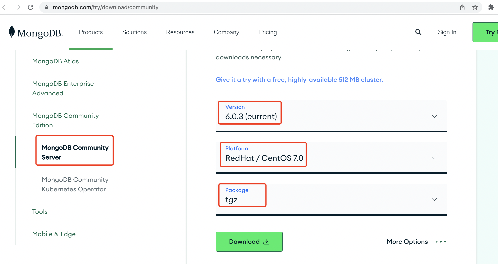
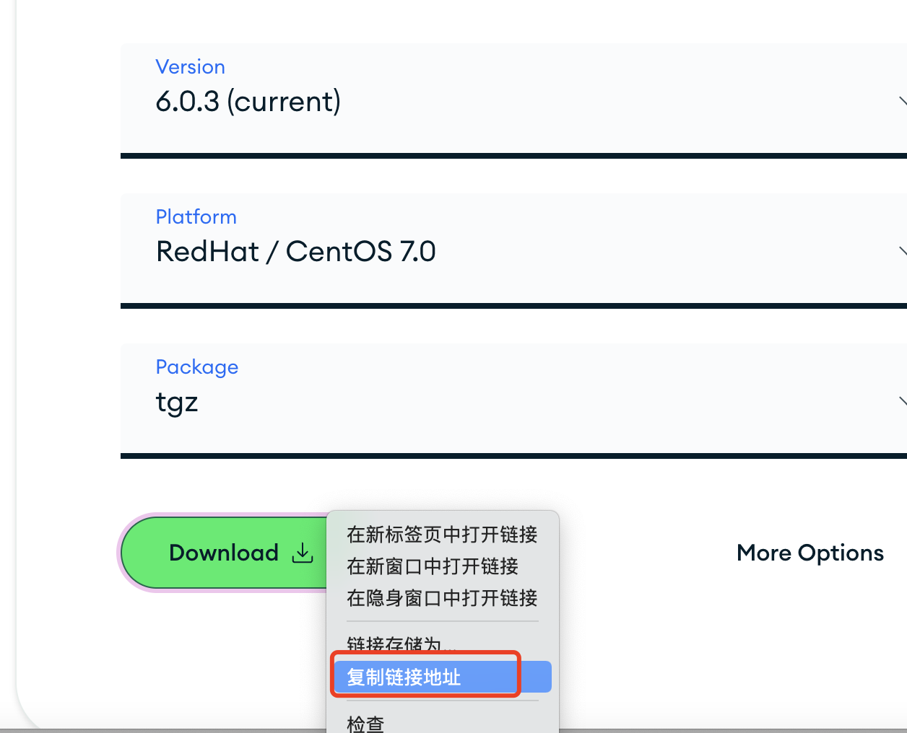
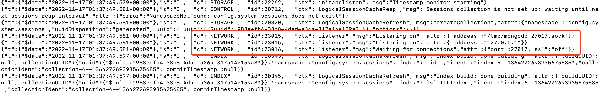

# MongoDB安装和简单使用

## 简介
MongoDB 是由C++语言编写的，是一个基于分布式文件存储的开源数据库系统。MongoDB 是一个面向文档存储的数据库，操作起来比较简单和容易。MongoDB 旨在为WEB应用提供可扩展的高性能数据存储解决方案。在本联系中你将学习如何安装MongoDB服务器和客户端，以及对MongoDB的简单操作。

### 先决条件

1. 在OCI上创建一个VM，Oracle Linux 7.9，1C16G
2. 参考[mongoDB安装文档](https://www.mongodb.com/docs/manual/administration/install-community/)
2. 参考[mongosh安装和使用文档](https://www.mongodb.com/docs/mongodb-shell/)


## 安装mongoDB

1. 下载[MongoDB社区版](https://www.mongodb.com/try/download/community)

    

2. 右键点击**Download**，复制链接地址。

    

3. 连接到虚机，使用wget命令下载：

    ```
    $ wget https://fastdl.mongodb.org/linux/mongodb-linux-x86_64-rhel70-6.0.3.tgz
    --2022-11-17 01:32:40--  https://fastdl.mongodb.org/linux/mongodb-linux-x86_64-rhel70-6.0.3.tgz
    Resolving fastdl.mongodb.org (fastdl.mongodb.org)... 13.33.33.125, 13.33.33.8, 13.33.33.62, ...
    Connecting to fastdl.mongodb.org (fastdl.mongodb.org)|13.33.33.125|:443... connected.
    HTTP request sent, awaiting response... 200 OK
    Length: 71837737 (69M) [application/gzip]
    Saving to: ‘mongodb-linux-x86_64-rhel70-6.0.3.tgz’
    
    100%[=======================================================>] 71,837,737  11.8MB/s   in 11s    
    
    2022-11-17 01:32:52 (6.34 MB/s) - ‘mongodb-linux-x86_64-rhel70-6.0.3.tgz’ saved [71837737/71837737]
    ```

    

4. 解压

    ```
    $ tar -zxvf mongodb-linux-x86_64-rhel70-6.0.3.tgz 
    mongodb-linux-x86_64-rhel70-6.0.3/LICENSE-Community.txt
    mongodb-linux-x86_64-rhel70-6.0.3/MPL-2
    mongodb-linux-x86_64-rhel70-6.0.3/README
    mongodb-linux-x86_64-rhel70-6.0.3/THIRD-PARTY-NOTICES
    mongodb-linux-x86_64-rhel70-6.0.3/bin/install_compass
    mongodb-linux-x86_64-rhel70-6.0.3/bin/mongod
    mongodb-linux-x86_64-rhel70-6.0.3/bin/mongos
    ```

    

5. 拷贝到指定目录

    ```
    $ sudo cp mongodb-linux-x86_64-rhel70-6.0.3/bin/* /usr/local/bin/
    ```

    

6. 创建数据库目录和日志目录并设置权限

    ```
    sudo mkdir -p /var/lib/mongo
    sudo mkdir -p /var/log/mongodb
    sudo chown `whoami` /var/lib/mongo   
    sudo chown `whoami` /var/log/mongodb
    ```

    

7. 启动MongoDB服务

    ```
    mongod --dbpath /var/lib/mongo --logpath /var/log/mongodb/mongod.log --fork
    ```

    

8. 查看日志

    ```
    $ tail -f /var/log/mongodb/mongod.log
    ```

    

9. 当看到一下Network信息时，表明MongoDB已正常启动

    

10. sadf

## 安装客户端工具-mongosh

1. 编辑yum repository文件

    ```
    sudo vi /etc/yum.repos.d/mongodb-org-6.0.repo
    ```

    

2. 在文件中加入以下内容

    ```
    [mongodb-org-6.0]
    name=MongoDB Repository
    baseurl=https://repo.mongodb.org/yum/redhat/$releasever/mongodb-org/6.0/$basearch/
    gpgcheck=1
    enabled=1
    gpgkey=https://www.mongodb.org/static/pgp/server-6.0.asc
    ```

    

3. 安装mongosh

    ```
    $ sudo yum install -y mongodb-mongosh
    ```

    

4. 连接mongo数据库，第一次连接，我们可以看到很多安全警告。

    ```
    $ mongosh "mongodb://localhost:27017"
    Current Mongosh Log ID:	63759bb27553f76987802202
    Connecting to:		mongodb://localhost:27017/?directConnection=true&serverSelectionTimeoutMS=2000&appName=mongosh+1.6.0
    Using MongoDB:		6.0.3
    Using Mongosh:		1.6.0
    
    For mongosh info see: https://docs.mongodb.com/mongodb-shell/
    
    ------
       The server generated these startup warnings when booting
       2022-11-17T01:37:49.556+00:00: Access control is not enabled for the database. Read and write access to data and configuration is unrestricted
       2022-11-17T01:37:49.556+00:00: This server is bound to localhost. Remote systems will be unable to connect to this server. Start the server with --bind_ip <address> to specify which IP addresses it should serve responses from, or with --bind_ip_all to bind to all interfaces. If this behavior is desired, start the server with --bind_ip 127.0.0.1 to disable this warning
       2022-11-17T01:37:49.557+00:00: /sys/kernel/mm/transparent_hugepage/enabled is 'always'. We suggest setting it to 'never'
       2022-11-17T01:37:49.557+00:00: Soft rlimits for open file descriptors too low
    ------
    
    ------
       Enable MongoDB's free cloud-based monitoring service, which will then receive and display
       metrics about your deployment (disk utilization, CPU, operation statistics, etc).
       
       The monitoring data will be available on a MongoDB website with a unique URL accessible to you
       and anyone you share the URL with. MongoDB may use this information to make product
       improvements and to suggest MongoDB products and deployment options to you.
       
       To enable free monitoring, run the following command: db.enableFreeMonitoring()
       To permanently disable this reminder, run the following command: db.disableFreeMonitoring()
    ------
    
    test> 
    ```

    

5. 缺省mongodb包含3个数据库。MongoDB 中默认的数据库为 test，如果你没有创建新的数据库，集合将存放在 test 数据库中。数据库中没有对象时，`show dbs`是看不到的。

    - admin：从权限的角度来看，这是"root"数据库。要是将一个用户添加到这个数据库，这个用户自动继承所有数据库的权限。一些特定的服务器端命令也只能从这个数据库运行，比如列出所有的数据库或者关闭服务器。
    - local：这个数据永远不会被复制，可以用来存储限于本地单台服务器的任意集合
    - config：当Mongo用于分片设置时，config数据库在内部使用，用于保存分片的相关信息。

    ```
    test> show dbs
    admin   40.00 KiB
    config  72.00 KiB
    local   40.00 KiB
    test>
    ```

    

6. 切换到admin数据库。`use <database>`命令，如果数据库不存在，则创建数据库，否则切换到指定数据库。

    ```
    test> use admin
    switched to db admin
    admin>
    ```

    

7. 输入下列命令创建新用户，授予管理员角色。

    ```
    db.createUser(
      {
        user: "myUserAdmin",
        pwd: passwordPrompt(), // or cleartext password
        roles: [
          { role: "userAdminAnyDatabase", db: "admin" },
          { role: "readWriteAnyDatabase", db: "admin" }
        ]
      }
    )
    ```

    

8. 输入password，如：WelcomePTS_2022#

    ```
    admin> db.createUser(
    ...   {
    ...     user: "myUserAdmin",
    ...     pwd: passwordPrompt(), // or cleartext password
    ...     roles: [
    ...       { role: "userAdminAnyDatabase", db: "admin" },
    ...       { role: "readWriteAnyDatabase", db: "admin" }
    ...     ]
    ...   }
    ... )
    Enter password
    ****************{ ok: 1 }
    admin> 
    ```

    

9. 退出mongosh

    ```
    admin> exit
    ```

    

10. 关闭mongodb

    ```
    $ mongod --dbpath /var/lib/mongo --logpath /var/log/mongodb/mongod.log --shutdown
    {"t":{"$date":"2022-11-18T01:06:15.354Z"},"s":"I",  "c":"CONTROL",  "id":20697,   "ctx":"-","msg":"Renamed existing log file","attr":{"oldLogPath":"/var/log/mongodb/mongod.log","newLogPath":"/var/log/mongodb/mongod.log.2022-11-18T01-06-15"}}
    Killing process with pid: 13154
    ```

    

11. 重新启动mongodb，使用`--auth`开启访问控制。

    ```
    $ mongod --auth --port 27017 --dbpath /var/lib/mongo --logpath /var/log/mongodb/mongod.log --fork
    about to fork child process, waiting until server is ready for connections.
    forked process: 29378
    child process started successfully, parent exiting
    ```

    

12. 进入mongosh

    ```
    $ mongosh
    Current Mongosh Log ID:	6376de544be03be4ec766069
    Connecting to:		mongodb://127.0.0.1:27017/?directConnection=true&serverSelectionTimeoutMS=2000&appName=mongosh+1.6.0
    Using MongoDB:		6.0.3
    Using Mongosh:		1.6.0
    
    For mongosh info see: https://docs.mongodb.com/mongodb-shell/
    
    test>
    ```

    

13. 我们可以看到当前不能访问数据库

    ```
    test> show dbs
    MongoServerError: command listDatabases requires authentication
    ```

    

14. 切换到admin数据库，使用管理员用户认证，输入用户密码

    ```
    test> use admin
    switched to db admin
    admin> db.auth("myUserAdmin", passwordPrompt()) // or cleartext password
    Enter password
    ****************{ ok: 1 }
    admin> 
    ```

    

15. 切换到test数据库，创建一个用户`myTester`，在test数据库中有读写权限，在reporting数据库中有读权限。

    ```
    admin> use test
    switched to db test
    test> db.createUser(
    ...   {
    ...     user: "myTester",
    ...     pwd:  passwordPrompt(),   // or cleartext password
    ...     roles: [ { role: "readWrite", db: "test" },
    ...              { role: "read", db: "reporting" } ]
    ...   }
    ... )
    Enter password
    ****************{ ok: 1 }
    test> 
    ```

    

16. 切换到myTester用户

    ```
    test> db.auth("myTester", passwordPrompt())
    Enter password
    ****************{ ok: 1 }
    ```

    

17. 创建一个集合

    ```
    test> db.createCollection("mycol1")
    { ok: 1 }
    ```

    

18. 查看新建的集合

    ```
    test> show collections
    mycol1
    ```

    

19. 在 MongoDB 中，你不需要创建集合。当你插入一些文档时，MongoDB 会自动创建集合。

    ```
    test> db.mycol2.insertOne({"name" : "testname"})
    {
      acknowledged: true,
      insertedId: ObjectId("6376e86d19af520d26261d15")
    }
    ```

    

20. 查看当前的集合

    ```
    test> show collections
    mycol2
    mycol1
    ```

    

21. 删除mycol2的集合

    ```
    test> db.mycol2.drop()
    true
    ```

    

22. 查看当前的集合

    ```
    test> show collections
    mycol1
    ```

    

23. sdf


## CRUD操作

1. 连接到test数据库

    ```
    $ mongosh --port 27017 --authenticationDatabase "test" -u "myTester" -p
    Enter password: ****************
    Current Mongosh Log ID:	6376e9a42677bd399ff472bc
    Connecting to:		mongodb://<credentials>@127.0.0.1:27017/?directConnection=true&serverSelectionTimeoutMS=2000&authSource=test&appName=mongosh+1.6.0
    Using MongoDB:		6.0.3
    Using Mongosh:		1.6.0
    
    For mongosh info see: https://docs.mongodb.com/mongodb-shell/
    
    test>
    ```

    

2. 创建movies集合并插入一条文档。

    ```
    db.movies.insertOne(
      {
        title: "The Favourite",
        genres: [ "Drama", "History" ],
        runtime: 121,
        rated: "R",
        year: 2018,
        directors: [ "Yorgos Lanthimos" ],
        cast: [ "Olivia Colman", "Emma Stone", "Rachel Weisz" ],
        type: "movie"
      }
    )
    ```

    

3. 按条件查询文档，我们可以看到每个文档自动添加了一个字段：  `_id`。

    ```
    test> db.movies.find( { title: "The Favourite" } )
    [
      {
        _id: ObjectId("6376ec8f20abd222f5cf57b9"),
        title: 'The Favourite',
        genres: [ 'Drama', 'History' ],
        runtime: 121,
        rated: 'R',
        year: 2018,
        directors: [ 'Yorgos Lanthimos' ],
        cast: [ 'Olivia Colman', 'Emma Stone', 'Rachel Weisz' ],
        type: 'movie'
      }
    ]
    ```

    

4. 插入多条记录。

    ```
    db.movies.insertMany([
       {
          title: "Jurassic World: Fallen Kingdom",
          genres: [ "Action", "Sci-Fi" ],
          runtime: 130,
          rated: "PG-13",
          year: 2018,
          directors: [ "J. A. Bayona" ],
          cast: [ "Chris Pratt", "Bryce Dallas Howard", "Rafe Spall" ],
          type: "movie"
        },
        {
          title: "Tag",
          genres: [ "Comedy", "Action" ],
          runtime: 105,
          rated: "R",
          year: 2018,
          directors: [ "Jeff Tomsic" ],
          cast: [ "Annabelle Wallis", "Jeremy Renner", "Jon Hamm" ],
          type: "movie"
        }
    ])
    ```

    

5. 查询所有记录

    ```
    db.movies.find()
    ```

    

6. 按条件查询，查询满足分级条件的文档

    ```
    db.movies.find( { rated: { $in: [ "PG", "PG-13" ] } } )
    ```

    

7. 查询电影时长大于等于130分钟的文档。

    ```
    db.movies.find( { runtime: { $gte: 130 }} )
    ```

    

8. 修改文档，修改文档的语法如下：

    ```
    {
      <update operator>: { <field1>: <value1>, ... },
      <update operator>: { <field2>: <value2>, ... },
      ...
    }
    ```

    

9. 如下列修改语句，`$set`操作修改某个字段的值，如果该字段不存在，则新建一个字段。`$currentDate`修改lastUpdate的值为当前时间，如果该字段不存在，则新建一个字段。

    ```
    db.movies.updateOne( { title: "Tag" },
    {
      $set: {
        plot: "One month every year, five highly competitive friends hit the ground running for a no-holds-barred game of tag"
      },
      $currentDate: { lastUpdated: true } 
    }) 
    ```

    

10. 查询修改后的文档。

    ```
    test> db.movies.find({ title: "Tag" })
    [
      {
        _id: ObjectId("6376ed2520abd222f5cf57bb"),
        title: 'Tag',
        genres: [ 'Comedy', 'Action' ],
        runtime: 105,
        rated: 'R',
        year: 2018,
        directors: [ 'Jeff Tomsic' ],
        cast: [ 'Annabelle Wallis', 'Jeremy Renner', 'Jon Hamm' ],
        type: 'movie',
        plot: 'One month every year, five highly competitive friends hit the ground running for a no-holds-barred game of tag',
        lastUpdated: ISODate("2022-11-20T02:40:27.394Z")
      }
    ]
    ```

    

11. 按条件删除一个文档，删除符合条件的第一个文档。

     ```
     db.movies.deleteOne( { cast: "Olivia Colman" } )
     ```

     

12. 删除符合条件的所有文档。

     ```
     db.movies.deleteMany( { rated: 'PG-13' } )
     ```

     

13. 关闭MongoDB服务器

     ```
     mongod --dbpath /var/lib/mongo --logpath /var/log/mongodb/mongod.log --shutdown
     ```

     