# 创建和配置负载平衡器

## 简介

OCI负载平衡服务提供了从一个入口点到多个服务器的自动流量分配。负载平衡器可提高资源利用率，易于扩展，并确保高可用性。负载平衡器也可以把后端服务隐藏起来，外界只能通过负载均衡器访问后端服务，不能直接访问。

### 前提条件

- 创建并配置了两个计算实例

## Step 1： 创建负载平衡器

1. 在OCI主菜单里选择**网络**，点击**负载平衡器**。

    

2. 点击**创建负载平衡器**。

    

3. OCI提供两种负载平衡器（FLB和NLB），我们选择缺省的负载平衡器，然后点击**创建负载平衡器**。

    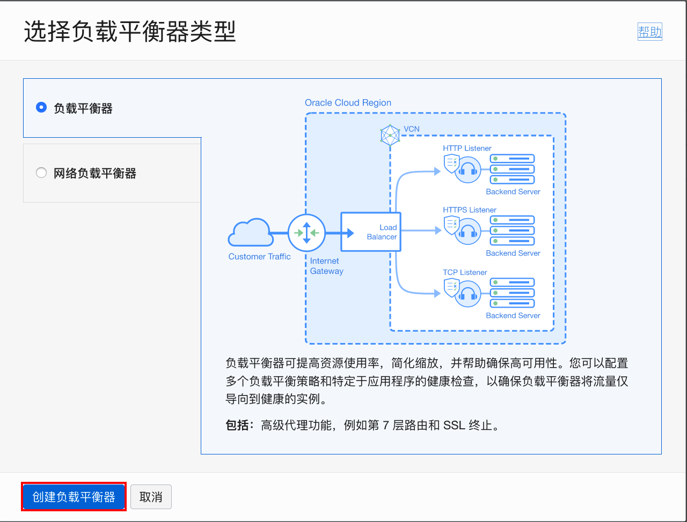

4. 输入**负载平衡器名称**，如：lb01。接受缺省的公共可见类型和临时分配IP地址。

    

5. **带宽**部分我们也接受缺省值，选择弹性配置，最小最大带宽都是10M。

    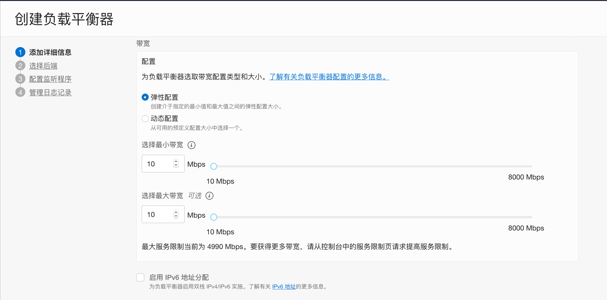

6. 负载平衡器建议部署在单独的子网里。在本练习中，我们选择跟应用服务器相同的公共子网。点击**下一步**。

    

7. 接受缺省的**负载平衡策略**，点击**添加后端**。

    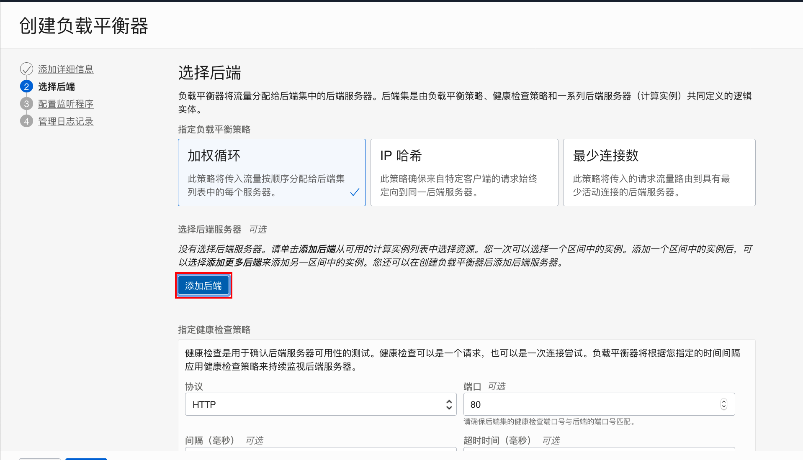

8. 勾选前面练习创建好的两个实例。点击**添加选定的后端**。

    

9. 两个后端服务添加完成。点击**下一步**。

    

10. 输入**监听程序名称**，指定处理的流量类型改为：HTTP，监听端口改为：8080。点击**下一步**。

    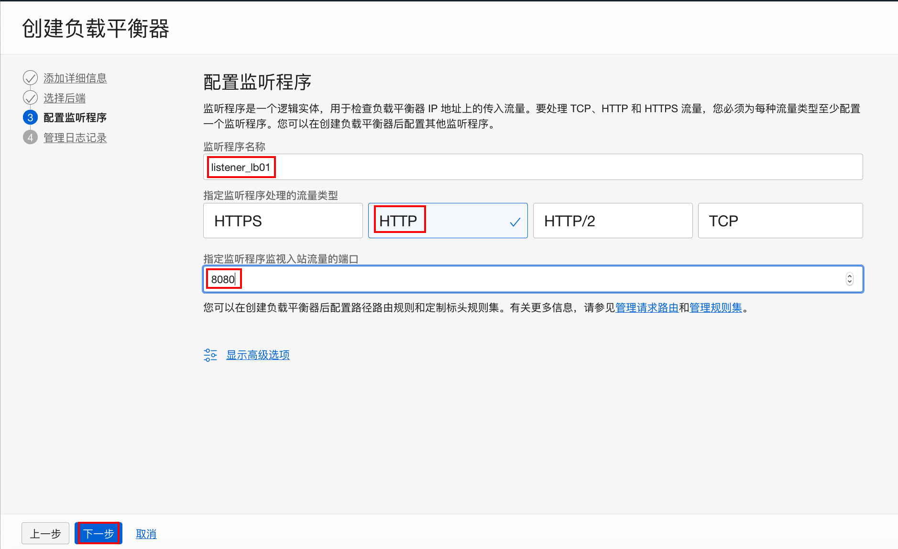

11. 接受缺省的错误日志和访问日志的设置。点击**提交**。

    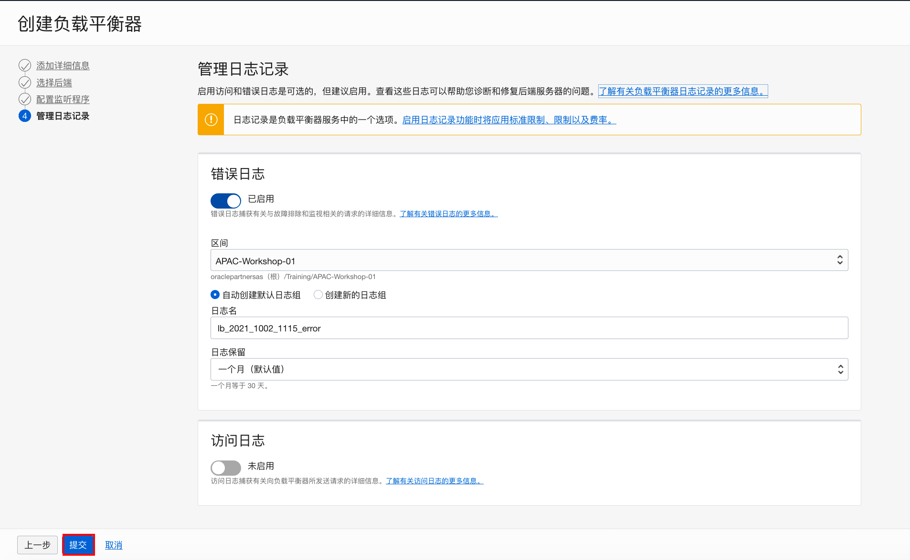

12. 稍等片刻，负载平衡器创建成功。记住该负载平衡器的IP地址。

    

13. asdf

## Step 2: 配置虚拟云网络的安全列表

因为我们设置的负载平衡器监听的端口为8080，需要修改对应的虚拟云网络里将子网的入站规则。

1. 在之前创建的**虚拟云网络详细信息**页面，点击公共子网链接。

    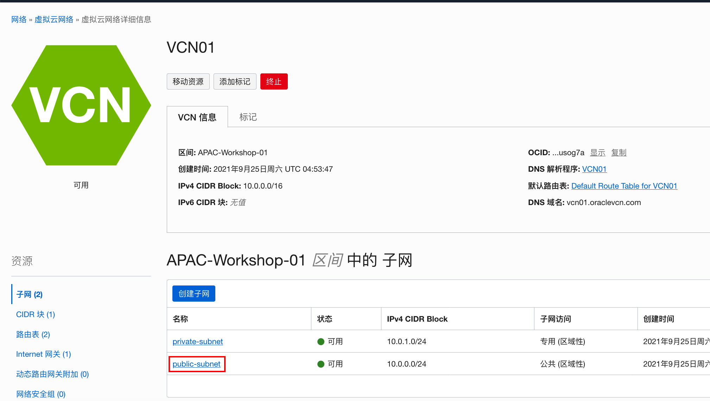

2. 点击缺省的安全列表链接。

    

3. 点击**添加入站规则**。

    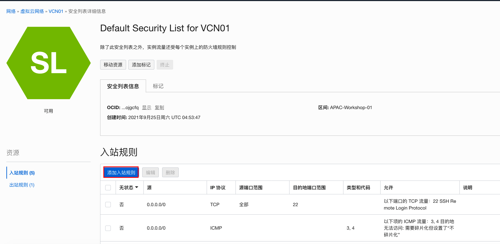

4. 我们将入站规则设置为任何外网地址都能通过TCP协议访问该子网内实例的8080端口。点击**添加入站规则**。

    

5. 入站规则添加成功。

    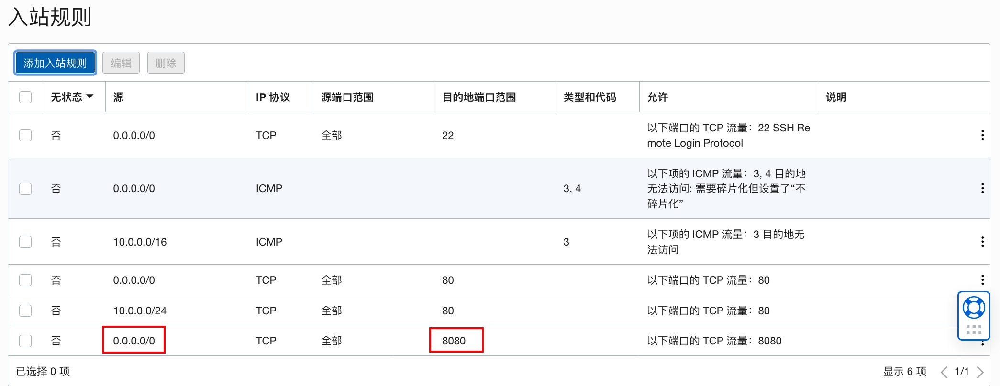

6. 为了不允许外网地址直接访问Web服务器的80端口，我们要将之前创建的入站规则删除掉。点击**删除**。

    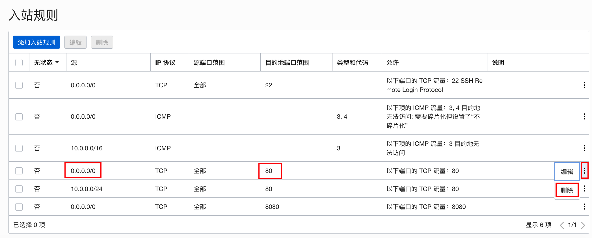

7. 在弹出窗口点击**删除**。

    

## Step 3: 验证负载平衡器

1. 在浏览器里输入负载平衡器的IP地址和8080端口，如：`http://xxx.xxx.xxx.xxx:8080`。

    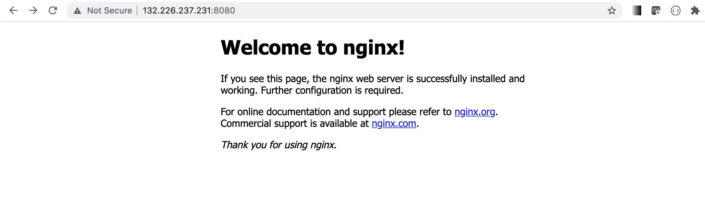

2. 刷新页面，可以观察到显示的内容改变，意味着后端切换到了另一台服务器。

    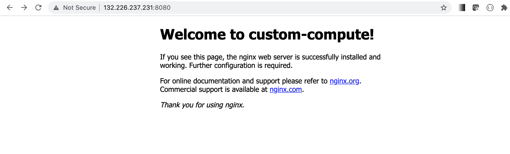

3. 直接输入后端Web服务器的地址，可以观察到现在连接不通，超时的现象。

    