# 创建虚拟云网络和子网

## 简介

虚拟云网络（VCN）是一个软件定义的网络，你可以在特定区域的OCI数据中心设置。一个VCN可以有多个不重叠的IPv4 CIDR块，你可以在创建VCN后进行更改。在VCN中你可以再划分子网，子网可以是公共的或是私有的。公有或私有的选择是在创建子网时发生的，创建以后不能改变。

在客户本地数据中心部署的应用通常包含数据库层、应用服务器层、Web层等等。要将应用迁移到云上，我们可以对应创建相应的层次，将不同的服务器部署在不同的子网，并为子网分配不同的安全策略来增强应用的安全性。如下图所示：

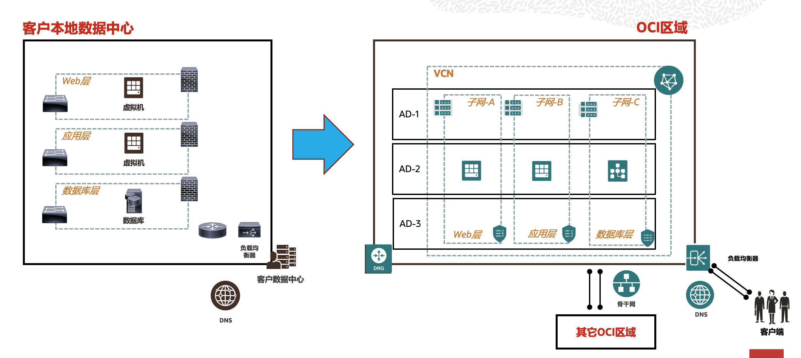

本练习将简化以上部署，通过手工的方式在OCI上创建一个VCN，一个公共子网和一个私有子网，并创建一些相关组件以便要部署的应用能正常使用。当然你也可以通过OCI提供的VCN向导一键部署所有的这些组件。

### 前提条件

- 你的帐号已经通过IAM 授权，加入到了具有VCN 操作权限的用户组中。

## Step 1: 创建VCN

1. 在OCI主页面，确定选择了正确的**区域**（如：Soeul）。点击左上角**主菜单**，选择**网络**，再点击**虚拟云网络**。

    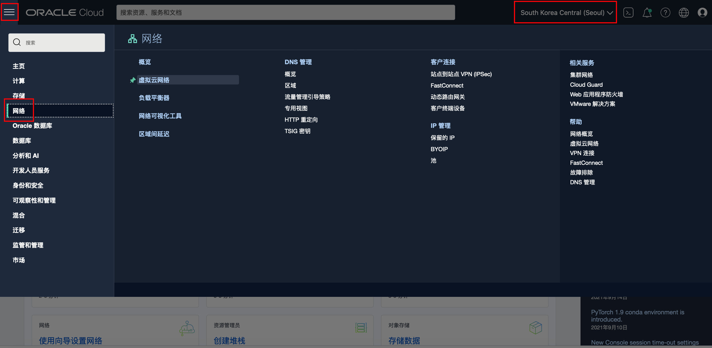

2. 在选择正确的**区间**（如：APAC-Workshop-01)后，点击**创建VCN**。

    

3. 在创建虚拟云网络页面，输入：

    - **名称**：给该VCN输入唯一名称（如：VCN01）

    - **IPv4 CIDR块**：10.0.0.0/16

        其它选项均为默认值。点击**创建VCN**。

    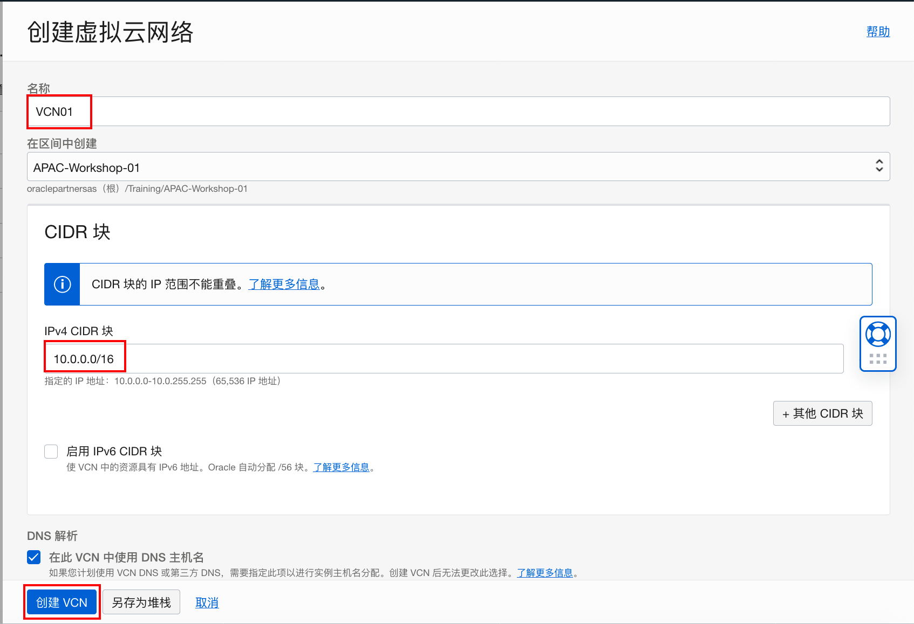

4. VCN创建成功。该VCN有一些缺省的组件，如**路由表**，**安全列表**等，我们在后面会进行添加和修改。

    

    

## Step 2: 创建公共子网

1. 在虚拟云网络详细信息页面，在**资源**下选择**子网**，点击**创建子网**

    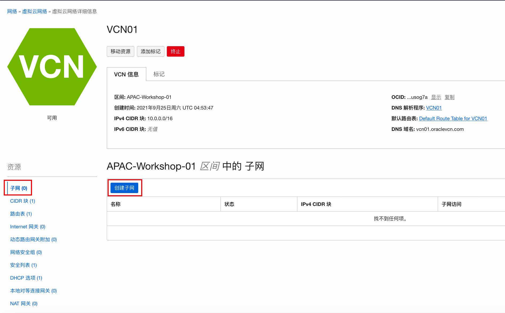

2. 在创建子网页面：

    - **名称**：输入子网名称（如：public-subnet）
    - **子网类型**：选择区域性子网。
    - **CIDR块**：输入10.0.0.0/24
    - **路由表**：选择缺省的路由表

    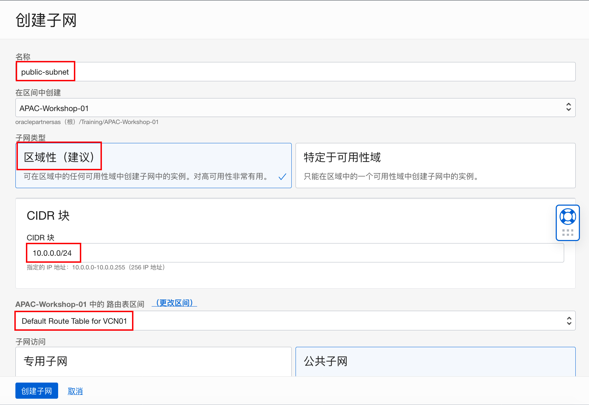

3. 往下滑动窗口

    - 子网访问：选择**公共子网**

    - DHCP选项：选择**Default DHCP Option**

    - 安全列表：选择**Default Security List**

        其它选项均为缺省值，点击**创建子网**。

    

4. 公共子网创建成功。

    

    

## Step 3: 创建Internet网关及配置相应路由

公共子网要访问Internet，必须要有路由规则到Internet网关。下面我们将会创建Internet网关及配置路由。

1. 在虚拟云网络详细信息页面，在**资源**下选择**Internet网关**，点击**创建Internet网关**。

    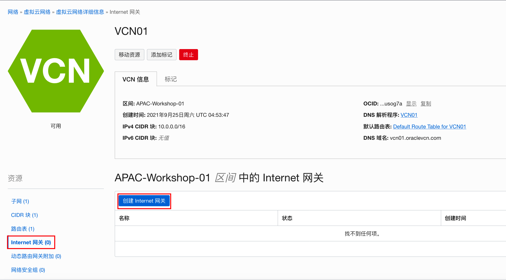

2. 在弹出窗口输入**名称**，如：internet-gateway。点击**创建Internet网关**。

    

3. Internet网关创建成功。

    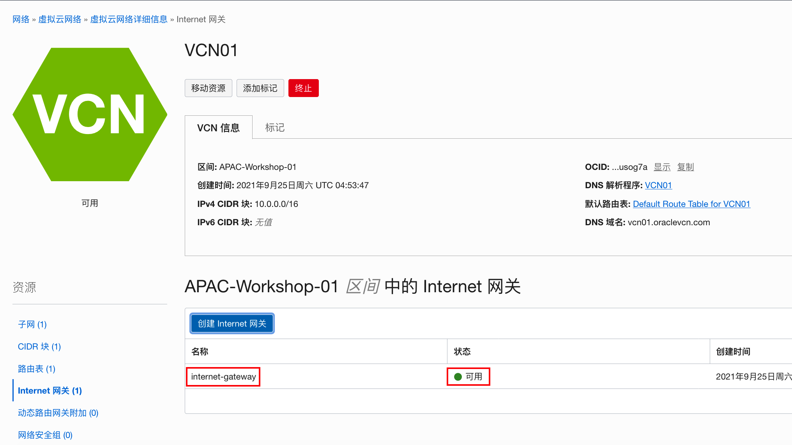

4. 在资源下选择**路由表**，点击**Default Route Table**。

    

5. 点击**添加路由规则**。

    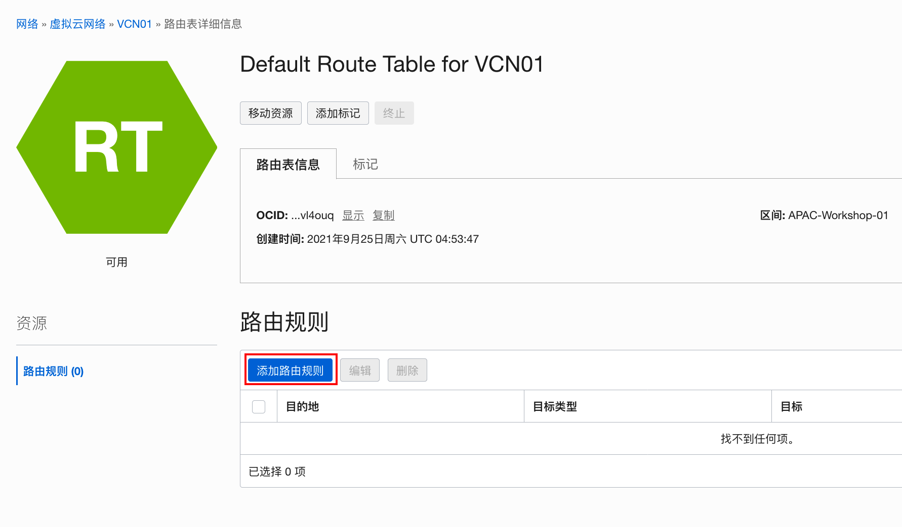

6. 选择**目标类型**为Internet网关。我们想设置公共子网的实例能访问任意的Internet网址，因此设置**目的地CIDR块**为：0.0.0.0/0，**目标Internet网关**为刚创建的internet-gateway。点击**添加路由规则**。

    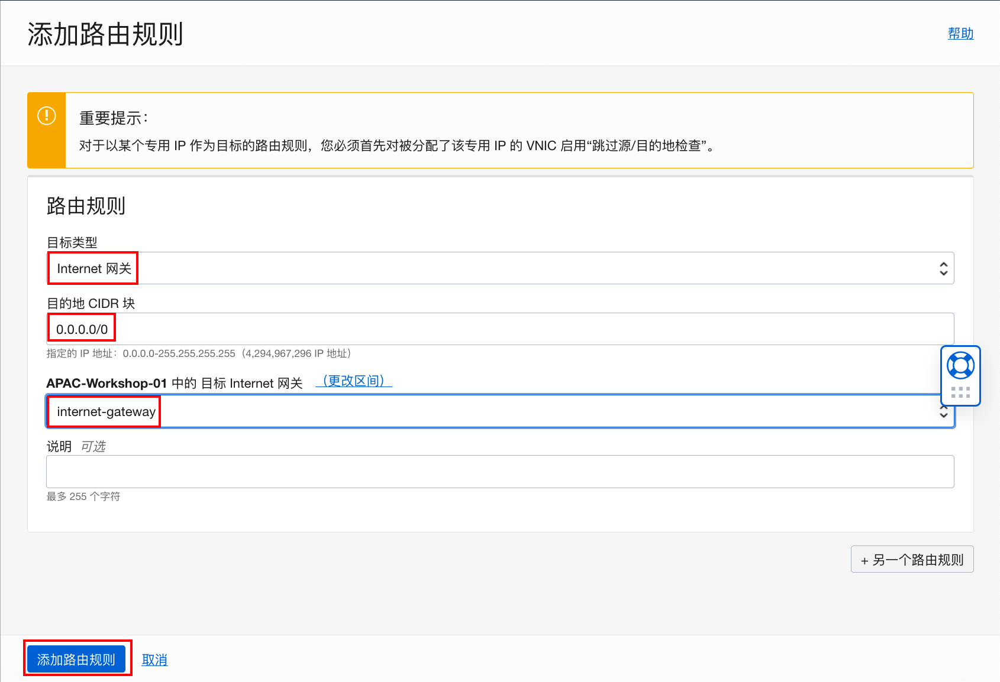

7. 路由规则添加完成。

    

8. 可以点击VCN的名称回到虚拟云网络的详细信息页面。

    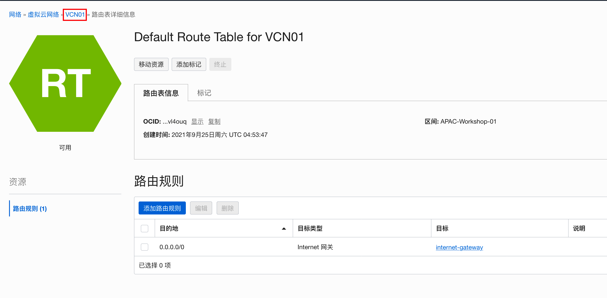

## Step 4: 创建私有子网的路由表和安全列表

在前面的设置中，公共子网使用了缺省的路由表和安全列表。我们将为私有子网创建新的路由表和安全列表。

1. 在**资源**下选择**路由表**，点击**创建路由表**。

    

2. 输入路由表**名称**，如：private-routetable。点击**创建**。

    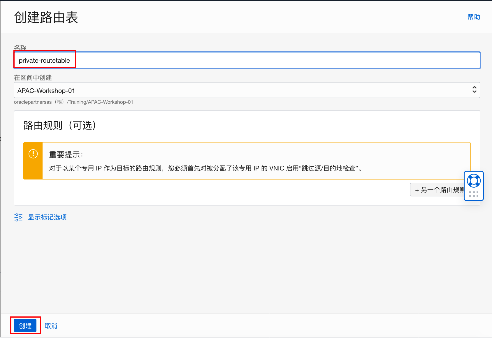

3. 新的路由表创建成功，但此时该路由表并没有设置路由规则。

    

4. 在**资源**下选择**安全列表**，点击**创建安全列表**。

    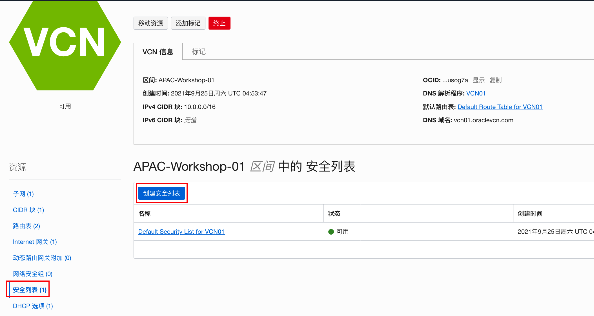

5. 输入安全列表的**名称**，如：private-seclist。要创建一个入站规则，点击**+另一个入站规则**。

    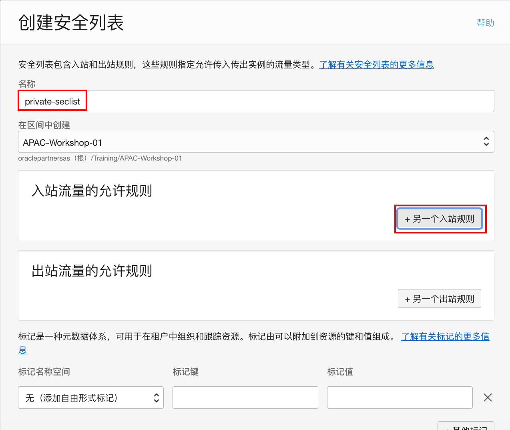

6. 在入站规则里，我们将允许所有的在该VCN里的实例都能通过TCP端口22访问该私有子网的实例。因此设置**源CIDR**为：10.0.0.0/16，**目标地端口范围**为：22。再设置出站流量规则，点击**+另一个出站规则**。

    

7. 在出站规则里，我们将允许私有子网的实例访问任意的外网地址。因此，设置**目的地CIDR**为：0.0.0.0/0，**IP协议**选择为：所有协议。点击**创建安全列表**。

    

8. 安全列表创建完成。

    

    

## Step 5: 创建私有子网

1. 在**资源**下选择**子网**，点击**创建子网**。

    

2. 在创建子网页面，

    - **名称**：输入子网名称，如：private-subnet
    - **子网类型**：选择缺省**区域性**
    - **CIDR块**：输入10.0.1.0/24
    - **路由表**：选择前面创建的路由表：private-routetable

    

3. 向下滚动窗口，

    - **子网访问**：选择**专用子网**

    - **DHCP选项**：选择**Default DHCP Option**

    - **安全列表**：选择前面创建的安全列表：private-seclist

        其它项均为缺省值。点击**创建子网**。

    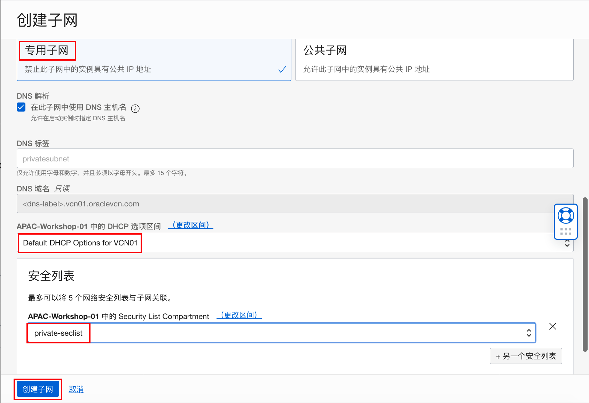

4. 私有子网创建成功。

    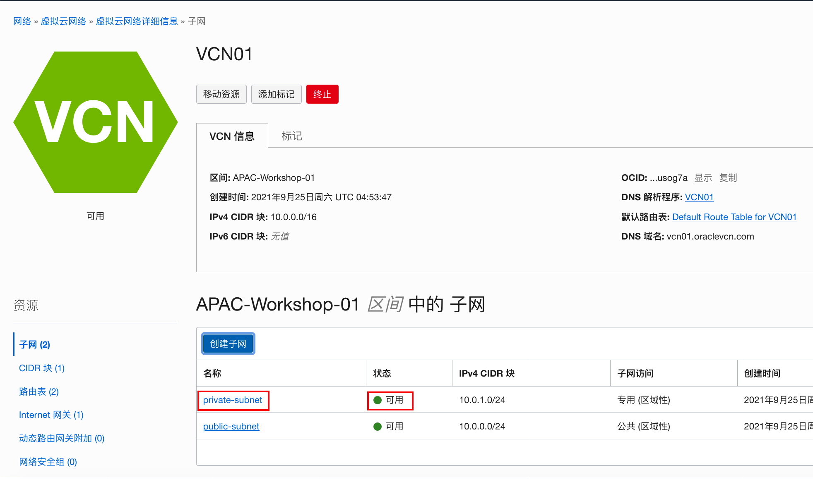

    

## Step 6（选做）：创建NAT网关和服务网关

NAT 网关允许整个私有网络访问互联网，而无需为每个主机分配公共 IP 地址。服务网关让VCN中的资源访问公共OCI服务，如对象存储，但无需使用互联网或NAT网关。

1. 在**虚拟云网络详细信息**页面，在**资源**下选择**NAT网关**，点击**创建NAT网关**。

    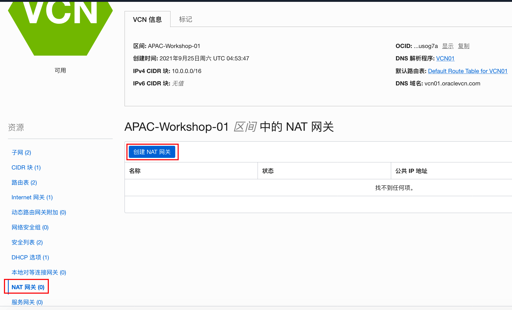

2. 输入**名称**，如：nat-gateway。选择缺省的**临时公共IP地址**，点击**创建NAT网关**。

    

3. NAT网关创建成功。

    

4. 在**资源**下选择**服务网关**，点击**创建服务网关**。

    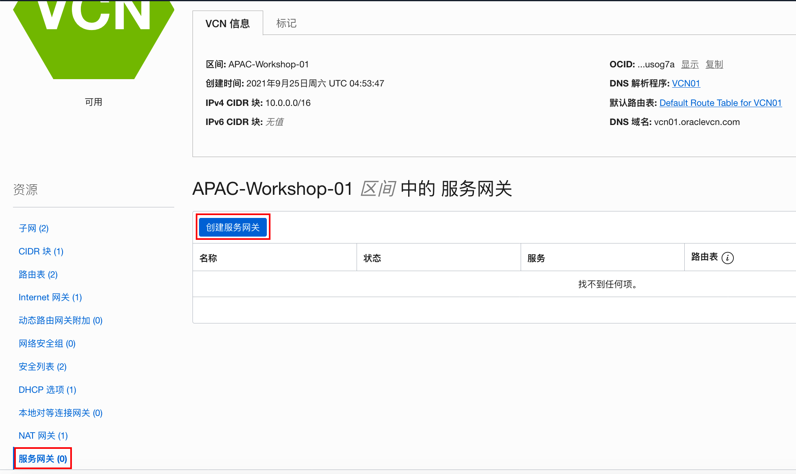

5. 输入服务网关的**名称**，如：service-gateway。**服务**可以选择只能访问object storage服务或者该区域的所有服务，我们选择所有服务。其中ICN为Seoul区域的区域代码。点击**创建服务网关**。

    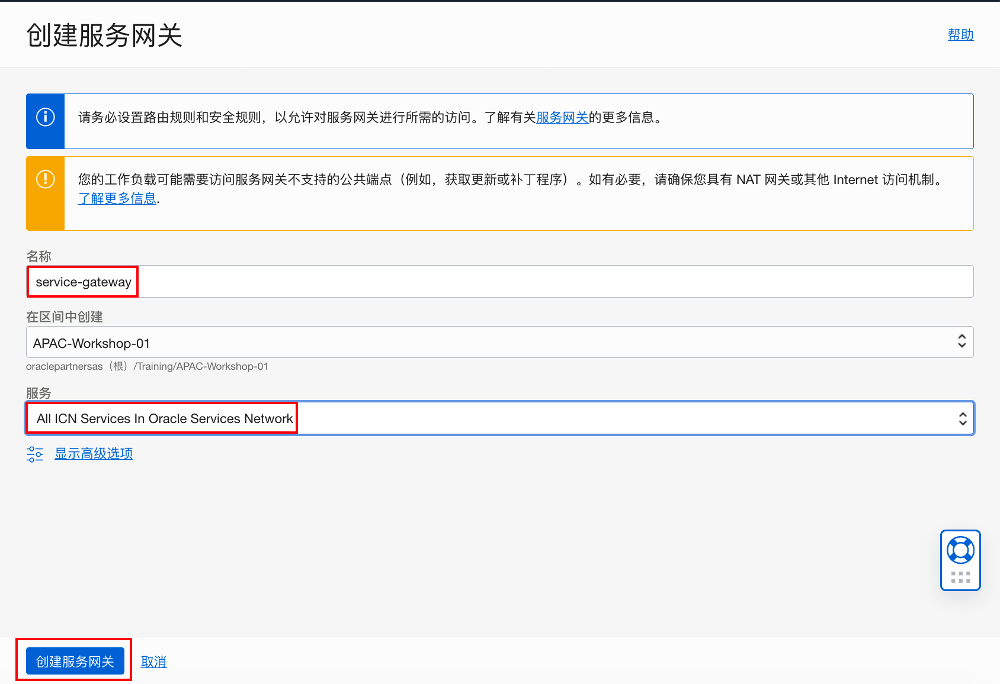

6. 点击**关闭**，服务网关创建成功。

    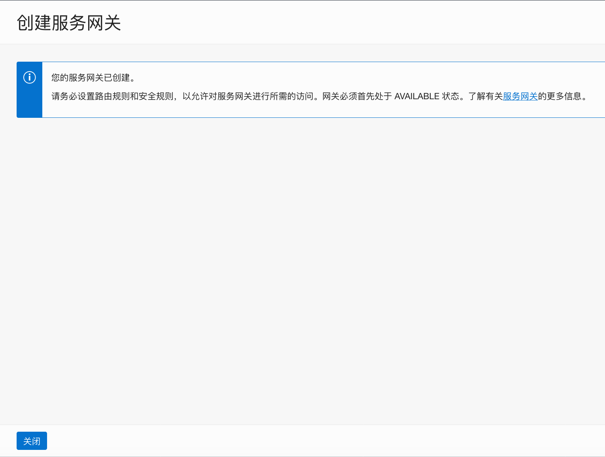

7. 在**资源**下，选择**路由表**，点击前面为私有子网创建的路由表：private-routetable。

    

8. 点击**添加路由规则**。

    

9. 选择**目标类型**为NAT网关。我们要设置私有网络的实例可以通过NAT网关访问任意的Internet地址，因此输入**目的地CIDR块**为：0.0.0.0/0，**目标NAT网关**选择为之前创建的网关：nat-gateway。点击**添加路由规则**。

    

10. NAT网关的路由规则添加成功。下面将添加服务网关的路由规则，点击**添加路由规则**。

    

11. 选择**目标类型**为服务网关。我们要设置私有子网的实例能访问该区域的所有公共服务，因此选择**目的地服务**为ALL Services。**目标服务网关**为之前创建的服务网关：service-gateway。点击**添加路由规则**。

    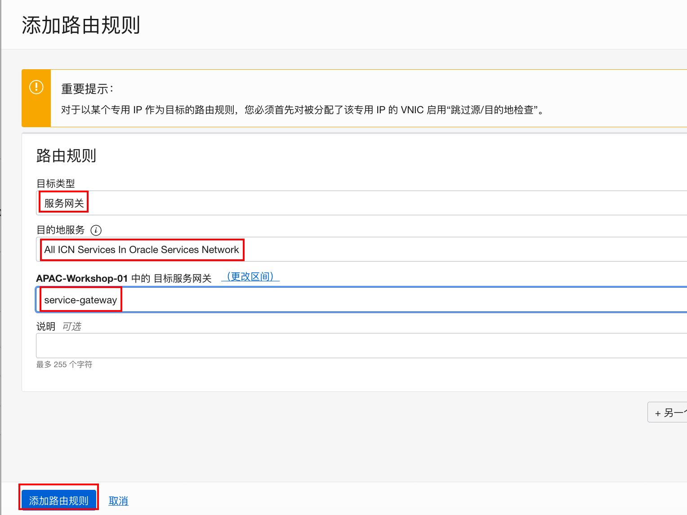

12. 服务网关的路由规则创建成功。

    

VCN的设置完成，你可以继续进行下面的实验。