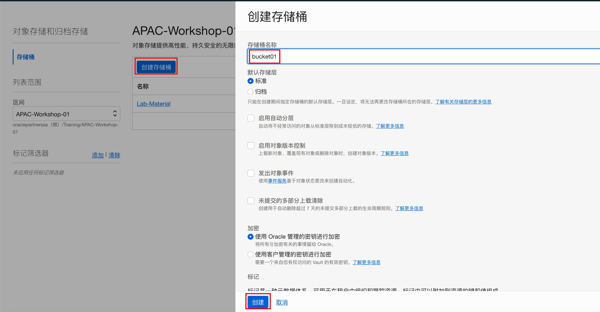
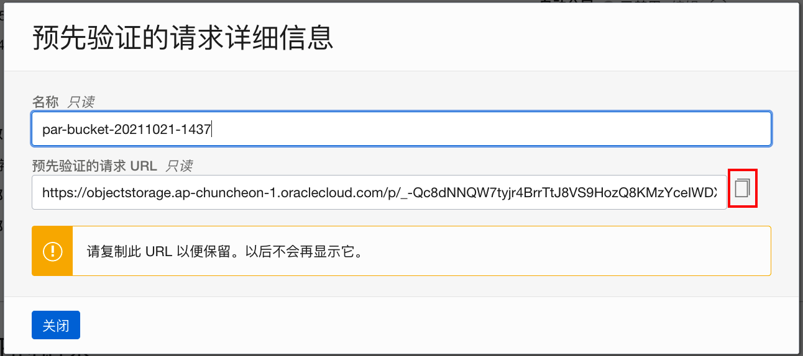
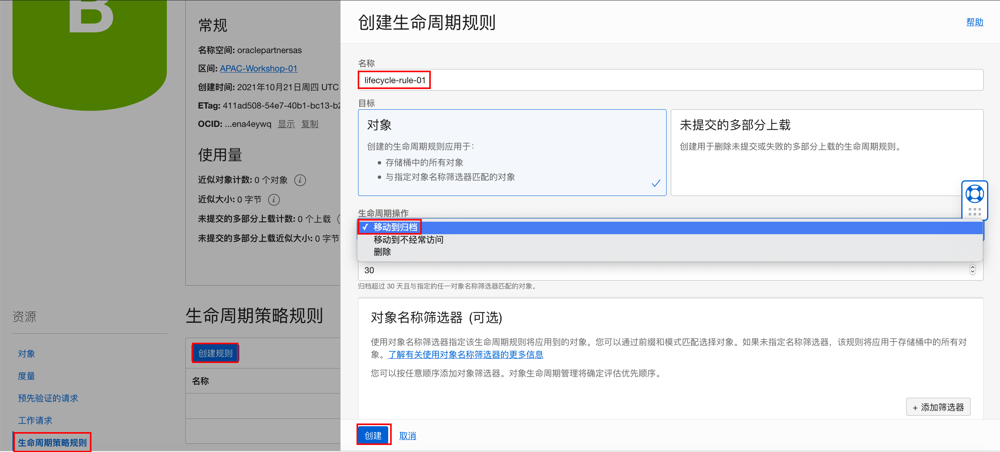
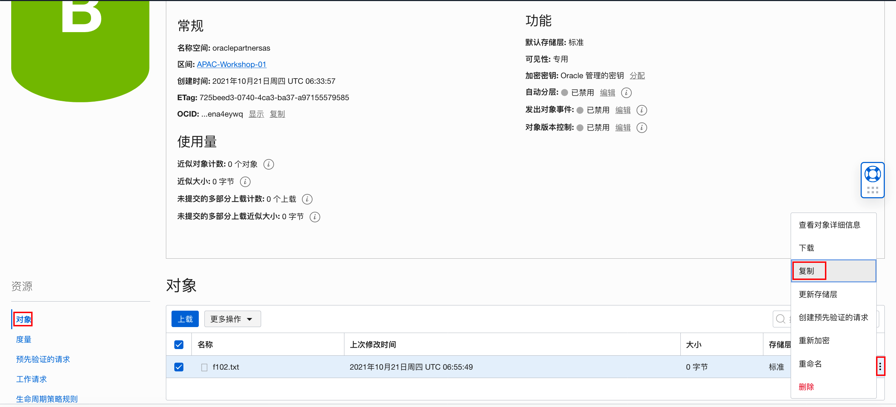
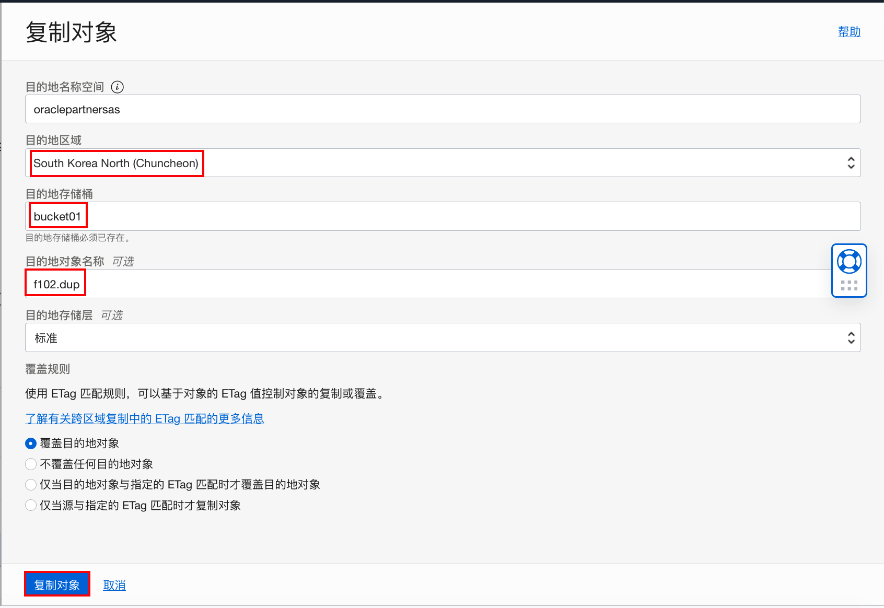
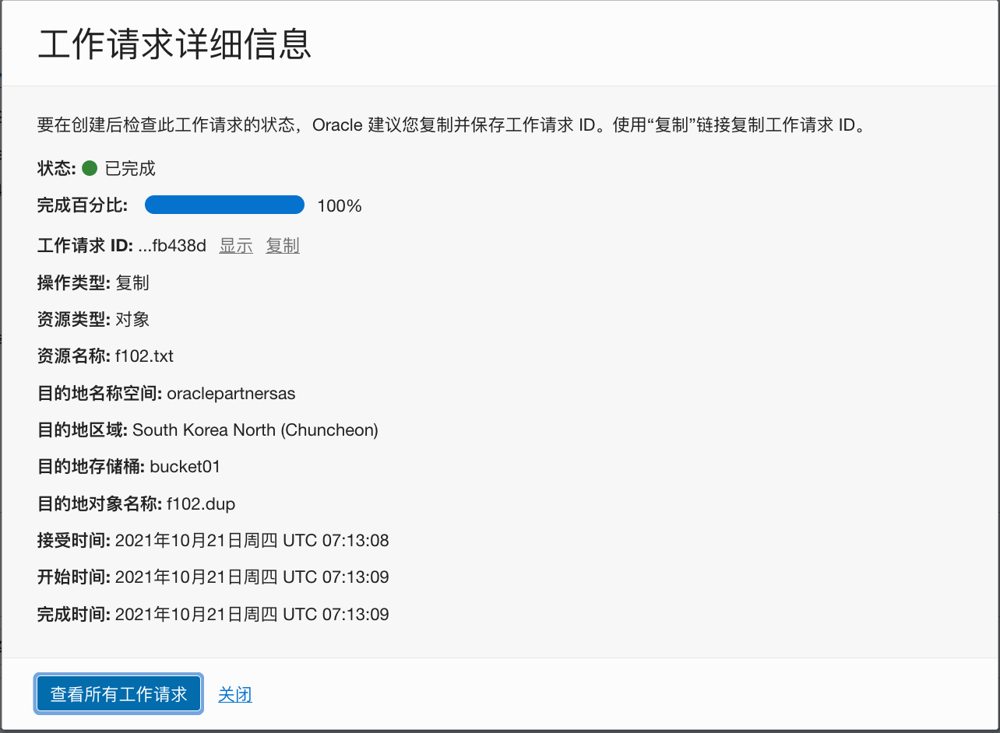

# 对象存储服务

## 概览

**甲骨文云基础设施 - 对象存储服务**是一个互联网规模的高性能存储平台，提供可靠且具有成本效益的数据持久性。**对象存储服务**可以存储无限大小的任意内容类型的非结构化数据，包括分析数据和富内容数据，例如图像和视频。

使用**对象存储**，您可以直接从Internet或从云平台，安全地存储或检索数据。对象存储提供了多个管理界面，使您可以轻松地管理大规模存储。平台的弹性使您可以在不影响性能和可靠性的情况下无缝扩展存储。

**对象存储**是区域级服务，不与任何特定的计算实例绑定。只要您具有Internet连接并且可以访问对象存储端点之一，就可以从**甲骨文云云基础设施**上下文内部或外部的任何位置访问数据。

**对象存储**还支持通过服务网关从甲骨文云基础设施的VCN中进行私有访问。服务网关允许从私有子网中的私有IP地址连接到对象存储公共端点。例如，您可以通过Oracle Cloud Infrastructure内部网络而不是通过Internet将数据库系统备份到对象存储桶。您可以选择使用IAM策略来控制哪些VCN或IP地址范围可以访问对象存储。

**甲骨文云基础设施-对象存储服务** 提供了两个不同的存储类层，可以满足对高性能，频繁访问的“热”存储和不太频繁访问的“冷”存储的需求。 存储层可帮助您在适当的情况下最大限度地提高性能，并在可能的情况下将成本降至最低。

- **标准存储**用于需要快速，立即和频繁访问的数据。 标准存储保证了数据的可访问性和访问性能，但因此价格也相对较高。
- **存档存储**用于存储很少访问但必须长时间保留的数据。 存档存储价格更低，同时访问数据所需较长交付时间。


### 先决条件

- Oracle Cloud Infrastructure帐户凭据（用户，密码和租户）

- 要登录控制台，您需要满足以下条件：

  - 租户，用户名和密码


**注意：** *某些UI可能与说明中包含的屏幕截图有些许不同，但是您仍然可以使用本说明来完成动手实验。*


## 1：使用OCI控制台使用对象存储服务

1. 从浏览器打开OCI控制台界面，输入正确的租户名、用户名和密码登录OCI控制台。从左侧菜单中选择 **对象存储-对象存储**


2.  在左侧下拉菜单选择**Compartment**，点击 **创建存储桶** 按钮， 输入**存储桶名称**，如：bucket01，其它均为缺省值，点击**创建**。



3. 创建完成后，在列表上点击存储桶名称，进入**存储桶详细信息**界面。点击 **上载** 按钮，根据页面提示，可以将文件上传到存储桶中。


4. 在对象列表中勾选要操作的对象，使用 **更多操作** 菜单， 可以**刷新**或**删除**存储桶中的对象。


## 2：使用预先验证请求上传对象

该步骤如果本地机器没有curl命令工具，可以先连接到虚拟计算节点，再进行下面的步骤。


1. 在 **存储桶详细信息** 界面，从左侧 **资源** 栏点击**预先验证的请求**， 点击 **创建预先验证的请求** 按钮，选择**访问类型**为**允许对象读写**。其它所有选项均为缺省设置，点击**创建预先验证的请求** 。


2. 复制预先验证的请求URL，然后点击**关闭**。注意，关闭后该URL不再显示。

    

3. 在本地打开命令行终端，或者连接到虚拟主机。使用如下格式上传对象到存储桶

```shell
$ curl -X PUT --data-binary '@<local-filename>' <unique-PAR-URL>/remote-filename
```

注意，PAR-URL后面需要有远程的文件名。例如：

```shell
[opc@compute01 ~]$ touch f102.txt
[opc@compute01 ~]$ curl -X PUT --data-binary '@f102.txt' https://objectstorage.ap-chuncheon-1.oraclecloud.com/p/IfMtmM4wFmXQVs-751u7QHCnTE6Z85GTg1_10jPfJir3fMqnAOettIqjtNnwKx1Y/n/oraclepartnersas/b/bucket01/o/f102.txt
[opc@compute01 ~]$ 
```


4. 打开 **资源** 栏下的 **对象** 列表，查看上传到对象存储桶中的对象


## 3：生命周期策略

1. 在对象**存储服务** - 存储桶详细信息页面左侧的**资源**栏点击 **生命周期策略规则** 按钮，点击 **创建规则** 按钮创建生命周期规则。



2. 根据向导提示，**生命周期规则**将符合筛选条件的对象，达到指定天数后，移动到归档，或从存储桶中删除。 配置好以后，点击**创建**按钮完成规则创建。


## 4：对象复制

1. 范围和限制

- 无法从归档存储桶中直接复制对象，但可以从标准存储将对象复制到归档存储桶。
- 源存储桶和目标存储桶都必须提前创建，复制操作不会自动创建存储桶
- 对象被复制到目标存储桶后，会自动分配新的ETag
- 如果复制操作过程中，源存储桶进行了重命名、覆盖或者删除对象操作，将导致复制失败。
- 复制操作目前近支持单个对象，不持支批量操作。

2. 从对象存储-**存储桶详细信息**页面对象列表中，选择想要复制的对象，打开右侧**操作**按钮（三个点）打开菜单，选择**复制**，打开复制对象配置页面

    

3. 根据向导，填写目标对象存储服务的 **命名空间**、**区域**、**目标存储桶名称**、**目标对象名称** 参数。在本练习中，如果没有其它的目标存储桶，可以选择自己的同一个存储桶进行复制。点击**复制对象**按钮开始复制。



3. 根据向导，填写目标对象存储服务的 **命名空间**、**区域**、**目标存储桶名称**、**目标对象名称** 参数，并选择ETag匹配规则。点击**复制对象**按钮开始复制。



4. 打开目标存储桶，查看对象是否被成功复制


