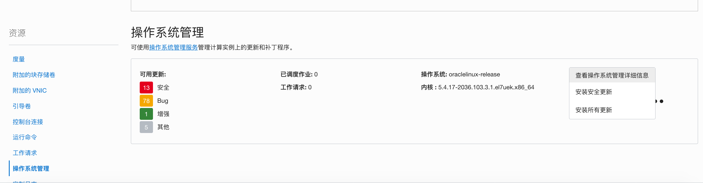

# 利用OCI操作系统管理服务(OS Management)简化操作系统更新和补丁程序

## 简介
企业应用上云，安全问题是首要考虑的因素之一。Oracle在OCI公有云上提供了全方位、多层次的安全保护机制。但是对于云上的应用安全，企业与Oracle有不同的安全责任范畴，需要企业与Oracle共同承担安全责任。


例如，在OCI上创建的计算实例，如果操作系统不是选择的Oracle自治Linux，则操作系统的更新和补丁需要客户自己来进行维护。但是不少客户会忽略定期更新系统包和补丁，特别是安全漏洞补丁，这将会使实例受到黑客攻击的风险，造成数据泄露，客户端响应变慢，企业应用失效等等不良后果。

没有经验的客户在管理操作系统软件包和补丁程序时，会遇到不少问题，如：更新软件包的查找，安装程序源的配置，安装包之间的依赖等等。

OCI 提供的操作系统管理服务(OS Management)可以让客户在OCI实例上管理操作系统环境的更新和补丁程序，客户可以通过浏览器或者API来管理更新和补丁，简化更新和补丁流程。

###操作系统管理服务支持的映像

Linux:

- Oracle Linux 6 及以上版本
- Oracle Linux 7 及以上版本
- Oracle Linux 8 及以上版本

Windows:

- Windows Server 2012 R2 Standard, Datacenter
- Windows Server 2016 Standard, Datacenter
- Windows Server 2019 Standard, Datacenter

本文将会以Oracle Linux虚拟机计算实例为例，简述OS管理服务的配置步骤。

### 先决条件

- 计算实例必须是支持的映像。
- 服务网关或公共IP地址：您的实例必须连接到具有以下其中一项的虚拟云网络（VCN）：
   - 具有服务网关的私有子网，该子网使用具有Oracle Services Network CIDR标签的所有区域服务。
   - 具有NAT网关的私有子网。
   - 具有Internet网关的公共子网。
- 安全列表（仅Windows实例）：必须定义安全列表或网络规则，以允许访问Windows更新服务器。
- 获取目标实例和区间的OCID。


## 步骤一：安装Oracle Cloud Agent

默认情况下，在当前Oracle提供的映像上都会安装Oracle Cloud Agent。 如果是旧映像需要手动安装Oracle Cloud Agent。

1. 进入你想管理的计算实例详细信息页面，点击**Oracle Cloud Agent**标签页。如果Oracle Cloud Agent没有安装或版本不是最新的，则需要手工进行安装。（**注意**：新建的计算实例需要稍等几分钟才能看到Agent的启动状态）。

   

2. 以opc用户连接到计算实例，运行下面的命令来判断Oracle Cloud Agent软件是否已经安装。（如果不是新版本，该命令也会自动更新Agent软件。）

   ```
   sudo yum info oracle-cloud-agent
   ```

   

3. 如果没有安装或安装的版本不是最新的，可以运行下面的命令来安装。

   ```
   sudo yum install -y oracle-cloud-agent
   ```

   

4. 从OCI控制面板，再次进入计算实例详细信息，查看**Oracle Cloud Agent**标签页，可以看到最新版本的Agent插件已经启动。这些插件是用来监控计算实例性能，收集日志信息，漏洞扫描等等。本文中我们只用查看OS Management Service Agent插件是否正常启动。你可以切换启用或禁用开关来管理插件。

   

   

## 步骤二：为操作系统管理服务设置策略

1. 创建一个动态组，其中包含要由OS Management Service管理的实例集。例如：

   - 名称：osm-group
   - 说明：Dynamic group for OS Management
   - 匹配规则：```Any {instance.id = 'ocid1.instance.oc1.iad..exampleuniqueid1',  instance.compartment.id = 'ocid1.compartment.oc1..exampleuniqueid2'}```，替换为你的目标实例id和区间id。如果你有更多的实例，你可以增加匹配规则。

   

2. 创建一个策略，授予实例访问操作系统管理服务的权限，同时授予该动态组权限检索实例详细信息的权限。

   - `Allow service osms to read instances in tenancy`
   - `ALLOW dynamic-group <dynamic_group_name> to use osms-managed-instances in compartment <compartment_name>`
   - `ALLOW dynamic-group <dynamic_group_name> to read instance-family in compartment <compartment_name>`

   

3. 用opc用户ssh连接到虚机实例，重新启动Oracle Cloud Agent。

   ```
   sudo systemctl restart oracle-cloud-agent.service
   ```

   

4. 运行下面的命令来验证您的实例是否可以访问OS Management提取服务(ingestion service)。将`<region>`替换为实例所在的区域，如：ap-seoul-1。

   ```
   curl https://ingestion.osms.<region>.oci.oraclecloud.com/
   ```

   下面的结果表明该实例可以成功到达OS Management提取服务。(注：输出中包含403 Forbidden是正常的。)

   ```
   <html>
   <head><title>403 Forbidden</title></head>
   <body>
   <center><h1>403 Forbidden</h1></center>
   <hr><center>nginx/1.16.1</center>
   </body>
   </html>
   ```

   

5. 验证yum配置。

   ```
   $ ls /etc/yum.repos.d
   ```

   确定`/etc/yum.repos.d`目录中的`*.repo`文件都备份到同一目录中的`*.repo.osms-backup`。如果没有，等待几分钟后再次查看，直到备份完成。

   ```
   ksplice-ol7.repo.osms-backup       oracle-softwarecollection-ol7.repo.osms-backup
   mysql-ol7.repo.osms-backup         oraclelinux-developer-ol7.repo.osms-backup
   oci-included-ol7.repo.osms-backup  uek-ol7.repo.osms-backup
   oracle-epel-ol7.repo.osms-backup   virt-ol7.repo.osms-backup
   oracle-linux-ol7.repo.osms-backup
   ```

   

6. 验证OS Management Service代理插件是否正在实例上运行。

   ```
   $ ps -elf | grep osms | grep -v grep
   4 S root     20811 20791  0  80   0 - 62265 -      11:22 ?        00:00:00 /usr/bin/sudo -n /usr/libexec/oracle-cloud-agent/plugins/osms/osms-agent
   4 S root     20813 20811  0  80   0 -  2163 -      11:22 ?        00:00:00 /usr/libexec/oracle-cloud-agent/plugins/osms/osms-agent
   4 S root     20814 20813  0  80   0 - 322898 -     11:22 ?        00:00:02 /usr/libexec/oracle-cloud-agent/plugins/osms/osms-agent
   ```

   OS Management Service Agent插件正常运行后，您已完成用于设置托管实例的任务。 现在，您可以使用OS Management服务来管理实例。

   

## 步骤三：管理Linux软件包

下面将介绍如何由OS Management Service管理Linux实例的软件包。

1. 从OCI控制台进入计算**实例详细信息**的页面，在**资源**下点击**操作系统管理**。可以看到该实例可用的操作系统更新，其中包含：

   - 安全：解决了在开发、测试期间或用户报告发现的安全漏洞的更新。 安全修补程序通常具有一个或多个关联的CVE（常见漏洞和披露）名称，用来标识漏洞。
   - Bug：此更新程序修复了用户报告的问题或在开发或测试过程中发现的问题。
   - 增强：该更新在软件包的软件中引入了新特性，改进的功能或增强的性能。
   - 其他：该更新未归类。

   

2. 点击右边菜单，可以看到有**安装安全更新**或者**安装所有更新选项**，你可以在这里进行更新的安装。本例中我们选择**查看操作系统管理详细信息**。

   

3. 在详细信息页面可以查看可用的更新包，你可以选择某个或多个更新包，点击**安装更新**按钮。

   

4. 你可以选择**立即安装**，也可以选择**定制计划**，在未来某个时间点启动安装任务。点击**安装程序包更新**按钮。

   

5. 你可以看到正在进行程序包更新的工作请求。点击正在进行的工作链接。

   

6. 你可以查看工作请求的详细信息。

   

7. 等待一段时间，任务完成，图标变绿，更新成功。

   

   

   


## 参考文档

[OS Management Services](https://docs.oracle.com/en-us/iaas/os-management/osms/index.htm)

