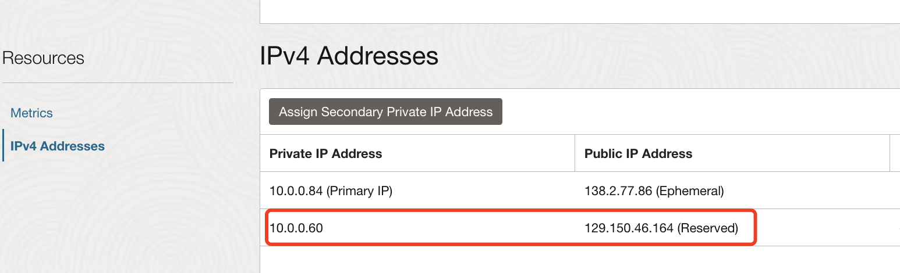

# How to add secondary IP to the VM in OCI


本文[该参考文档](https://docs.oracle.com/en-us/iaas/Content/Network/Tasks/managingIPaddresses.htm#Linux)添加第二个IP，如果是添加第二块VNIC，[参见文档](https://docs.oracle.com/en-us/iaas/Content/Network/Tasks/managingVNICs.htm#Linux)

1. 在OCI Console中添加Secondary Private IP后，这时在VM中并没有起效

    

2. 

3. 运行下列命令，这时只能看到一个IP。

    ```
    $ ip addr
    1: lo: <LOOPBACK,UP,LOWER_UP> mtu 65536 qdisc noqueue state UNKNOWN group default qlen 1000
        link/loopback 00:00:00:00:00:00 brd 00:00:00:00:00:00
        inet 127.0.0.1/8 scope host lo
           valid_lft forever preferred_lft forever
        inet6 ::1/128 scope host 
           valid_lft forever preferred_lft forever
    2: ens3: <BROADCAST,MULTICAST,UP,LOWER_UP> mtu 9000 qdisc pfifo_fast state UP group default qlen 1000
        link/ether 02:00:17:01:eb:13 brd ff:ff:ff:ff:ff:ff
        inet 10.0.0.84/24 brd 10.0.0.255 scope global dynamic ens3
           valid_lft 86116sec preferred_lft 86116sec
        inet6 fe80::17ff:fe01:eb13/64 scope link noprefixroute 
           valid_lft forever preferred_lft forever
    ```

    

4. 运行下列命令添加第二个ip。

    ```
    sudo ip addr add 10.0.0.60/24 dev ens3 label ens3:1
    ```

    

5. 要使该配置在VM重启后有效，需要新建一个文件

    ```
    sudo vi /etc/sysconfig/network-scripts/ifcfg-ens3:1
    ```

    添加内容：

    ```
    DEVICE="ens3:1"
    BOOTPROTO=static
    IPADDR=10.0.0.60
    NETMASK=255.255.255.0
    ONBOOT=yes
    ```

    

6. 这时可以看到第二个IP已经添加进来了：

    ```
    $ ip addr
    1: lo: <LOOPBACK,UP,LOWER_UP> mtu 65536 qdisc noqueue state UNKNOWN group default qlen 1000
        link/loopback 00:00:00:00:00:00 brd 00:00:00:00:00:00
        inet 127.0.0.1/8 scope host lo
           valid_lft forever preferred_lft forever
        inet6 ::1/128 scope host 
           valid_lft forever preferred_lft forever
    2: ens3: <BROADCAST,MULTICAST,UP,LOWER_UP> mtu 9000 qdisc pfifo_fast state UP group default qlen 1000
        link/ether 02:00:17:01:eb:13 brd ff:ff:ff:ff:ff:ff
        inet 10.0.0.84/24 brd 10.0.0.255 scope global dynamic ens3
           valid_lft 85576sec preferred_lft 85576sec
        inet 10.0.0.60/32 scope global ens3
           valid_lft forever preferred_lft forever
        inet6 fe80::17ff:fe01:eb13/64 scope link noprefixroute 
           valid_lft forever preferred_lft forever
    ```

    

7. 可以试试ping第二个IP