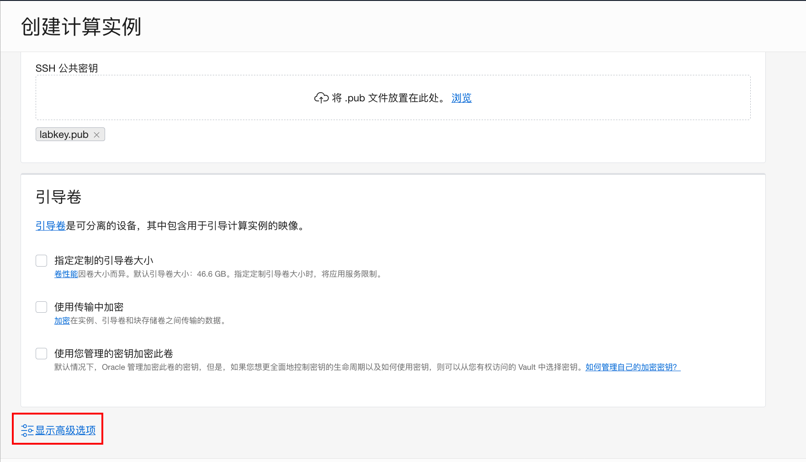
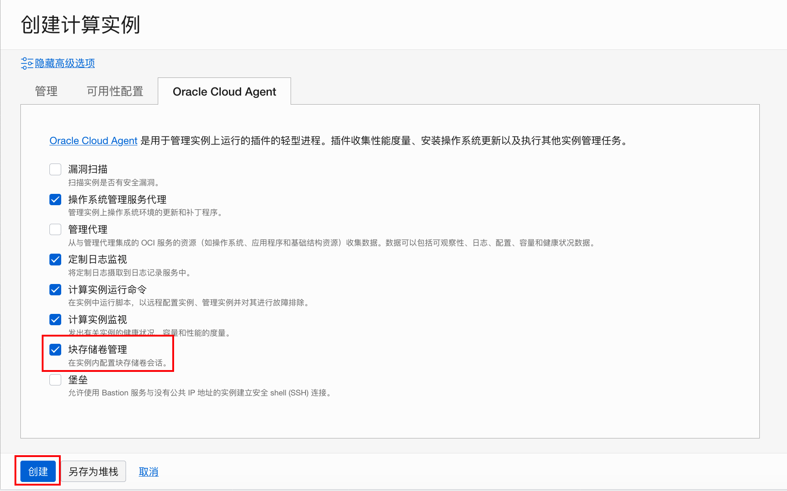
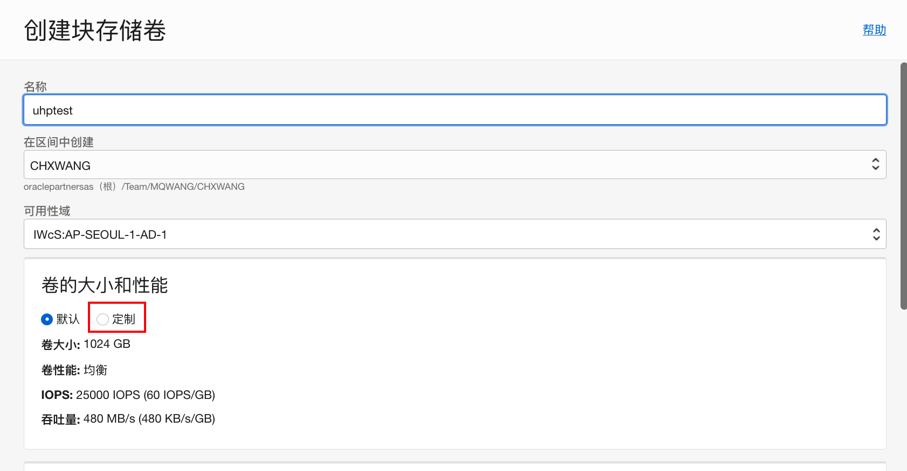
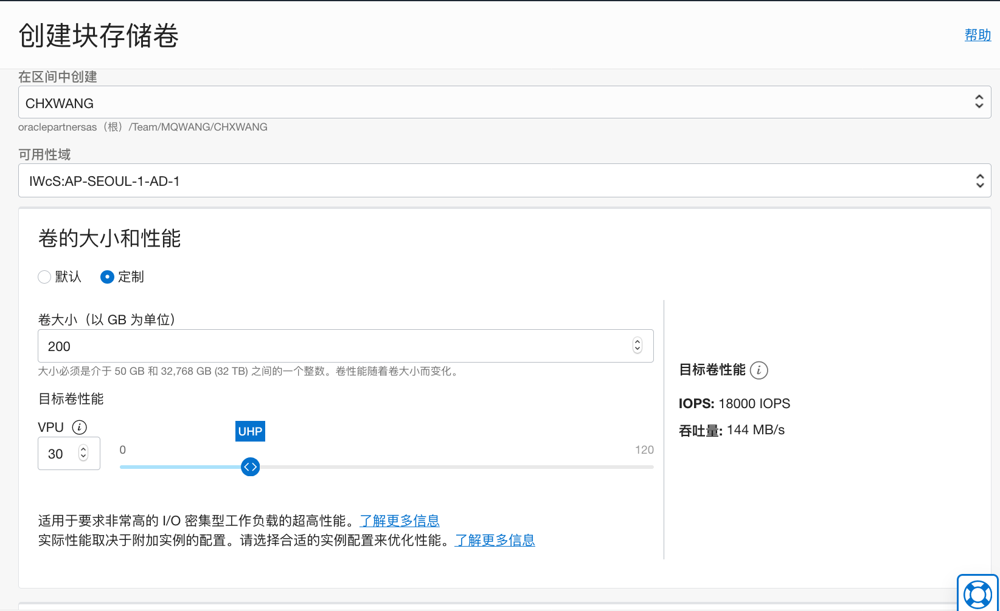
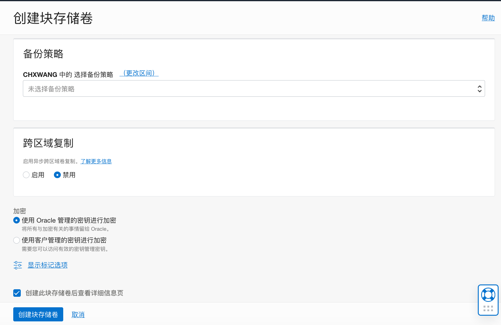
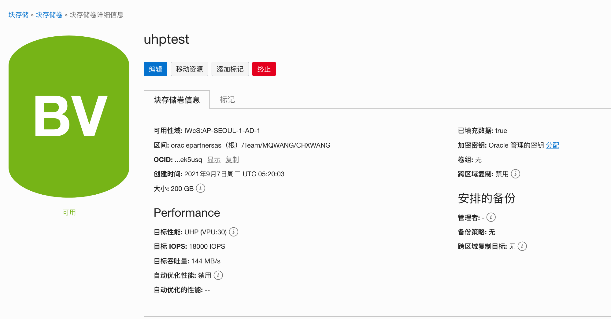
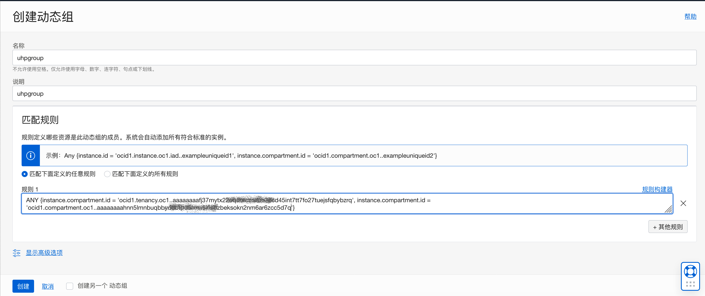
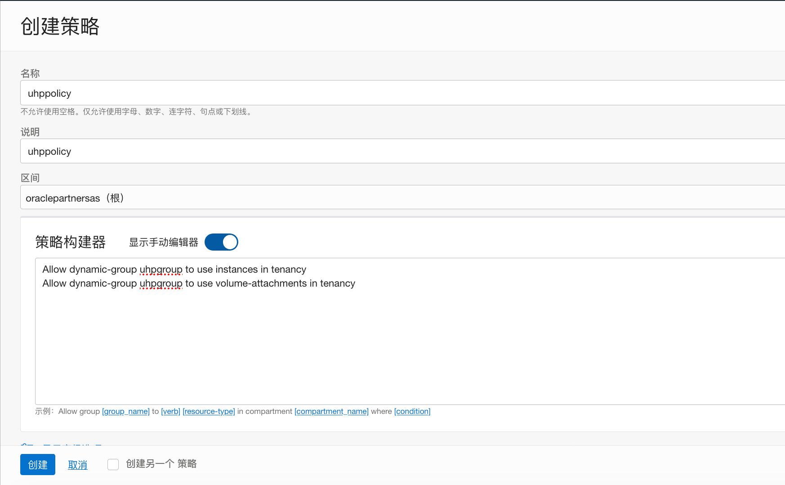
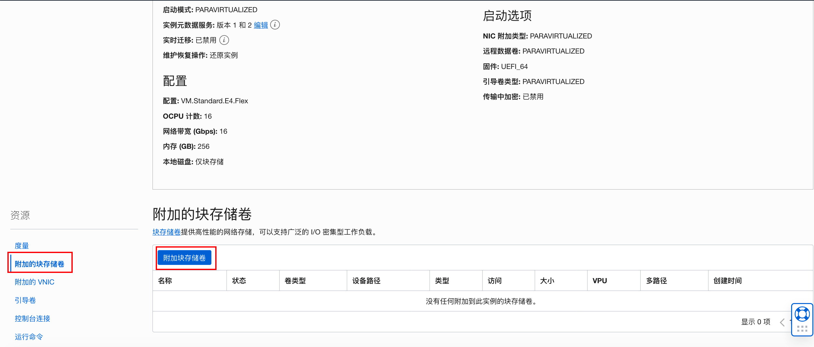
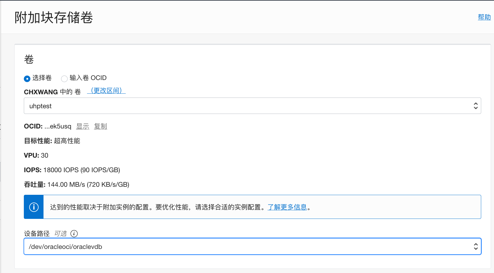

# 如何在计算实例上附加超高性能块存储

## 简介
Oracle OCI块存储卷服务让您可以动态地供应和管理块存储卷。 您可以根据需要创建、附加、连接和移动卷，以及更改卷性能，以满足您的存储、性能和应用程序要求。 将存储卷附加并连接到实例后，您可以像使用普通硬盘驱动器一样使用该卷。 您还可以断开卷并将其附加到另一个实例而不会丢失数据。

创建卷时，可以选择性能级别。 您还可以更改现有卷的性能级别。块存储卷性能包括卷性能单元 (**VPU**) 的概念。 您可以购买更多 VPU 来为卷分配更多资源，从而提高 IOPS/GB 和每 GB 吞吐量。 您还可以灵活地购买更少的 VPU，这会降低存储卷的性能特征，但也可以节省成本。 您还可以选择不购买任何 VPU，这可以为不需要增加性能特征的存储卷节省大量成本。

目前支持的性能级别：

- **超高性能**：用于具有最高 I/O 要求、需要最佳性能的工作负载。 使用此选项，您需要每 GB/月购买 30 – 120 个 VPU。 
- **高性能**：用于不需要超高性能级别性能的具有高 I/O 要求的工作负载。 使用此选项，您需要每 GB/月购买 20 个 VPU。
- **平衡**：块存储和引导卷的默认性能级别，并为大多数工作负载提供了性能和成本节约之间的良好平衡。 使用此选项，您需要每 GB/月购买 10 个 VPU。
- **低成本**：用于具有大量顺序 I/O 的吞吐量密集型工作负载，例如流、日志处理和数据仓库。 成本只是存储成本，没有额外的VPU成本。 此选项仅适用于块卷，不适用于引导卷。

使用超高性能块存储和其它性能块存储时有一些不同的地方，当您附加超高性能级别的存储卷时，存储卷附加必须启用多路径以优化卷的性能。 块存储卷服务尝试在连接过程中将连接配置为启用多路径。因此需要有以下的先决条件和注意事项：

- 支持的计算实例类型：
    - 虚拟机型：当前16 核以上VM机型支持启用多路径的附加块存储。支持iSCSI和半虚拟化连接。
    - 裸金属机型：所有当前的裸金属机型都支持启用多路径的 iSCSI 连接。不支持半虚拟化连接。
- 支持的操作系统镜像：支持Oracle Linux或者基于Oracle Linux的自定义镜像。不支持Windows。
- 一个实例只支持一个多路径块存储的附加。
- 该计算实例需要启用块存储卷管理插件。
- 该计算实例必须具有公共 IP 地址或服务网关，以便 Block Volume Management 插件能够连接到 Oracle 服务。
- 必须配置权限以允许块卷管理插件报告启用多路径的 iSCSI 附件的 iSCSI 设置结果：需要创建动态组，并为改组分配权限。
- 存储卷附加必须配置为使用一致的设备路径。如：`/dev/oracleoci/oraclevdb`。

下面是具体的步骤举例：

## **Step 1:** 创建虚机计算实例

1. 在创建虚机计算实例时，操作系统映像接受缺省的Oracle Linux 7.9。

2. 选择大于16核的机型。如下图我们选择16OCPU的E4.Flex机型。

    

3. VCN网络选择public子网。

    

4. 上传SSH公钥密码后，选择**显示高级选项**。

    

5. 在高级选项中点击**Oracle Cloud Agent**。

    

6. 勾选**块存储卷管理**，再点击**创建**。

    

    

7. 稍等片刻，虚机计算实例创建完成。

## **Step 2:** 创建超高性能块存储

1. 在创建块存储卷的页面中选择**定制**卷的大小和性能。

    

2. 输入卷大小（50G - 32T）和目标卷性能（VPU 30-120），如： 200G，30VPU。可以看到当前的目标卷性能为 - IOPS：18000 IOPS，吞吐量：144MB/s。

    

3. 点击**创建块存储卷**。

    

4. 块存储卷创建完成。

    

    

## **Step 3:** 配置权限

1. 创建一个动态组，命名为uhpgroup。加入如下规则：

    ```
    ANY {instance.compartment.id = 'ocid1.tenancy.oc1..<tenancy_ID>', instance.compartment.id = 'ocid1.compartment.oc1..<compartment_OCID>'}
    ```

    

2. 在根区间创建一个策略，加入如下策略：

    ```
    Allow dynamic-group uhpgroup to use instances in tenancy
    Allow dynamic-group uhpgroup to use volume-attachments in tenancy
    ```

    

    


## **Step 4:** 在计算实例上附加超高性能块存储卷

1. 在计算实例详细信息页面，在**资源**下选择**附加的块存储卷**，点击**附加块存储卷**。

    

2. 选择在之前创建的超高性能卷，如：uhptest。选择**设备路径**，如：`/dev/oracleoci/oraclevdb`。

    

3. 选择附加类型，如：ISCSI。选择访问方式，如：读/写。点击**附加**。

    

4. 点击**关闭**，关闭提示信息。

    

5. 附加完成后，点击最右的操作菜单，可以看到超高性能存储卷不需要执行单独的iSCSI命令。

    

    


## **Step 5:** 使用超高性能存储卷

1. ssh连接到虚机，创建磁盘分区。

    ```
    [opc@uhptest ~]$ sudo fdisk /dev/oracleoci/oraclevdb
    
    The device presents a logical sector size that is smaller than
    the physical sector size. Aligning to a physical sector (or optimal
    I/O) size boundary is recommended, or performance may be impacted.
    Welcome to fdisk (util-linux 2.23.2).
    
    Changes will remain in memory only, until you decide to write them.
    Be careful before using the write command.
    
    
    Command (m for help): n
    Partition type:
       p   primary (0 primary, 0 extended, 4 free)
       e   extended
    Select (default p): 
    Using default response p
    Partition number (1-4, default 1): 
    First sector (2048-419430399, default 2048): 
    Using default value 2048
    Last sector, +sectors or +size{K,M,G} (2048-419430399, default 419430399): 
    Using default value 419430399
    Partition 1 of type Linux and of size 200 GiB is set
    
    Command (m for help): p
    
    Disk /dev/oracleoci/oraclevdb: 214.7 GB, 214748364800 bytes, 419430400 sectors
    Units = sectors of 1 * 512 = 512 bytes
    Sector size (logical/physical): 512 bytes / 4096 bytes
    I/O size (minimum/optimal): 4096 bytes / 1048576 bytes
    Disk label type: dos
    Disk identifier: 0xa49822d3
    
                       Device Boot      Start         End      Blocks   Id  System
    /dev/oracleoci/oraclevdb1            2048   419430399   209714176   83  Linux
    
    Command (m for help): w
    The partition table has been altered!
    
    Calling ioctl() to re-read partition table.
    
    WARNING: Re-reading the partition table failed with error 22: Invalid argument.
    The kernel still uses the old table. The new table will be used at
    the next reboot or after you run partprobe(8) or kpartx(8)
    Syncing disks.
    [opc@uhptest ~]$
    ```

    

2. 创建文件系统。

    ```
    [opc@uhptest ~]$ sudo mkfs.ext4 /dev/oracleoci/oraclevdb
    mke2fs 1.45.4 (23-Sep-2019)
    Found a dos partition table in /dev/oracleoci/oraclevdb
    Proceed anyway? (y,N) y
    Creating filesystem with 52428800 4k blocks and 13107200 inodes
    Filesystem UUID: 42b5eced-ddfe-4a7d-b05c-e92ac413a397
    Superblock backups stored on blocks: 
    	32768, 98304, 163840, 229376, 294912, 819200, 884736, 1605632, 2654208, 
    	4096000, 7962624, 11239424, 20480000, 23887872
    
    Allocating group tables: done                            
    Writing inode tables: done                            
    Creating journal (262144 blocks): done
    Writing superblocks and filesystem accounting information: done     
    
    [opc@uhptest ~]$
    ```

    

3. 创建`/data`目录，mount到`/data`。

    ```
    [opc@uhptest ~]$ sudo mkdir /data
    [opc@uhptest ~]$ sudo mount /dev/oracleoci/oraclevdb /data
    [opc@uhptest ~]$ sudo chmod 777 /data
    ```

    

4. （可选）如果要在虚机重启后自动mount，需要修改/etc/fstab表。首先需要获取设备的UUID。

    ```
    [opc@uhptest data]$ sudo blkid /dev/oracleoci/oraclevdb
    /dev/oracleoci/oraclevdb: UUID="42b5eced-ddfe-4a7d-b05c-e92ac413a397" TYPE="ext4" 
    ```

    在/etc/fstab表中加入:

    ```
    UUID=<Volume_UUID> /data ext4 defaults,_netdev,noatime 0 2
    ```

    

5. 安装测试工具。

    ```
    [opc@uhptest data]$ sudo yum install fio
    ```

    

6. 测试IOPS，随机读写：

    ```
    [opc@uhptest ~]$ sudo fio -filename=/dev/mapper/mpatha -direct=1 -iodepth 1 -thread -rw=randrw -rwmixread=50 -ioengine=psync -bs=4k -size=5G -numjobs=14 -runtime=60 -group_reporting -name=mytest -allow_mounted_write=1
    mytest: (g=0): rw=randrw, bs=(R) 4096B-4096B, (W) 4096B-4096B, (T) 4096B-4096B, ioengine=psync, iodepth=1
    ...
    fio-3.7
    Starting 14 threads
    Jobs: 14 (f=14): [m(14)][100.0%][r=34.5MiB/s,w=34.4MiB/s][r=8835,w=8803 IOPS][eta 00m:00s]
    mytest: (groupid=0, jobs=14): err= 0: pid=20269: Tue Sep  7 09:33:00 2021
       read: IOPS=9114, BW=35.6MiB/s (37.3MB/s)(2136MiB/60007msec)
        clat (usec): min=228, max=16320, avg=757.68, stdev=1672.58
         lat (usec): min=228, max=16320, avg=757.83, stdev=1672.58
        clat percentiles (usec):
         |  1.00th=[  260],  5.00th=[  273], 10.00th=[  281], 20.00th=[  293],
         | 30.00th=[  302], 40.00th=[  314], 50.00th=[  330], 60.00th=[  351],
         | 70.00th=[  375], 80.00th=[  404], 90.00th=[  486], 95.00th=[ 5211],
         | 99.00th=[ 8979], 99.50th=[ 9634], 99.90th=[10683], 99.95th=[11076],
         | 99.99th=[11863]
       bw (  KiB/s): min= 1744, max= 5344, per=7.14%, avg=2604.63, stdev=456.07, samples=1674
       iops        : min=  436, max= 1336, avg=651.11, stdev=114.01, samples=1674
      write: IOPS=9106, BW=35.6MiB/s (37.3MB/s)(2135MiB/60007msec)
        clat (usec): min=263, max=13772, avg=775.80, stdev=1668.06
         lat (usec): min=263, max=13772, avg=776.08, stdev=1668.06
        clat percentiles (usec):
         |  1.00th=[  302],  5.00th=[  314], 10.00th=[  322], 20.00th=[  330],
         | 30.00th=[  338], 40.00th=[  347], 50.00th=[  359], 60.00th=[  367],
         | 70.00th=[  383], 80.00th=[  404], 90.00th=[  474], 95.00th=[ 5211],
         | 99.00th=[ 8979], 99.50th=[ 9634], 99.90th=[10683], 99.95th=[11076],
         | 99.99th=[11863]
       bw (  KiB/s): min= 1768, max= 5429, per=7.14%, avg=2602.30, stdev=459.51, samples=1674
       iops        : min=  442, max= 1357, avg=650.52, stdev=114.87, samples=1674
      lat (usec)   : 250=0.10%, 500=90.64%, 750=2.38%, 1000=0.38%
      lat (msec)   : 2=0.36%, 4=0.54%, 10=5.30%, 20=0.30%
      cpu          : usr=0.64%, sys=1.58%, ctx=1093600, majf=0, minf=0
      IO depths    : 1=100.0%, 2=0.0%, 4=0.0%, 8=0.0%, 16=0.0%, 32=0.0%, >=64=0.0%
         submit    : 0=0.0%, 4=100.0%, 8=0.0%, 16=0.0%, 32=0.0%, 64=0.0%, >=64=0.0%
         complete  : 0=0.0%, 4=100.0%, 8=0.0%, 16=0.0%, 32=0.0%, 64=0.0%, >=64=0.0%
         issued rwts: total=546935,546483,0,0 short=0,0,0,0 dropped=0,0,0,0
         latency   : target=0, window=0, percentile=100.00%, depth=1
    
    Run status group 0 (all jobs):
       READ: bw=35.6MiB/s (37.3MB/s), 35.6MiB/s-35.6MiB/s (37.3MB/s-37.3MB/s), io=2136MiB (2240MB), run=60007-60007msec
      WRITE: bw=35.6MiB/s (37.3MB/s), 35.6MiB/s-35.6MiB/s (37.3MB/s-37.3MB/s), io=2135MiB (2238MB), run=60007-60007msec
    [opc@uhptest ~]$ 
    ```

    可以看到总的IOPS=读IOPS:9114+写IOPS:9106=18220，符合预期。

7. 测试随机读：IOPS:18.2k

    ```
    [opc@uhptest ~]$ sudo fio -filename=/dev/mapper/mpatha -direct=1 -iodepth 1 -thread -rw=randread -rwmixread=50 -ioengine=psync -bs=4k -size=5G -numjobs=14 -runtime=60 -group_reporting -name=mytest -allow_mounted_write=1
    mytest: (g=0): rw=randread, bs=(R) 4096B-4096B, (W) 4096B-4096B, (T) 4096B-4096B, ioengine=psync, iodepth=1
    ...
    fio-3.7
    Starting 14 threads
    Jobs: 14 (f=14): [r(14)][100.0%][r=68.7MiB/s,w=0KiB/s][r=17.6k,w=0 IOPS][eta 00m:00s]
    mytest: (groupid=0, jobs=14): err= 0: pid=6859: Wed Sep  8 01:31:20 2021
       read: IOPS=18.2k, BW=71.1MiB/s (74.6MB/s)(4269MiB/60011msec)
        clat (usec): min=218, max=20919, avg=767.29, stdev=1629.90
         lat (usec): min=218, max=20919, avg=767.42, stdev=1629.90
        clat percentiles (usec):
         |  1.00th=[  260],  5.00th=[  273], 10.00th=[  285], 20.00th=[  306],
         | 30.00th=[  326], 40.00th=[  343], 50.00th=[  355], 60.00th=[  367],
         | 70.00th=[  383], 80.00th=[  408], 90.00th=[  523], 95.00th=[ 5014],
         | 99.00th=[ 8717], 99.50th=[ 9503], 99.90th=[10683], 99.95th=[11076],
         | 99.99th=[12256]
       bw (  KiB/s): min= 3608, max=11280, per=7.14%, avg=5203.57, stdev=906.71, samples=1677
       iops        : min=  902, max= 2820, avg=1300.86, stdev=226.69, samples=1677
      lat (usec)   : 250=0.24%, 500=89.13%, 750=3.01%, 1000=0.60%
      lat (msec)   : 2=0.64%, 4=0.83%, 10=5.29%, 20=0.26%, 50=0.01%
      cpu          : usr=0.74%, sys=1.30%, ctx=1093148, majf=0, minf=14
      IO depths    : 1=100.0%, 2=0.0%, 4=0.0%, 8=0.0%, 16=0.0%, 32=0.0%, >=64=0.0%
         submit    : 0=0.0%, 4=100.0%, 8=0.0%, 16=0.0%, 32=0.0%, 64=0.0%, >=64=0.0%
         complete  : 0=0.0%, 4=100.0%, 8=0.0%, 16=0.0%, 32=0.0%, 64=0.0%, >=64=0.0%
         issued rwts: total=1092977,0,0,0 short=0,0,0,0 dropped=0,0,0,0
         latency   : target=0, window=0, percentile=100.00%, depth=1
    
    Run status group 0 (all jobs):
       READ: bw=71.1MiB/s (74.6MB/s), 71.1MiB/s-71.1MiB/s (74.6MB/s-74.6MB/s), io=4269MiB (4477MB), run=60011-60011msec
    [opc@uhptest ~]$ 
    ```

    

8. 测试随机写：IOPS: 18.2k

    ```
    [opc@uhptest ~]$ sudo fio -filename=/dev/mapper/mpatha -direct=1 -iodepth 1 -thread -rw=randwrite -rwmixread=50 -ioengine=psync -bs=4k -size=5G -numjobs=14 -runtime=60 -group_reporting -name=mytest -allow_mounted_write=1
    mytest: (g=0): rw=randwrite, bs=(R) 4096B-4096B, (W) 4096B-4096B, (T) 4096B-4096B, ioengine=psync, iodepth=1
    ...
    fio-3.7
    Starting 14 threads
    Jobs: 14 (f=14): [w(14)][100.0%][r=0KiB/s,w=66.0MiB/s][r=0,w=17.1k IOPS][eta 00m:00s]
    mytest: (groupid=0, jobs=14): err= 0: pid=7601: Wed Sep  8 01:33:56 2021
      write: IOPS=18.2k, BW=71.3MiB/s (74.7MB/s)(4277MiB/60010msec)
        clat (usec): min=259, max=32831, avg=765.65, stdev=1607.81
         lat (usec): min=259, max=32832, avg=765.95, stdev=1607.81
        clat percentiles (usec):
         |  1.00th=[  297],  5.00th=[  314], 10.00th=[  322], 20.00th=[  334],
         | 30.00th=[  343], 40.00th=[  355], 50.00th=[  367], 60.00th=[  379],
         | 70.00th=[  396], 80.00th=[  420], 90.00th=[  494], 95.00th=[ 4883],
         | 99.00th=[ 8717], 99.50th=[ 9372], 99.90th=[10552], 99.95th=[11076],
         | 99.99th=[12125]
       bw (  KiB/s): min= 3728, max=10424, per=7.14%, avg=5213.16, stdev=897.15, samples=1675
       iops        : min=  932, max= 2606, avg=1303.27, stdev=224.29, samples=1675
      lat (usec)   : 500=90.32%, 750=2.97%, 1000=0.36%
      lat (msec)   : 2=0.34%, 4=0.52%, 10=5.24%, 20=0.24%, 50=0.01%
      cpu          : usr=0.55%, sys=1.80%, ctx=1095110, majf=0, minf=0
      IO depths    : 1=100.0%, 2=0.0%, 4=0.0%, 8=0.0%, 16=0.0%, 32=0.0%, >=64=0.0%
         submit    : 0=0.0%, 4=100.0%, 8=0.0%, 16=0.0%, 32=0.0%, 64=0.0%, >=64=0.0%
         complete  : 0=0.0%, 4=100.0%, 8=0.0%, 16=0.0%, 32=0.0%, 64=0.0%, >=64=0.0%
         issued rwts: total=0,1094919,0,0 short=0,0,0,0 dropped=0,0,0,0
         latency   : target=0, window=0, percentile=100.00%, depth=1
    
    Run status group 0 (all jobs):
      WRITE: bw=71.3MiB/s (74.7MB/s), 71.3MiB/s-71.3MiB/s (74.7MB/s-74.7MB/s), io=4277MiB (4485MB), run=60010-60010msec
    [opc@uhptest ~]$ 
    ```

    