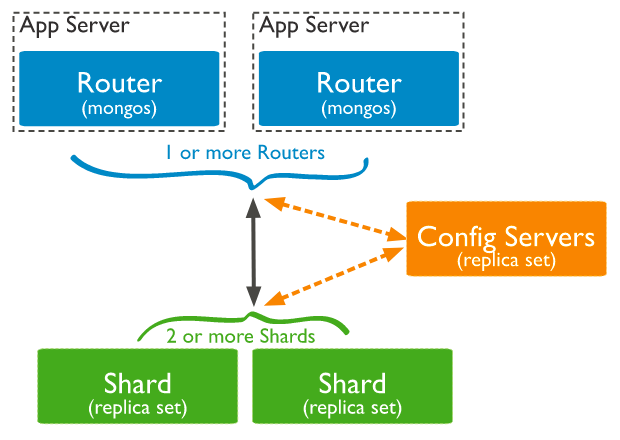

# 配置MongoDB分片

## 简介

分片是一种跨多台机器分布数据的方法。MongoDB 使用分片来支持大数据集和高吞吐量操作的部署。

MongoDB分片集群由以下组件组成：

- shard：每个分片包含分片数据的一个子集。每个分片都可以部署为一个副本集。
- mongos：充当查询路由器，提供客户端应用程序和分片集群之间的接口。
- 配置服务器：配置服务器存储集群的元数据和配置设置。

下图描述了分片集群中组件的交互：



本练习我们将配置具有两个shard的mongodb，每个shard都是一个副本集，配置服务器也是一个副本集。

### 先决条件

- 安装MongoDB数据库软件
- 安装Mongo Shell客户端工具
- 配置MongoDB第一个副本集


## Task 1: 启动第一个Shard副本集

1. 在之前的练习中，我们已经配置好了一个副本集，我们把它作为第一个shard。启动第一个副本集。

    - shardsvr: 将该实例配置为shard集群中的一个shard。

    ```
    mongod --shardsvr --replSet rs0 --port 27017 --bind_ip localhost,mongodb-test --dbpath /srv/mongodb/rs0-0 --logpath /srv/mongodb/log/rs0-0.log --logappend --oplogSize 128 --fork
    ```

    ```
    mongod --shardsvr --replSet rs0 --port 27018 --bind_ip localhost,mongodb-test --dbpath /srv/mongodb/rs0-1 --logpath /srv/mongodb/log/rs0-1.log --logappend --oplogSize 128 --fork
    ```

    ```
    mongod --shardsvr --replSet rs0 --port 27019 --bind_ip localhost,mongodb-test --dbpath /srv/mongodb/rs0-2 --logpath /srv/mongodb/log/rs0-2.log --logappend --oplogSize 128 --fork
    ```

    

2. 连接到任意的一个副本集成员。

    ```
    mongosh --port 27017
    ```

    

3. 查看当前副本集的主从状态。

    ```
    rs0 [direct: primary] test> rs.isMaster()
    {
      topologyVersion: {
        processId: ObjectId("63968f4bec95e66716754abc"),
        counter: Long("6")
      },
      hosts: [ 'mongodb-test:27017', 'mongodb-test:27018', 'mongodb-test:27019' ],
      setName: 'rs0',
      setVersion: 1,
      ismaster: true,
      secondary: false,
      primary: 'mongodb-test:27017',
      me: 'mongodb-test:27017',
      electionId: ObjectId("7fffffff0000000000000003"),
      lastWrite: {
        opTime: { ts: Timestamp({ t: 1670811908, i: 1 }), t: Long("3") },
        lastWriteDate: ISODate("2022-12-12T02:25:08.000Z"),
        majorityOpTime: { ts: Timestamp({ t: 1670811908, i: 1 }), t: Long("3") },
        majorityWriteDate: ISODate("2022-12-12T02:25:08.000Z")
      },
      isImplicitDefaultMajorityWC: true,
      maxBsonObjectSize: 16777216,
      maxMessageSizeBytes: 48000000,
      maxWriteBatchSize: 100000,
      localTime: ISODate("2022-12-12T02:25:16.628Z"),
      logicalSessionTimeoutMinutes: 30,
      connectionId: 15,
      minWireVersion: 0,
      maxWireVersion: 17,
      readOnly: false,
      ok: 1,
      '$clusterTime': {
        clusterTime: Timestamp({ t: 1670811908, i: 1 }),
        signature: {
          hash: Binary(Buffer.from("0000000000000000000000000000000000000000", "hex"), 0),
          keyId: Long("0")
        }
      },
      operationTime: Timestamp({ t: 1670811908, i: 1 }),
      isWritablePrimary: true
    }
    rs0 [direct: primary] test>
    ```

    

4. 退出mongosh

    ```
    exit
    ```

    

5. sadf

## Task 2: 配置第二个副本集

1. 创建新目录

    ```
    sudo mkdir -p /srv/mongodb/rs1-0  /srv/mongodb/rs1-1 /srv/mongodb/rs1-2
    sudo chown opc /srv/mongodb/rs1-0  /srv/mongodb/rs1-1 /srv/mongodb/rs1-2
    ```

    

2. 启动副本集rs1，给每个成员配置不同的端口

    ```
    mongod --shardsvr --replSet rs1 --port 27020 --bind_ip localhost,mongodb-test --dbpath /srv/mongodb/rs1-0 --logpath /srv/mongodb/log/rs1-0.log --logappend --oplogSize 128 --fork
    ```

    ```
    mongod --shardsvr --replSet rs1 --port 27021 --bind_ip localhost,mongodb-test --dbpath /srv/mongodb/rs1-1 --logpath /srv/mongodb/log/rs1-1.log --logappend --oplogSize 128 --fork
    ```

    ```
    mongod --shardsvr --replSet rs1 --port 27022 --bind_ip localhost,mongodb-test --dbpath /srv/mongodb/rs1-2 --logpath /srv/mongodb/log/rs1-2.log --logappend --oplogSize 128 --fork
    ```

    

3. 连接到任一个成员

    ```
    mongosh --port 27020
    ```

    

4. 初始化副本集

    ```
    rs.initiate(
      {
        _id : "rs1",
        members: [
          { _id : 0, host : "mongodb-test:27020" },
          { _id : 1, host : "mongodb-test:27021" },
          { _id : 2, host : "mongodb-test:27022" }
        ]
      }
    )
    ```

    

5. 查看副本集主从关系状态

    ```
    rs.isMaster()
    ```

    

## Task 3: 创建配置服务器副本集

1. 下面我们将创建配置服务器副本集。你可以创建多个配置服务器副本集，在本练习中只创建一个。创建新目录。

    ```
    sudo mkdir -p /srv/mongodb/conf-0  /srv/mongodb/conf-1 /srv/mongodb/conf-2
    sudo chown opc /srv/mongodb/conf-0  /srv/mongodb/conf-1 /srv/mongodb/conf-2
    ```

    

2. 启动配置服务器副本集，给每个成员配置不同的端口

    - configsvr: 申明该实例作为shard集群中的配置服务器

    ```
    mongod --configsvr --replSet conf --port 27100 --bind_ip localhost,mongodb-test --dbpath /srv/mongodb/conf-0 --logpath /srv/mongodb/log/conf-0.log --logappend --oplogSize 128 --fork
    ```

    ```
    mongod --configsvr --replSet conf --port 27101 --bind_ip localhost,mongodb-test --dbpath /srv/mongodb/conf-1 --logpath /srv/mongodb/log/conf-1.log --logappend --oplogSize 128 --fork
    ```

    ```
    mongod --configsvr --replSet conf --port 27102 --bind_ip localhost,mongodb-test --dbpath /srv/mongodb/conf-2 --logpath /srv/mongodb/log/conf-2.log --logappend --oplogSize 128 --fork
    ```

    

3. 连接到任一个成员

    ```
    mongosh --port 27100
    ```

    

4. 初始化副本

    - configsvr: true

    ```
    rs.initiate(
      {
        _id : "conf",
        configsvr: true,
        members: [
          { _id : 0, host : "mongodb-test:27100" },
          { _id : 1, host : "mongodb-test:27101" },
          { _id : 2, host : "mongodb-test:27102" }
        ]
      }
    )
    ```

    

5. 查看副本集主从关系状态

    ```
    rs.isMaster()
    ```

    

6. sadf

7. asdf


## Task 4: 配置MongoDB分片

1. 启动mongos作为shard集群的路由

    ```
    mongos --port 40000 --configdb conf/mongodb-test:27100,mongodb-test:27101,mongodb-test:27102 --bind_ip localhost,mongodb-test --logpath=/srv/mongodb/log/route.log --logappend --fork
    ```

    

2. 使用mongo shell客户端连接到shard集群

    ```
    mongosh --port 40000
    ```

    返回信息如下，先忽略警告信息。

    ```
    Current Mongosh Log ID:	63b0df1df3158070b0fa2c78
    Connecting to:		mongodb://127.0.0.1:40000/?directConnection=true&serverSelectionTimeoutMS=2000&appName=mongosh+1.6.0
    Using MongoDB:		6.0.3
    Using Mongosh:		1.6.0
    
    For mongosh info see: https://docs.mongodb.com/mongodb-shell/
    
    ------
       The server generated these startup warnings when booting
       2023-01-01T01:17:07.969+00:00: Access control is not enabled for the database. Read and write access to data and configuration is unrestricted
    ------
    
    [direct: mongos] test> 
    ```

    

3. 将分片数据库副本集添加到shard集群中

    ```
    sh.addShard( "rs0/mongodb-test:27017,mongodb-test:27018,mongodb-test:27019")
    ```

    ```
    sh.addShard( "rs1/mongodb-test:27020,mongodb-test:27021,mongodb-test:27022")
    ```

    返回信息如下：

    ```
    [direct: mongos] test> sh.addShard( "rs0/mongodb-test:27017,mongodb-test:27018,mongodb-test:27019")
    {
      shardAdded: 'rs0',
      ok: 1,
      '$clusterTime': {
        clusterTime: Timestamp({ t: 1672535929, i: 8 }),
        signature: {
          hash: Binary(Buffer.from("0000000000000000000000000000000000000000", "hex"), 0),
          keyId: Long("0")
        }
      },
      operationTime: Timestamp({ t: 1672535929, i: 8 })
    }
    [direct: mongos] test> sh.addShard( "rs1/mongodb-test:27020,mongodb-test:27021,mongodb-test:27022")
    {
      shardAdded: 'rs1',
      ok: 1,
      '$clusterTime': {
        clusterTime: Timestamp({ t: 1672535948, i: 6 }),
        signature: {
          hash: Binary(Buffer.from("0000000000000000000000000000000000000000", "hex"), 0),
          keyId: Long("0")
        }
      },
      operationTime: Timestamp({ t: 1672535948, i: 6 })
    }
    [direct: mongos] test> 
    ```

    

4. 查看当前shard集群状态

    ```
    sh.status()
    ```

    返回信息如下：

    ```
    [direct: mongos] test> sh.status()
    shardingVersion
    {
      _id: 1,
      minCompatibleVersion: 5,
      currentVersion: 6,
      clusterId: ObjectId("63b0dba6c3fb0f153f10a9c0")
    }
    ---
    shards
    [
      {
        _id: 'rs0',
        host: 'rs0/mongodb-test:27017,mongodb-test:27018,mongodb-test:27019',
        state: 1,
        topologyTime: Timestamp({ t: 1672535929, i: 5 })
      },
      {
        _id: 'rs1',
        host: 'rs1/mongodb-test:27020,mongodb-test:27021,mongodb-test:27022',
        state: 1,
        topologyTime: Timestamp({ t: 1672535948, i: 4 })
      }
    ]
    ---
    active mongoses
    [ { '6.0.3': 1 } ]
    ---
    autosplit
    { 'Currently enabled': 'yes' }
    ---
    balancer
    {
      'Currently enabled': 'yes',
      'Currently running': 'no',
      'Failed balancer rounds in last 5 attempts': 0,
      'Migration Results for the last 24 hours': 'No recent migrations'
    }
    ---
    databases
    [
      {
        database: { _id: 'config', primary: 'config', partitioned: true },
        collections: {}
      }
    ]
    [direct: mongos] test>
    ```

    

5. sdf


## Task 5: 配置集合分片 - Hash Shard

MongoDB支持Hash和Range分片，下面我们以Hash分片为例来配置一个分片的集合。

1. 将test数据库中的movies集合，以"_id"字段作为shard key，建立hash分片。

    - 如果对已经存在的集合进行分片，则sharding操作会先创建一个包含所有键值的初始分片。再由balancer进程将键值移动到不同的分片中。
    - 如果是空的或不存在的集合，Sharding操作会缺省在每个分片上创建2个空的chunk。初始chunk可以修改。chunk是指在某个shard中连续存放的shard key值，缺省为128Megabytes。

    ```
    sh.shardCollection( "test.movies", { "_id" : "hashed" } )
    ```

    返回信息如下：

    ```
    [direct: mongos] test> sh.shardCollection( "test.movies", { "_id" : "hashed" } )
    {
      collectionsharded: 'test.movies',
      ok: 1,
      '$clusterTime': {
        clusterTime: Timestamp({ t: 1672536095, i: 44 }),
        signature: {
          hash: Binary(Buffer.from("0000000000000000000000000000000000000000", "hex"), 0),
          keyId: Long("0")
        }
      },
      operationTime: Timestamp({ t: 1672536095, i: 40 })
    }
    [direct: mongos] test> 
    ```

    

2. 插入一条文档

    ```
    db.movies.insertOne(
    {
        "_id": 100,
        "type":"movie",
        "title": "Coming to America",
        "format": "DVD",
        "condition": "acceptable",
        "price": 5,
        "comment": "DVD in excellent condition, cover is blurred",
        "starring": ["Eddie Murphy", "Arsenio Hall", "James Earl Jones", "John Amos"],
        "year": 1988,
        "decade": "80s"
    }
    )
    ```

    

3. 插入多条文档

    ```
    db.movies.insertMany([
    {
        "_id": 101,
        "title": "The Thing",
        "type": "movie",
        "format": "DVD",
        "condition": "like new",
        "price": 9.50,
        "comment": "still sealed",
        "starring": [
            "Kurt Russel",
            "Wilford Brimley",
            "Keith David"
        ],
        "year": 1982,
        "decade": "80s"
    },
    {
        "_id": 102,
        "title": "Aliens",
        "type": "movie",
        " format ": "VHS",
        "condition": "unknown, cassette looks ok",
        "price": 2.50,
        "starring": [
            "Sigourney Weaver",
            "Michael Bien",
            "Carrie Henn"
        ],
        "year": 1986,
        "decade": "80s"
    },
    {
        "_id": 103,
        "title": "The Thing",
        "type": "book",
        "condition": "okay",
        "price": 2.50,
        "author":"Alan Dean Forster",
        "year": 1982,
        "decade": "80s"
    }
    ])
    ```

    

4. 查看分片情况，先用flushRouterConfig命令刷新缓存的路由表，以避免返回集合的过时的分部信息。

    ```
    db.adminCommand( { flushRouterConfig: "test.movies" } );
    db.getSiblingDB("test").movies.getShardDistribution();
    ```

    返回信息如下，可以看到每个shard有2个文档，2个chunk。

    ```
    [direct: mongos] test> db.adminCommand( { flushRouterConfig: "test.movies" } );
    {
      flushed: true,
      ok: 1,
      '$clusterTime': {
        clusterTime: Timestamp({ t: 1672536320, i: 1 }),
        signature: {
          hash: Binary(Buffer.from("0000000000000000000000000000000000000000", "hex"), 0),
          keyId: Long("0")
        }
      },
      operationTime: Timestamp({ t: 1672536320, i: 1 })
    }
    [direct: mongos] test> db.getSiblingDB("test").movies.getShardDistribution();
    Shard rs1 at rs1/mongodb-test:27020,mongodb-test:27021,mongodb-test:27022
    {
      data: '461B',
      docs: 2,
      chunks: 2,
      'estimated data per chunk': '230B',
      'estimated docs per chunk': 1
    }
    ---
    Shard rs0 at rs0/mongodb-test:27017,mongodb-test:27018,mongodb-test:27019
    {
      data: '433B',
      docs: 2,
      chunks: 2,
      'estimated data per chunk': '216B',
      'estimated docs per chunk': 1
    }
    ---
    Totals
    {
      data: '894B',
      docs: 4,
      chunks: 4,
      'Shard rs1': [
        '51.56 % data',
        '50 % docs in cluster',
        '230B avg obj size on shard'
      ],
      'Shard rs0': [
        '48.43 % data',
        '50 % docs in cluster',
        '216B avg obj size on shard'
      ]
    }
    [direct: mongos] test> 
    ```

    

5. sdf