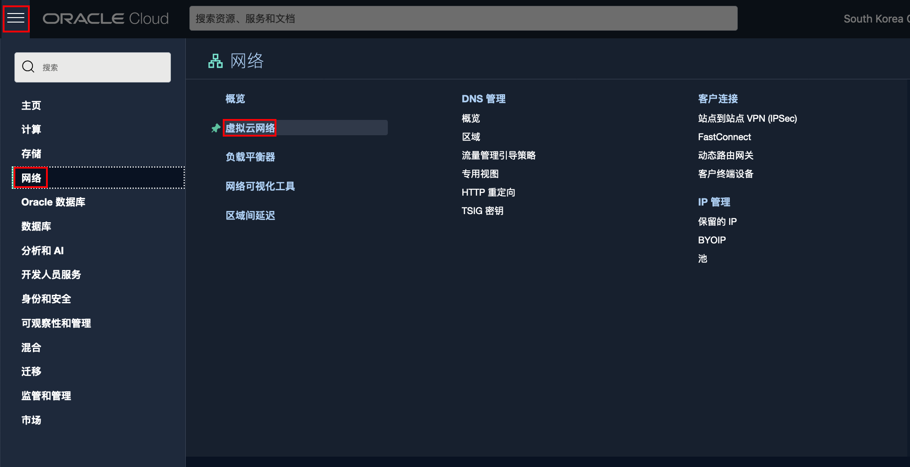
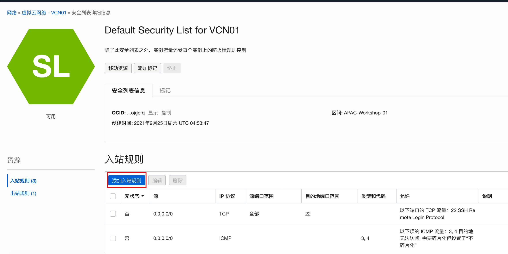

# 创建应用服务器

## 简介

下面我们将在公共子网创建应用服务器。在练习中为了节省资源，我们将堡垒机也同时作为应用服务器，在该机上安装应用服务（该练习以安装Nginx为例）。

### 前提条件

- 创建了VCN并配置了相应的子网。
- 在公有子网里创建了堡垒机（应用服务器主机）。

## Step 1: 安装Nginx

1. 连接到应用服务器主机。Mac和Unix采用命令行方式，Windows使用putty工具。

    ```
    $ ssh -i labkey opc@152.70.234.21
    Last login: Sun Sep 26 05:22:26 2021 from 202.45.129.206
    -bash: warning: setlocale: LC_CTYPE: cannot change locale (UTF-8): No such file or directory
    [opc@compute01 ~]$ 
    ```

    

2. 创建并编辑nginx资料库文件。

    ```
    [opc@compute01 ~]$ sudo vi /etc/yum.repos.d/nginx.repo
    ```

    

3. 将下面的内容拷贝到该文件中，并保存该文件。

    ```
    [nginx-stable]
    name=nginx stable repo
    baseurl=http://nginx.org/packages/centos/$releasever/$basearch/
    gpgcheck=1
    enabled=1
    gpgkey=https://nginx.org/keys/nginx_signing.key
    module_hotfixes=true
    
    [nginx-mainline]
    name=nginx mainline repo
    baseurl=http://nginx.org/packages/mainline/centos/$releasever/$basearch/
    gpgcheck=1
    enabled=0
    gpgkey=https://nginx.org/keys/nginx_signing.key
    module_hotfixes=true
    ```

    

4. 允许下列命令安装nginx。

    ```
    [opc@compute01 ~]$ sudo yum install -y nginx
    
    ......
    ......
      Verifying  : 1:nginx-1.20.1-1.el7.ngx.x86_64                                                                                                                                   1/1 
    
    Installed:
      nginx.x86_64 1:1.20.1-1.el7.ngx                                                                                                                                                    
    
    Complete!
    [opc@compute01 ~]$ 
    ```

    

5. 启动nginx服务并查看状态。

    ```
    [opc@compute01 ~]$ sudo systemctl start nginx
    [opc@compute01 ~]$ sudo systemctl status nginx
    ● nginx.service - nginx - high performance web server
       Loaded: loaded (/usr/lib/systemd/system/nginx.service; disabled; vendor preset: disabled)
       Active: active (running) since Sun 2021-09-26 08:25:36 GMT; 32s ago
         Docs: http://nginx.org/en/docs/
      Process: 29096 ExecStart=/usr/sbin/nginx -c /etc/nginx/nginx.conf (code=exited, status=0/SUCCESS)
     Main PID: 29097 (nginx)
       Memory: 2.7M
       CGroup: /system.slice/nginx.service
               ├─29097 nginx: master process /usr/sbin/nginx -c /etc/nginx/nginx.conf
               ├─29098 nginx: worker process
               └─29099 nginx: worker process
    
    Sep 26 08:25:36 compute01 systemd[1]: Starting nginx - high performance web server...
    Sep 26 08:25:36 compute01 systemd[1]: Started nginx - high performance web server.
    [opc@compute01 ~]$ 
    ```

    

6. 在后面的练习中，要创建该计算实例的定制映像，期间该计算实例会重启。我们可以创建nginx开机自启动服务。编辑init.d文件。

    ```
    [opc@compute01 ~]$ sudo vi /etc/init.d/nginx
    ```

    

7. 将以下内容粘贴到该文件中。

    ```
    <copy>
    #!/bin/sh
    #
    # nginx - this script starts and stops the nginx daemon
    #
    # chkconfig:   - 85 15
    # description:  NGINX is an HTTP(S) server, HTTP(S) reverse \
    #               proxy and IMAP/POP3 proxy server
    # processname: nginx
    # config:      /etc/nginx/nginx.conf
    # config:      /etc/sysconfig/nginx
    # pidfile:     /var/run/nginx.pid
    
    # Source function library.
    . /etc/rc.d/init.d/functions
    
    # Source networking configuration.
    . /etc/sysconfig/network
    
    # Check that networking is up.
    [ "$NETWORKING" = "no" ] && exit 0
    
    nginx="/usr/sbin/nginx"
    prog=$(basename $nginx)
    
    NGINX_CONF_FILE="/etc/nginx/nginx.conf"
    
    [ -f /etc/sysconfig/nginx ] && . /etc/sysconfig/nginx
    
    lockfile=/var/lock/subsys/nginx
    
    make_dirs() {
       # make required directories
       user=`$nginx -V 2>&1 | grep "configure arguments:.*--user=" | sed 's/[^*]*--user=\([^ ]*\).*/\1/g' -`
       if [ -n "$user" ]; then
          if [ -z "`grep $user /etc/passwd`" ]; then
             useradd -M -s /bin/nologin $user
          fi
          options=`$nginx -V 2>&1 | grep 'configure arguments:'`
          for opt in $options; do
              if [ `echo $opt | grep '.*-temp-path'` ]; then
                  value=`echo $opt | cut -d "=" -f 2`
                  if [ ! -d "$value" ]; then
                      # echo "creating" $value
                      mkdir -p $value && chown -R $user $value
                  fi
              fi
           done
        fi
    }
    
    start() {
        [ -x $nginx ] || exit 5
        [ -f $NGINX_CONF_FILE ] || exit 6
        make_dirs
        echo -n $"Starting $prog: "
        daemon $nginx -c $NGINX_CONF_FILE
        retval=$?
        echo
        [ $retval -eq 0 ] && touch $lockfile
        return $retval
    }
    
    stop() {
        echo -n $"Stopping $prog: "
        killproc $prog -QUIT
        retval=$?
        echo
        [ $retval -eq 0 ] && rm -f $lockfile
        return $retval
    }
    
    restart() {
        configtest || return $?
        stop
        sleep 1
        start
    }
    
    reload() {
        configtest || return $?
        echo -n $"Reloading $prog: "
        killproc $prog -HUP
        retval=$?
        echo
    }
    
    force_reload() {
        restart
    }
    
    configtest() {
      $nginx -t -c $NGINX_CONF_FILE
    }
    
    rh_status() {
        status $prog
    }
    
    rh_status_q() {
        rh_status >/dev/null 2>&1
    }
    
    case "$1" in
        start)
            rh_status_q && exit 0
            $1
            ;;
        stop)
            rh_status_q || exit 0
            $1
            ;;
        restart|configtest)
            $1
            ;;
        reload)
            rh_status_q || exit 7
            $1
            ;;
        force-reload)
            force_reload
            ;;
        status)
            rh_status
            ;;
        condrestart|try-restart)
            rh_status_q || exit 0
                ;;
        *)
            echo $"Usage: $0 {start|stop|status|restart|condrestart|try-restart|reload|force-reload|configtest}"
            exit 2
    esac
    </copy>
    ```

    

8. 保存后设置文件的执行权限。

    ```
    [opc@compute01 ~]$ sudo chmod a+x /etc/init.d/nginx
    ```

    

9. 将nginx服务加入chkconfig管理列表。

    ```
    [opc@compute01 ~]$ sudo chkconfig --add /etc/init.d/nginx
    ```

    

10. 设置开机自动启动。

    ```
    [opc@compute01 ~]$ sudo chkconfig nginx on
    Note: Forwarding request to 'systemctl enable nginx.service'.
    Created symlink from /etc/systemd/system/multi-user.target.wants/nginx.service to /usr/lib/systemd/system/nginx.service.
    [opc@compute01 ~]$
    ```

    

## Step 2：打开服务端口

虽然已经安装好了nginx服务，但是该主机以及主机所在的VCN公共子网相对应的服务端口并没有打开。客户端还不能直接访问nginx服务。

1. OCI上的计算服务缺省只打开了TCP22端口，用于SSH连接。我们需要手工打开相应的端口来用于应用的访问，如：80端口。运行下列命令来打开相应的端口。

    ```
    [opc@compute01 ~]$ sudo firewall-cmd --zone=public --add-port=80/tcp --permanent
    success
    [opc@compute01 ~]$ sudo firewall-cmd --reload
    success
    [opc@compute01 ~]$ sudo firewall-cmd --list-all
    public (active)
      target: default
      icmp-block-inversion: no
      interfaces: ens3
      sources: 
      services: dhcpv6-client ssh
      ports: 80/tcp
      protocols: 
      masquerade: no
      forward-ports: 
      source-ports: 
      icmp-blocks: 
      rich rules: 
    	
    [opc@compute01 ~]$
    ```

    

2. 在OCI主菜单里，选择**网络**，再点击**虚拟云网络**。

    

3. 选择你之前创建的VCN，如：VCN01。再点击公共子网，如：public-subnet。

    

4. 选择缺省的安全列表：Default Security List。

    

5. 点击**添加入站规则**。

    

6. 我们将允许任何实例通过TCP80端口访问公有子网的服务，因此设置**源CIDR**为：0.0.0.0/0。设置**目的地端口范围**为：80。点击**添加入站规则**。

    

7. 入站规则添加成功。

## Step 3: 访问nginx服务

1. 连接到虚拟机实例，备份nginx缺省主页。

    ```
    [opc@compute01 ~]$ sudo mv /usr/share/nginx/html/index.html /usr/share/nginx/html/index.html.sav
    ```
    
    
    
2. 编辑新的nginx主页。

    ```
    [opc@compute01 ~]$ sudo vi /usr/share/nginx/html/index.html
    ```

    

3. 在文件里写入下列内容，然后保存并退出编辑器。

    ```
    This is my first nginx01!
    ```

    

4. 在浏览里输入URL：`http://<应用服务器主机的公共IP>:80/index.html`，得到nginx的欢迎页面，说明访问应用服务器安装成功。

    

    