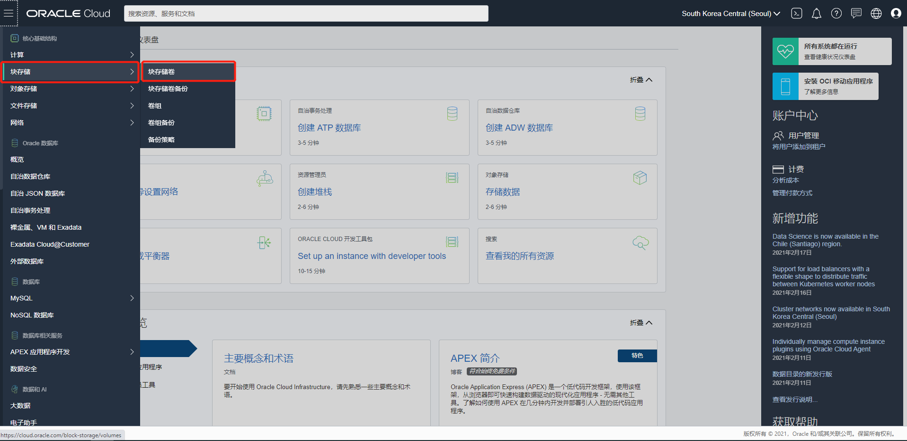
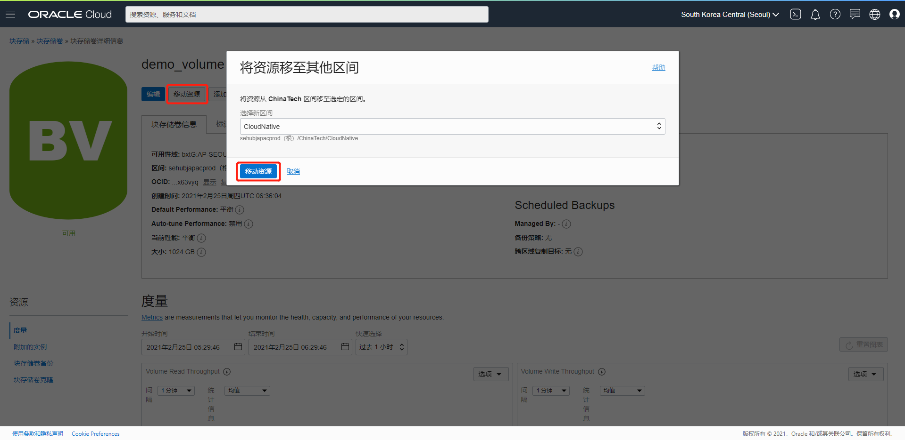

# 块存储

## 概览

**甲骨文云基础设施-块存储服务**使用户可以动态得创建和管理块存储。主要功能包括对块存储的创建、附加、连接、迁移以及动态调整性能。

典型应用场景：

- 扩展计算实例存储空间

- 数据持久化和可靠存储：块存储可以保证在附加和移除过程中不会发生数据丢失，因此可以被用来将数据从一个计算实例迁移到另一个计算实例上去。
- 计算实例扩展：删除一个计算实例时，可保留其引导卷。用该引卷引导不同类型、Shape的计算实例。 例如将一个VM实例转换成裸金属实例。


### 先决条件

- 计算实例：在云租户中运行状态的裸金属或者虚拟机实例(可以利用之前实验创建的计算实例)

**注意**：*某些UI可能与说明中包含的名目截图有些许不同，但是您仍然可以使用本说明完成动手实验。*


## Task 1：块存储卷的创建、附加和移除

1. 浏览器打开甲骨文控制台界面，输入正确的租户名、用户名和密码登录OCI控制台。从左侧菜单中选择 **块存储-块存储卷**



2.确认所在正确的区域和区间后，点击 **创建块存储卷** 按钮，在打开的引导界面中填写块存储卷的名称，如：`demo_block01`，其它均为缺省值。然后点击 **创建块存储卷**按钮完成创建。


3.等待几秒钟后，块存储卷图标变成绿色，表示已经完成了创建。该页面展示了块存储卷的详细信息和监控度量。


4.（没有其它区间权限，请忽略这一步）使用 **移动资源** 按钮，打开移动块存储卷页面。 在页面中选择想要移动到的区间，点击**移动资源**按钮可以将块存储卷移动到其它区间。



5.在左侧 **资源栏**下选择 **附加的实例**， 打开附加实例引导界面。 选择要附加的目标实例，其它均为缺省值，点击**附加**按钮。


6. 附加成功后，在**附加的实例**列表中，打开右侧菜单选择 **iSCSI命令和信息**，打开页面


7. 点击**右侧三个点菜单**按钮，点击**iSCSI命令和信息**复制 ATTACH COMMANDS内容


8. 使用ssh连接到附加的计算实例，逐条复制并执行ATTACH COMMANDS中的3条命令。


9. 使用命令 sudo fdisk -l 查看成功附加的块存储卷

```
[opc@compute01 ~]$ sudo iscsiadm -m node -o new -T iqn.2015-12.com.oracleiaas:28a3fcd8-8d0a-4d28-9dc0-676c57e52c90 -p 169.254.2.2:3260
New iSCSI node [tcp:[hw=,ip=,net_if=,iscsi_if=default] 169.254.2.2,3260,-1 iqn.2015-12.com.oracleiaas:28a3fcd8-8d0a-4d28-9dc0-676c57e52c90] added
[opc@compute01 ~]$ sudo iscsiadm -m node -o update -T iqn.2015-12.com.oracleiaas:28a3fcd8-8d0a-4d28-9dc0-676c57e52c90 -n node.startup -v automatic
[opc@compute01 ~]$ sudo iscsiadm -m node -T iqn.2015-12.com.oracleiaas:28a3fcd8-8d0a-4d28-9dc0-676c57e52c90 -p 169.254.2.2:3260 -l
Logging in to [iface: default, target: iqn.2015-12.com.oracleiaas:28a3fcd8-8d0a-4d28-9dc0-676c57e52c90, portal: 169.254.2.2,3260] (multiple)
Login to [iface: default, target: iqn.2015-12.com.oracleiaas:28a3fcd8-8d0a-4d28-9dc0-676c57e52c90, portal: 169.254.2.2,3260] successful.
[opc@compute01 ~]$  sudo fdisk -l
WARNING: fdisk GPT support is currently new, and therefore in an experimental phase. Use at your own discretion.

Disk /dev/sda: 50.0 GB, 50010783744 bytes, 97677312 sectors
Units = sectors of 1 * 512 = 512 bytes
Sector size (logical/physical): 512 bytes / 4096 bytes
I/O size (minimum/optimal): 4096 bytes / 1048576 bytes
Disk label type: gpt
Disk identifier: 4E05BFB5-8B93-4170-9F08-8ED358FA34E2


#         Start          End    Size  Type            Name
 1         2048       411647    200M  EFI System      EFI System Partition
 2       411648     17188863      8G  Linux swap      
 3     17188864     97675263   38.4G  Microsoft basic 

Disk /dev/sdb: 1099.5 GB, 1099511627776 bytes, 2147483648 sectors
Units = sectors of 1 * 512 = 512 bytes
Sector size (logical/physical): 512 bytes / 4096 bytes
I/O size (minimum/optimal): 4096 bytes / 1048576 bytes

[opc@compute01 ~]$
```


10. 通过上面结果可以看到 Disk /dev/sdb 是我们的路径。利用此路径。在系统中使用以下命令创建挂载点，并挂载块存储卷

```shell
sudo mkfs.ext4 /dev/sdb #[你的路径]为disk创建文件系统
sudo mkdir -p /mnt/vol1  #创建挂载点
sudo mount /dev/sdb /mnt/vol1  #[你的路径]挂载卷
```

11. 挂载完成，查看磁盘挂载状态。`mnt/vol1`可以正常使用。

    ```
    [opc@compute01 ~]$ sudo lsblk
    NAME   MAJ:MIN RM  SIZE RO TYPE MOUNTPOINT
    sdb      8:16   0    1T  0 disk /mnt/vol1
    sda      8:0    0 46.6G  0 disk 
    |-sda2   8:2    0    8G  0 part [SWAP]
    |-sda3   8:3    0 38.4G  0 part /
    `-sda1   8:1    0  200M  0 part /boot/efi
    [opc@compute01 ~]$
    ```

    

12. 在Linux中如果我们想让虚机在重启时自动挂载磁盘，需要做些配置。首先，我们要查看磁盘的设备号。

    ```
    [opc@compute01 ~]$ sudo blkid
    /dev/sda3: UUID="fdff5a28-34df-4222-a7f2-a22058607fbf" TYPE="xfs" PARTUUID="063a3c79-064d-4ce5-8e77-ca36fa969ee5" 
    /dev/sda1: SEC_TYPE="msdos" UUID="3802-1B67" TYPE="vfat" PARTLABEL="EFI System Partition" PARTUUID="d6548156-5872-4e03-b30a-f1737ba0555b" 
    /dev/sda2: UUID="4f2b766a-c551-408e-abbb-3d1cf5678a4d" TYPE="swap" PARTUUID="40e32313-96f2-4531-b4b2-e20c8bb438ce" 
    /dev/sdb: UUID="0d235dab-7c5f-4b03-ae94-35fa672b23d7" TYPE="ext4"
    ```

    

13. 修改/etc/fstab文件，增加如下一行。重启虚机，检查磁盘挂载情况。

    ```
    UUID=0d235dab-7c5f-4b03-ae94-35fa672b23d7 /mnt/vol1 ext4 defaults,_netdev,nofail 0 2
    ```

    

12. 要移除卷：首先删除/etc/fstab文件中新加的行，再移除挂载，最后执行步骤9中DETACH COMMANDS命令移除卷

```shell
sudo umount -l /mnt/vol1 #卸载磁盘
sudo lsblk #查看磁盘
```


12. 我们可以在虚机里直接运行iSCSI命令来使卷从实例分离出来，也可以通过控制台。在**块存储卷详细信息**页面，从**附加的实例**列表右侧的菜单中，选择 **从实例分离**。


从打开的界面中点击 **继续分离**按钮完成分离，在弹出对话框中点击**确认**。分离过程需要等待几分钟时间。


## Task 2: 修改块存储卷性能

1. 进入**块存储卷详情**页面，点击**编辑**按钮打开块存储编辑页面。 该页面可以编辑卷大小以及调整性能和备份策略。 比如将VPU从缺省的10增加到20，观察目标卷性能的变化。编辑完成后点击**保存更改**按钮使编辑生效。


2. 编辑提交后需要几秒钟时间完成更新。


## Task 3: 块存储卷的备份和恢复

1. 打开**块存储卷详细信息**页面，从左侧**资源**栏选择 **块存储卷备份** 选项卡，在打开的页面中点击**创建块存储卷备份**按钮，打开**块存储卷备份**页面。填写**备份名称**，如：backup01。选择**备份类型**，如：增量备份。点击**创建块存储卷备份**按钮，


2. 等待几秒钟即可成功创建备份


3. 除了手动备份外，也可以使用备份策略执行自动备份。 从左侧菜单中选择 **块存储 - 备份策略** 打开备份策略页面


4. Oracle缺省定义了gold，silver，bronze三种备份策略。我们也可以创建自定义的备份策略。点击 **创建备份策略按钮**，在打开的页面中填写**名称**，如：my-backup-policy01，点击**创建备份策略按钮**。


5. 点击 **添加计划**按钮为备份策略添加备份计划。根据页面提示，即可完成自定义备份计划的创建。如：每周日2:00AM进行增量备份。


6. 在**块存储卷详情**页面，点击**编辑**按钮，在最下方的备份策略中选择自定义的策略，保存后应用策略生效。


7. （忽略该步骤）块存储卷备份可以被用来创建新的块存储卷，或者**复制和移动到另一个区域**。 打开**块存储卷备份详情**页面，根据提示操作即可。


## Task 4: 在线扩展计算实例的引导卷

Linux系统默认驱动盘容量为46.6GB，您可以在OCI中在线扩展引导卷的大小，而不会出现任何停机时间。

1. 在你创建的计算实例详细信息页面，在**资源**下选择**引导卷**，点击相应的引导卷名称链接。

    

2. 在**引导卷详细信息**页面，点击**编辑**。修改**卷大小**，从缺省的47G扩大到100G。点击**保存更改**。

    

3. **复制**重新扫描磁盘命令，然后关闭窗口。

    

4. 连接引导卷所在的虚拟机实例，Mac和Unix可以直接用命令行工具，Windows可以用putty工具。查看当前磁盘大小。可以看到当前磁盘大小为46.6G。

    ```
    [opc@compute01 ~]$ lsblk
    NAME   MAJ:MIN RM  SIZE RO TYPE MOUNTPOINT
    sda      8:0    0 46.6G  0 disk 
    |-sda2   8:2    0    8G  0 part [SWAP]
    |-sda3   8:3    0 38.4G  0 part /
    `-sda1   8:1    0  200M  0 part /boot/efi
    [opc@compute01 ~]$
    ```

    

5. 运行之前复制的重新扫描磁盘的命令。

    ```
    [opc@compute01 ~]$ sudo dd iflag=direct if=/dev/oracleoci/oraclevda of=/dev/null count=1
    1+0 records in
    1+0 records out
    512 bytes (512 B) copied, 0.000724 s, 707 kB/s
    [opc@compute01 ~]$ echo "1" | sudo tee /sys/class/block/`readlink /dev/oracleoci/oraclevda | cut -d'/' -f 2`/device/rescan
    1
    [opc@compute01 ~]$
    ```

    

6. 重新查看磁盘大小，可以看到磁盘已经扩展到100G。

    ```
    [opc@compute01 ~]$ lsblk
    NAME   MAJ:MIN RM  SIZE RO TYPE MOUNTPOINT
    sda      8:0    0  100G  0 disk 
    |-sda2   8:2    0    8G  0 part [SWAP]
    |-sda3   8:3    0 38.4G  0 part /
    `-sda1   8:1    0  200M  0 part /boot/efi
    [opc@compute01 ~]$ 
    ```

    

7. 但此时引导卷的分区并没有真正扩展，运行`df -h`，查看分区大小。

    ```
    [opc@compute01 ~]$ df -h
    Filesystem      Size  Used Avail Use% Mounted on
    devtmpfs        7.6G     0  7.6G   0% /dev
    tmpfs           7.6G     0  7.6G   0% /dev/shm
    tmpfs           7.6G   49M  7.6G   1% /run
    tmpfs           7.6G     0  7.6G   0% /sys/fs/cgroup
    /dev/sda3        39G  4.9G   34G  13% /
    /dev/sda1       200M  7.5M  193M   4% /boot/efi
    tmpfs           1.6G     0  1.6G   0% /run/user/0
    tmpfs           1.6G     0  1.6G   0% /run/user/994
    tmpfs           1.6G     0  1.6G   0% /run/user/1000
    [opc@compute01 ~]$
    ```

    

8. 执行扩展分区命令。

    ```
    [opc@compute01 ~]$ sudo /usr/libexec/oci-growfs -y
    CHANGE: partition=3 start=17188864 old: size=80486400 end=97675264 new: size=192526302 end=209715166
    CHANGED: partition=3 start=17188864 old: size=80486400 end=97675264 new: size=192526302 end=209715166
    meta-data=/dev/sda3              isize=256    agcount=4, agsize=2515200 blks
             =                       sectsz=4096  attr=2, projid32bit=1
             =                       crc=0        finobt=0, sparse=0, rmapbt=0
             =                       reflink=0
    data     =                       bsize=4096   blocks=10060800, imaxpct=25
             =                       sunit=0      swidth=0 blks
    naming   =version 2              bsize=4096   ascii-ci=0, ftype=1
    log      =internal log           bsize=4096   blocks=4912, version=2
             =                       sectsz=4096  sunit=1 blks, lazy-count=1
    realtime =none                   extsz=4096   blocks=0, rtextents=0
    data blocks changed from 10060800 to 24065787
    [opc@compute01 ~]$ 
    ```

    

9. 再次运行`df –h`，显示引导卷的分区大小扩展。

    ```
    [opc@compute01 ~]$ df -h
    Filesystem      Size  Used Avail Use% Mounted on
    devtmpfs        7.6G     0  7.6G   0% /dev
    tmpfs           7.6G     0  7.6G   0% /dev/shm
    tmpfs           7.6G   49M  7.6G   1% /run
    tmpfs           7.6G     0  7.6G   0% /sys/fs/cgroup
    /dev/sda3        92G  4.9G   87G   6% /
    /dev/sda1       200M  7.5M  193M   4% /boot/efi
    tmpfs           1.6G     0  1.6G   0% /run/user/0
    tmpfs           1.6G     0  1.6G   0% /run/user/994
    tmpfs           1.6G     0  1.6G   0% /run/user/1000
    [opc@compute01 ~]$
    ```

    
