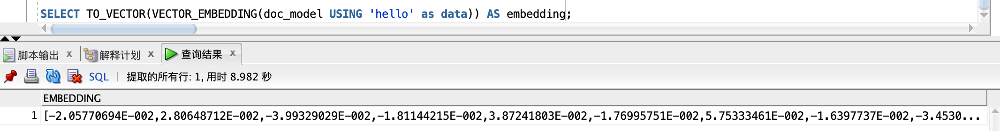
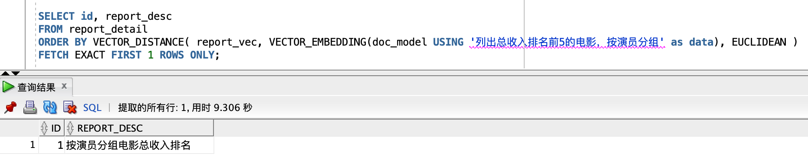
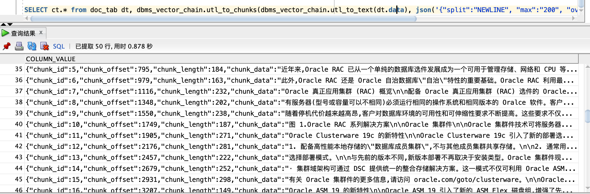
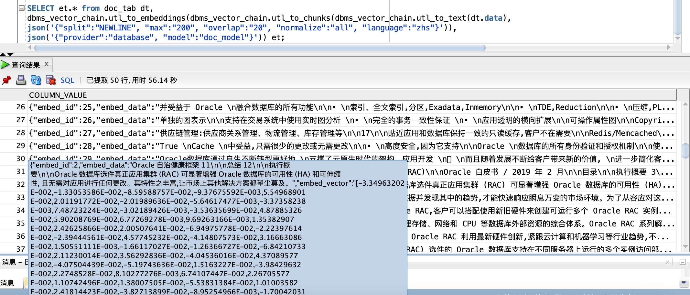
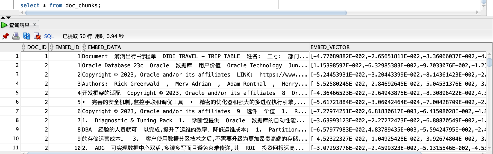
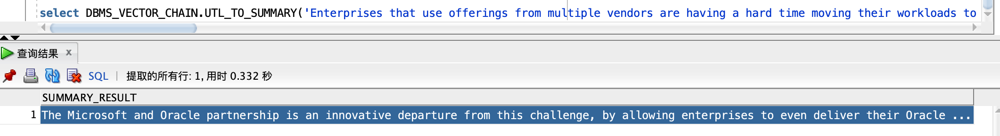
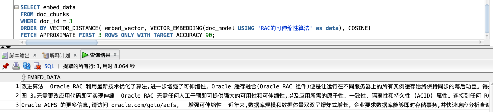

# Oracle AI Vector Search LA2学习


## 生成onnx embedding模型

1.   在URL：`https://repo.anaconda.com/archive/index.html`下载最新版Anaconda

2.   安装

     ```
     chmod +x Anaconda3-2024.02-1-Linux-x86_64.sh
     ./Anaconda3-2024.02-1-Linux-x86_64.sh
     ```

     

3.   创建并激活一个conda环境，如：`omlutil`

     ```
     conda create -n omlutil python=3.12
     conda activate omlutil
     ```

     

4.   找到安装软件带的`omlutil-0.zip`文件，解压

     ```
     unzip omlutil-0.zip
     cd omlutil-0
     ```

     

5.   安装依赖包

     ```
     python -m pip install -r requirements.txt
     ```

     

6.   再安装omlutil包

     ```
     python -m pip install omlutils-0.12.0-cp312-cp312-linux_x86_64.whl
     ```

     

7.   启动python

     ```
     python
     ```

     

8.   在[huggingface](https://huggingface.co/)网站上找到想要的模型，有两种方式生成onnx格式。

     -   如果网站上有配置好的模型，如：`intfloat/e5-small-v2`

         ```
         from omlutils import EmbeddingModel, EmbeddingModelConfig
         em = EmbeddingModel(model_name="intfloat/e5-small-v2")
         em.export2file("e5-small-v2",output_dir=".")
         ```

         

     -   如果网站上只有模型的template，如：GanymedeNil/text2vec-base-chinese

         ```
         from omlutils import EmbeddingModel, EmbeddingModelConfig
         config = EmbeddingModelConfig.from_template("text",max_seq_length=512)
         em = EmbeddingModel(model_name="GanymedeNil/text2vec-base-chinese",config=config)
         em.export2file("text2vec-base-chinese",output_dir=".")
         ```

         

9.   退出python。在本地目录下会看到相应的onnx文件。注意，生成的onnx文件如果大于1G，则无法加载到Oracle数据库中

     ```
     exit()
     ```

     

10.   退出虚拟环境

      ```
      conda activate
      ```

      

11.   删除虚拟环境（选项）

      ```
      conda info --envs
      conda remove -n omlutil --all
      ```

      

12.   dsf


## 加载onnx模型到数据库中

1.   以sysdba方式连接到Oracle数据库

     ```
     sqlplus sys/WelcomePTS_2023#@freepdb1 as sysdba
     ```

     

2.   创建目录对象，指定到onnx文件目录，给相应用户授权等

     ```
     CREATE OR REPLACE DIRECTORY DM_DUMP as '/home/oracle';
     GRANT READ ON DIRECTORY dm_dump TO vector;
     GRANT WRITE ON DIRECTORY dm_dump TO vector;
     GRANT create mining model TO vector;
     GRANT DB_DEVELOPER_ROLE TO vector;
     ```

     

3.   连接到相应的用户

     ```
     connect vector/vector@freepdb1
     ```

     

4.   加载onnx模型，两种方式加载，模型要小于1G，其中`doc_model`为加载后的模型名称

     -   方式一

         ```
         DECLARE
           m_blob BLOB default empty_blob();
           m_src_loc BFILE ;
         BEGIN
           DBMS_LOB.createtemporary (m_blob, FALSE);
           m_src_loc := BFILENAME('DM_DUMP', 'text2vec-base-chinese.onnx');
           DBMS_LOB.fileopen (m_src_loc, DBMS_LOB.file_readonly);
           DBMS_LOB.loadfromfile (m_blob, m_src_loc, DBMS_LOB.getlength (m_src_loc));
           DBMS_LOB.CLOSE(m_src_loc);
           DBMS_DATA_MINING.import_onnx_model ('doc_model', m_blob, JSON('{"function" : "embedding", "embeddingOutput" : "embedding", "input": {"input": ["DATA"]}}'));
           DBMS_LOB.freetemporary (m_blob);
         END;
         /
         ```

         

     -   方式二

         ```
         EXECUTE DBMS_VECTOR.LOAD_ONNX_MODEL('DM_DUMP','text2vec-base-chinese.onnx','doc_model',JSON('{"function" : "embedding", "embeddingOutput" : "embedding", "input": {"input": ["DATA"]}}'));
         ```

         

5.   查询模型

     ```
     SELECT MODEL_NAME, MINING_FUNCTION, ALGORITHM,
     ALGORITHM_TYPE, MODEL_SIZE
     FROM user_mining_models
     WHERE model_name = 'DOC_MODEL'
     ORDER BY MODEL_NAME;
     ```

     

6.   查询模型属性

     ```
     SELECT model_name, attribute_name, attribute_type, data_type, vector_info
     FROM user_mining_model_attributes
     WHERE model_name = 'DOC_MODEL'
     ORDER BY ATTRIBUTE_NAME;
     ```

     

7.   查询模型详细信息

     ```
     SELECT * FROM DM$VMDOC_MODEL ORDER BY NAME;
     SELECT * FROM DM$VPDOC_MODEL ORDER BY NAME;
     SELECT * FROM DM$VJDOC_MODEL;
     ```

     

8.   测试模型

     ```
     SELECT TO_VECTOR(VECTOR_EMBEDDING(doc_model USING 'hello' as data)) AS embedding;
     ```

     

9.   删除模型（选项）

     ```
     execute dbms_data_mining.drop_model(model_name => 'doc_model', force => true);
     ```

     


## 使用embedding模型

1.   创建测试表

     ```
     create table if not exists report_detail
     (
       id number,
       report_desc varchar2(2000),
       report_vec vector,
       report_url varchar2(2000)
     );
     ```

     

2.   插入测试数据

     ```
     insert into report_detail values(10,'某段时间上映的电影的市场占有率','','');
     insert into report_detail values(9,'女性观众最爱看的前十部电影','','');
     insert into report_detail values(8,'暑期档的电影播放排名，取前5名','','');
     insert into report_detail values(7,'不同年龄段的观众看电影的次数','','');
     insert into report_detail values(6,'看电影次数与收入的关系','','');
     insert into report_detail values(5,'看电影最多的城市排名','','');
     insert into report_detail values(4,'播放电影最多的渠道','','');
     insert into report_detail values(3,'收入排名前10的电影','','');
     insert into report_detail values(2,'按年分组，每年的电影总收入','','');
     insert into report_detail values(1,'按演员分组电影总收入排名','','');
     commit;
     ```

     

3.   转换成向量embedding插入report_vec中。

     ```
     update report_detail set report_vec=VECTOR_EMBEDDING(doc_model USING report_desc as data);
     commit;
     ```

     

4.   查询最接近的描述

     ```
     SELECT id, report_desc
     FROM report_detail
     ORDER BY VECTOR_DISTANCE( report_vec, VECTOR_EMBEDDING(doc_model USING '列出总收入排名前5的电影，按演员分组' as data), EUCLIDEAN )
     FETCH EXACT FIRST 1 ROWS ONLY;
     ```

     

5.   sdf


## 文档转文字、分段、转向量

1.   创建表

     ```
     CREATE TABLE doc_tab (id number, data blob);
     ```

     

2.   加载文档

     ```
     INSERT INTO doc_tab values(1, to_blob(bfilename('DM_DUMP', 'test.pdf')));
     commit;
     ```

     

3.   转文本

     ```
     select DBMS_VECTOR_CHAIN.utl_to_text(t.DATA) FROM DOC_TAB t;
     ```

     

4.   分段，缺省是每个字段大小是100，重复是0。`split`参数表示如何找到分段的位置。`normalize`参数表示是否将中文标点符号转为英文。

     ```
     SELECT ct.* from doc_tab dt, dbms_vector_chain.utl_to_chunks(dbms_vector_chain.utl_to_text(dt.data), json('{"split":"NEWLINE", "max":"200", "overlap":"20", "normalize":"all", "language":"zhs"}')) ct;
     ```

     

5.   分段后转向量

     ```
     SELECT et.* from doc_tab dt,
     dbms_vector_chain.utl_to_embeddings(dbms_vector_chain.utl_to_chunks(dbms_vector_chain.utl_to_text(dt.data), 
     json('{"split":"NEWLINE", "max":"200", "overlap":"20", "normalize":"all", "language":"zhs"}')),
     json('{"provider":"database", "model":"doc_model"}')) et;
     ```

     

6.   直接插入向量表

     ```
     CREATE TABLE doc_chunks as
     (select dt.id doc_id, et.embed_id, et.embed_data, to_vector(et.embed_vector)
     embed_vector
     from
     doc_tab dt,
     dbms_vector_chain.utl_to_embeddings(
     dbms_vector_chain.utl_to_chunks(dbms_vector_chain.utl_to_text(dt.data),
     json('{"split":"NEWLINE", "max":"200", "overlap":"20", "normalize":"all", "language":"zhs"}')),
     json('{"provider":"database", "model":"doc_model"}')) t,
     JSON_TABLE(t.column_value, '$[*]' COLUMNS (embed_id NUMBER PATH
     '$.embed_id', embed_data VARCHAR2(4000) PATH '$.embed_data', embed_vector
     CLOB PATH '$.embed_vector')) et
     );
     ```

     

7.   查看表中内容：

     ```
     select * from doc_chunks;
     ```

     

8.   给vector用户授予TEXT权限

     ```
     connect sys/WelcomePTS_2023#@freepdb1 as sysdba;
     grant ctxapp to vector;
     connect vector/vector@freepdb1;
     ```

     

9.   测试生成汇总信息：

     ```
     select DBMS_VECTOR_CHAIN.UTL_TO_SUMMARY('Enterprises that use offerings from multiple vendors are having a hard time moving their workloads to the cloud,” said Holger Mueller, vice president and principal analyst, Constellation Research. “Effectively CxOs need to pick the better offering and then live with the integration cost and risk going forward. The Microsoft and Oracle partnership is an innovative departure from this challenge, by allowing enterprises to even deliver their Oracle services through Azure’s console. It is no surprise that Microsoft and Oracle are now doubling down on the customer momentum and expanding their partnership with more locations. This will give more enterprises the chance to move their mission-critical workloads to the cloud.', json('{"provider":"Database","glevel":"sentence","numParagraphs":"1","language":"english"}')) summary_result from dual; 
     ```

     

10.   生成中文汇总信息(好像没啥用)

      ```
      select DBMS_VECTOR_CHAIN.UTL_TO_SUMMARY(DBMS_VECTOR_CHAIN.utl_to_text(t.DATA), json('{"provider":"Database","glevel":"sentence","numParagraphs":"1","language":"zhs"}')) summary_result FROM DOC_TAB t;
      ```

      

11.   asdf

12.   sadf


## 使用向量索引

1.   检查事先设置好的向量内存空间，在CDB级设置需要重启数据库，之后在PDB级可以联机修改。

     ```
     SQL> show parameter vector_memory_size
     
     NAME				     TYPE	 VALUE
     ------------------------------------ ----------- ------------------------------
     vector_memory_size		     big integer 512M
     ```

     

2.   创建向量索引，目前只支持HNSW。（注意：数据库重启后，向量索引需要重新创建）

     ```
     CREATE VECTOR INDEX doc_hnsw_idx ON doc_chunks (embed_vector)
     ORGANIZATION INMEMORY NEIGHBOR GRAPH
     DISTANCE COSINE
     WITH TARGET ACCURACY 95;
     ```

     

3.   向量查询，查看是否使用向量索引，注意`vector_distance`的算法要与向量索引一致，才能使用索引，比如都是`COSINE`。(注意：使用了`APPROXIMATE`关键字)

     ```
     SQL> EXPLAIN PLAN FOR SELECT embed_data
     FROM doc_chunks
     WHERE doc_id = 3
     ORDER BY VECTOR_DISTANCE( embed_vector, VECTOR_EMBEDDING(doc_model USING 'RAC的可伸缩性算法' as data), COSINE)
     FETCH APPROXIMATE FIRST 3 ROWS ONLY;
     
     Explained.
     
     SQL> select * from table(dbms_xplan.display);
     
     PLAN_TABLE_OUTPUT
     --------------------------------------------------------------------------------------------------------------------------------------------------------------------------------------------------------
     Plan hash value: 4096901702
     
     --------------------------------------------------------------------------------------------------------
     | Id  | Operation			     | Name	       | Rows  | Bytes | Cost (%CPU)| Time     |
     --------------------------------------------------------------------------------------------------------
     |   0 | SELECT STATEMENT		     |		       |     1 |  2002 |     3	(34)| 00:00:01 |
     |*  1 |  COUNT STOPKEY			     |		       |       |       |	    |	       |
     |   2 |   VIEW				     |		       |     1 |  2002 |     3	(34)| 00:00:01 |
     |*  3 |    SORT ORDER BY STOPKEY	     |		       |     1 |  3936 |     3	(34)| 00:00:01 |
     |*  4 |     TABLE ACCESS BY INDEX ROWID      | DOC_CHUNKS      |     1 |  3936 |     2	 (0)| 00:00:01 |
     |   5 |      VECTOR INDEX HNSW SCAN IN-FILTER| DOC_HNSW_IDX    |     1 |  3936 |     2	 (0)| 00:00:01 |
     |   6 |       VIEW			     | VW_HIJ_C8949690 |     1 |       |     1	 (0)| 00:00:01 |
     |*  7 |        TABLE ACCESS BY USER ROWID    | DOC_CHUNKS      |     1 |  3936 |     1	 (0)| 00:00:01 |
     --------------------------------------------------------------------------------------------------------
     
     Predicate Information (identified by operation id):
     ---------------------------------------------------
     
        1 - filter(ROWNUM<=3)
        3 - filter(ROWNUM<=3)
        4 - filter("DOC_ID"=3)
        7 - filter("DOC_ID"=3)
     
     Note
     -----
        - dynamic statistics used: dynamic sampling (level=2)
     
     26 rows selected.
     ```

     

4.   如果换成`EUCLIDEAN`，再次查看执行计划，看看这次是否使用了索引。

     ```
     SQL> EXPLAIN PLAN FOR SELECT embed_data
     FROM doc_chunks
     WHERE doc_id = 3
     ORDER BY VECTOR_DISTANCE( embed_vector, VECTOR_EMBEDDING(doc_model USING 'RAC的可伸缩性算法' as data), EUCLIDEAN)
     FETCH APPROXIMATE FIRST 3 ROWS ONLY;
     
     Explained.
     
     SQL> select * from table(dbms_xplan.display);
     
     PLAN_TABLE_OUTPUT
     --------------------------------------------------------------------------------------------------------------------------------------------------------------------------------------------------------
     Plan hash value: 3690958558
     
     --------------------------------------------------------------------------------------
     | Id  | Operation               | Name       | Rows  | Bytes | Cost (%CPU)| Time     |
     --------------------------------------------------------------------------------------
     |   0 | SELECT STATEMENT        |            |     3 |  6006 |    18   (6)| 00:00:01 |
     |*  1 |  COUNT STOPKEY          |            |       |       |            |          |
     |   2 |   VIEW                  |            |    18 | 36036 |    18   (6)| 00:00:01 |
     |*  3 |    SORT ORDER BY STOPKEY|            |    18 | 70812 |    18   (6)| 00:00:01 |
     |*  4 |     TABLE ACCESS FULL   | DOC_CHUNKS |    18 | 70812 |    17   (0)| 00:00:01 |
     --------------------------------------------------------------------------------------
     
     Predicate Information (identified by operation id):
     ---------------------------------------------------
     
        1 - filter(ROWNUM<=3)
        3 - filter(ROWNUM<=3)
        4 - filter("DOC_ID"=3)
     
     18 rows selected.
     ```

     

5.   查询时也可以覆盖创建索引时的精度

     ```
     SELECT embed_data
     FROM doc_chunks
     WHERE doc_id = 3
     ORDER BY VECTOR_DISTANCE( embed_vector, VECTOR_EMBEDDING(doc_model USING 'RAC的可伸缩性算法' as data), COSINE)
     FETCH APPROXIMATE FIRST 3 ROWS ONLY WITH TARGET ACCURACY 90;
     ```

     

6.   查询向量索引的搜索精度报告，如：返回结果是比目标要求的精度`90%`高`10%`。

     ```
     SQL> set serveroutput on
     SQL> declare
       q_v VECTOR;
       report varchar2(128);
     begin
       select VECTOR_EMBEDDING(doc_model USING 'RAC的可伸缩性算法' as data) into q_v from dual;
       report := dbms_vector.index_accuracy_query(
       OWNER_NAME => 'VECTOR',
       INDEX_NAME => 'DOC_HNSW_IDX',
       qv => q_v, top_K =>10,
       target_accuracy =>90 );
       dbms_output.put_line(report);
     end;
     /
     
     Accuracy achieved (100%) is 10% higher than the Target Accuracy requested (90%)
     
     PL/SQL procedure successfully completed.
     ```

     

7.   sadf

8.   


