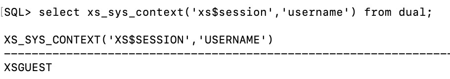
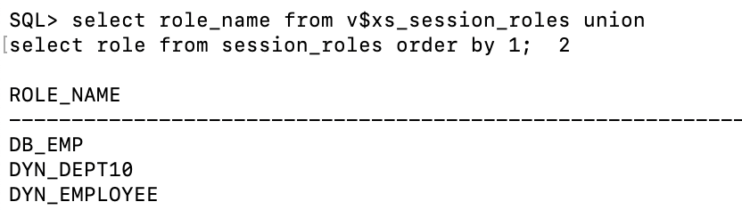
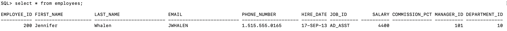
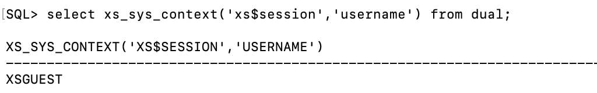
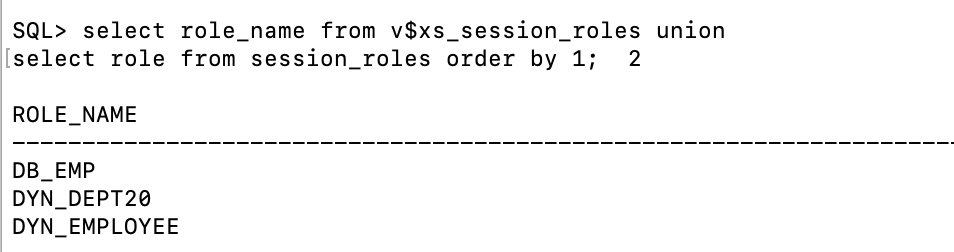
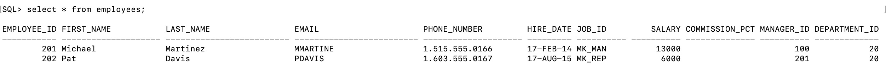

# Oracle RAS Setup using Dynamic Role

## 前提条件

1.   安装Oracle DB 23ai
2.   安装HR Sample Schema


## Task 1: 创建RAS管理员用户

1.   以sysdba连接到数据库对应的PDB

     ```
     sqlplus sys/WelcomePTS_2025#@bj_sales as sysdba
     ```

     

2.   创建rasadm为RAS管理员用户，并授予相应的权限。

     ```
     create user rasadm identified by rasadm;
     grant CREATE SESSION to rasadm;
     exec sys.xs_admin_util.grant_system_privilege('ADMIN_ANY_SEC_POLICY','RASADM');
     exec sys.xs_admin_util.grant_system_privilege('PROVISION','RASADM');
     ```

     

3.   创建数据库角色并授权

     ```
     create role db_emp;
     grant insert,update,delete,select on hr.employees to db_emp;
     grant db_emp to rasadm with admin option;
     ```

     

4.   sdf


## Task 2: 创建应用动态角色

1.   连接到rasadm用户

     ```
     connect rasadm/rasadm@bj_sales;
     ```

     

2.   创建应用角色并授权

     ```
     exec sys.xs_principal.CREATE_DYNAMIC_ROLE(name => 'dyn_employee', scope => XS_PRINCIPAL.SESSION_SCOPE);
     exec sys.xs_principal.CREATE_DYNAMIC_ROLE(name => 'dyn_dept10', scope => XS_PRINCIPAL.SESSION_SCOPE);
     exec sys.xs_principal.CREATE_DYNAMIC_ROLE(name => 'dyn_dept20', scope => XS_PRINCIPAL.SESSION_SCOPE);
     grant db_emp to dyn_employee;
     grant db_emp to dyn_dept10;
     grant db_emp to dyn_dept20;
     ```

     

5.   sdf


## Task 3: 创建security class和ACL

1.   创建security class：`hr_privileges`

     ```
     declare
     begin
       sys.xs_security_class.create_security_class(
         name        => 'hr_privileges', 
         parent_list => xs$name_list('sys.dml'),
         priv_list   => xs$privilege_list(xs$privilege('view_priv')));
     end;
     /
     ```

     

2.   创建三个ACL：`emp_acl, dept10_acl, dept20_acl` , dyn_employee角色有查询权限，dyn_dept10和dyn_dept20角色有增删改查权限。

     ```
     declare  
       aces xs$ace_list := xs$ace_list();  
     begin 
       aces.extend(1);
      
       -- EMP_ACL
       aces(1) := xs$ace_type(privilege_list => xs$name_list('select'),
                              principal_name => 'dyn_employee');
      
       sys.xs_acl.create_acl(name      => 'emp_acl',
                         ace_list  => aces,
                         sec_class => 'hr_privileges');
       
       -- DEPT10_ACL
       aces(1) := xs$ace_type(privilege_list => xs$name_list('select', 'insert', 
                                                'update', 'delete'),
                              principal_name => 'dyn_dept10');
      
       sys.xs_acl.create_acl(name      => 'dept10_acl',
                         ace_list  => aces,
                         sec_class => 'hr_privileges');
      
       -- DEPT20_ACL
       aces(1):= xs$ace_type(privilege_list => xs$name_list('select', 'insert', 
                                               'update', 'delete'),
                             principal_name => 'dyn_dept20');
      
       sys.xs_acl.create_acl(name      => 'dept20_acl',
                         ace_list  => aces,
                         sec_class => 'hr_privileges');
     end;
     /
     ```

     

3.   创建数据安全策略，三个realm，`emp_acl`的realm对应的数据是用户自己的。`dept10_acl`对应的数据是department 10的。`dept20_acl`对应的数据是department 20的。

     ```
     declare
       realms   xs$realm_constraint_list := xs$realm_constraint_list();      
       cols     xs$column_constraint_list := xs$column_constraint_list();
     begin  
       realms.extend(3);
      
       -- Realm #1: Only the employee's own record.     
       realms(1) := xs$realm_constraint_type(
         realm    => 'email = xs_sys_context(''xs$session'',''username'')',
         acl_list => xs$name_list('emp_acl'));
      
       -- Realm #2: The records in the department 10.
       realms(2) := xs$realm_constraint_type(
         realm    => 'department_id = 10',
         acl_list => xs$name_list('dept10_acl'));
      
       -- Realm #3: The records in the department 20.
       realms(3) := xs$realm_constraint_type(
         realm    => 'department_id = 20',
         acl_list => xs$name_list('dept20_acl'));
      
       sys.xs_data_security.create_policy(
         name                   => 'emp_ds',
         realm_constraint_list  => realms
         );
     end;
     /
     ```

     

4.   应用该安全策略到employees表，排除owner的权限控制（owner可以查看自己的表的全部记录）

     ```
     begin
       sys.xs_data_security.apply_object_policy(
         policy => 'emp_ds', 
         schema => 'hr',
         object =>'employees',
         owner_bypass => true);
     end;
     /
     ```

     

5.   验证安全策略，正确时没有记录返回

     ```
     begin
       if (sys.xs_diag.validate_workspace()) then
         dbms_output.put_line('All configurations are correct.');
       else
         dbms_output.put_line('Some configurations are incorrect.');
       end if;
     end;
     /
     -- XS$VALIDATION_TABLE contains validation errors if any.
     -- Expect no rows selected.
     select * from xs$validation_table order by 1, 2, 3, 4;
     ```

     


## Task 4: 利用公共session用户连接

1.   以sysdba连接到sys用户

     ```
     connect sys/WelcomePTS_2025#@bj_sales as sysdba
     ```

     

2.   创建session管理员用户，只有session管理权限，没有数据权限

     ```
     grant xs_session_admin, create session to hr_session identified by hr_session;
     ```

     

3.   连接到session管理员。定义session变量。

     ```
     connect hr_session/hr_session@bj_sales;
     var gsessionid varchar2(32);
     ```

     

4.   创建匿名用户的session并attach这个session，设置动态角色`dyn_employee`和`dyn_dept10`

     ```
     declare
       sessionid raw(16);
       l_enable_roles XS$NAME_LIST := XS$NAME_LIST();
     begin
       sys.dbms_xs_sessions.create_session('XSGUEST', sessionid);
       :gsessionid := rawtohex(sessionid);
       l_enable_roles.EXTEND(2); -- Allocate space for 2 roles
       l_enable_roles(1) := 'dyn_employee';
       l_enable_roles(2) := 'dyn_dept10';
       sys.dbms_xs_sessions.attach_session(sessionid => sessionid, enable_dynamic_roles => l_enable_roles);
     end ;
     /
     ```

     或者试试：

     ```
     l_enable_roles:= XS$NAME_LIST('dyn_employee', 'dyn_dept10');
     ```

     

5.   查看当前用户

     ```
     select xs_sys_context('xs$session','username') from dual;
     ```

     返回结果：

     

6.   查看当前用户的角色

     ```
     select role_name from v$xs_session_roles union
     select role from session_roles order by 1;
     ```

     返回结果：

     

7.   查询数据

     ```
     select * from hr.employees;
     ```

     返回结果：

     

8.   detach并删除这个session

     ```
     declare
       sessionid raw(16);
     begin
       sessionid := hextoraw(:gsessionid);
       sys.dbms_xs_sessions.detach_session;
       sys.dbms_xs_sessions.destroy_session(sessionid);
     end;
     /
     ```

     

9.   创建匿名session并attach这个session，设置动态角色`dyn_employee`和`dyn_dept20`

     ```
     declare
       sessionid raw(16);
       l_enable_roles XS$NAME_LIST := XS$NAME_LIST();
     begin
       sys.dbms_xs_sessions.create_session('XSGUEST', sessionid);
       :gsessionid := rawtohex(sessionid);
       l_enable_roles.EXTEND(2); -- Allocate space for 2 roles
       l_enable_roles(1) := 'dyn_employee';
       l_enable_roles(2) := 'dyn_dept20';
       sys.dbms_xs_sessions.attach_session(sessionid => sessionid, enable_dynamic_roles => l_enable_roles);
     end ;
     /
     ```

     

10.   查看当前用户

      ```
      select xs_sys_context('xs$session','username') from dual;
      ```

      

11.   查看当前用户的角色

      ```
      select role_name from v$xs_session_roles union
      select role from session_roles order by 1;
      ```
      
      
      
11.   查看数据

      ```
      select * from hr.employees;
      ```

      返回结果：

      

      

12.   detach并删除这个session

      ```
      declare
        sessionid raw(16);
      begin
        sessionid := hextoraw(:gsessionid);
        sys.dbms_xs_sessions.detach_session;
        sys.dbms_xs_sessions.destroy_session(sessionid);
      end;
      /
      ```


## Task 6: 清除环境

1.   连接到rasadm

     ```
     connect rasadm/rasadm@bj_sales;
     ```

     

2.   删除应用对象的安全策略

     ```
     begin
       xs_data_security.remove_object_policy(policy=>'emp_ds', 
                                             schema=>'hr', object=>'employees');
     end;
     /
     ```

     

3.   删除security class和ACL

     ```
     exec sys.xs_security_class.delete_security_class('hr_privileges', xs_admin_util.cascade_option);
     exec sys.xs_acl.delete_acl('emp_acl', xs_admin_util.cascade_option);
     exec sys.xs_acl.delete_acl('dept10_acl', xs_admin_util.cascade_option);
     exec sys.xs_acl.delete_acl('dept20_acl', xs_admin_util.cascade_option);
     
     ```

     

4.   删除安全策略

     ```
     exec sys.xs_data_security.delete_policy('emp_ds', xs_admin_util.cascade_option);
     ```

     

5.   删除应用角色和用户

     ```
     exec sys.xs_principal.delete_principal('dyn_employee', xs_admin_util.cascade_option);
     exec sys.xs_principal.delete_principal('dyn_dept10', xs_admin_util.cascade_option);
     exec sys.xs_principal.delete_principal('dyn_dept20', xs_admin_util.cascade_option);
     ```
     
     

6.   连接到sysdba

     ```
     connect sys/WelcomePTS_2025#
     ```

     

7.   删除数据库角色

     ```
     drop role db_emp;
     ```

     

8.   删除session管理员，RAS管理员

     ```
     drop user hr_session;
     drop user rasadm;
     ```

     