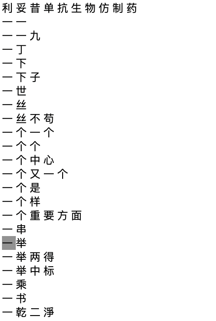

# Oracle Text Study

## 创建全文检索索引

1.   创建stoplist

     ```
     exec ctx_ddl.create_stoplist('mystop', 'BASIC_STOPLIST');
     ```

     

2.   创建中文分词器

     ```
     exec ctx_ddl.create_preference('MY_LEXER', 'CHINESE_LEXER');
     ```

     

3.   创建全文索引

     ```
     create index idx1_t1 on doc_chunks(embed_data) indextype is ctxsys.context parameters('lexer my_lexer stoplist mystop'); 
     ```

     

4.   进行全文检索

     ```
     SQL> select * from doc_chunks C where contains(c.embed_data, '阿尔卡迪亚d区') > 0;
     
        EMBED_ID
     ----------
     EMBED_DATA
     --------------------------------------------------------------------------------
     	 4
     大厂片区晓山路阿尔卡迪亚d区03-2-803(采暖)
     ```

     

5.   sadf

     


## 使用中文分词

1.   创建策略

     ```
     exec ctx_ddl.create_policy('my_policy', NULL, NULL, 'MY_LEXER', 'mystop', NULL);
     ```

     

2.   使用策略分词

     ```
     set serveroutput on ;
     declare
       rtab   ctx_doc.token_tab;
     begin
        ctx_doc.policy_tokens('my_policy', 'rituximab biosimilar : 利妥昔单抗生物仿制药',rtab, 'zhs');
        for i in 1..rtab.count loop
          dbms_output.put_line(rtab(i).token);
        end loop;
     end;
     ```

     

3.   分词结果如下：

     ```
     RITUXIMAB
     BIOSIMILAR
     利妥
     妥昔
     昔单
     单抗
     抗
     生物
     仿制
     药
     ```

     

4.   如果想让```'利妥昔单抗生物仿制药'```作为一个词组，需要对中文字典做一个改造。先导出缺省的中文字典

     ```
     ctxlc -zht -ocs UTF8 > new_chinese_dict.txt
     ```

     

5.   编辑导出的文件，增加词组：```'利妥昔单抗生物仿制药'```

     

6.   加载新增加的文件

     ```
     ctxlc -zht -ics UTF8 -n -i new_test_dict.txt
     ```

     

7.   此时当前目录下生成4个dat文件

     ```
     drold.dat
     droli.dat
     drolk.dat
     drolt.dat
     ```

     

8.   将文件拷贝到如下目录中（拷贝前先将目标目录的文件备份）

     ```
     cp *.dat /opt/oracle/product/23c/dbhomeFree/ctx/data/zhlx
     ```

     

9.   将文件名改名，添加```ZHT```。注意：```drolt.dat```要改为```drolsZHT.dat```。

     ```
     cp drold.dat droldZHT.dat
     cp droli.dat droliZHT.dat
     cp drolk.dat drolkZHT.dat
     cp drolt.dat drolsZHT.dat
     ```

     

10.   修改后以前创建的全文索引要重新创建。再次试一试分词

      ```
      begin
         ctx_doc.policy_tokens('my_policy', 'rituximab biosimilar : 利妥昔单抗生物仿制药有限公司',rtab, 'zhs');
         for i in 1..rtab.count loop
           dbms_output.put_line(rtab(i).token);
         end loop;
      end;
      ```

      

11.   可以看到我们想要的结果

      ```
      RITUXIMAB
      BIOSIMILAR
      利妥昔单抗生物仿制药
      有限公司
      ```

      

12.   sdaf

      