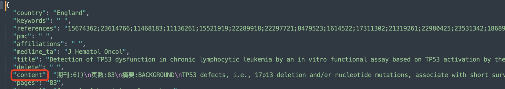

# 某客户向量测试总结

## 背景

客户提供一些示例数据，要对一些文献的摘要做相似性检索。想在Oracle DB23ai上做向量功能和性能测试。

需要完成以下的工作：

-   测试环境的搭建，包括搭建数据库环境和搭建本地embedding模型调用的环境

-   测试数据的准备、加载和翻倍

-   调用本地embedding模型批量将某一个字段转化为向量

-   进行向量查询，测试性能

    **--- 扩展 ---**

-   标量字段和向量查询

-   全文检索和向量查询

    

## Task 1: 环境搭建

1.   安装数据库，安装步骤参见[链接文档Task1](https://github.com/minqiaowang/my-documents/blob/main/kbot-install-guide/Kbot2.0-install-guide.md)

2.   安装配置本地嵌入模型

     -   方案一：安装kbot核心组建，新版kbot有向量嵌入REST API，安装配置[参见链接](https://github.com/minqiaowang/my-documents/blob/main/kbot-install-guide/Kbot2.0-install-guide-%E5%A4%A9%E5%A3%AB%E5%8A%9B.md)。kbot运行后提供REST API接口。如果GPU资源有富裕，可以多启动几个kbot进程在不同的端口，如（8899，8910，8912等等），REST API接口如下：

         ```
         http://ipaddress:8899/chat/text_embedding/
         ```

         输入参数为```text```和```embed_model```

         

     -   方案二：安装ollama（DB23.6可直接支持调用本地ollama REST API），ollama安装后可从huggingface下载需要的模型，并生成REST API接口。

         [ollama下载安装说明主页](https://ollama.com/download/linux)

3.   下面是安装ollama的步骤

4.   关闭防火墙

     ```
     $ sudo systemctl stop firewalld
     $ sudo systemctl disable firewalld
     ```

     

5.   一键安装

     ```
     $ curl -fsSL https://ollama.com/install.sh | sh
     ```

     输出结果：

     ```
     >>> Installing ollama to /usr/local
     >>> Downloading Linux amd64 bundle
     ######################################################################## 100.0%
     >>> Creating ollama user...
     >>> Adding ollama user to render group...
     >>> Adding ollama user to video group...
     >>> Adding current user to ollama group...
     >>> Creating ollama systemd service...
     >>> Enabling and starting ollama service...
     Created symlink /etc/systemd/system/default.target.wants/ollama.service → /etc/systemd/system/ollama.service.
     >>> The Ollama API is now available at 127.0.0.1:11434.
     >>> Install complete. Run "ollama" from the command line.
     WARNING: No NVIDIA/AMD GPU detected. Ollama will run in CPU-only mode.
     ```

     

6.   下载嵌入模型

     ```
     $ ollama pull bge-m3
     ```

     输出结果：

     ```
     pulling manifest 
     pulling daec91ffb5dd... 100% ▕███████████████████████████████████████████████████████████████████▏ 1.2 GB                         
     pulling a406579cd136... 100% ▕███████████████████████████████████████████████████████████████████▏ 1.1 KB                         
     pulling 0c4c9c2a325f... 100% ▕███████████████████████████████████████████████████████████████████▏  337 B                         
     verifying sha256 digest 
     writing manifest 
     success 
     ```

     

7.   安装完成后，ollama提供的REST API接口如下：

     ```
     http://ipaddress:11434/api/embeddings
     ```

8.   测试嵌入模型，输入参数为```model```和```prompt```。

     ```
     $ curl http://localhost:11434/api/embeddings -d '{"model" : "bge-m3", "prompt": "What is Oracle AI Vector Search?"}'
     ```

     输出结果：

     ```
     {"embedding":[-1.758695125579834,-1.0357520580291748,-0.8723464012145996,0.7145974040031433,-0.1171426847577095,0.21268607676029205,-1.0412145853042603,0.39349493384361267,0.3811132609844208,0.0898110494017601,-0.3114147484302521,......
     ```

     

9.   asdf


## Task 2: 测试数据的准备

客户提供用于测试的数据为json文本格式，需要加载到数据库中，并提取出相应的字段到表中。包括某些标量的表及文献摘要字段。并将数据翻倍到需要的记录数。

1.   客户提供的json文本文件，其中```content```是用来做近似检索的内容。

     

2.   将文件拷贝到相应目录下，创建外部表

     ```
     先用sys用户给vector用户授权
     sqlplus / as sysdba
     alter session set container=bj_sales;
     
     GRANT CREATE ANY DIRECTORY TO vector;
     
     connect vector/vector@bj_sales;
     
     CREATE OR REPLACE DIRECTORY json_dir AS '/home/oracle';
     
     drop table json_file_contents;
     
     CREATE TABLE json_file_contents (data JSON)
       ORGANIZATION EXTERNAL
         (TYPE ORACLE_BIGDATA
          ACCESS PARAMETERS (
              com.oracle.bigdata.json.path = '$[*]'
              com.oracle.bigdata.fileformat = jsondoc
              )
          LOCATION (JSON_DIR:'es_tmp.json'))
       PARALLEL
       REJECT LIMIT UNLIMITED;
     
     select * from json_file_contents;
     ```

     

3.   创建展开表，提取json中需要的字段到单独的列，其中```id```为自增长列，```vector_content```是为content字段生成的向量，当前为空。

     ```
     drop table es_docs_10000;
     create table es_docs_10000 (
     id number generated always as identity,
     country varchar2(128),
     keywords varchar2(4000),
     references varchar2(4000),
     medline_ta varchar2(1024),
     title varchar2(1024),
     content clob,
     vec_content vector);
     
     --truncate table es_docs_10000;
     
     insert into es_docs_10000(country,medline_ta,title,content,pages,journal,
     pubdate,publication_types,languages,abstract,filename,authors)
     select 
     json_value(data,'$.country') as country,
     json_value(data,'$.medline_ta') as medline_ta,
     json_value(data,'$.title') as title,
     to_clob(json_query(data,'$.content')) as content
     from json_file_contents;
     
     commit;
     select * from es_docs_10000;
     ```

     

4.   asd


## Task 3: 调用向量嵌入模型，将摘要字段向量化

采用python脚本读取表中摘要数据，调用向量嵌入模型，生成向量后插入表中向量字段。

可以利用安装kbot模块时创建的conda，激活一个新的环境。

1.   安装Anaconda

     ```
     -- opc用户
     wget https://repo.anaconda.com/archive/Anaconda3-2024.02-1-Linux-x86_64.sh
     
     chmod +x Anaconda3-2024.02-1-Linux-x86_64.sh
     ./Anaconda3-2024.02-1-Linux-x86_64.sh
     ```

     

2.   创建一个python3.12的环境命名为vector，并激活vector环境

     ```
     conda create --name vector python=3.12
     conda activate vector 
     ```

     

3.   [python脚本链接](https://github.com/tmuife/call_kbot_embedding_data)，获取python脚本

     ```
     $ sudo dnf install -y git
     $ git clone https://github.com/tmuife/call_kbot_embedding_data
     $ cd call_kbot_embedding_data/
     ```

     

4.   安装依赖包

     ```
     pip install -r requirements.txt
     ```

     

5.   修改环境变量参数```.env```文件

     ```
     $ cp .env.example .env
     $ vi .env
     ```

     修改后的文件内容如下，改版本目前只支持kbot接口(kbot和ollama输入和返回的数据参数不同）：

     ```
     user='vector'
     password='vector'
     dsn='localhost:1521/bj_sales'
     min=1
     max=10
     increment=1
     
     text_embedding_url='http://localhost:8899/chat/text_embedding/'
     
     #embedding rest api lists, split with comma
     text_embedding_urls='http://<REST API IP>:8899/chat/text_embedding/,http://<REST API IP>:8899/chat/text_embedding/'
     #query from DB, maybe the source data is huge, so you can query it by page
     query_batch_size=1000
     #how many records was sent to one embedding api, so the concurrency is query_batch_size/embedding_batch_size
     embedding_batch_size=100
     fetch_sql='select id,content from es_docs_10000 order by id offset :1 rows fetch next :2 rows only'
     #this column should be primary key or unique
     key_column='id'
     #this column is origin content which want to be embedded
     origin_column='content'
     #this column store the VECTOR data
     vector_column='vec_content'
     update_sql='update es_docs_10000 set vec_content=:1 where id=:2'
     ```

     

6.   运行python脚本

     ```
     python embed.py
     ```

     

7.   查看向量数据

     ```
     4、--执行看看向量情况
     select vector_dims(vec_content)，VECTOR_DIMENSION_FORMAT(vec_content) from es_docs_10000 
     fetch first 1 row only;
     ```

     

8.   DB23.6以上可以直接调用ollama接口，在SQL语句中直接调用生成向量，参考下面的步骤。

9.   给用户授权访问外网

     ```
     sqlplus / as sysdba
     alter session set container=bj_sales;
     BEGIN
       DBMS_NETWORK_ACL_ADMIN.APPEND_HOST_ACE(
         host => '*',
         ace => xs$ace_type(privilege_list => xs$name_list('connect'),
                            principal_name => 'vector',
                            principal_type => xs_acl.ptype_db));
     END;
     /
     ```

     

10.   调用嵌入模型，修改ipaddress和model名(当前版本如果content超过4000字符会出错：```ORA-20003: max input size exceeded```)。因为字符集的原因，我们将content截到3000字符。本地CPU环境32条记录耗时394.41秒(对比客户在A100环境，调用kbot API，21秒/100条记录)。

      ```
      connect vector/vector@bj_sales;
      set timing on
      
      declare
      embed_ollama_params clob;
      begin
      embed_ollama_params := '{
           "provider": "ollama",
           "host"    : "local",
           "url"     : "http://localhost:11434/api/embeddings", 
           "model"   : "bge-m3"
      }';
      
      update es_docs_10000 set vec_content=dbms_vector.utl_to_embedding(dbms_lob.substr(content,3000,1), json(embed_ollama_params));
      end;
      /
      PL/SQL procedure successfully completed.
      
      Elapsed: 00:06:34.41
      
      commit;
      ```

      

11.   查看向量字段

      ```
      select vector_dims(vec_content)，VECTOR_DIMENSION_FORMAT(vec_content) from es_docs_10000 
      fetch first 1 row only;
      ```

      

12.   sdf


## Task 4: 数据翻倍

1.   数据翻倍，将数据量增加到所需的记录数。

     ```
     3、--创建测试表es_docs_100w_test
     drop table es_docs_100w_test;
     create table es_docs_100w_test (
     id number generated always as identity,
     country varchar2(128),
     medline_ta varchar2(1024),
     title varchar2(1024),
     content clob,
     vec_content vector);
     
     --truncate table es_docs_100w_test;
     
     --重复100次生成测试数据
     DECLARE
        v_counter NUMBER := 1; -- 循环计数器
     BEGIN
        FOR v_counter IN 1..100 LOOP
           -- 这里是要执行的 SQL 语句，可以根据需求修改
             insert into es_docs_100w_test(country,medline_ta,title,content,vec_content) 
             select country,medline_ta,title,content,vec_content 
         from es_docs_10000;
           -- 可选：输出当前执行状态（仅在开发环境使用）
           DBMS_OUTPUT.PUT_LINE('Executed iteration: ' || v_counter);
        END LOOP;
     
        -- 提交事务（如需要）
        COMMIT;
     END;
     /
     
     select count(*) from es_docs_100w_test;
     select id, vec_content from es_docs_100w_test;
     ```

     

2.   sadf


## Task 5: 创建HNSW索引

向量的HNSW索引为全内存索引，能极大提高向量检索性能。

1.   计算HNSW索引所需内存大小。假设向量每个维度为float32类型，占4Bytes，1024维度的向量就会占用4KB空间。1千条记录占用4M空间，一百万记录占用4G空间，以此类推。另外还要额外30%的空间预留。

2.   分配向量索引内存池

     ```
     sqlplus / as sysdba
     show parameter vector_memory_size;
     show parameter SGA_TARGET;
     show parameter SGA_MAX;
     
     create pfile from spfile;
     ALTER SYSTEM SET SGA_MAX = 16G SCOPE=SPFILE;
     ALTER SYSTEM SET SGA_TARGET = 16G SCOPE=SPFILE;
     ALTER SYSTEM SET vector_memory_size = 12G SCOPE=SPFILE;
     shutdown immediate;
     startup
     show parameter vector_memory_size;
     alter PLUGGABLE database all open;
     ```

     

3.   创建索引，某些创建参数可以省略，缺省精度为90

     ```
     create vector index vec_content_idx on es_docs_100w_test(vec_content) organization inmemory neighbor graph
     DISTANCE COSINE
     WITH TARGET ACCURACY 90
     parameters(type HNSW, neighbors 40, efconstruction 500);
     
     drop index vec_content_idx;
     create vector index vec_content_idx on es_docs_100w_test(vec_content) organization inmemory neighbor graph
     DISTANCE COSINE;
     ```

     

4.   检查索引占用空间（DB23.6）

     ```
     sqlplus / as sysdba
     alter session set container=bj_sales;
     -- con_id=3为用户的pdb
     SQL> select CON_ID, POOL, ALLOC_BYTES, USED_BYTES from V$VECTOR_MEMORY_POOL;
     
         CON_ID POOL 		      ALLOC_BYTES USED_BYTES
     ---------- -------------------------- ----------- ----------
     	 3 1MB POOL			738197504   19922944
     	 3 64KB POOL			318767104     524288
     	 3 IM POOL METADATA		 16777216   16777216
     
     9 rows selected.
     
     SQL> select INDEX_NAME, USED_BYTES from V$VECTOR_INDEX where index_name='VEC_CONTENT_IDX';
     
     INDEX_NAME
     --------------------------------------------------------------------------------
     USED_BYTES
     ----------
     VEC_CONTENT_IDX
       15224120
     
     SQL> select INDEX_NAME, USED_BYTES from V$VECTOR_GRAPH_INDEX where index_name='VEC_CONTENT_IDX';
     
     INDEX_NAME
     --------------------------------------------------------------------------------
     USED_BYTES
     ----------
     VEC_CONTENT_IDX
       15224120
     ```

     

5.   sdaf


## Task 6: 测试向量检索性能

1.   从测试表中找到一个vector，再进行近似检索。

     ```
     7、--测试结果运行情况
     set serveroutput on;
     DECLARE
        vec_2c vector;
        nid number;
        pid number;
     BEGIN
        pid:=2000;
        SELECT id, vec_content
        INTO nid, vec_2c 
        FROM es_docs_100w_test 
        where id=pid;
        DBMS_OUTPUT.PUT_LINE(to_char(systimestamp,'YYYY-MM-DD HH24:MI:SS.FF6'));
        for rec in (
         select id, content,VECTOR_DISTANCE(vec_content,vec_2c) as distance
             FROM es_docs_100w_test
             where id<>nid
             ORDER BY VECTOR_DISTANCE(vec_content, vec_2c)
             FETCH APPROXIMATE FIRST 5 ROWS ONLY) LOOP
             DBMS_OUTPUT.PUT_LINE(rec.id);
         end loop;
         DBMS_OUTPUT.PUT_LINE(to_char(systimestamp,'YYYY-MM-DD HH24:MI:SS.FF6'));    
     END;
     /
     ```

     输出结果：

     ```
     2024-12-05 07:41:46.958192
     2320
     464
     1168
     176
     1808
     2024-12-05 07:41:46.958982
     
     PL/SQL procedure successfully completed.
     ```

     

2.   python脚本测试，参见附件文档

3.   模拟多个用户并发，客户测试的结果。200并发，平均返回时间0002秒。

4.   sdfa


## 扩展

## Task 7： 标量和向量组合查询测试

1.   sdaf
2.   sdaf


## Task 8: 全文检索和向量组合查询测试

1.   创建全文索引，客户的摘要主要是英文，本次创建全文索引采用英文解析器。

     ```
     sqlplus / as sysdba
     alter session set container=bj_sales;
     grant ctxapp to vector;
     
     connect vector/vector@bj_sales;
     execute ctx_ddl.create_preference('en_lexer', 'BASIC_LEXER');
     drop index text_content_idx;
     create index text_content_idx on es_docs_100w_test(content) indextype is ctxsys.context parameters ('lexer en_lexer');
     --parallel 8 parameters ('Lexer en_lexer sync (on commit)');
     
     select id, content,length(content) as cont_len from es_docs_100w_test
     where contains(content,'{TP53 protein modulation} or {TP53 wildtype tumor cells}')>0
     order by id; 
     ```

     

2.   sdaf

3.   sdff

4.   